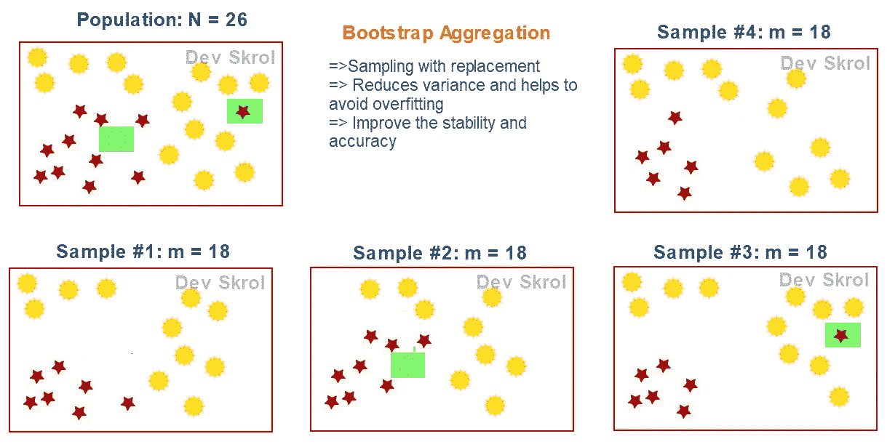
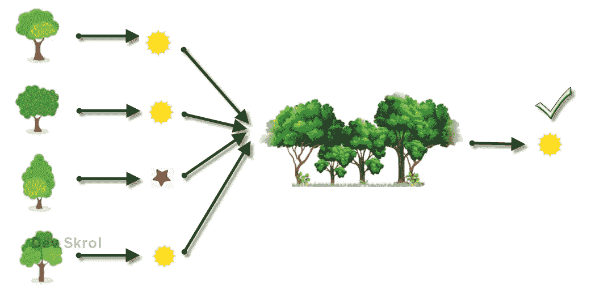

# 随机森林是如何工作的？—为什么我们需要随机森林？

> 原文：<https://medium.com/analytics-vidhya/how-random-forest-works-why-we-need-random-forest-e8eb5f3d6577?source=collection_archive---------22----------------------->

来源:照片由 Marissa Price 在 Unsplash 上拍摄

在这篇文章中，我们将学习如何从决策树中得到随机森林。随机森林是如何工作的！集成学习如何帮助克服过度拟合！

随机森林是决策树的集合。

集成学习是一种通过组合几个模型以获得更好的预测来改进机器学习模型的学习的方法。

Random Forest 将替换数据打包，并根据每个数据创建一个决策树。在预测时，它从所有的树中得到答案，并将多数结果作为最终预测。

在本文中，我们将通过一个示例详细了解这一点。

要了解决策树，请查看[决策树](https://devskrol.com/index.php/2020/07/25/decision-tree/)。

# 借助自举聚集/打包解决过度拟合问题的方法:

决策树的主要问题是，它“容易过度拟合”。

尽管我们可以使用参数来控制它，但这在 DT 中是一个值得注意的问题。

随机森林给了我们一个解决这个问题的方法。

当我们的模型从训练数据中学到太多东西时，就会发生过度拟合，这意味着它从噪声中也从训练数据中学习。但是当测试数据开始起作用时，从噪声中接收到的训练使得模型不能进行预测。

但是我们可以说，整个数据不是一个噪音。

Bootstrap 聚合:按作者分类的图像

在上图中，您可以看到，从一个大小为 26 的数据集，已经绘制了 4 个数据集。

1.  所有数据集大小相同。
2.  存在于一个数据集中的数据点可能存在于其他数据集中，也可能不存在。这就是为什么我们说它是“用替换”。我们在创建数据集时没有设置任何条件，因为给一个数据集的点不会从主数据集中删除。我们可以说，我们从主要群体中随机复制数据点，并创建 m 个数据集。
3.  从总体中取样的数据集数量没有限制。但是，每个数据集都是唯一的，因为至少有一个数据点不同于其他数据集。

# 随机森林是如何工作的？

许多弱学习者造就了一个强学习者。

装袋后，我们有 *n* 个独立数据集，数据数量相同。

使用上述 4 个样本，为每个样本数据集建立一个决策树。因此，每个决策树充当一个独立的模型。

随机森林:作者图片

从上图中，4 个决策树给出结果，赢得多数投票的结果被设置为最终预测值。

因为所有的数据集不会有相同的数据，所以噪声数据不会存在于所有的决策树中。可能有几个决策树含有噪声数据。但是，由于多数投票，那些有噪声的数据可能会被忽略。

# 随机森林的优势:

1.  克服决策树的过拟合问题。
2.  给出高准确度，因为我们不是用决策树的一个结果，而是从所有结果中取最好的。

# 结论:

在本文中，我们了解到随机森林从许多弱学习者中产生了一个强学习者。

请在这里找到实现随机森林[的 Jupyter 笔记本。](https://github.com/aasha01/DevSkrol/blob/master/LoanData.ipynb)

感谢您的阅读！

编程快乐！🙂

喜欢支持？只需点击心形图标❤️.