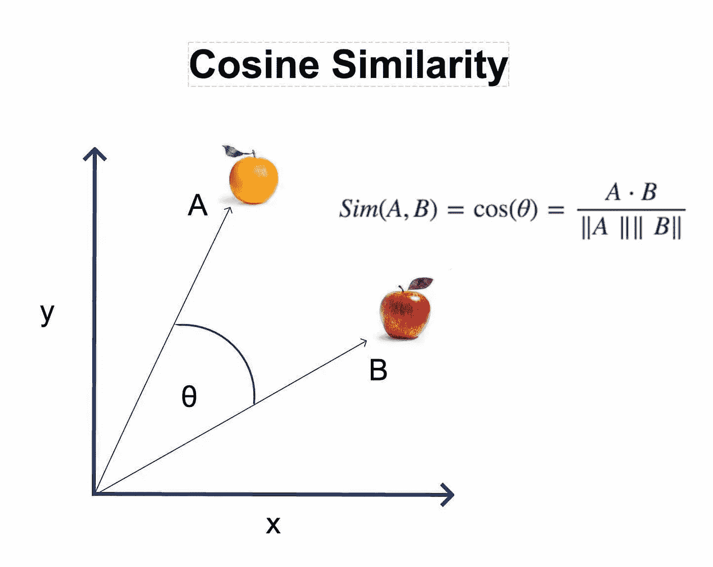
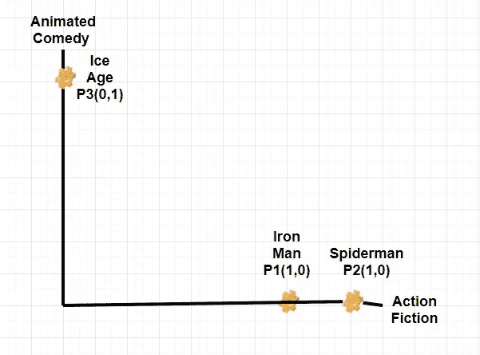

# 推荐系统是如何工作的？

> 原文：<https://medium.com/analytics-vidhya/how-recommendation-systems-work-75efdd562be?source=collection_archive---------29----------------------->

图片来源:短笛

# 推荐系统

几乎在所有的数字平台上，我们每天都会收到大量的推荐。无论是音乐、电影还是购物，我们都会从这些网站获得大量推荐。这些建议大多基于我们浏览或购买的产品类型。你有没有想过，这些网站每次都是如何向每位客户发送这种定制化的推荐？这个博客解释了推荐系统这个不可思议的世界的基本工作原理。

在构建推荐模型时，可以使用多种技术。其中最流行的技术叫做**余弦相似度。**

## **余弦相似度**

余弦相似度通过寻找投影到多维空间中的两个向量之间的角度的余弦来度量两个向量之间的相似性。

让我们考虑两点 A & B，设这两点之间的夹角为 teta。然后这两点的相似度由 cos teta 给出。余弦相似度总是在-1 到+ 1 之间。假设两点之间的角度为 90°，那么这两点之间的相似度为零。类似地，如果两点之间的角度为零，那么这两点之间的相似度为 1，这表明这两点非常相似。

**电影推荐**

假设我们有三部电影:钢铁侠、蜘蛛侠、冰河世纪。我们知道钢铁侠和蜘蛛侠属于动作小说类型，而冰河世纪属于动画喜剧类型。由于钢铁侠和蜘蛛侠是相同类型的电影，这两部电影之间的角度将是最小的(在上图中为零)，因此相似性得分将是最大的(因为 cos0 =1)，而冰河时代属于完全不同的类型，因此冰河时代和其他两部电影之间的角度将是高的(在上图中为 90°)，因此相似性得分将会较小。(因为 Cos90 = 0)。因此，如果我看过《钢铁侠》,那么根据相似度评分，与《冰河世纪》相比，我很有可能被推荐去看《蜘蛛侠》。同样，如果我看过《冰河世纪》,我会得到推荐去看类似的电影。

现实生活中的推荐系统将是多维系统。在电影推荐系统的情况下，当向用户推荐电影时，诸如演员、导演、发行年份、人口统计的因素也将被考虑。

## 结论

大多数科技公司都在使用推荐系统来增加他们的用户互动，并根据他们从每个客户的偏好和购买中收集的信息来最大化他们的投资回报率。过去几年，推荐系统在电子商务和其他科技公司的许多方面迅速扩张，这种趋势在未来只会加剧。

如果你喜欢这篇文章，请鼓掌和分享！快乐阅读！