# python 中的 regex 怎么没有你想的那么差？

> 原文：<https://medium.com/analytics-vidhya/how-regex-in-python-isnt-as-bad-as-you-think-23551d73e6c9?source=collection_archive---------22----------------------->

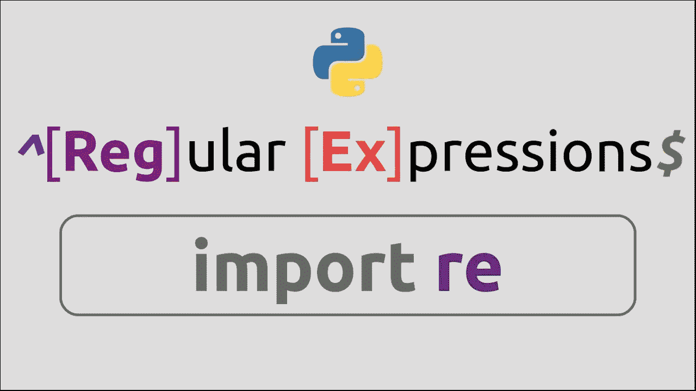

## 什么是正则表达式？

简而言之，正则表达式是描述一组字符的模式。它广泛用于检查一个字符串是否包含一组匹配特定模式的字符。

**引擎:**

当我说引擎时，它不是指一个复杂的系统或任何类似的东西。
引擎是一种软件/编写良好的代码，用于测试特定模式匹配的字符串。通常，它是更大的应用程序/包的一部分，不能被直接访问。较大的应用程序根据需要和用途调用它。通常情况下，所有的引擎并不完全兼容，但主要部分是相同的。

**特殊字符:**

直接词可以很容易地用作文字字符进行搜索，但正则表达式的能力并不局限于此，即使我们想充分利用它，而不仅仅是直接词文字。

总共有 14 个具有特殊含义的字符，它们是:

反斜杠\、插入符号^、美元符号$、句点或点号。，竖线或竖线符号|，问号？、星号或星号*、加号+、左括号(、右括号)、左方括号[、右方括号]和花括号{ }。

如果您使用这些字符中的任何一个，您需要使用反斜杠\这是它的用法的一个例子。

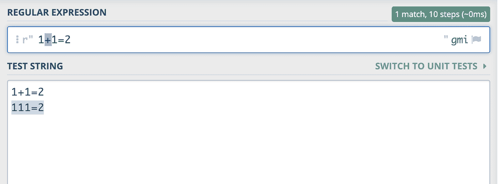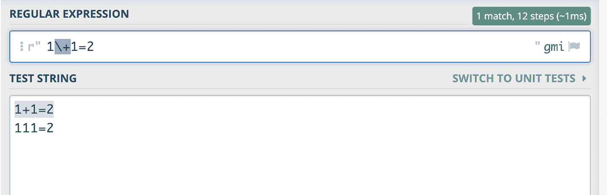

{ }花括号用于限制匹配长度。这里有一个例子:

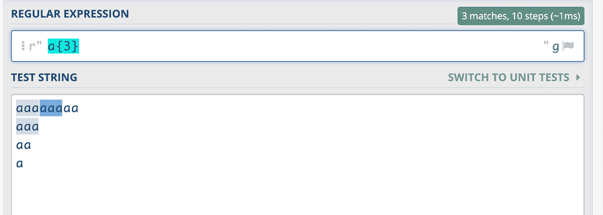

^用于指定字符集的开始，而$用于指定模式的结束。

这里有一个例子:

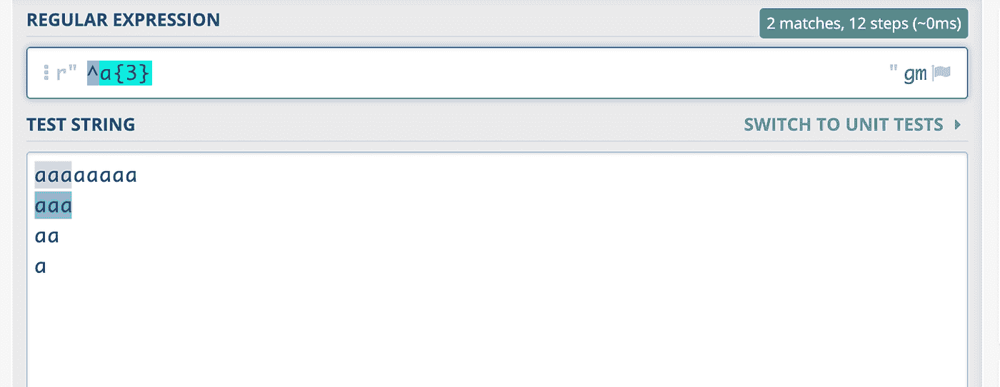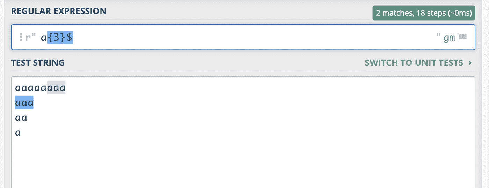

+和*分别用于捕获模式“一次或多次”和“零次或多次”。

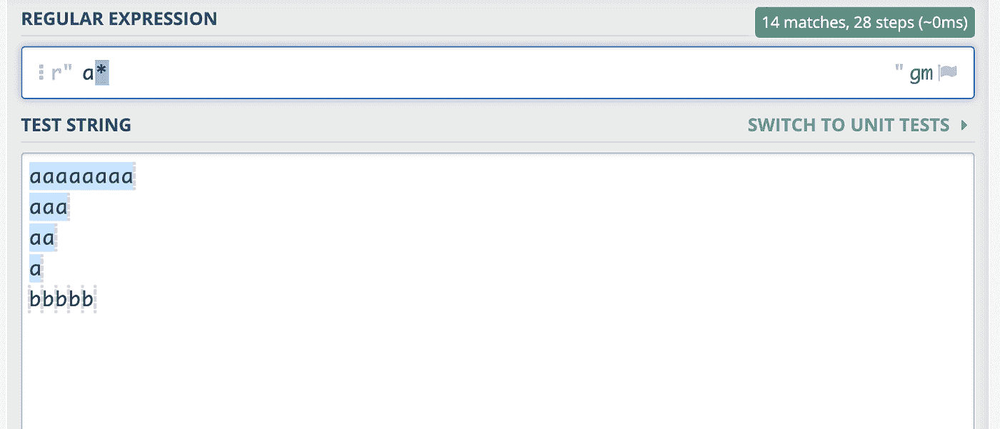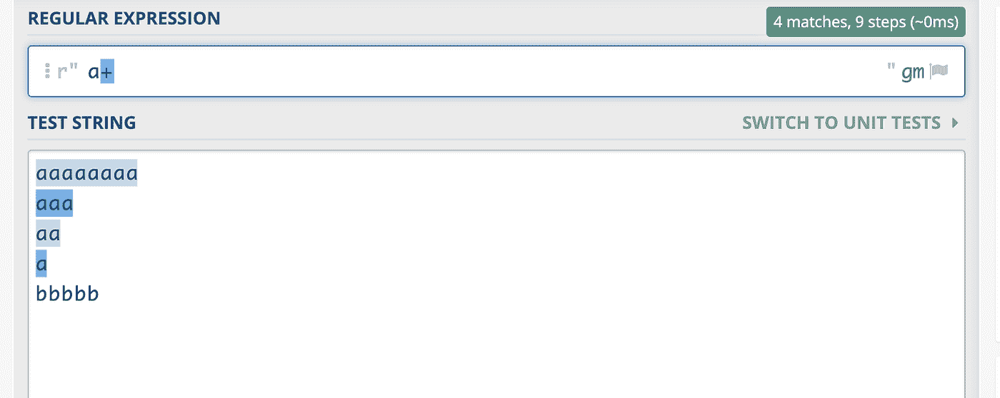

随着阅读的深入，你会遇到更多的问题。

**标志:**

标志是正则表达式使用的一个非常重要的部分。它定义了特定模式的使用范围。下面是使用最广泛的正则表达式标志。

g:代表全球，第一场比赛结束后就不回来了

I:代表不区分大小写

x:代表扩展的，有帮助的，同时忽略空白

s:代表单线

m:代表多线

u:代表 Unicode，匹配完整的 Unicode

a:代表 ASCII，只匹配 ASCII 字符

**python 中的用法:**

要在 python 中使用 regex 引擎，我们需要导入隐式可用的 RegEx 模块。这个包被命名为 re。

要在 python 中导入“re”包:

> 进口 re

**示例功能:**

在本文中，我们将介绍四个最常用的 regex-python 函数。

> 搜索()
> 
> sub()
> 
> 拆分()
> 
> findall()

## 搜索():

这个函数只搜索给定字符串中第一个出现的模式。

示例:

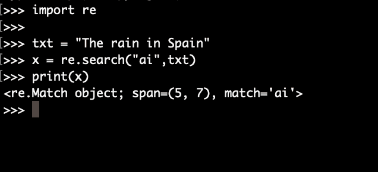

**findall():**

这个函数返回一个字符匹配列表。

示例:

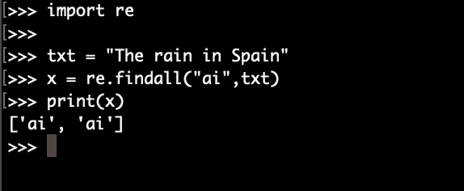

**sub():**

这个函数用给定的字符替换匹配项。

示例:

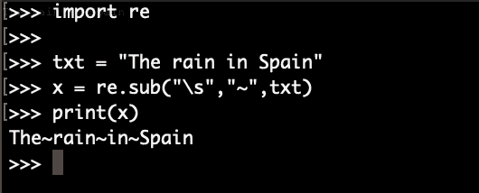

**split():**

该函数返回一个列表，其中包含从每个匹配项中拆分出的给定字符串。

示例:

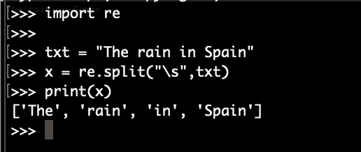

**概要:**

现在我们来简单回顾一下到目前为止我们读过的内容。

*   什么是正则表达式
*   正则表达式引擎
*   字符及其用法。
*   正则表达式中的标志
*   Python 中正则表达式的使用
*   相同的示例示例。

您可能已经理解了 RegEx 和 Python 的不同用法。所以现在轮到你开始快乐编码了！！

**资源:**

1.  获得 Jonny Fox 撰写的关于 RegEx 的详细文章。[https://medium . com/factory-mind/regex-tutorial-a-simple-cheat sheet-by-examples-649 DC 1 C3 f 285](/factory-mind/regex-tutorial-a-simple-cheatsheet-by-examples-649dc1c3f285)
2.  使用自定义测试用例在线练习正则表达式:[https://regex101.com/](https://regex101.com/)
3.  了解 Python 及其用法:[https://www.w3schools.com/python/python_regex.asp](https://www.w3schools.com/python/python_regex.asp)
4.  re 模块的文档，Python:[https://docs.python.org/3/library/re.html](https://docs.python.org/3/library/re.html)