# 决策树回归是如何工作的？

> 原文：<https://medium.com/analytics-vidhya/how-regression-with-decision-trees-works-ba8b523097cf?source=collection_archive---------9----------------------->

在这篇博客中，我将讨论我们如何从头开始构建回归决策树。因此，我们将使用一个小数据集，针对该数据集，我们将针对数据集中每个个体的各种特征计算标准差。* **注意*** : *由于博客很长，请耐心浏览，如果你不理解任何部分，请发表评论，以便我可以帮助你理解你被阻止的部分*。

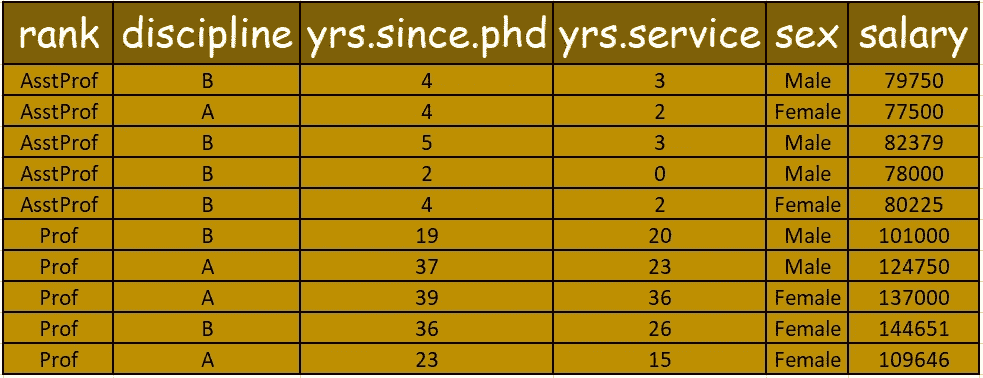

随着我们逐步计算数据集中要素的工资，我们将逐步了解如何计算新要素的工资，以及如何在回归决策树的每个渐进步骤中做出决策:

第 1 步→我们将逐个逐列研究每个特性，并决定如何将每个特性放置在回归树的每个级别。首先我们将从**列开始**列为:

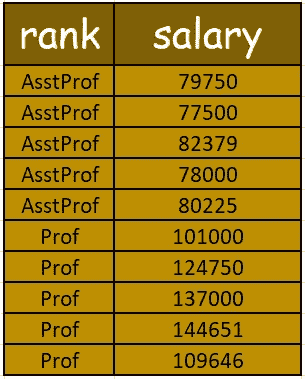

第 2 步→由于这是一个分类列，我们将根据等级划分工资，计算两者的平均值，并计算残差平方和，如下所示:

**asst prof Mean**=(79750+77500+82379+78000+80225)/5 = 79570.8

**Prof Mean**=(101000+124750+137000+144651+109646)/5 = 123409.4

*列***=**(79750–79570.8)+(77500–79570.8)+(82379–79570.8)+(78000–79570.8)+(80225–79570.8)+(1000)****

****我们将对每一列继续这一过程，结束后，具有最小**残差平方和的列将是回归真的第一个节点。******

****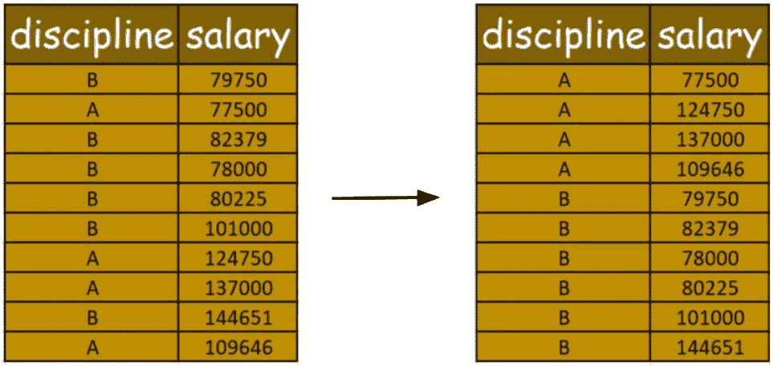****

******一个平均值**=(77500+124750+137000+109646)/4 = 112224****

******B 表示**=(79750+82379+78000+80225+101000+144651)/6 = 94334.16****

*****残差平方和为* **秩** *列***=**(77500–112224)+(124750–112224)+(137000–112224)+(109646–112224)+(79750–94334.16)+(8224)********

******第 3 步→对于像 yrs.since.phd 和 yrs.service 这样的数字列，我们将首先按升序对列进行排序，并在该列的每个数据项旁边保留各自的薪金值。******

******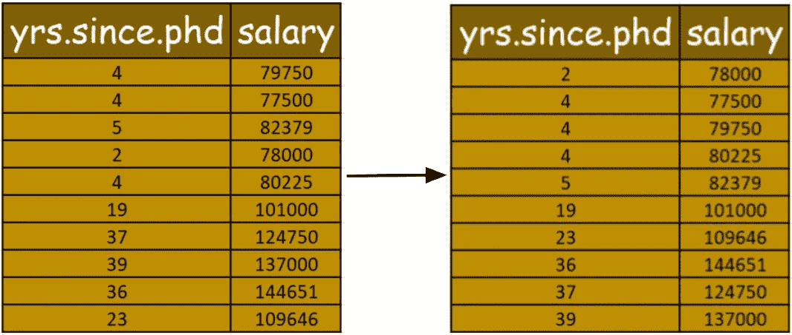******

******然后，我们将遍历列中的每个数据点，计算每个连续数据点的平均值，并计算残差平方和的最小值，如下所示:→******

******对于，2 和 4 →平均值为 3******

******因此，对于 3，残差平方和为:******

******平均工资 78000 英镑是 78000 英镑******

******其余为:(77500+79750+80225+82379+101000+109646+144651+124750+137000)/9 = 104100.11******

******因此， **3** *的*残差平方和为*=(78000-78000)+(77500-104100.11)+(79750-104100.11)+(80225-104100.11)+(82379-104100.11)+(101000-104100*******

****在这之后，我们可以看到有 3 个连续的 4(**4**)。因此，我们可以跳过连续数字，然后取下一个数据点，进行与前面相同的平均和步骤:****

****对于 4 和 5 →平均值为 4.5****

****因此，对于 4.5 的平方和残差为:****

****薪金 78000、77500、79750 和 80225 的平均值为(78000+77500+79750+80225)/4 = 78868.75****

****并且，对于休息(82379+101000+109646+144651+124750+137000)/6 = 116571****

****因此，*值* 4.5 *的残差平方和为*=(78000–78868.75)+(77500-78868.75)+(79750-78868.75)+(80225-78868.75)+(82379–116571)+(101000-1000)****

****同样，我们将为其他人继续努力，****

****对于 5 和 19 →平均值为 12****

****薪金 78000、77500、79750、80225 和 82379 的平均值为(78000+77500+79750+80225+82379)/5 = 79570.8****

****并且，对于休息(101000+109646+144651+124750+137000)/5 = 123409.4****

****因此，*值****的残差平方和为*=(78000–79570.8)+(77500-79570.8)+(79750-79570.8)+(80225-79570.8)+(82379–79570.8)+(101000-123400******

*******值* **21 的残差平方和(**为 19 和 23→平均值为 **21)** *为*=(78000–83142.33)+(77500-83142.33)+(79750-83142.33)+(80225-83142.33)+(82377******

*****值* **的残差平方和为 29.5 (** 为 23 和 36 →平均值为 29.5 **)** *为*=(78000–86928.57)+(77500-86928.57)+(79750-86928.57)+(80225-86928.57)+(886927)****

*****值的残差平方和***36.5(**36 和 37 →平均值为 36.5 **)** *为*=(78000–94143.875)+(77500–94143.875)+(79750–94143.875)+(80225–94143.875)+(823775)****

*****值* **38 的残差平方和(**37 和 39 →平均值为 38 **)** *为*=(78000–97544.55)+(77500–97544.55)+(79750–97544.55)+(80225–97544.55)+(823775)****

*****由此，我们看到对于* ***21*** *的值，它具有最小的残差平方和* ***1099370278.08。*** *因此，该值将被考虑用于与其他列的平方残差的比较。*****

****我们将再次重复计算“**yers . service”**的最小残差平方和的相同过程，就像我们对“**yers . since . PhD”**列所做的那样。****

****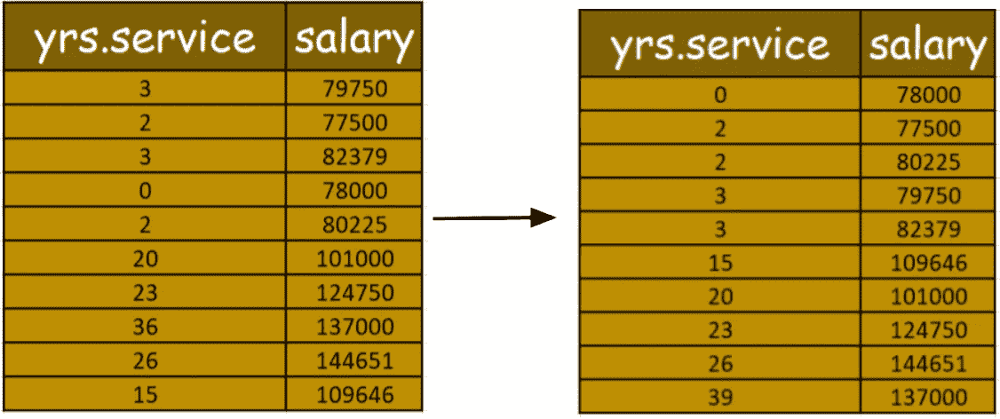****

*****先对数据值进行排序，然后，*****

*****值* **1 的残差平方和(**表示 0 和 2 →平均值为 **1)** *为*=(78000–78000)+(77500–104100.11)+(80225–104100.11)+(79750–104100.11)+(82379–1047)****

*****值* **的残差平方和为 1.5 (** 为 23 和 26 →平均值为 **1.5)** *为*=(78000–78575)+(77500–78575)+(80225–78575)+(79750–111310.85)+(82379–111337)****

*****值* **9 的残差平方和(**为 3 和 15→平均值为 **9)** *为*=(78000–79570.8)+(77500–79570.8)+(80225–79570.8)+(79750–79570.8)+(82333****

*****值* **的残差平方和为 17.5 (** 为 15 和 20→平均值为 **17.5)** *为*=(78000–84583.33)+(77500–84583.33)+(80225–84583.33)+(79750–84583.33)+(82379–8479****

*****值* **的残差平方和为 21.5 (** 为 20 和 23→平均值为 **21.5)** *为*=(78000–86928.57)+(77500–86928.57)+(80225–86928.57)+(79750–86928.57)+(7957)****

*****值* **的残差平方和为 24.5 (** 为 23 和 26→平均值为 **24.5)** *为*=(78000–91656.25)+(77500–91656.25)+(80225–91656.25)+(79750–91656.25)+(8975)****

*****值* **31 的残差平方和(**为 26 和 36→平均值为 **31)** *为*=(78000–81472.22)+(77500–81472.22)+(80225–81472.22)+(79750–81472.22)+(823772)****

*****由此，我们看到对于* **的值 21.5** *它具有最小的残差平方和****1201422401.71*。**** **因此，该值将被考虑用于与其他列的残差平方进行比较。******

*****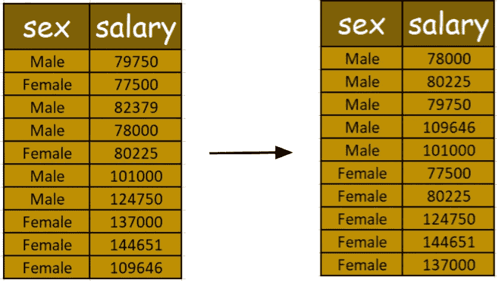*****

*******男平均值**=(78000+80225+79750+109646+101000)/5 = 89724.2*****

*******Prof Mean**=(77500+80225+124750+144651+137000)/5 = 112825.2*****

******残差平方和为****列***=**(78000–89724.2)+(80225–89724.2)+(79750–89724.2)+(109646–89724.2)+(101000–1000***********

*******因此，在所有因素中，平方和残差:*******

*******对于"**排名**列= **1344421278*********

*****对于**学科**栏目= **16657363674.8*******

*******年**。**自**起。**博士**专栏= **1099370278.08*******

*****对于“**年服务**列= **1201422401.71*******

*****对于"**性**"列= **4901344263.6*******

*****因此，“**yers . since . PhD**列成为残差平方和最小的列，从而成为回归树的第一个节点。*****

*****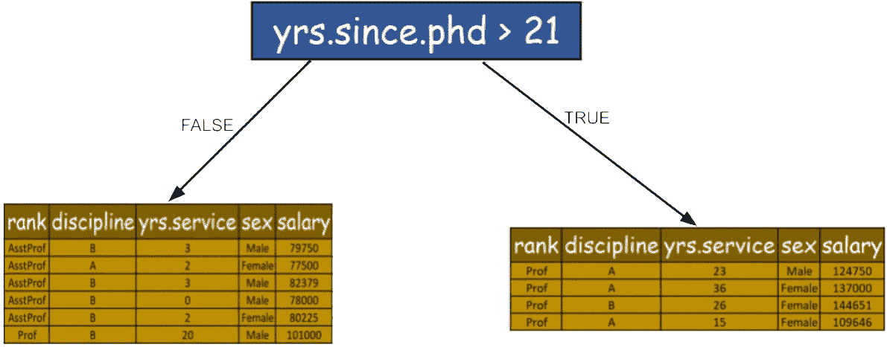*****

*****现在，我们将对图中给出的其他数据集节点执行相同的过程，并继续在树的每个级别形成这些类型的节点。*****

*****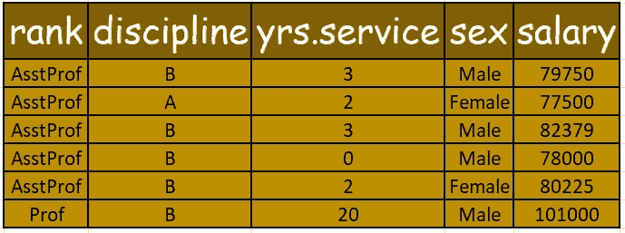*****

*****"**等级**"列的残差平方和:(79750–79570.8)+(77500–79570.8)+(82379–79570.8)+(78000–79570.8)+(80225–79570.8)+(101000-101000)=**15101702.8*******

*****“**学科**列的残差平方和:(79750–84270.8)+(77500–77500)+(82379–84270.8)+(78000–84270.8)+(80225–84270.8)+(101000–84270.8)=**359574102.8*******

*****“**性别**”列的残差平方和:(79750–85282.25)+(77500–78862.5)+(82379–85282.25)+(78000–85282.25)+(80225–78862.5)+(101000–85282.25)=*****

*******现在，对于“**年服务**”:*******

*****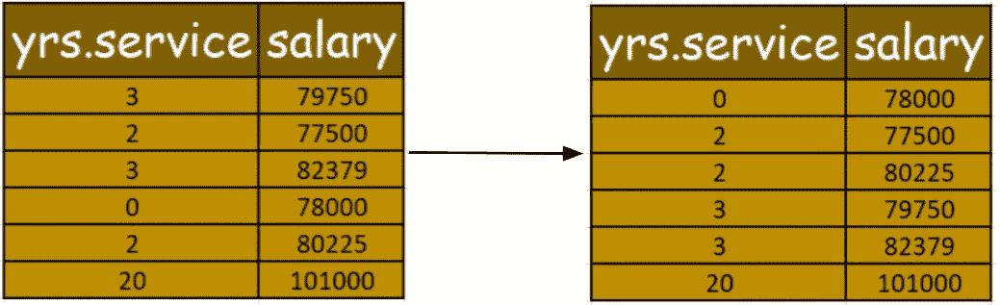*****

*****首先根据“**年服务**中的数据对列进行排序*****

******值* **1 的残差平方和(**表示 0 和 2→平均值为 **1)** *为*=(78000–78000)+(77500–84170.8)+(80225–84170.8)+(79750–84170.8)+(82379–84170.8)*****

******值* **的残差平方和为 1.5 (** 为 2 和 3→平均值为 **1.5)** *为*=(78000–78575)+(77500–78575)+(80225–78575)+(79750–87709.66)+(82379–87709.609)*****

******值* **11.5 的残差平方和(3 和 20 的**→平均值为 **11.5** ) *为*=(78000–79570.8)+(77500–79570.8)+(80225–79570.8)+(79750–79570.8)+(828)*****

******由此，我们看到对于****的值 11.5，它具有最小的残差平方和* **15101702.8。** *因此，该值将被考虑用于残差平方与其他列的比较。********

*****现在，如果我们比较所有其他残差平方和值，我们将看到“**排名**”和“**年服务**”11.5 将具有残差平方和的最低值。因此，我们树的下一个节点将是这样的:*****

*****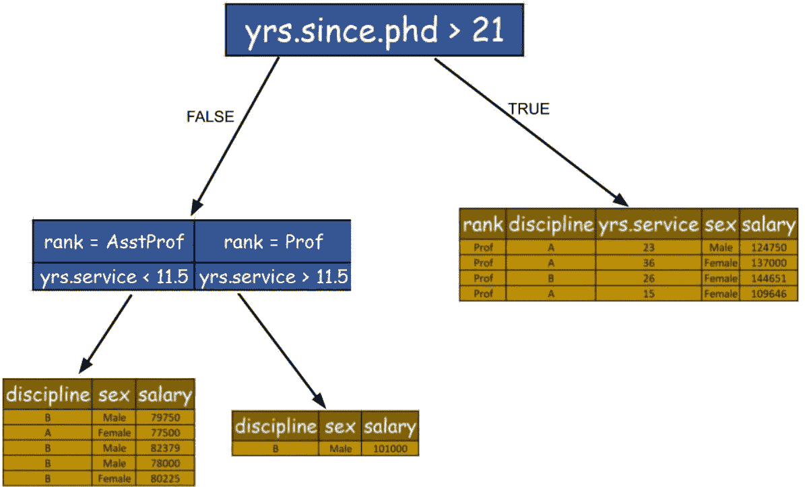*****

*****现在，我们将处理根节点的右边子节点:*****

*****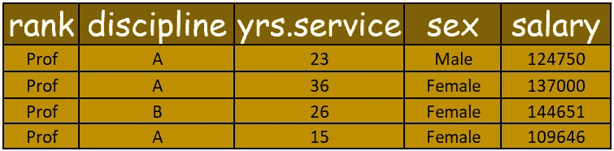*****

******对于“**排名**”列，所有值都相同，因此我们将跳过它。*****

*****“**学科**”的残差平方和=(124750–123798.66)+(137000–123798.66)+(144651–144651)+(109646-123798.66)=**375478210.66*******

*****"**性别**" =(124750–124750)+(137000–118764)+(144651–118764)+(109646–118764)=**1085826389*******

*****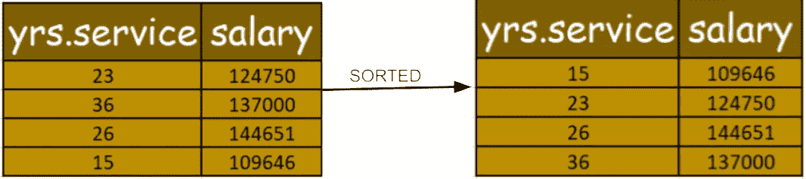*****

******值* **19 的残差平方和(**为 15 和 23→平均值为 **19** ) *为*=(109646–109646)+(124750–135467)+(144651–135467)+(137000–135467)=**2015500*******

******值* **的残差平方和为 24.5(** 为 23 和 236 的平均值为 **24.5** ) *为*=(109646–117198)+(124750–117198)+(144651–140825.5)+(137000–140825.5)=【中*****

******值* **的残差平方和为 24.5(** 为 23 和 236 的平均值为 **24.5** ) *为*=(109646–126349)+(124750–126349)+(144651–126349)+(137000–137000)=**611*******

******因此，正如我们看到的* **24.5** *的值，它具有最小的残差平方和* **143334308.5。** *因此，该值将被考虑用于将平方残差与其他列进行比较，这些列是***375478210.66(***表示“* **学科** *”列* **)和 1085826389 (** *表示“* **性** *)******

*****因此， **143334308.5** 是所有列**中残差平方和的最小值。因此，我们的回归树看起来像这样:*******

*****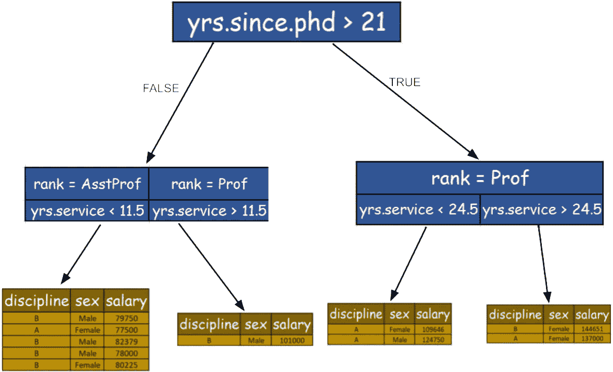*****

*****现在，对于最左边的孩子；*****

*****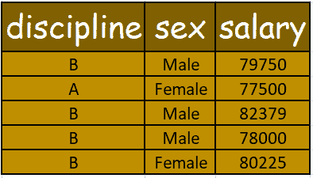*****

*****对于，"**学科**"栏:*****

*******一个平均值** = 77500 / 1 =*****

*******B 表示**=(79750+82379+78000+80225)/5 = 80088.5*****

********秩** *列***=**(79750–80088.5)+(77500–77500)+(82379–80088.5)+(78000–80088.5)+(80225–80088.5)=**9741437************

******对于，"**性**"栏:******

********男性平均数**=(79750+82379+78000)/3 = 80043******

********女性均值** = (77500 + 80225)/2 = 78862.5******

*******残差平方和为****列***=**(79750–80043)+(77500–78862.5)+(82379–80043)+(78000–80043)+(80225–78862.5)=**13429400**************

******因为**学科**列的平方和小于**性别**列。因此，下一个节点将用于**专业**列。******

******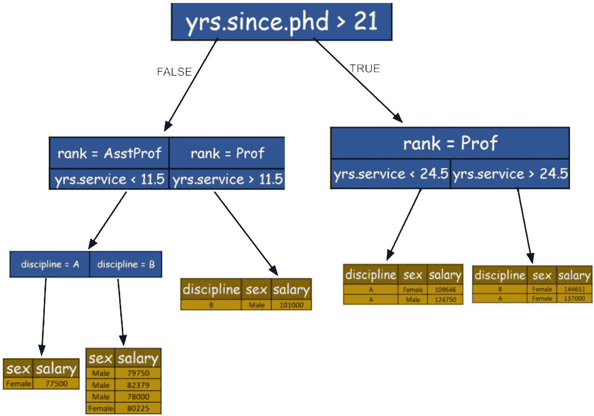******

******因此，我们将继续构建回归树的不同节点。******

******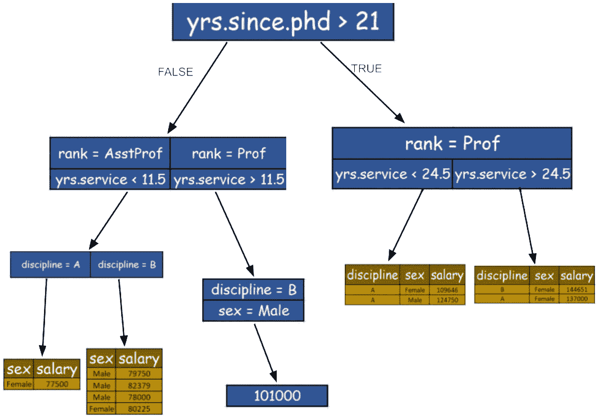******

******我在这里跳过了几个步骤，因为我们可以清楚地理解如何对下一个节点进行分类，最终我们的回归树在到达最后一步时将看起来像**下一张图**。******

******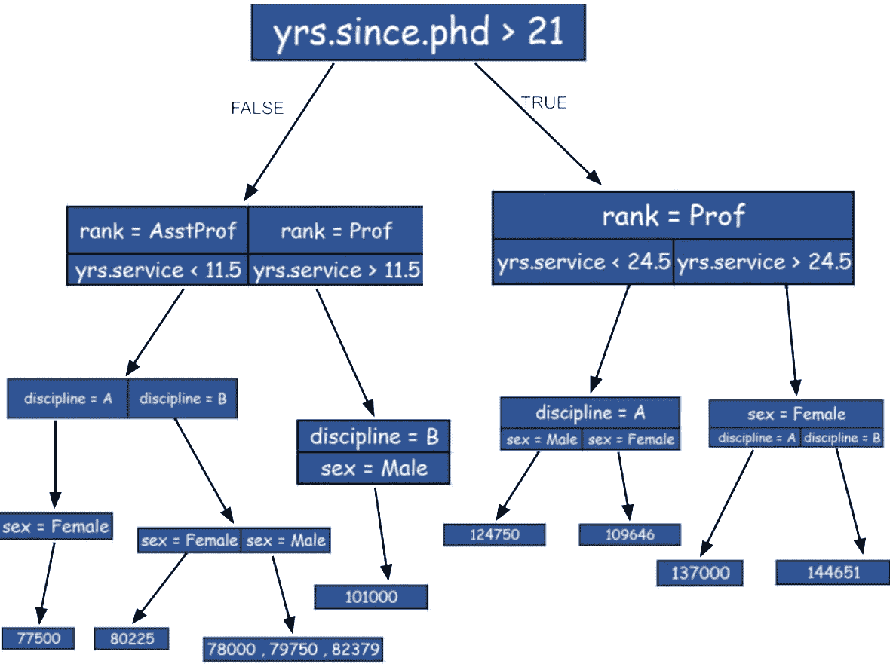******

******我们可以看到，从左侧开始的第三个叶节点有三个值，因此我们可以用它们的平均值替换这三个值，从而像回归树中存在的每个其他叶节点一样，为该叶节点获得一个值。******

******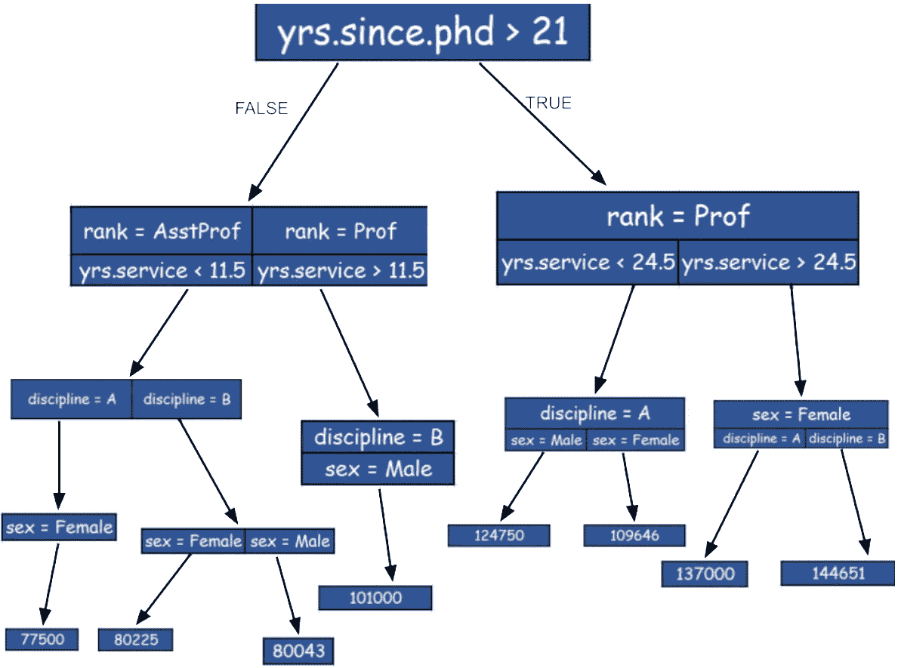******

******这就是如何从数据集构建回归树，我们现在准备好用新数据进行预测。所以如果我们必须对一个有特征的数据进行预测:→******

************

******然后，******

******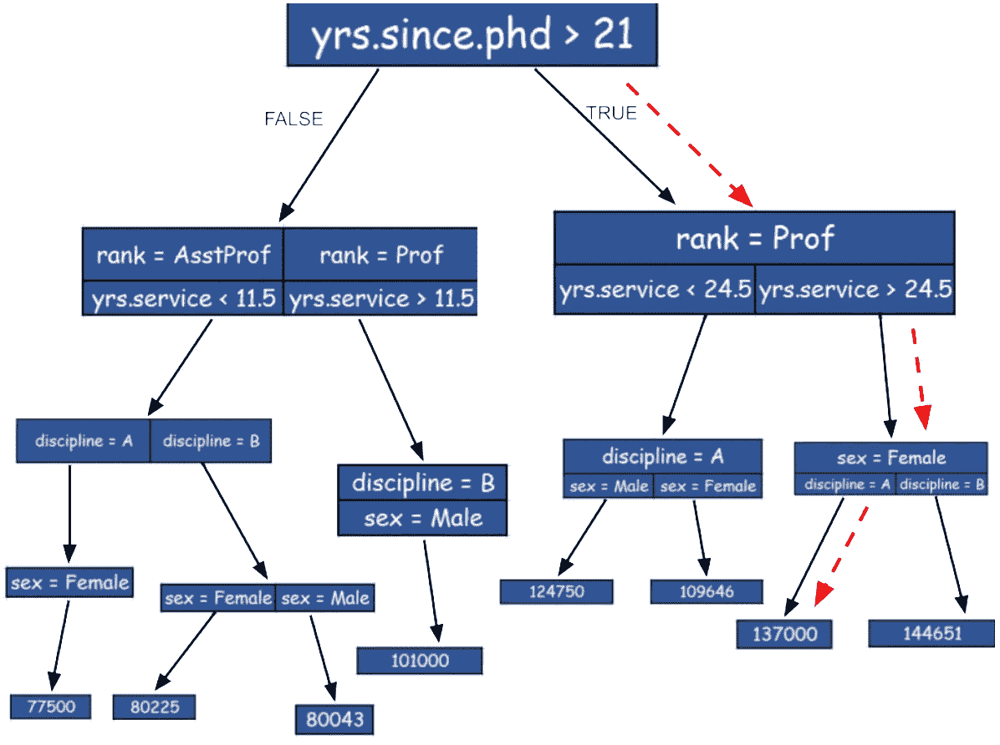******

******我们可以清楚地预测，具有这些特征的个人(**教授，25 岁，40 岁，女性**)的平均工资是 **137000 英镑。********

******我希望你已经很好地理解了这个博客，如果没有，请在评论区提出你的问题，评论和担忧，直到那时享受学习。******