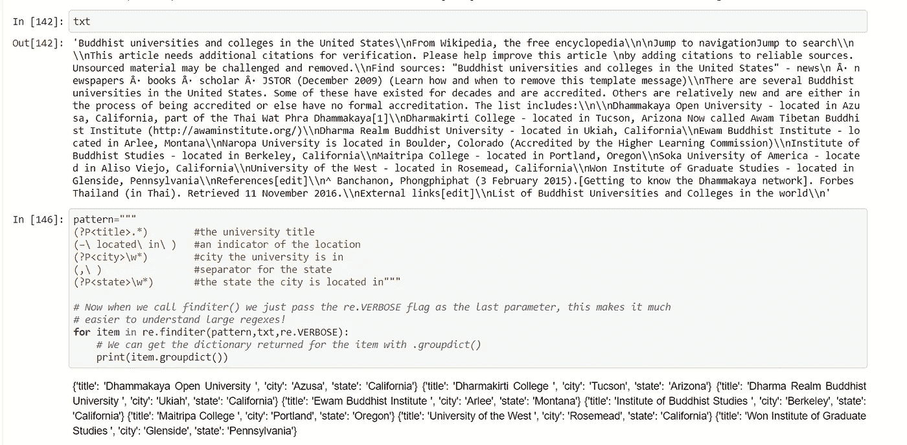

# 如何使用正则表达式来获得有洞察力的数据？

> 原文：<https://medium.com/analytics-vidhya/how-regular-expression-is-used-in-getting-insightful-data-e558ab21744a?source=collection_archive---------9----------------------->

先说故事，简而言之正则表达式是如何引起我的兴趣的。所有计算机科学专业的学生都学习或至少接触过“编译器设计”这个术语。因为正则表达式在部分中起主要作用。我也研究过这个课题，但是我没有被选中。同时在 Coursera 的密歇根大学学习“python 应用数据科学”课程。讲师在讲授正则表达式时表示，正则表达式是数据科学中重要且被低估的技能之一，他可以通过使用正则表达式来完成整个课程。这突然让我想到这是多么强大，于是我的兴趣被激发起来，我浏览了那里提到的文档，并摆弄了代码。在这里，我将分享我在使用 python 中的 re 模块进行 regex 实验中获得的东西。


学习很有趣: )

# **正则表达式前言:**

简而言之，正则表达式是一个字符序列，它定义了用于字符串匹配、搜索子字符串、查找模式以及查找和替换操作等目的的搜索模式。


**但为什么是在数据科学领域？？**
正则表达式主要用于数据准备和数据清理任务。它用于使用数据准备任务的模式从杂乱的数据中提取有意义的数据，如标签、网站、电子邮件 id、电话号码等。它在自然语言处理中广泛用于数据清理，如仅提取字母单词和删除数字。

好了，让我们一头扎进 regex，这是一个用于实现正则表达式的 python 模块

# 那么，真正的正则表达式是什么呢？


正则表达式模式

正则表达式就像你在上图中看到的那样。写这样的表达式是为了找到模式。接下来让我们详细看看 regex 的每个位和字节。

```
. ^ $ * + ? { } [ ] \ | ( )
```

这些每个字符在正则表达式中都有自己的含义。让我们先看一下基础知识，然后在代码示例的帮助下检查它们的用法。

> * -用来表示重复的事情，放在字符之后，告诉它可以重复多次
> 
> $-用于表示模式的结束
> 
> ^-用于拒绝一个模式(如非运算)
> 
> []-用于定义字符集，如[a-z]，[0–9]
> 
> +-与*操作相同，但它至少需要出现一次。

一些主要使用的特殊序列是

> \ D-匹配十进制数字，接受包含 0 到 9 的数字
> \ w-匹配所有字母数字字符串
> \ s-匹配特殊字符，如\t、\n、\ f
> \ D-匹配非数字数据

# 使用 re 模块实现:

让我们进入编码部分，看看使用 python 实现 regex。

```
**import re
p=re.compile('[a-z]+')
print(p.match('priya'))****Output:
<re.Match object; span=(0, 5), match='priya'>**
```

compile 方法中的表达式是正则表达式。它告诉查找以小写字母开始，后面跟着许多字母的字符串。它返回匹配及其开始和结束索引。

```
**print(p.match('Priya'))****Output:
None**
```

它返回 none，因为字符串不是以小写字母开头的。match()方法只看到字符串的初始位置。

**使用 search()方法:**

```
**pat=re.compile('[A-Z][a-z]*')
match=pat.search('Abi is my classmate, Bibi is my roomate')

if match:
    print('Found names are',match.group())**Output:
Found names are Abi
```

上面的模式用于查找字符串中的名称，这可以通过使用以大写字母开头的单词，后跟使用*字符的小写字母来完成。它并不适用于每一种现实情况。group()方法用于获取 RE 匹配的所有字符串。

但是如果您清楚地注意到，search()方法只返回一个名字。但是字符串中有两个名字，因为 search()方法返回该模式的第一个匹配项，而不会进一步查看。
为了找到一个模式的所有出现，我们必须使用 findall()方法。

```
**pat=re.compile('[A-Z][a-z]*')
match=pat.findall('Abi is my classmate, Bibi is my roomate')

if match:
    print('Found names are',match)****Output:
Found names are ['Abi', 'Bibi']**
```

# 更多元字符:

|字符执行与 OR 操作相同的操作。

```
**Grade='AABBCDABADACB'

print(re.findall('AB|CB',Grade))****Output:
['AB', 'AB', 'CB']**
```

它返回 A 或 c 后面 B 的每一次出现。

^字符执行 not 运算，拒绝字符串中指定范围的字符，并返回其余部分。

```
**Characters='abcde9289abdifhoejf'

print(re.findall('[^0-9]',Characters))****Output:
['a', 'b', 'c', 'd', 'e', 'a', 'b', 'd', 'i', 'f', 'h', 'o', 'e', 'j', 'f']**
```

请参阅 RE 返回字符串中除数字以外的所有字符。

$运算符放在一个字符之后，表示该字符将是模式的结尾。

```
**numbers=[110,322,550,10]

for i in numbers:
    a=str(i)
    print(re.findall('[0-9]*0$',a))****Output:
['110']
['550']
['10']**
```

上面的模式只返回以 0 结尾的数字。正则表达式只接受字符串。所以我用 str()方法转换了数字。

# 其他有用的操作:

**命名群体:**

我们还可以命名从匹配 re 的字符串中返回的组。这是通过使用？<name>'模式，我们可以在名字的地方给任何名字。这可以通过以下方式实现</name>

```
**names=['Bagavathy Priya','Saravana Kumar']

for i in names:
    res=re.match(r'(?P<first>\w+) (?P<last>\w+)',i)
    print(res.groupdict())****Output:
{'first': 'Bagavathy', 'last': 'Priya'}
{'first': 'Saravana', 'last': 'Kumar'}**
```

名字是通过使用' \w '序列获得的，该序列采用任何字母数字，注意后面跟有空格，其余字母被用作姓氏。

## 拆分字符串:

我们可以使用正则表达式中的 split()方法按照任何正则表达式模式来拆分字符串。

```
**pat=re.compile(',')

text='Raj,Vincy,Zoe'

print(pat.split(text))****Output:
['Raj', 'Vincy', 'Zoe']**
```

这里，在模式部分，我指定了'，'字符。所以 RE 用'，'分割字符串。在处理 CSV 文件时，我们也可以用它来按分隔符分隔列。

# 搜索和替换:

考虑这样一种情况，如果 Emy 离开了一个项目，而 Abi 在同一个项目中工作，我们必须将 Emy 的每一次出现都替换为 Abi，我们可以通过使用 sub()方法来做到这一点。

```
**sen='Priya and Emy are working in AB project,Priya is taking the data cleaning part and Emy is doing the modelling part'****pat=re.compile('Emy')

pat.sub('Abi',sen)****Output:
'Priya and Abi are working in AB project,Priya is taking the data cleaning part and Abi is doing the modelling part'**
```

它工作得很好: )在 sub()方法中，用“Abi”替换从编译模式中找到的“Emy”。

# 真实世界示例:

如果我在一个文本文件中从 Twitter 获得了杂乱的数据，我如何从这些数据中获得有见地的细节以供进一步分析。在 RE 的帮助下，我们可以通过模式匹配获得电子邮件、标签、个人资料 id 等详细信息。这可以通过下面的代码来完成。

```
**txt="VFD\n483686339687510016|Mon Jun 30 18:59:44 +0000 2014|Hobby Lobby ruling seems likely to make it harder for women to get contraception in the future @aaroncarroll writes http://nyti.ms/1iO0g23\n483683719476432896|Mon Jun 30 18:49:19 +0000 2014|Leprosy, Still Claiming Victims http://nyti.ms/1nZIuG9\n483657174275874817|Mon Jun 30 17:03:50 +0000 2014|Justices Rule in Favor of Hobby Lobby http://nyti.ms/VAgtgX\n483652347860885504|Mon Jun 30 16:44:40 +0000 2014|Supreme Court Declines Case Contesting Ban on Gay ‘Conversion Therapy’ http://nyti.ms/1iNwGd1\n483651450342735872|Mon Jun 30 16:41:06 +0000 2014|RT @UpshotNYT: Evidence-based medicine, or why hardly anyone has tonsils removed these days: http://nyti.ms/1sRDCdc\n483651253374033921|Mon Jun 30 16:40:19 +0000 2014|RT @jessbidgood: I spent 3 days outside Boston’s @PPact clinic to look at how SCOTUS\' buffer-zone ruling is felt there: http://t.co/wyNjQuP…\n483650611528093697|Mon Jun 30 16:37:46 +0000 2014|RT @celiadugger: Scientists: morning after pills don\'t cause abortions in way abortion opponents contend in Hobby Lobby case. http://t.co/k…\n483650393164222465|Mon Jun 30 16:36:54 +0000 2014|#health"** 
```

如果我拿着这些杂乱的数据，我们可以得到这样的见解

```
**pattern='@[\w\d]*'

re.findall(pattern,txt)****Output:
['@aaroncarroll',
 '@UpshotNYT',
 '@jessbidgood',
 '@PPact',
 '@celiadugger']**
```

使用模式中的@字符后跟序列\w 和\d 获取配置文件 id。

```
**pattern=re.findall(r"[A-Za-z0-9._%+-]+"
                     r"@[A-Za-z0-9.-]+"
                     r"\.[A-Za-z]{2,4}", txt)

print(pattern)****Output:
['jessbidgood@ibm.co', 'ppact@gmail.com']**
```

上面的模式用于从文本中提取邮件 id。

同样，我们可以使用正则表达式进行更复杂和健壮的操作。我们可以清理数据，以适当的方式获取数据字典，并能够使用 pandas 数据框将其转换为 CSV 文件，如下例所示。



从上述数据“txt”返回字典的最后一个单元格

你可以在这里看到这段代码的完整记录

[https://github . com/bagavathypriyanavaneethan/Data-science-Python/blob/master/Regular % 20 expression . ipynb](https://github.com/bagavathypriyanavaneethan/Data-science-Python/blob/master/Regular%20expression.ipynb)

在那里我实现了更多的方法和例子，并以适当的方式进行了详细的删减。

感谢阅读。

问候，

巴格瓦蒂·普里亚

# 参考:

https://docs.python.org/3/howto/regex.html#regex-howto——它提供了每一种方法的精彩文档。

【https://www.coursera.org/learn/python-data-analysis? 专业化=数据-科学-python-python 初学者的绝佳课程。