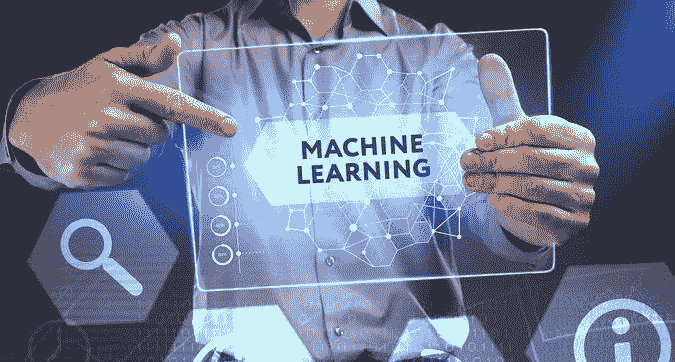

# 再现性危机是如何蚕食机器学习技术的可信度的？

> 原文：<https://medium.com/analytics-vidhya/how-reproducibility-crisis-is-eating-away-the-credibility-of-machine-learning-technology-a4db017f85e4?source=collection_archive---------7----------------------->

任何科学发现的核心价值是繁殖的能力。当对任何物理现实的科学探究观察到一些自然规律时，这些规律可以被视为对相似的事物状态有相似的影响。这种输出的再现性决定了科学探究和原则。当事物之间的某种特定的因果关系被发现一次而不再出现时，那么这种因果关系就根本不成立。

如果类似的事情发生在机器学习上，会发生什么？机器学习是一种不断发展的技术，声称能够训练计算算法进行分析输出。一段时间以来，结果的可重复性已经成为机器学习模型的一大挑战。通过这篇文章的长度，我们将解释这个问题。

## **美好的画面和现实**

机器学习对科学和专业团体的承诺是巨大的。用相关用户数据训练机器，并获得针对不同用户上下文和目的的数据驱动的洞察力，这使得机器学习被认为是跨利基的交互界面最受欢迎的技术之一。[电子商务商店或其他数字化企业为移动](https://www.cmarix.com/leverage-the-hidden-potent-of-machine-learning-for-mobile-apps/)或网络解决方案采用的机器学习技术，提供了通过学习客户互动和屏幕行为来主动解决客户问题的承诺。

但没过多久，这种乐观的景象就消失了，变得黯淡无光。最近，澳大利亚莱斯大学的一名统计学家表示，使用机器学习做出的发现不能自动被视为可信和神圣不可侵犯。在 2016 年进行的“[《自然》](https://www.nature.com/news/1-500-scientists-lift-the-lid-on-reproducibility-1.19970?source=post_page---------------------------)调查中，发现超过 70%的研究人员实际上未能成功复制其他数据科学家使用机器学习取得成果的实验结果。再现性危机继续困扰着数据科学家，尤其是在他们使用机器学习模型的情况下。

虽然数据科学家和跨多个学科的其他科学家仍在使用机器学习，以利用精细的数据分析来进行发现和获得更准确的发现，但由于这种可再现性危机，该技术的可信度正变得越来越普遍。一些专家认为，使用机器学习的科学发现现在失去了可信度，因为缺乏可重复性，这些发现需要用其他科学方法进行测试和评估，才能被认为是可信的。

在机器学习技术日益增加的困境和不确定性的另一方面，下一代研究已经在进行中，以推进该领域并解决可重复性危机。世界上最好的实验室中的数据科学家已经在努力评估基于以数据为中心的学习来重现结果的能力出了什么问题。尽管机器学习现在正处于关于可信度的争议之中，但毫无疑问，这项技术将会昙花一现，一去不复返。

## 我们要去哪里？我们是否完全控制了数据驱动的决策过程？

当提到机器学习技术的缺点时，我们需要谨慎地对待每个方面，并逐一解释所有方面。试想一家初创公司，它正在使用机器学习模型，利用各种团队成员的工作进行构建。现在，如果机器学习模型在处理相同的原始数据时，在不同的情况下提出不同的解决方案，你如何积极地评估模型的可信度？如果不能用同样的数据训练输入产生同样的输出，这纯粹是危机。因此，在从头开始构建以数据为中心的模型时，我们并没有取得很大进展。

## **核心挑战:ML 模型的合作**

您如何跟踪变更并维护所有源代码和相应代码变更的安全注册？嗯，这种与软件程序的版本控制相对应的挑战似乎造成了最大的障碍。到目前为止，机器学习环境已经成为合作带来变化并以有组织的方式跟踪这些变化的最具挑战性的环境之一。

为什么机器学习模型使得协作和跟踪变化变得很有挑战性？嗯，解释机器学习模型生命周期的典型属性在这方面会有帮助。让我们看看机器学习模型是如何工作的。

●例如，数据研究员试图证明问题，同时试图建立一个架构来对图像进行分类。

●为了使所需数据集的输入更容易，他从另一个已完成的项目中引入了一些数据。

●从另一个系统合并的数据集存储在一个网络文件夹中。这样做是为了记录数据集发生的所有变化。

●现在，通过调整一些东西和做一些额外的事情，他最终复制了整个源文件，并将其存储在 GPU 集群中。他这样做是为了运行完整的培训模块。

●通过这种方式，他实际上执行了几次训练运行。他甚至继续这个过程，同时在电脑上做其他事情，只是因为这个过程可能需要几周或几个月才能完成。

●如果他在运行集群时发现了一个 bug，他需要修改代码，并在所有其他机器上复制粘贴相同的代码，以便开始工作。

●当一次跑步进行时，他可以从这次跑步中获得部分训练的重量，并使用相同的重量作为另一次不同代码跑步的起点。

●现在，他还保留着所有跑分的所有评价分数和各种模型权重。

●当他不能再进行实验时，他选择经过训练的模型权重来发布最终模型。这些最终采用的模型权重可以是他的机器中存储的任何一个，也可以是完全不同的一个。

●他还需要将最终代码签入到为源代码控制指定的个人文件夹中。

●现在，他终于准备好发布带有训练好的权重和源代码的结果。

这个建立机器学习模型的场景包含了所有的艰辛和时间。为了得到相似的结果，这个过程的每一步都需要一丝不苟地执行，没有例外。如果任何一步的立足点稍有不同，就很容易出现不一致，结果的数值决定也会随之改变。让事情变得更具挑战性的是，ML 框架可以取消对性能的精确的数值决定。自然，即使奇迹般地成功再现了上述步骤，结果的微小差异也无法完全避免。

在大多数其他真实世界的场景中，研究人员通常不会记录所有的开发步骤，因此，他们根本不可能重现模型。

## **再现性和数据:重新审视关键问题**

当谈到机器学习中的再现性危机时，一些担忧不断出现。这些挑战或顾虑仍然是再现性危机的常见障碍和促成因素。让我们一个一个来看看。

在创建机器学习模型时，大型数据集的版本控制是最大的问题。您可以为模型和数据集创建版本并保留版本历史，但是您可能没有对模型所做的所有小更改和小调整的版本。再次将所有资产复制到服务器上确实是一个挑战。当处理少量的数据并到处调整时，挑战并不那么大。但正如我们所知，机器学习模型需要在大型数据集上工作，因此，控制和注册不同变化的版本变得非常重要。

如果通过注册不同版本的所有小调整和更改来控制版本的挑战是关键的痛点，那么处理大型数据集就成了问题的另一端。当你针对一个小的数据子集训练机器时，再现性并不是一个大的挑战，但是当对一个大的子集进行扩展时，甚至通过重新应用早期模型的所有小的调整和改变，结果可能会非常不同。

适用于一个人的相同模型可能不适用于其他团队成员，因为不同的日期和相似的属性会使数据库看起来不同。例如，Excel 格式化日期，通过这样做，它将立即切换到本地日期或在本地上下文中感知的日期。对于分散在欧洲大陆的大型开发团队来说，这里可能会非常混乱。

# **结论**

不要因为了解这些挑战而认为机器学习是一个短暂的泡沫，在巨大的挑战面前破灭了。实际上，在这种情况下恰恰相反。机器学习的可重复性挑战最终将通过解决大型数据集的版本控制问题来解决。

这一挑战可能会导致数据科学家操纵一些装备良好的机制来组织大型数据集，以允许开发人员毫不费力地保留不同版本的每个调整。像所有早期对革命性技术的挑战一样，随着机器学习不断成熟和更加完善，这些挑战也将会过去。