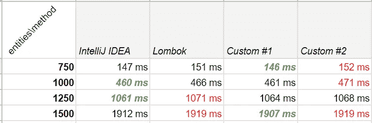
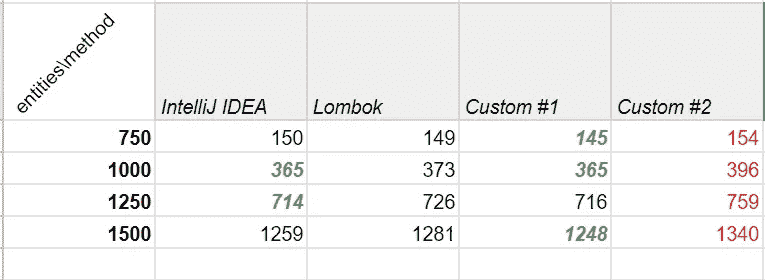
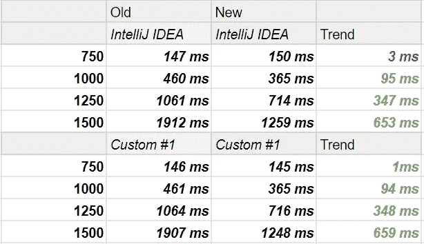

# right equals()方法如何提高应用程序的性能

> 原文：<https://medium.com/analytics-vidhya/how-right-equals-method-could-improve-the-performance-of-your-application-2f96388f7c91?source=collection_archive---------13----------------------->

## 当我们谈论性能改进时，我们通常会想到算法及其复杂性，但有些事情并不那么明显，但却至关重要。


克里斯里德在 [Unsplash](https://unsplash.com?utm_source=medium&utm_medium=referral) 上的照片

让我们假设我们有一个包含成千上万学生记录的数据库。我们的学生有以下特点:

```
**public class** Student {
    **private** String *city*;
    **private** String *university*;
    **private** String *fullName*;
    **private int** *classNumber*;
}
```

我们将从以下值中生成学生:

```
**private static final** String[] *cities* = {"New York", "Los Angeles", "Chicago", "Houston", "Phoenix"};
**private static final** String[] *names* = {"James", "Mary", "John", "Patricia", "Robert"};
**private static final** String[] *lastName* = {"Smith", "Johnson", "Williams", "Brown", "Jones"};
**private static final** String[] *university* = {"Liberty University", "California State University, Fullerton","Texas A&M University — College Station", "University of Central Florida","The Ohio State University — Columbus"};
```

所有学生字段将从适当的数组中随机设置，从 1 到 5 的班级编号和从随机的名字和第二个名字合并的全名。

现在，对于这个 Student.class，我们必须编写 equals()方法。通常，我们不会关心我们的 equals()方法看起来如何，并通过 IDE(在我的情况下是 Intellij 思想)生成它，但从性能角度来看，这种解决方案是最好的吗？

所以我们有三个 equals()方法。你认为，什么是最快的？

**由 Intellij IDEA 生成**

```
**public boolean** ideaEquals(Object *o*) {
    **if** (**this** == *o*) **return** true;
    **if** (*o* == **null** || getClass() != *o*.getClass()) **return** false;Student *student* = (Student) *o*;**if** (*classNumber* != *student*.*classNumber*) **return** false;
    **if** (!Objects.*equals*(city, *student*.*city*)) **return** false;
    **if** (!Objects.*equals*(*university*, *student*.*university*)) 
        **return** false;
    **return** Objects.*equals*(*fullName*, *student*.*fullName*);
}
```

**自定义#1**

```
**public boolean** custom1equals(Object *o*) {
    **if** (**this** == *o*) **return** true;
    **if** (o == **null** || getClass() != *o*.getClass()) **return** false;Student *student* = (Student) *o*;
    **if** (!Objects.*equals*(*fullName*, *student*.*fullName*)) **return** false;
    **if** (classNumber != *student*.*classNumber*) **return** false;
    **if** (!Objects.*equals*(*city*, *student*.*city*)) **return** false;
    **return** Objects.*equals*(*university*, *student*.*university*);
}
```

**自定义#2**

```
**public boolean** custom2Equals(Object o) {
    **if** (**this** == o) **return** true;
    **if** (o == **null** || getClass() != o.getClass()) **return** false;Student student = (Student) o;
    **if** (!Objects.*equals*(city, student.city)) **return** false;
    **if** (!Objects.*equals*(fullName, student.fullName)) **return** false;
    **if** (!Objects.*equals*(university, student.university)) 
        **return** false;
    **return** (classNumber == student.classNumber);
}
```

如果你选择了 IntelliJ generated equals()，你的想法是对的，但是…

让我们创建 1000 个学生实体

```
**public static** Student generateStudent() {
    **final** Student student = **new** Student();
    student.setCity(**new** String(*cities*[*generateInt*(0, 4)]));
    student.setClassNumber(*generateInt*(1, 5));
    student.setFullName(*generateFullName*());
    student.setUniversity(**new** String(*university*[*generateInt*(0, 4)])); **return** student;
}
```

用这个相当复杂的方法来计算有多少个实体是相等的

```
**private static int** equalStudentsCount(List<Student> students) {
    **int** similar = 0;
    **final int** size = students.size();
    **final long** start = System.*currentTimeMillis*();
    **for** (**int** i = 0; i < size; i++) {
        **for** (**int** j = i + 1; j < size; j++) {
            **if** (students.get(i).equals(students.get(j))) {
                similar++;
            }
        }
    }
    **return** similar;
}
```

为了获得准确的结果，我们将使用相同的值列表测试这些方法。每种方法我们将执行 100 次，并计算平均值

```
**public static void** countAverage() {
    **int** size = 1500;
    **int** loops = 100;
    **final** List<Student> students = *generateStudentList*(size);
    **final long** start = System.*currentTimeMillis*();
    **for** (**int** i = 0; i < loops; i++) {
        *equalStudentsCountIDEA*(students);
    }
    **final long** result =(System.*currentTimeMillis*() - start)/loops;
}
```

以下是测试结果:



如你所见，IntelliJ IDEA 生成的 equals()方法非常快，但并不是在所有情况下都如此。但是怎么做呢？在这个方法中，我们首先比较整数值，然后比较所有字符串。这种行为的主要原因是字段值的唯一性。

在字符串之前比较原始值是一个很好的性能观点，但是如果这些值是公共的，这可能会在方法中创建过多的检查。例如，如果我们有 1000 个实体，并且它们都有相同的布尔值，即使布尔比较比字符串或整数快得多，也没有理由将布尔检查置于其他字段的检查之上。

在我们的例子中，我们的整数字段 **classNumber** 介于 1 和 5 之间，它具有较低的唯一性，因此没有理由将它放在检查的顶部。字段**城市**和**大学**具有相同的唯一性。 **Student.class** 中最独特的字段是 **fullName** ，名和姓有 25 种可能的组合。但是为什么定制#1 不总是比 IDE 生成的更快呢？

让我们来看看 String.class equals 方法:

```
**public boolean** equals(Object anObject) {
    **if** (**this** == anObject) {
        **return** true;
    }
    **if** (anObject **instanceof** String) {
        String anotherString = (String)anObject;
        **int** n = value.length;
        **if** (n == anotherString.value.length) {
            **char** v1[] = value;
            **char** v2[] = anotherString.value;
            **int** i = 0;
            **while** (n-- != 0) {
                if (v1[i] != v2[i])
                    **return** false;
                i++;
            }
            **return** true;
        }
    }
    **return** false;
}
```

首先“if”部分检查对象是否链接到字符串池中的同一个对象上(这就是为什么我在生成 set Student **city** 和 **university** 时使用`new String()`)。在这个方法检查之后，如果字符串具有相同的长度，这使得 String equals()方法有时真的很快。但是，如果字符串有相同的长度，坏的部分来了，方法逐步比较字符串的每一个字符。这是 String.class equals()方法最糟糕的部分，也是人们通常将字符串比较放在 equals()方法底部的原因。

同样，这也是为什么 Custom #1 equals()方法并不总是比 IntelliJ IDEA one 快。一些组合具有相同的长度但是不同的值(例如“玛丽·布朗”和“玛丽·琼斯”，“帕特里夏·史密斯”和“帕特里夏·琼斯”)，但是在 String.class equals()方法发现这些字符串是不同的之前，它已经比较了许多字符。

现在让我们测试这些方法，只使用唯一的名，不使用姓

```
**private static final** String[] *uniqueNames* = {"James", "Mary", "John", "Patricia", "Robert", "William", "David",
        "Richard", "Thomas", "Charles", "Daniel", "Matthew", "Anthony", "Donald", "Mark", "Paul", "Steven", "Andrew",
        "Kenneth", "Joshua", "George", "Kevin", "Brian", "Edward", "Ronald"};
```



正如我们所见，结果令人印象深刻，让我们更详细地比较 Custom #1 和 IDEA generated equals()方法。



在某些情况下，更多的唯一值让 Custom #1 equals()方法的速度更快，如果我们比较 Custom #1 和 IntelliJ 生成的方法，这种增加并不明显，但一般来说，这种变化提高了所有 equals 方法的速度，最多超过 600 毫秒。

当然，这种速度提升并不是很大，也不值得到处编写自定义的 equals()方法。我也喜欢在任何可能的地方使用 Lombok。这有助于保持代码的整洁。但这只是一个简单的模板，在真实的项目中，我们有更多的字段和更困难的层次结构的实体。而错误的 equals()方法会大大降低应用程序的速度。

IntelliJ equals()方法生成器很聪明，它首先放置原始值，如 boolean、int、short 等。但这并不是在所有情况下都有效。

所以有几个规则可以提高使用 equals()方法的方法的速度:

*   将唯一字段检查放在首位，即使这是一个字符串。
*   在将字符串放在 equals()检查的顶部之前，请注意字符串的长度和唯一性类型。如果每个字符串都是唯一的，但是非常长，并且最终只有值不同(例如`very-very-long-string-1`和`very-very-long-string-2`)，那么将这个字段放在 equals()检查的顶部是一个坏主意。
*   如果你不确定数据库中每个字段的唯一性，那么先放入布尔值、枚举、整数。
*   在比较实体的所有字段之前，不要忘记空检查。

希望这篇文章对你提高申请速度有所帮助。通常，我们选择较少的代码量而不是应用程序性能，对于某些人来说，这一测试结果可能并不重要，但现在许多应用程序在具有数百个字段的数据库中包含数百万个条目，并使用具有高复杂性的繁重算法，这些算法可能使用 equals()方法，因此这几毫秒很容易变成几秒甚至几分钟。