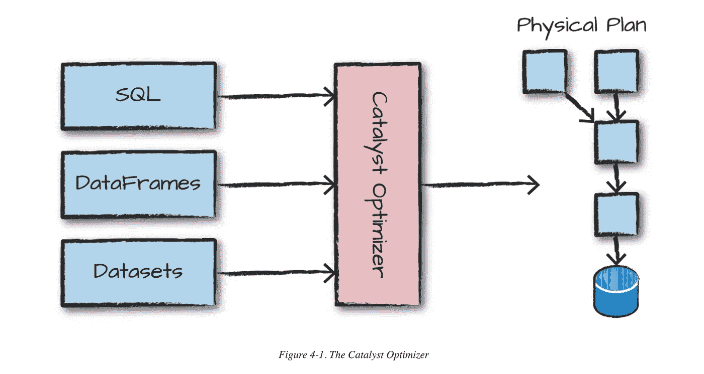

# spark 如何执行用结构化 API 编写的代码(数据帧、数据集和 SQL)

> 原文：<https://medium.com/analytics-vidhya/how-spark-executes-the-code-written-in-structured-api-dataframes-datasets-and-sql-c344335740ef?source=collection_archive---------16----------------------->

用结构化 API 编写的代码按以下方式执行:

*   首先，包含数据框、数据集或 SQL *代码的代码通过控制台或提交的作业提交*给 spark。

*   然后如果代码正确，就转换成*逻辑计划*。

逻辑规划与执行者或驱动者没有联系，它只是一组抽象的转换。旨在将用户给定的表情转换成*最佳版本*。这是通过将用户代码转换成*未解析的逻辑计划*来完成的。如果用户表达式中有任何 spark analyzer 无法解析的引用，那么它将拒绝未解析的逻辑计划。如果分析器通过了未解决的逻辑计划(成为*已解决的逻辑计划*，那么它被进一步传递给 catalyst 优化器。这将通过下推谓词或选择优化逻辑计划，并提供*优化的逻辑计划*。

*   现在，物理规划过程开始，物理规划也被称为*星火计划。*

Spark Plan 指定如何在集群上执行获得的逻辑计划。它通过生成不同的物理执行策略并在成本模型的帮助下对它们进行比较来做到这一点。

***比较示例 1:*** 如何通过查看表的物理属性来执行连接。

***比较示例 2:*** 查找最佳执行顺序，查询将按照该顺序执行，从而得到优化的结果。例如，假设在一个查询中，我们必须通过连接表来过滤掉一些候选人的信息。因此，最佳的物理计划应该是，首先过滤候选项，然后连接表，并显示结果。尽管存在另一种方法，即首先连接表，然后过滤并显示结果，但这在资源方面是很昂贵的。

物理规划给出了一系列的 RDD 和变换。这就是为什么 Spark 被称为*编译器*的原因，因为它接受数据帧、数据集和 SQL 代码，并将它们编译成 RDD 变换。

*   最后，完成物理计划的执行。在运行时，spark 做了进一步的优化，通过生成本地 Java 字节码，它能够在执行过程中根据几个条件删除整个任务或阶段。现在，输出终于返回给用户了。

这都是关于用结构化 API 编写的代码的火花执行。希望它清晰、明快、易于理解。