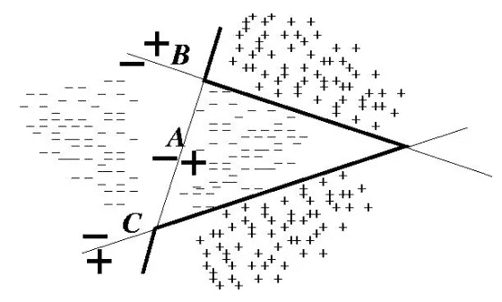
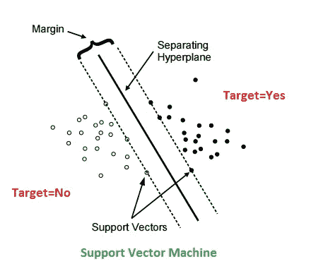
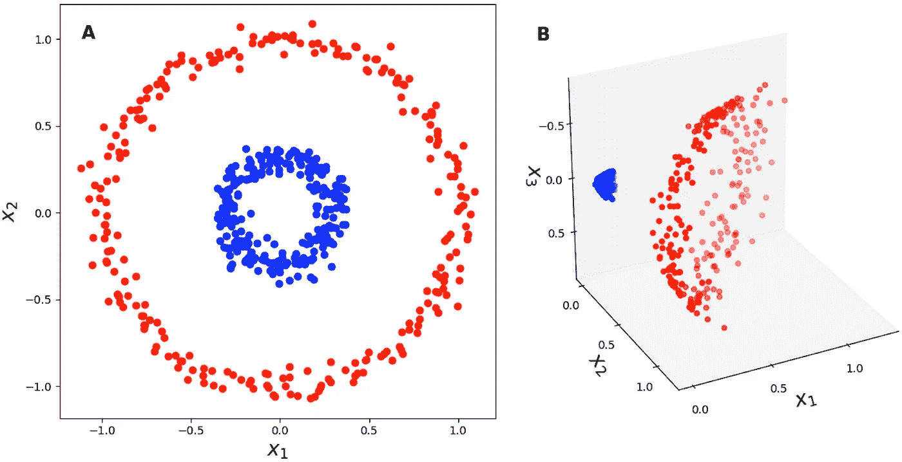

# SVM(支持向量机)与众不同？

> 原文：<https://medium.com/analytics-vidhya/how-svm-support-vector-machine-is-different-from-others-18eb7ce196c1?source=collection_archive---------20----------------------->

当我们谈论机器学习算法时，我们脑海中会出现许多机器学习算法，如有监督的和无监督的机器学习算法，例如:逻辑回归、决策树、朴素贝叶斯分类器、knn、k 均值聚类等..但是在这些当中，为什么 SVM 最受关注，为什么它在最近变得如此受欢迎呢？，你有没有想过？，让我们看看为什么 SVM 的使用率比其他人高，直到**神经网络**出现。

在我们讨论 SVM 之前，让我们看看 SVM 的发展有什么贡献，为此，我们必须了解一下 1957 年出现的第一个分类算法，它被普遍称为**感知器**，由美国心理学家弗兰克**罗森布拉特**开发

Rosenblatt 证明，如果数据在较低的维度中是线性可分的，那么在更高的维度中也是可能的，因为感知器会找到可以区分不同类别的边界，是的，这就是为什么感知器会出现在图像中。

但在更高维度中，感知器可以找到一个边界，可以将不同的类分开，但它不能保证你在实时情况下，它会提供并保持与训练数据中给定的相同的准确性。

是的，虽然在训练数据中，它可能会给你 100%的准确性，但当涉及到真正的性能准确性时,**可能会下降到 80%**,这真的是不可接受的，对吗？这是感知器的局限性导致了 SVM 的发展

感知器

通过查看上面的图像，您可以在更高维度中看到，感知器可以找到边界，但是来自许多类的数据点靠近边界，这反过来会实时影响，因为数据点更靠近边界，所以许多数据点可以跳到其他类中，这清楚地显示了感知器的**局限性**

1992 年，俄罗斯科学家瓦尼克和他的同事提出了 SVM 算法，他们证明了在感知器中不可能的事情，他们通过 SVM 实现了

是的，让我们看看如何！！SVM 是感知器的升级版，他们对感知器做了增强。

SVM 本身有两个变体，第一个是 **SVC** (支持向量分类器)，第二个是 **SVR** (支持向量回归器)，这里我们将讨论 SVM/SVC，是的，SVC 的工作方式类似 pereptron，但它不仅会在**更高维度**中找到两个类之间的边界，还会通过在两边放置相等的边距来找到两个类中间的一个边界

让我们看看下面的图片

你可以从上面的图像中看到，SVM 找到了位于两个类中间的边界，它不仅在那里停下来，而且它在两边设置了相等的边距，没有数据点落在边距内，现在你可以看到它的性能比感知器更好，它可以给你 98%的训练准确率和 90%的实时准确率，这比感知器好得多，因为两边的边距可以清楚地区分不同的类

# **支持向量**

从上面的图像中，你可以看到一些**数据点靠近边界两侧的边距**，它们被称为支持向量，它将定义边距的表面，并决定两边的边距相等。

在上面的例子中，我们称之为硬边界，有两种类型的边界，一种是硬边界，另一种是软边界。

# **硬边界**

在硬页边空白中，页边空白中不允许有数据点，因此两个不同的类明显分开，并且可以非常实时地执行，因此在类**中没有重叠**，因为两侧的页边空白不允许数据点落入页边空白中

# **软余量**

如果数据是非线性的，那么我们可以使用软边界，这将允许一些数据点进入边界，并且这是受控的超参数，例如:**“误差成本”**，我们现在不讨论它，通过降低误差容限，您可以最大化两边的边界，并且通过增加误差成本，您可以减少类之间的边界，这允许数据点进入边界，并且看起来像您的感知器，例如见下面

提醒:到目前为止，我们所讨论的几乎都是二维的，而不是更高的维度，因为我们不知道更高的维度是什么样子。

# **具有非线性数据的 SVM**

首先，我们要看看为什么 SVM 变得如此受欢迎，是的，如果你有非线性数据，那么非标准算法可以执行得更好，那么让我们看看 SVM 如何解决这个非线性问题

# **KSVM(K** 通用支持向量机 **)**

1995 年，SVM 的 BETTER 开始处理非线性数据，称为 KSVM，所以如果你有非线性数据，我们不能使用标准算法进行分类？但是在数学中有一个叫做 cover 定理的东西，它指出在低维中非线性可分的数据点，如果我们把它们带到本质上是多项式的高维中，那么我们可以清楚地把不同的类分开，使用一些叫做核的东西，这是对数据进行的数学变换。

是的，使用 kernel，你可以通过增加更多的维度来将低维度映射到更高维度，但是要做所有的数学映射，如果你想做的话，这是相当计算密集型的。

但是使用一种叫做**内核技巧**的东西，你不必做所有这些计算，内核会在没有太多计算的情况下完成数据转换。

这使得 SVM 如此受欢迎，通过使用内核技巧，我们可以获取高维非线性数据，并对其进行分类，这是其他算法无法做到的，**直到神经网络出现**，让我们看看下面的一些内核技巧

径向基函数

在上面的图像中，你可以看到，不能线性分离的二维可以用径向基函数核在三维空间中分离。

有一些核技巧，例如线性核和多项式核和 Sigmoid 核和 **RBF(径向基核)**，其中 RBF 在 it 使用中非常流行，因为它可以在无限维中分离类。

# **结论**

现在我们已经意识到为什么 SVM 如此受欢迎，因为它能够获取非线性数据并使其在高维空间中线性分离，除了神经网络，没有其他算法能够做到这一点，这就是为什么 SVM 比传统的机器学习算法有巨大的优势。

希望你觉得这篇文章很有价值，我已经省略了一些不需要在这里讨论的东西，但是我已经给出了 SVM 比其他国家更受欢迎的概况。