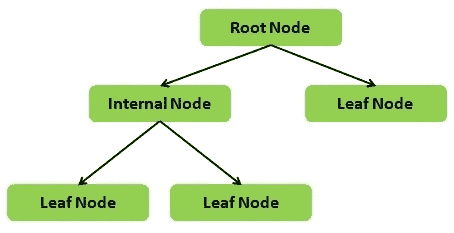
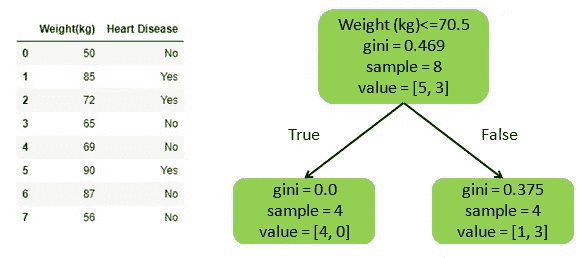
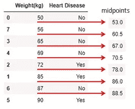
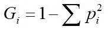
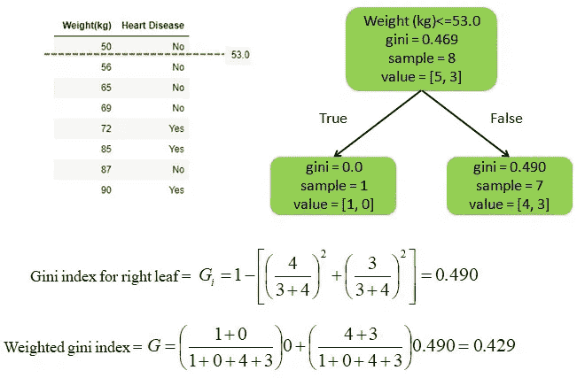
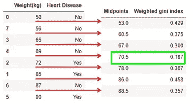

# 决策树如何做出决策？

> 原文：<https://medium.com/analytics-vidhya/how-the-decision-tree-takes-the-decisions-31749439deac?source=collection_archive---------20----------------------->

[www.theguardian.pe.ca](http://www.theguardian.pe.ca/)

决策树是一种非常流行的监督机器学习算法，用于回归和分类。决策树是随机森林、XGBoost 等更健壮的机器学习模型的构建块。这是一个非常简单的机器学习模型，即使对于外行来说也很容易理解。有多种决策树算法可用，例如 ID3、C4.5 和 CART 用于小数据集，BOAT 用于大数据集。

要理解决策树，了解决策树的结构很重要。下面是对其结构的简单阐述。在机器学习的语言中，第一个分裂节点被称为根节点，进一步分裂的节点被称为内部节点。如果没有进一步的数据分割，那么它被称为叶节点。到达叶节点的最长路径称为决策树的深度。

决策树结构

让我们用一个小的心脏病数据集，并对其应用决策树算法。

数据及其决策树

这里问题就来了，决策树怎么知道 70.5 kg 是拆分数据的最佳点！让我们弄清楚。

第一步:将权重按升序排序，计算所有的中点。

寻找中点

第二步:以 53 kg 为拆分点拆分数据，计算基尼指数。基尼系数的公式如下，其中 p 代表是或否的概率。

步骤 3:对每个分割点重复步骤 2。

由于基尼指数衡量节点的杂质，决策树算法选择杂质最小的分裂点。在我们的例子中，0.187 是最小的杂质，因此相应的 70.5 kg 是最佳分裂点。决策树算法重复它以创建具有更高深度的决策树。

我希望这篇文章对你理解决策树的内部工作有所帮助。