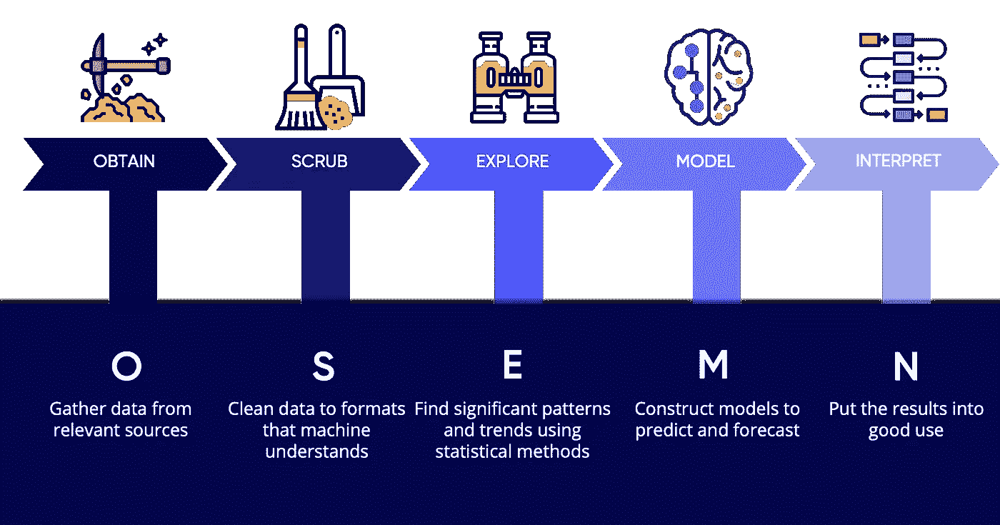
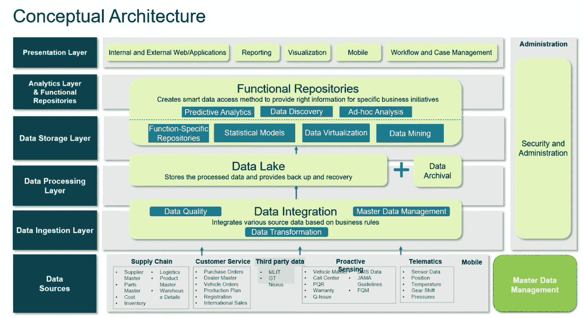
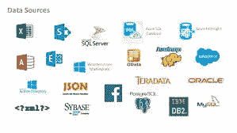
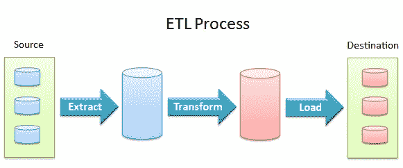
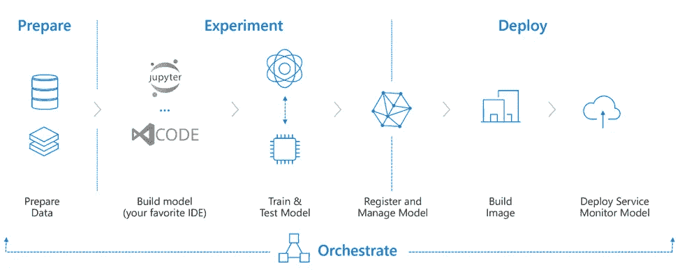
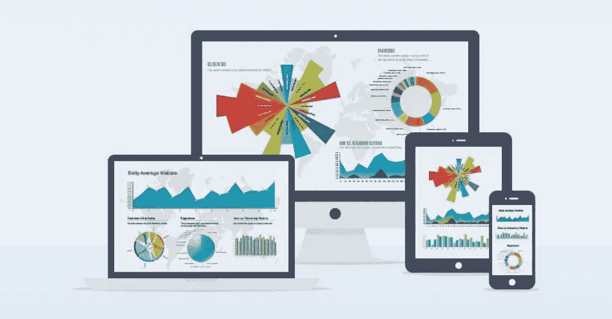

# 现实世界数据科学项目中的工作方式:概念架构

> 原文：<https://medium.com/analytics-vidhya/how-thing-works-in-a-real-world-data-science-project-conceptual-architecture-50478af6551d?source=collection_archive---------18----------------------->

数据科学项目的生命周期

> ***大家好，如果你是数据科学领域的初学者或者正在进入这个领域，那么你必须看看这篇文章，它描述了一个项目是如何在数据科学中端到端地开发的。***

让我们先来看一个数据科学项目的概念架构，它是为供应链行业问题而创建的，但也可以应用于其他问题。

概念建筑

起初，这个图表可能看起来有点令人生畏，但不要担心，我们将一个一个地探索每一层，你会发现它最终相当容易。我们从底层(数据源)开始，向上(表示层)。

# 1.数据源

在这一步中，我们将创建一个从数据源收集数据的管道。我们可以有文件(CSV，Excel)，图像，数据库视图形式的数据。可以使用多种来源提供数据，如云、API 和不同类型的数据库。

# 2.数据摄取层

因为我们有关于数据来源和 DSA(数据共享协议)签署的详细信息。接下来的事情是从不同的来源收集数据，并通过参考 DSA 来验证数据。

验证由文件名、扩展名、列数、空列、数据类型等参数执行。接下来，我们在主数据管理中审计这些数据，主数据管理可以建立在任何数据库上。对有效和无效数据进行数据隔离，并保存在文件系统(ea。HDFS)。

# 3.数据处理层

现在，在对文件进行基本验证之后，我们就可以获得行数据了。我们可以深入研究数据集的特征。我们将准备一个 ETL 管道，并将对数据执行预处理任务。

第一步是验证和清理。检查空值并删除不必要的列。接下来，我们将对数据执行标准化，并将应用转换和聚合。

在这些预处理步骤之后，我们的数据将为应用一些统计分析或机器学习建模做好准备。

# 4.数据存储层

数据湖

然后，所有预处理的数据被存储在任何数据库或数据湖中，以提供备份和恢复。

# 5.分析层和功能存储库

预处理数据现在可以用于各种操作。统计分析，机器学习建模。在预测建模中，我们创建一个管道，首先通过应用一些机器学习算法创建一个基础模型，然后选择我们的最佳基础模型。接下来，我们执行超参数优化以找到最佳模型。模型部署是管道中的下一步。

# 6.表示层

当我们准备好我们的分析，我们可以在许多方面使用它。

我们可以使用 Power BI、Tableau、Qlikview 等数据可视化工具创建仪表盘来显示图形和图表。

我们可以将模型部署为 API，供许多客户端使用。python 的 Flask 和 Django 框架有利于这个过程。

根据我们的需求，我们可以以更多的方式利用我们的分析。

如果你喜欢这篇文章，请鼓掌。