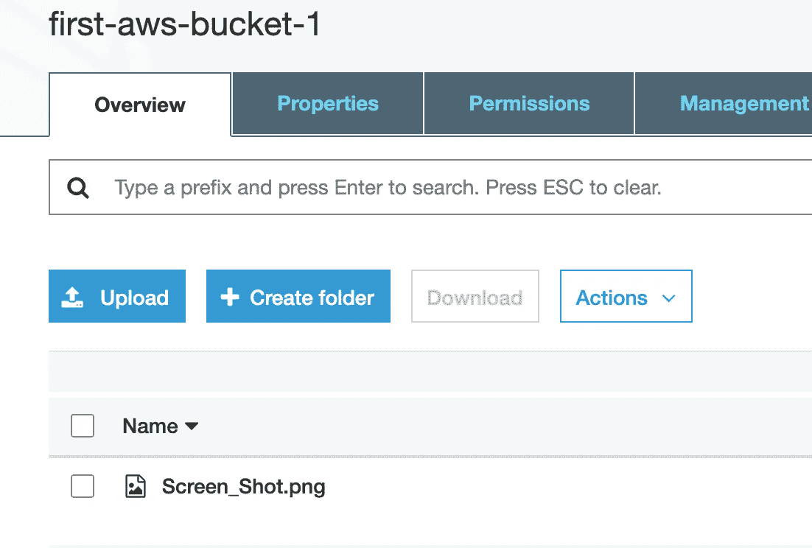

# 如何使用 Boto3 (Python SDK)访问 AWS S3

> 原文：<https://medium.com/analytics-vidhya/how-to-access-aws-s3-using-boto3-python-sdk-e5fbd3d276bd?source=collection_archive---------4----------------------->


最近，亚马逊网络服务(AWS)在云计算领域变得相当流行。其中一个主要组件是 S3，AWS 的对象存储服务。

我们可以通过不同语言的 AWS 控制台、AWS CLI 和 AWS SDKs 访问 S3。 [Boto3](https://boto3.amazonaws.com/v1/documentation/api/latest/index.html) 是用于 AWS 的 Python SDK 的名称。如果你正在使用 S3 和 Python，那么你会知道 boto3 库有多酷。这让事情变得更容易处理。

## **先决条件**:

1.  Python 3+

2.boto3 模块( *pip 安装 boto3* 得到它)。

3.一个 AWS 帐户，其 AWS IAM 用户具有*编程访问权限*。向该用户添加 *AmazonS3FullAccess* 策略。这是为了简单起见，在 prod 中，您必须遵循最小特权原则。

4.从 AWS 控制台下载访问密钥详细信息文件。在终端上创建一个新文件`~/.aws/credential`，并粘贴如下详细信息:


5.从终端在`~/.aws/config`中设置默认区域。


## **基本操作**:

既然准备好了，那就开始探索一些基本操作吧。
**创建存储桶**

要记住的第一件重要事情是，bucket 名称在整个 AWS 平台上必须是唯一的，因为 bucket 名称是符合 DNS 的。如果您试图使用另一个用户已经声明的名称，您的代码将会失败。您将看到以下错误，而不是成功:`botocore.errorfactory.BucketAlreadyExists`。

```
import boto3
s3_resource = boto3.resource(**'s3'**)
s3_resource.create_bucket(Bucket=**"first-aws-bucket-1"**)
```

**列出 S3 的所有时段**

列出所有在 S3 的桶。

```
for bucket in s3_resource.buckets.all():
    print(bucket.name)
```

输出:


**上传对象**

从本地路径*/*Users/ankhipaul/Documents/snapshot 上传一个文件 *Screen_Shot.png* 到上面创建的 S3 桶 *first-aws-bucket-1*

```
s3_resource.Object(**'first-aws-bucket-1'**, **'Screen_Shot.png'**).\
    upload_file(Filename=**'/Users/ankhipaul/Documents/Screenshots/Screen_Shot.png'**)
```

输出:



**从 S3 下载对象**

将名为*doc.pdf*的对象从桶 *pythonusecase* 下载到本地系统。

```
s3_resource.Object(**'pythonusecase'**, **'doc.pdf'**).download_file(
    **f'/Users/ankhipaul/Documents/doc.pdf'**)
```

**列出特定桶的所有对象**

列出桶中的所有对象 *pythonusecase。*这还将列出所有文件夹以及该桶中各个文件夹的文件。

```
pythonusecase = s3_resource.Bucket(name = **'pythonusecase'**)
for object in pythonusecase.objects.all():
          print(object.key)
```

输出:


**复制一个对象**

将对象 *old_convertcsv.csv* 复制到同一个桶中的新位置，并使用新名称 *new_convertcsv.csv* 。因此，创建一个新的对象。

```
s3_resource.Object(**"pythonusecase"**, **"new_convertcsv.csv"**).copy_from(CopySource=**"pythonusecase/old_convertcsv.csv"**)
```

输出:


**删除一个对象**

从桶 *pythonusecase* 中删除 *old_convertcsv.csv*

```
s3_resource.Object(**"pythonusecase"**, **"old_convertcsv.csv"**).delete()
```

输出:


> 请记住，S3 存储桶没有任何“移动”或“重命名”操作。我们所能做的就是创建、复制和删除。因为没有移动或重命名；复制+删除同样可以实现。

**删除一个桶**

要删除存储桶，我们必须首先确保存储桶中没有对象。首先，删除桶*的所有对象 first-aws-bucket-1。*然后删除空桶。

```
bucket = s3_resource.Bucket(**'first-aws-bucket-1'**)
bucket.objects.all().delete()
s3_resource.Bucket(**"first-aws-bucket-1"**).delete()
```

输出:


删除后，S3 中只存在一个存储桶

**对象的加密**

S3 对象使用服务器端或客户端加密进行加密。我将使用*服务器端加密和亚马逊 S3 管理的密钥(SSE-S3)*；在这个亚马逊 S3 加密的对象使用 AES-256 算法之前，保存到磁盘和解密时，你下载的对象。

上传一张图片 *random_pic.jpg* 到桶 *pythonusecase* 使用 AES-256 加密。

```
s3_resource.Object(**'pythonusecase'**, **'random_pic.jpg'**).\
    upload_file(Filename=**'/Users/ankhipaul/Documents/random_pic.jpg'**,ExtraArgs={
                         **'ServerSideEncryption'**: **'AES256'**})
```

在 AWS 控制台上，我们可以看到加密为 AES-256。


**版本控制**

我们都曾使用版本控制来防止意外删除或维护对象随时间变化的完整记录。当您请求一个版本化的对象时，Boto3 将检索最新版本。

我们必须首先启用版本控制。*在 AWS 中，默认情况下，桶版本控制是禁用的*。一旦我们启用了版本控制，它可以被挂起，但不能被禁用。

```
s3_resource.BucketVersioning(**"pythonusecase"**).enable()
```

输出:


## 摘要

至此，我们完成了！您现在应该对 Boto3 有了基本的了解。更多详情，请访问[https://boto 3 . Amazon AWS . com/v1/documentation/API/latest/reference/services/S3 . html](https://boto3.amazonaws.com/v1/documentation/api/latest/reference/services/s3.html)

完整的代码参考，请访问 [github](https://github.com/ankhipaul/aws_demos) 。