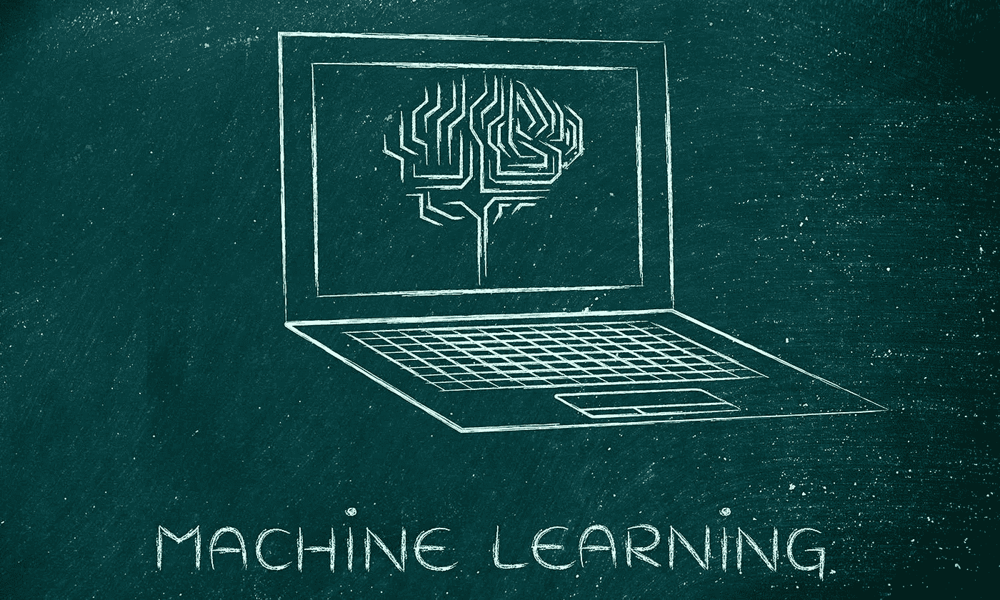
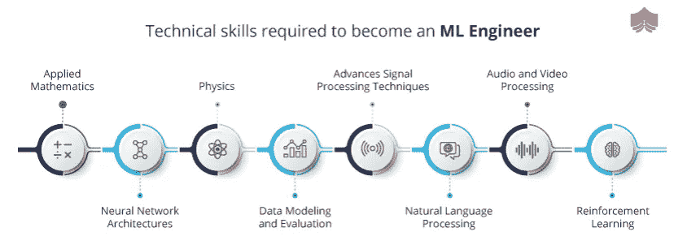

# 如何赢得机器学习生涯:综合指南

> 原文：<https://medium.com/analytics-vidhya/how-to-ace-a-machine-learning-career-a-comprehensive-guide-c9c5ae9d4b58?source=collection_archive---------15----------------------->

从预测提高股票市场涨跌预测准确性的燃料，到预测语音识别中低于 5%的错误率，再到智能机器人的兴起，机器学习正在改变我们的生活，使其变得更好。

## 机器学习的时代已经来临。

*   Statista 预测，大约 87%的公司已经开始将人工智能用于电子邮件营销和销售预测。
*   甲骨文表示，到 2020 年底，近 80%的公司计划在客户服务中采用人工智能。
*   根据创意策略，97%的移动用户正在使用人工智能语音助手。

人们必须注意到，这些统计数据同样揭示了社区和组织的迫切关切。

基于多种类型的研究，2020 年将是实时重建业务和解决复杂问题的绝佳年份。对机器学习专业人员的需求从未如此之好。到 2020 年底，AI 的实践将更加突出。

# 机器学习的现在和未来

**经商**

*   65%的公司希望采用机器学习来改善决策，memsql.com。
*   约 51%的组织称是机器学习的早期用户，[麦肯锡。](https://www.mckinsey.com/~/media/McKinsey/Business%20Functions/McKinsey%20Digital/Our%20Insights/Driving%20impact%20at%20scale%20from%20automation%20and%20AI/Driving-impact-at-scale-from-automation-and-AI.ashx)
*   麦肯锡的报告显示，49%的公司计划使用新技术进行产品开发。

**在营销方面**

*   在 allindex.org 机器学习算法的帮助下，网飞每年节省 10 亿美元。
*   美国陆军开始使用智能功能增强先进传感器来预测作战机器的维护。
*   由于机器学习的大规模增长，预计到 2020 年底，云计算市场将增长到 4100 多亿美元。

# 机器学习:行业中的活跃领域

你需要做好准备，因为机器学习是来颠覆行业的。你有没有想过优步是如何为不同的顾客制定不同的价格的？嗯，这是由于动态定价，并不是每个人都意识到这个事实。企业通过根据需求改变不同客户的定价体系来赚钱。

> 这些是机器学习而不是人类的工作。

除了旅游业之外，这项技术已经转移到许多其他部门。科技巨头埃森哲认为，目前的人工智能技术可以将企业生产率提高 40%。著名研究和咨询公司 Gartner 预测，到 2020 年底，大约 85%的客户反应可以在没有人的情况下处理。

**让我们简单介绍一下受到机器学习广泛影响的行业:**

**医疗保健**

*   放射学和放射疗法
*   诊断学

**教育**

*   提高效率
*   个性化学习

**运输**

*   自动驾驶
*   交通规则

**农业**

*   现场条件管理
*   作物管理

**金融**

*   高频交易(HFT)
*   证券管理

目前，这些行业依靠机器学习来建立最快的方法来有效地执行任务。

据劳工统计局报道，预计到 2026 年，将为**人工智能/人工智能工程师**创造约 1150 万个工作机会。对于希望提升工作的有抱负的技术专业人士来说，在 2020 年抓住机器学习职业是一个理想的赌注。

# **机器学习的工作角色包括:**

*   数据工程师和数据架构师
*   机器学习工程师
*   数据科学家
*   数据分析师
*   商业智能开发人员

# 👉ML 工程师-角色和职责

机器学习工程师在帮助组织使用机器学习技术、推荐系统、计算机视觉、表示学习、 [**、深度学习**](https://www.artiba.org/blog/multi-matrix-deep-learning-with-gpus) 和自然语言处理(NLP)来构建最新和最新的应用程序方面具有独特的地位。

你的工作职责包括:

*   研究、开发和实施机器学习技术，以帮助获得更好的结果。
*   这些专家预计会将机器学习解决方案转移到产品团队(数据工程师和数据科学家)进行进一步分析。
*   他们还负责向产品团队提供技术知识，建议完成任务的最佳方法。
*   关于新特性的技术和工具的反馈应该更新并与产品团队共享。
*   他们需要确保给予人才团队全面的支持，以培训新的研究人员和 ML 工程师。

# 👉成为机器学习工程师所需的顶级技能

在进入如何成为一名 [**机器学习专业**](https://www.artiba.org/the-artiba-edge) 的过程之前，首先要学习的技能很重要。

*   计算机科学基础和编程技能——数据结构、可计算性和复杂性、算法和计算机体系结构。
*   数据建模
*   数据估计
*   概率与统计
*   系统设计和软件工程
*   机器学习算法(如何应用)

一些顶级公司正在寻求招聘 ML 工程师，包括优步、埃森哲、苹果、微软、亚马逊、谷歌、脸书和网飞。

# 👉铺平机器学习的道路

你会发现很多建议告诉你该走哪条路。然而，达到顶点并不是一件轻而易举的事情，这就是为什么许多有抱负的技术专业人士在学习时容易迷失方向。不付出努力，你不可能简单地成为一名机器学习专家。人们花几个小时在一起了解工程的细微差别，以及它对你职业生涯的影响。

## **你可以考虑这些简单的步骤来开始:**

*   在构建模型和分析数据时，您将需要广泛的编程语言(Python、Java 和 R)实践知识。
*   掌握数学概念(统计、概率和微积分)来实现机器学习算法。
*   获取数据工程技能(数据预处理、数据操作和数据评估),用于清理、处理和可视化大量数据。
*   掌握机器学习算法(监督、非监督和强化算法)，帮助您建立预测模型。
*   必须具备先进的大数据知识(Hadoop、Mahout、Spark 和 Matlab)。
*   商业敏锐性是至关重要的，为此你需要学习可视化工具如何工作，以及如何使用这些工具构建图表。

技术世界正在以惊人的速度变化，对 [**AI/ML 工程师**](https://www.artiba.org/certification/artificial-intelligence-certification) 的需求只会呈指数级增长。如果这是你计划在可预见的未来看到自己的地方，现在就是时候了。

机器学习的未来并不遥远！