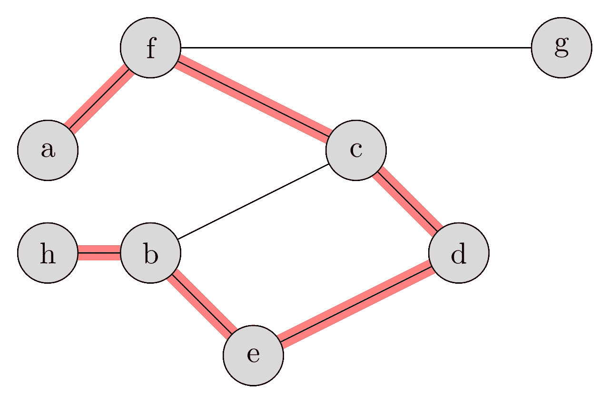
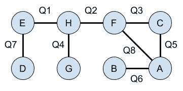

# 如何:用图论赢得外语词汇测验

> 原文：<https://medium.com/analytics-vidhya/how-to-ace-foreign-vocabulary-quizzes-26ef66b6782a?source=collection_archive---------10----------------------->

我最近给学校的数学俱乐部做了一次演讲，题目是“如何在外语词汇测验中胜出”本讲座是在进行英语词汇测验时发生的。在被一些问题卡住后，我能够逻辑地推断出一些答案，保证 100%正确，尽管实际上并不知道所有的词汇。我想知道我是否可以将这种演绎应用到外国词汇测验中，知道 0%并保证 100%的分数。这是我对这个话题的探索，它有一个非常有趣的图论应用。

维基共享资源:马丁托马斯[抄送([https://creativecommons.org/licenses/by/3.0](https://creativecommons.org/licenses/by/3.0))]

我以对基础图论的快速概述开始了我的演讲，基础图论是对成对关系模型的研究。这里有一个总结:

1.  节点/顶点:对象，直观地表示为点。一个图有 V 个顶点。
2.  边:两个对象之间的连接，在视觉上用线条表示。一个图有 E 条边。
3.  循环:在同一顶点开始和结束的一系列不同的边。
4.  叶子:只连接到一边的节点。
5.  树:一种图，其中有且仅有一条路径连接每对节点。
6.  森林:由多棵树组成的图。

所有的树都遵循 E = (V — 1)的准则。

假设一个词汇测验是这样一个测验，其中有 N 个单词和 N 个问题，对于某个正整数 N，每个问题有两个唯一的答案选项，从 N 个单词的库中选择。每个单词都是一个且只有一个问题的答案。

在这样的测验中，如果一个单词还不是一个问题的答案，并且只被列为一个未回答问题的选项，就可以推断出答案。

在这个例子中，我们可以推导出 5/8 的答案，这些答案是粗体的。

1.  Q1: **E** 还是 H
2.  Q2: **H** 还是 F
3.  Q3: F 或 C
4.  Q4: H 或 **G**
5.  Q5: A 还是 C
6.  Q6: A 或 **B**
7.  Q7: **D** 或 E
8.  问题 8: F 还是 A

有可能完全推导出这样一个外国词汇测验，知道 0%的单词，并保证 100%的分数吗？

考虑这个问题一段时间后，我意识到它可以用一个图来表示，其中答案是顶点，问题是边。解决一个测验就是在每条边(问题)和一个连接的节点(答案)之间创建一个完美的一对一匹配。

示例测验可以表示为:

示例测验的表示形式，其中每个节点代表一个单词，每个边代表一个问题。

扣除只是简单地将叶子分配给相邻的边。通过删除已经分配的元素并重复分配假期，可以进一步扣除 Q1 和 Q2。

最终，该图被简化为循环 AFC。这个问题无法解决，因此在这种情况下不能保证 100%的分数。

利用图论，我们可以确定是否有可能构造一个完全可解的测验。这样的图必须有 N 个顶点和 N 条边，没有圈。树木和森林是唯一没有周期的结构。然而，对于 N 个顶点，它们最多只能有(N-1)条边，再多就会产生一个循环。因此，不可能创建一个完全可解的测验。

然而，通过构建一个小循环并添加许多树叶，我们可以构建一个大部分可解的测验。我们最多能确定(N-2)/N 个问题的正确答案。

即使对语言有初步的了解，这些循环也可以很容易地解决。循环中的任何知识都可以用于确定性地解决循环。因此，在最好的情况下，对于具有 K 个循环的测验，仅用 K 条知识就可以保证满分。

给定这个图论方法，我们也可以保证 1/3 的最小分数。可以猜测每个周期，使得半个周期是正确的。对于长度为 L 的奇数长度循环，这保证了 L 的分数为(L-1)/2。在最坏的情况下，3 长度循环的图，这种策略保证了至少 1/3 的分数。