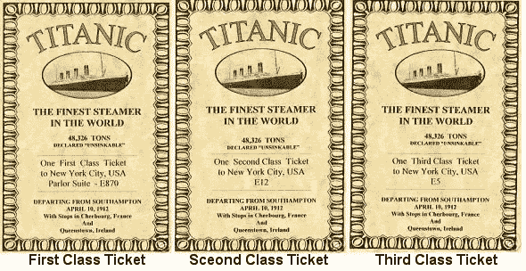
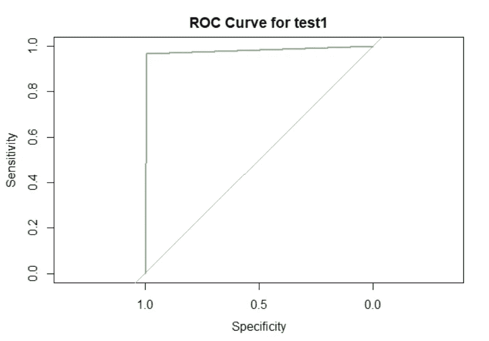
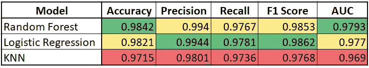

# 如何在 Titanic 数据集上达到 98%以上的准确率

> 原文：<https://medium.com/analytics-vidhya/how-to-achieve-more-than-98-of-accuracy-on-titanic-dataset-87241c18161a?source=collection_archive---------8----------------------->


伊夫琳·帕里斯在 [Unsplash](https://unsplash.com?utm_source=medium&utm_medium=referral) 上拍摄的照片

对于机器学习爱好者来说，从泰坦尼克号数据集开始练习非常平常。

为了预测泰坦尼克号灾难中全班乘客的存活率，我开始搜索 Kaggle 上的数据集。我决定选择， **Kaggle +维基百科数据集**来研究客观。

这项研究是在 R 工作室完成的。

加载数据前，请仔细阅读 Readme.md 中的“[数据清理和编辑”部分。](https://github.com/RutvijBhutaiya/The-Famous-Titanic-Study/blob/master/README.md)

数据集中变量的结构如下...

```
$ PassengerId       : int  1 2 3 4 5 6 7 8 9 10 ...
$ Survived          : int  0 1 1 1 0 0 0 0 1 1 ...
$ Pclass            : int  3 1 3 1 3 3 1 3 3 2 ...
$ Name              : Factor w/ 1307 levels "Abbing, Mr. Anthony",..: 156 287 531 430 23 826 775 922 613 855 ...
$ NameLength        : int  23 27 22 29 24 16 23 30 22 22 ...
$ Sex               : Factor w/ 2 levels "female","male": 2 1 1 1 2 2 2 2 1 1 ...
$ SibSpouse         : int  1 1 0 1 0 0 0 3 0 1 ...
$ ParentsChild      : int  0 0 0 0 0 0 0 1 2 0 ...
$ TicketNumber      : Factor w/ 929 levels "110152","110413",..: 721 817 915 66 650 374 110 542 478 175 ...
$ Fare              : num  7.25 71.28 7.92 53.1 8.05 ...
$ Cabin             : Factor w/ 187 levels "","A10","A11",..: 1 108 1 72 1 1 165 1 1 1 ...
$ Age_wiki          : num  22 35 26 35 35 22 54 2 26 14 ...
$ Age_Months        : int  264 420 312 420 420 264 648 24 312 168 ...
$ HometownCountry   : Factor w/ 47 levels "","Argentina",..: 18 47 19 47 18 24 47 41 47 27 ...
$ Boarded           : Factor w/ 5 levels "","Belfast","Cherbourg",..: 5 3 5 5 5 4 5 5 5 3 ...
$ Destination       : Factor w/ 292 levels "","Aberdeen, South Dakota, US",..: 217 187 186 242 186 186 73 57 250 60 ...
$ DestinationCountry: Factor w/ 10 levels "","Brazil","Canada",..: 3 10 10 10 10 10 10 10 10 10 ...
$ Lifeboat          : Factor w/ 21 levels "","1","10","11",..: 1 12 7 21 1 1 1 1 8 1 ...
$ LifeboatSupport   : Factor w/ 2 levels "No","Yes": 1 2 2 2 1 1 1 1 2 1 ...
```

**我们在数据分析中开始的重要任务是关于 EDA(探索性数据分析)**。我们还使用 tableau 进行分析，不仅如此，我们还使用 Tableau 图表分析来处理缺失值。

根据分析，我们发现一等舱的乘客有优先乘坐救生艇的权利，因为 62%的乘客幸存，而三等舱的乘客只有 24%幸存。然而，一等舱、二等舱和三等舱的乘客总数分别为 323 人、277 人和 709 人。



研究中最精彩的部分是 EDA，它涵盖了，

```
**# Treating Missing Values
# Pivot table Analysis
# Fare Variable Analysis for Outliers
# Boxplot Analysis for Outlier - Used Hypothesis 
# Other Variables Outliers Study
# Correlation
# Data Normalization****## And Finally we stored clean data into TitanicCleanData.csv file.** 
```

在这项研究中，我们决定在同一个数据集(TitanicCleanData.csv)上研究三种 ML 技术。一项完整的研究在美国完成

在建立模型之前，我们将数据分成三部分， **1。幸存变量的缺失值-实际预测。2.训练数据集—用于模型训练。3.测试数据集—用于测试基于未知和性能的模型。**

```
## Development (Study) dataSet and Validation (Test) dataset Prediction = subset(TitanicCleanData, is.na(TitanicCleanData$Survived)) train = na.omit(TitanicCleanData)attach(train) # %%%%%%%%%%%%%%%%%%%%%%%%%%%%%%%%%%%%% # Make Ratio of 30% and 70% for test1 and train1 dataset ind = sample(2, nrow(train), replace = TRUE, prob = c(0.7,0.3)) train1 = train[ind == 1,]
test1 = train[ind == 2,]
```

首先，我们应用随机森林技术来预测乘客的存活率。我们使用了**“bo ruta”特征选择技术，**并从研究中剔除了不太重要的特征。

```
#Feature Selection Techniques 
attach(train1) 
set.seed(123) boruta.train <- Boruta(Survived ~ . , data=train1, doTrace = 2)
```


图片由 [Geran de Klerk](https://unsplash.com/@gerandeklerk?utm_source=medium&utm_medium=referral) 在 [Unsplash](https://unsplash.com?utm_source=medium&utm_medium=referral) 上拍摄

我们调整了随机森林模型，并根据错误率选择了正确数量的变量和树，以避免过度拟合。

```
train.tune = tuneRF(x = train1[, -c(1)], 
y = as.factor(train1$Survived),                   
mtryStart = 6,                    
ntreeTry = 41,                    
stepFactor = 1.2,                    
improve = 0.0001,                    
trace = TRUE,                    
plot = TRUE,                    
nodesize = 20,                    
doBest = TRUE,                    
importance = TRUE) train.rf = randomForest(as.factor(train1$Survived) ~ ., 
data = train1,                         
ntree =31, mtry = 5, nodesize = 20, importance  = TRUE)
```

同样的模型——train . RF——我们应用于在测试数据集上预测泰坦尼克号灾难中幸存的乘客，以检查模型的性能。

对于未知数据的**性能测量**，我们使用了三种技术， **1。混淆矩阵，2。F1 分数，3。AUC 分数。**

```
# Confusion Matrix  
library(caret)
library(e1071) confusionMatrix(as.factor(test1$Survived), test1$predict.class) ## F1 Score precision.test1 = precision(as.factor(test1$Survived), test1$predict.class)
# [1] 0.9940828 recall.test1 = recall(as.factor(test1$Survived), test1$predict.class)
# [1] 0.9767442 test1.F1 = (2*precision.test1*recall.test1) / sum(precision.test1, recall.test1)
# [1] 0.9853372 ## ROC Curve 
roc(test1$Survived, as.numeric(test1$predict.class), plot = TRUE, main = 'ROC Curve for test1', col = 'darkseagreen')
```



基于 TitanicCleanData.csv 文件，我们还建立了逻辑回归和 K 近邻模型来预测泰坦尼克号上的幸存乘客。



关于项目实施，敬请访问…**[**Github**](https://github.com/RutvijBhutaiya/The-Famous-Titanic-Study)**

**[](https://github.com/RutvijBhutaiya/The-Famous-Titanic-Study) [## rutvijbhutaya/著名的泰坦尼克号研究

### 在发展中..展开步骤步骤 2:下载泰坦尼克号数据集步骤 3:设定研究目标步骤 4…

github.com](https://github.com/RutvijBhutaiya/The-Famous-Titanic-Study)**