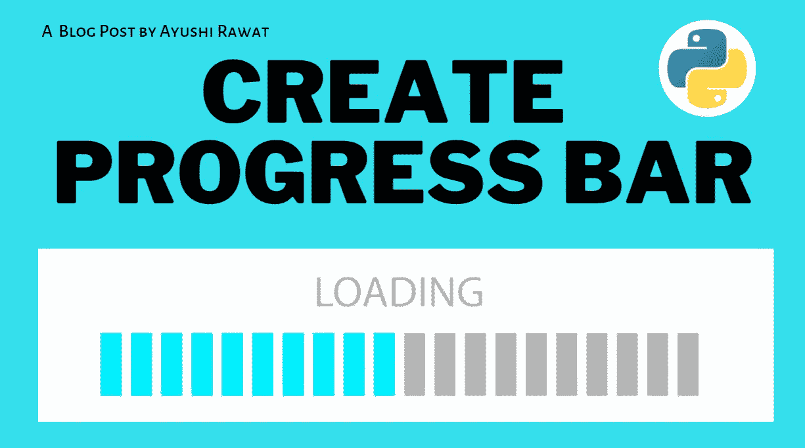
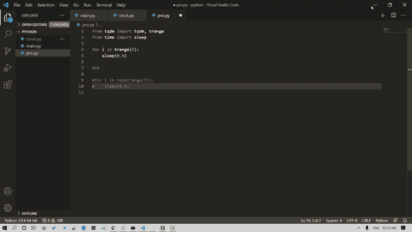

# 如何在 Python 中添加进度条

> 原文：<https://medium.com/analytics-vidhya/how-to-add-a-progress-bar-in-python-19c45149e0?source=collection_archive---------4----------------------->



你好世界！

当您碰巧安装软件、下载应用程序或媒体或加载页面时，您会看到一个进度条，显示完成或渲染该过程所需的估计时间。您也可以在代码中添加一个。在这篇博客文章中，我们将学习如何创建一个进度条。我们将看到 Python 中的实现。

[查看 python](https://github.com/ayushi7rawat/Ultimate-Python-Resource-Hub) 中的终极资源库。发现有用就掉颗星！有什么要补充的吗？开个 PR 就一样了！

你可以参考我的 YouTube 视频教程，看一个工作教程来更好的理解和一步一步的指导。

# 这个博客将会涵盖什么

```
1\. tqdm Introduction
2\. How to Create Progress Bar
```

# `tqdm`简介:

进度条是一种图形控制元素，用于显示扩展计算机操作的进度，如下载、文件传输或安装。我们将利用 Python 库 tqdm 来创建简单的进度条，这些进度条可以添加到代码中，使它看起来生动活泼！

`tqdm`在阿拉伯语中是“进步”的意思(*塔卡杜姆*，تقدّم)，在西班牙语中是“我如此爱你”的缩写( *te quiero demasiado* )。`tqdm`是快速和可扩展的进度表。

如果你想了解更多，可以参考`[tqdm](https://github.com/tqdm/tqdm)` [文档](https://github.com/tqdm/tqdm)。使用此链接导航到文档。

现在你已经了解了`tqdm`的基础知识，我们可以前进到编码部分了。我们开始吧！

# 该编码了！

你可以在我的 [GitHub 库](https://github.com/ayushi7rawat/Youtube-Projects/tree/master/create%20progress%20bar)找到所有代码。发现有用就掉颗星。

为了访问 Python 库，您需要将它安装到您的 Python 环境中，使用下面的命令来安装`tqdm`

```
pip install tqdm
```

现在，让我们在 Python 脚本中导入包。

```
from tqdm import tqdm, trange
```

我们将需要时间包，所以让我们也导入一个

```
import time
```

让我们为一个 iterable 运行一个循环

```
for i in range(10):
    pass
```

为了查看进度，让我们使用`time`模块

```
for i in range(10):
    time.sleep(0.4)
```

完成后，让我们为循环添加一个进度条。为了做到这一点，让我们用`tqdm`方法包装 iterable。

```
for i in tqdm(range(10)):
    time.sleep(0.4)
```

让我们来看看输出。它看起来会像这样:



如果您希望去掉 iterable，可以通过将 iterable 封装在`trange`模块中来实现。

```
for i in trange(5):
    sleep(0.4)
```

这就是如何在 python 脚本中添加进度条的方法。就是这样！

很简单，不是吗？希望这篇教程有所帮助。我强烈推荐你去看看同样的 [YouTube 视频](https://www.youtube.com/watch?v=wbYqz71WVvI)，别忘了订阅我的频道。

您可以使用`tqdm`库，甚至探索更多的特性。您甚至可以使用 Tkinter 来利用 Python GUI。

你可以在我的 [GitHub 库](https://github.com/ayushi7rawat/Youtube-Projects/tree/master/create%20progress%20bar)找到所有代码。发现有用就掉颗星。

感谢您的阅读，我很乐意通过 [Twitter](https://twitter.com/ayushi7rawat) | [LinkedIn](https://www.linkedin.com/in/ayushi7rawat/) 与您联系。

请分享您的宝贵建议，感谢您的真诚反馈！

你绝对应该看看我的其他博客:

*   [Python 3.9:你需要知道的一切](https://ayushirawat.com/python-39-all-you-need-to-know)
*   [终极 Python 资源中心](https://ayushirawat.com/the-ultimate-python-resource-hub)
*   [GitHub CLI 1.0:你需要知道的一切](https://ayushirawat.com/github-cli-10-all-you-need-to-know)
*   [成为更好的程序员](https://ayushirawat.com/become-a-better-programmer)
*   [如何制作自己的谷歌 Chrome 扩展](https://ayushirawat.com/how-to-make-your-own-google-chrome-extension-1)
*   [使用 Python 从任何 pdf 创建您自己的有声读物](https://ayushirawat.com/create-your-own-audiobook-from-any-pdf-with-python)
*   [你很重要，你的心理健康也很重要！](https://ayushirawat.com/you-are-important-and-so-is-your-mental-health)

# 资源:

*   [pypi.org/project/tqdm](https://pypi.org/project/tqdm/)
*   [tqdm.github.io](https://tqdm.github.io/)
*   [github.com/tqdm/tqdm](https://github.com/tqdm/tqdm)

在我的下一篇博客文章中再见，保重