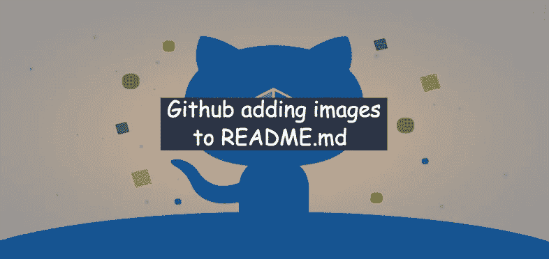
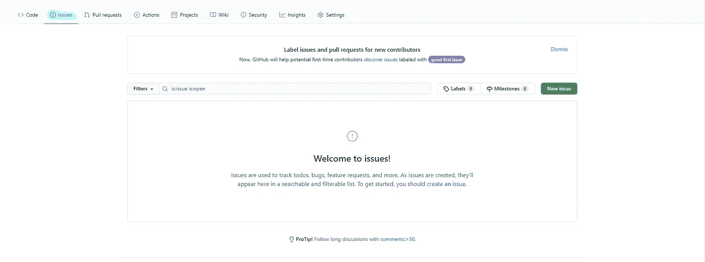
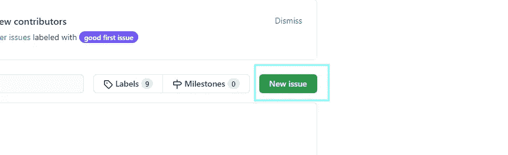
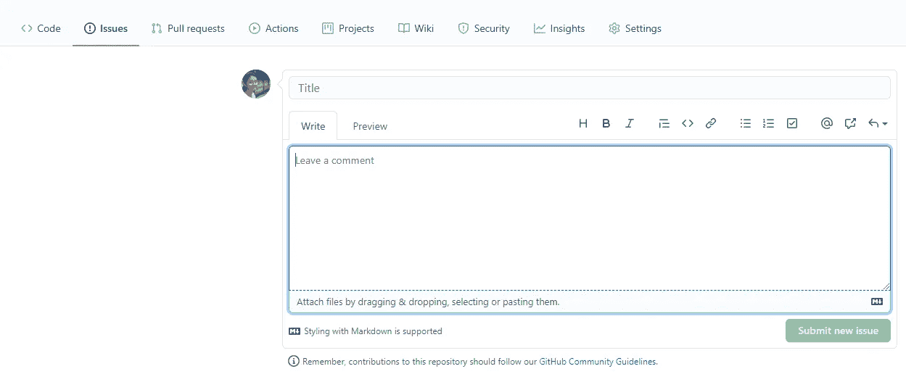
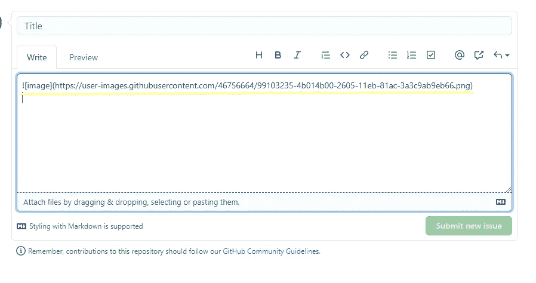

# 如何在你的 GitHub 自述文件中添加截图？

> 原文：<https://medium.com/analytics-vidhya/how-to-add-a-screenshot-in-your-github-readme-file-176afeb8ad86?source=collection_archive---------5----------------------->

自述文件提供了关于您的存储库中具体包括什么以及它看起来会是什么样子的见解。顾名思义，read me 文件(“readme”)可能是任何人从你的 repo 中读取的第一个文件，也是 Github 或任何 Git 托管网站在有人打开你的存储库时显示的第一个文件。

老实说，我不想下载整个回购并运行它，让它成为一个应用程序或网站，看看它看起来如何，然后决定它是否适合我。如果你能附上你的网站或应用程序或任何文件的截屏，这将对访问者非常方便，这样他们就能了解它的外观和功能。github 上有大量关于几乎所有话题的回复，所以你可以放一张截图，只需要 1-2 分钟，就可以让你的回复更加引人注目。

现在，让我逐一列出步骤:

1.  转到您的存储库并单击“问题”选项卡

2.点击“新问题”。

3.将所需的屏幕截图粘贴到问题的消息框中。

4.一旦图像上传，你会在消息框中看到图像路径，复制它。

**注意:不需要提交问题，复制图片路径即可。**

5.将此路径粘贴到您的自述文件中，屏幕截图将会出现。提交对自述文件的更改。

仅此而已！！！您已经准备好了一个精彩的自述文件。你闭着眼睛也能做到这一点，所以试试这个，让你的回复与众不同。