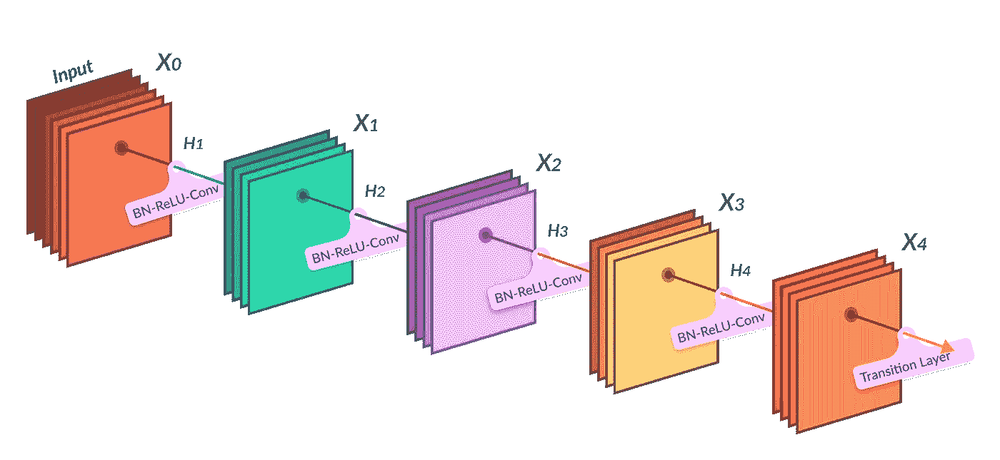
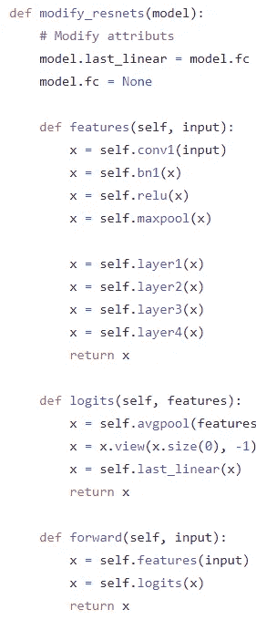

# 如何使用 Pytorch 在预训练模型中添加附加层

> 原文：<https://medium.com/analytics-vidhya/how-to-add-additional-layers-in-a-pre-trained-model-using-pytorch-5627002c75a5?source=collection_archive---------2----------------------->

我们大多数人发现添加附加层并在模型和附加层之间生成连接是非常困难的。但是，在这里，我将使它变得简单。这样，每个人都能从中受益。只要把这个读一遍，我们就可以开始了。



因此，在这里我将使用两个小模型的架构(**efficient net _ B0**&**resnet 18**)作为我们理解这个主题的例子。

## **效率网 _b0** →


首先，我们将安装预先训练的模型

```
!pip install efficientnet_pytorch
```

然后，如果我们在 Pytorch 的 efficientNet 的 GitHub 中查找[,我们会发现它的重要性](https://github.com/lukemelas/EfficientNet-PyTorch)

```
from efficientnet_pytorch import EfficientNet
```

最后，我们将定义自己的类

```
class **EfficientNet_b0**(nn.Module):
```

之后，我们为我们的类定义构造函数

```
def __init__(self):
        super(EfficientNet_b0, self).__init__()

#  where this line **super(EfficientNet_b0, self).__init__()** is used to inherit nn.Module used above.
```

之后，我们将加载预训练的 EfficientNet 模型。

```
self.model = efficientnet_pytorch.EfficientNet.from_pretrained('efficientnet-b0')
```

最后，我致力于添加额外的层**一个密集层**，然后**批量规格化层**然后**一个脱落层**和**最后两个密集层。**

```
self.classifier_layer = nn.Sequential(
            nn.Linear(1280 , 512),
            nn.BatchNorm1d(512),
            nn.Dropout(0.2),
            nn.Linear(512 , 256),
            nn.Linear(256 , **no._of_outputs_classes_for_your_dataset**)
        )
```

***注*** : **nn。Linear(1280，512)** 第一个附加密集层包含 **1280** 作为 in_features 因为如果我们打印model **最后一层**(***_ fc***)**of**efficient net-B0 model 包含 **1280 作为 in features** 和 **1000 作为 out_features 来分类**

```
(**_bn1**): BatchNorm2d(1280, eps=0.001, momentum=0.010000000000000009, affine=True, track_running_stats=True) 
(**_avg_pooling**): AdaptiveAvgPool2d(output_size=1) 
(**_dropout**): Dropout(p=0.2, inplace=False) 
**(_fc): Linear(in_features=1280, out_features=1000, bias=True)** (**_swish**): MemoryEfficientSwish()
```

之后，我们将定义 forward 函数来生成模型和我们定义的层之间的连接。对于这个 [***我们需要看看 GitHub Repo***](https://github.com/lukemelas/EfficientNet-PyTorch/blob/master/efficientnet_pytorch/model.py) 中模型类的 forward 函数

```
# forward function of Efficient-Net model 
def forward(self, inputs):
   x = self.extract_features(inputs)
   x = self._avg_pooling(x)
   x = x.flatten(start_dim=1)        
   x = self._dropout(x)        
   x = self._fc(x)
   return x
```

我们将通过**移除最后一层**和**添加 self.model** 来改变一些事情，因为我们已经在构造函数类中定义了 **self.model** 。

```
def forward(self, inputs):
    x = **self.model**.extract_features(inputs)
    x = **self.model**._avg_pooling(x)
    x = x.flatten(start_dim=1)
    x = **self.model**._dropout(x)
    x = self.classifier_layer(x)
    return x
```

终于准备好了。

## **RestNet18** →


同样，对于 resNet18 型号，我们将遵循与之前类似的步骤。

```
!pip install pretrainedmodelsimport pretrainedmodels
```

我们将把模型类和构造函数定义为

```
class **Resnet18**(nn.Module):
    def __init__(self):
        super(Resnet18, self).__init__()
        self.model =  pretrainedmodels.__dict__['resnet18'](pretrained='imagenet')
```

并像在 EfficientNet_b0 模型中一样添加我们的额外层。

```
self.classifier_layer = nn.Sequential(
            nn.Linear(**512** , 256),
            nn.BatchNorm1d(256),
            nn.Dropout(0.2),
            nn.Linear(256 , 128),
            nn.Linear(128 , **no._of_outputs_classes_for_your_dataset**)
        )
```

***注*** : **nn。线性(512，** 256 **)** 第一个附加密集层包含 **512** 作为 in_features 因为如果我们打印******最后一个层( **最后 _ 线性** ) 【T22)的 resnet18 模型包含 **512 作为 in features 【T25********

```
**(avgpool): AdaptiveAvgPool2d(output_size=(1, 1)) 
(fc): None 
(**last_linear**): Linear(in_features=**512**, out_features=1000, bias=True)**
```

****最后我们将通过 [***查看 GitHub Repo***](https://github.com/Cadene/pretrained-models.pytorch/blob/master/pretrainedmodels/models/torchvision_models.py) 中模型类的转发函数来定义转发函数****

********

****并将其更改为:→****

```
**def forward(self, x):
    **batch_size** ,_,_,_ = x.shape #taking out **batch_size** from input image
    x = self.model.features(x)
    x = torch.nn.functional.adaptive_avg_pool2d(x,1).reshape(**batch_size**,-1) # then reshaping the **batch_size**
    x = self.classifier_layer(x)
    return x**
```

****在所有的改变之后，我们的类将会是这样的****

****之后，我们就可以通过创建它们的对象来使用我们的模型类了。我希望你已经明白了这一点，如果你有任何问题，评论或关注，请让我知道在评论部分；在那之前，享受学习吧。****