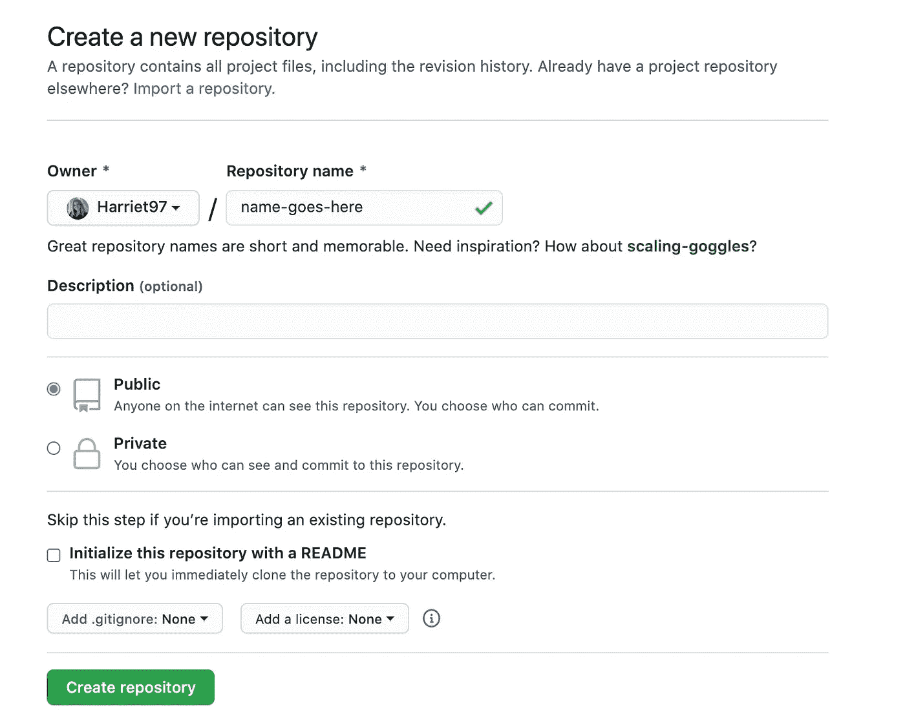
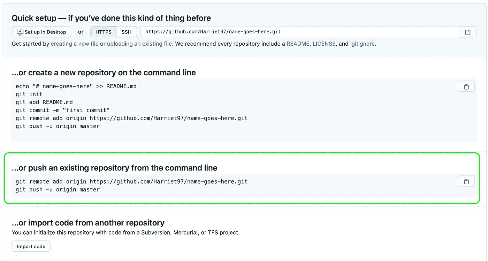

# 如何将现有项目添加到 GitHub

> 原文：<https://medium.com/analytics-vidhya/how-to-add-an-existing-project-to-github-b5cf382e8782?source=collection_archive---------25----------------------->


由 [Unsplash](https://unsplash.com/s/photos/lightbulb?utm_source=unsplash&utm_medium=referral&utm_content=creditCopyText) 上[卡拉·维达尔](https://unsplash.com/@karlavidal?utm_source=unsplash&utm_medium=referral&utm_content=creditCopyText)拍摄的照片

我发现我的许多编码之旅都要追溯到我早期的笔记，回顾如何做最简单的事情。本周，由于急于开始一个新项目，我直接进入了“创建-反应-应用”，然后意识到我没有先在 GitHub 上创建回购。所以回到笔记上来记住怎么做！现在我用简单的步骤做了这个指南，它将帮助未来的我，希望你也一样！

1.  上 GitHub，开始一个新项目。给你的项目起个名字，决定它是公有的还是私有的，你就可以开始了！我建议不要用*自述文件*初始化新的存储库。gitignore 或许可证来避免错误。在您的项目被推送到 GitHub 之后，您可以在 GitHub 上或在您的代码编辑器中轻松地添加它。



2.在 CLI 中导航到要跟踪的项目文件夹，然后键入:打开项目文件夹 CLI，并使用以下命令初始化本地目录:

```
$ git init
```

3.在本地存储库中暂存要提交的文件。

```
$ git add .
```

4.提交您在本地存储库中暂存的文件。这将准备好要推送到远程存储库的文件:

```
$ git commit -m "First commit"
```

5.现在回到 GitHub，您应该会看到这个:



我们正在尝试“从命令行推送一个现有的存储库”,所以请复制这段代码

6.将其粘贴到项目的本地 CLI 中:

```
$ git remote add origin <repo-URL> 
# this defines where your local repo will be pushed$ git push -u origin master
# this pushes the changes in your local repo to GitHub.
```

恭喜你！你的项目现在在 GitHub 上！

如果你打算继续在回购上工作，那么我会建议你立即切换到一个新的分支，这样你就可以轻松地跟踪你的项目，并轻松地恢复到以前的版本。

```
$ git checkout -b <new-branch-name>
```

要对本地回购进行推送和后续更改，您只需:

```
$ git add .
$ git commit -m "a descriptive message for you to track the changes"
$ git push -u origin master
```

进入 GitHub，合并修改，你就可以开始了！