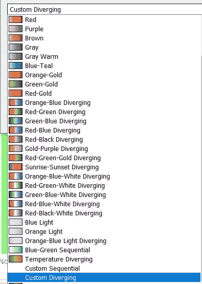
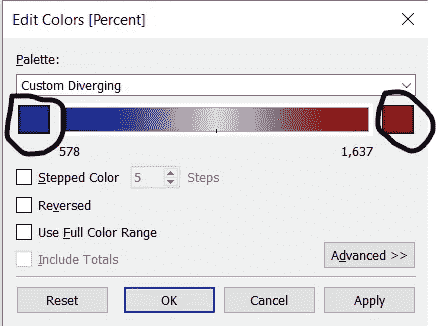
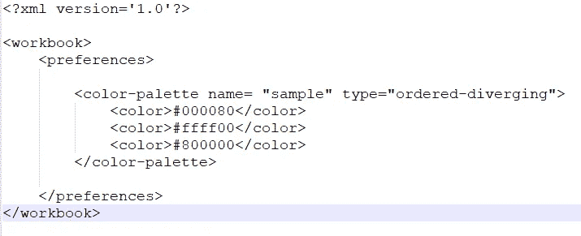
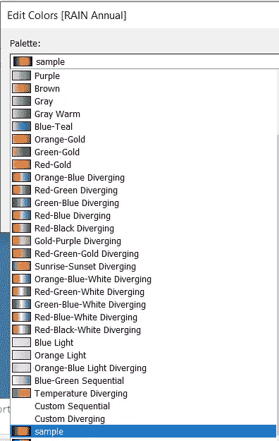
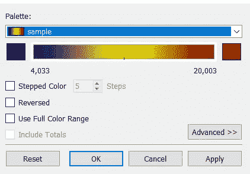
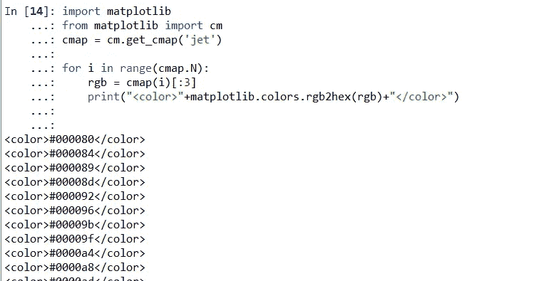
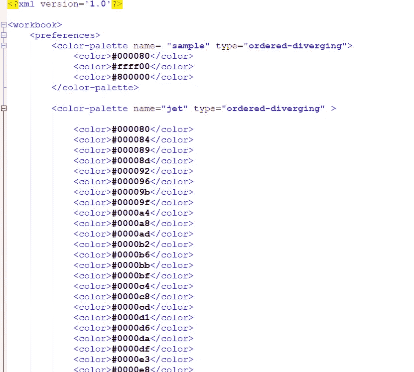
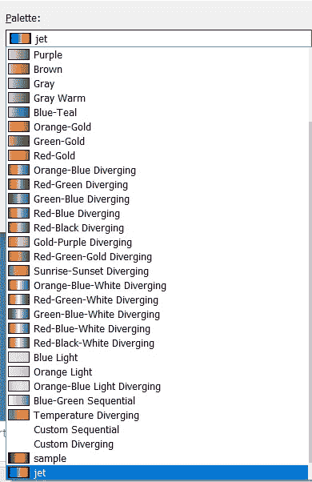

# 如何向 Tableau 添加 matplotlib 发散配色方案

> 原文：<https://medium.com/analytics-vidhya/how-to-add-matplotlib-diverging-color-schemes-to-tableau-83907b4b43f3?source=collection_archive---------10----------------------->

Tableau 是我最喜欢的可视化工具之一。我敢打赌，对于许多其他数据爱好者来说也是如此。除了各种默认的配色方案，允许用户以多种不同的方式创建自己的配色方案。

基本上，tableau 有两种不同类型的配色方案分类和分歧的配色方案。在本文中，我们将着重于创建 matplotlib 中可用而 Tableau 中没有的自定义发散配色方案。让我们从在桌面上创建自定义发散配色方案的各种方法开始。

# **简单明了的方法:**

在标记部分，转到颜色->编辑颜色选项。您会发现创建如图 1 所示的自定义发散颜色方案的选项。

图 Tableau 中的配色方案选项。

现在，你可以点击这些颜色方块，在配色方案的两边选择你想要的自定义颜色。

图 2:自定义发散配色方案窗口

这是在 Tableau 中创建自定义配色方案的简单易行的方法。但是，这种方法有以下限制:

1.  默认情况下，中心配色方案会发散为灰色，我们无法改变这一点。
2.  我们不能创建多种颜色(超过 3 种颜色)的配色方案
3.  它不能被保存并在以后重新使用。

为了避免这些限制，我们将使用一种不同的方法，这种方法并不直接，也不容易实现。

# **进阶方法:**

在这个方法中，我们将编辑文件 **"Preferences.tps"** ，该文件位于**"我的 Tableau Repository"** 文件夹中。通常，在 Windows 操作系统上，该文件夹位于**“我的文档”**文件夹中。该文件可以使用记事本或 notepad++等编辑器进行编辑

图 3 显示了我们将添加到 Preferences.tps 文件中的 XML 代码。在这个文件中,“颜色”标签按照下面提到的发散颜色的顺序使用十六进制值。一旦添加了所需的 XML 代码，就应该保存文件并重启 Tableau。

图 3: Preferences.tps 文件

<color-palette>标签中的“name”属性可以是您希望该配色方案在 tableau 上显示的任何名称。如图 4 所示。</color-palette>

图 4:添加到列表中的自定义调色板。

样本代码中提到的十六进制代码分别是蓝色、黄色和红色。图 5 显示了这个样本配色方案的外观。

图 5:从 Preferences.tps 添加的示例配色方案

要了解更多关于 Preferences.tps 的标签和属性，请参考[文档](https://help.tableau.com/current/pro/desktop/en-us/formatting_create_custom_colors.htm)。

如你所见，现在我们可以了

1.  将发散颜色更改为我们想要替换默认灰色的任何颜色。
2.  使用超过 3 种颜色创建不同的配色方案。
3.  保存自定义的发散配色方案并重复使用。

所以，为了添加任何颜色的新配色方案，我们不得不简单地按照发散的顺序提到发散的颜色。但是，问题是，如何识别 matplotlib 配色方案中涉及的多种颜色及其十六进制代码。我们将使用 python 来识别配色方案中的颜色序列，我们希望使用 Python 在 Tableau 上复制这些颜色序列。

# **使用 Python** 提取颜色序列和相应的十六进制代码

我使用 Tableau 来生成可视化效果，讲述我们在研究气候数据时所做的分析。所以，我不得不使用 matplotlib 命名为“jet”的配色方案(如图 6 所示。)作为研究领域的一些标准的一部分。因此，这里的问题是识别颜色的顺序和这个配色方案中涉及的颜色的相应十六进制值。

图 6 喷射配色方案。

下面是识别和提取颜色序列及其十六进制值的简单 Python 代码。这将显示配色方案中所有 256 种颜色的整个序列。只需复制这个输出 XML 行并将其粘贴到 preferences.tps 中，就可以在 Tableau 上获得您的自定义配色方案。

图 Jet 配色方案中带有颜色序列的 Python 代码

保存 Preferences.tps 文件后，重新启动 Tableau 以反映更改。

图 8:带有自定义配色方案“jet”的 Preferences.tps 文件

图 9 添加 jet 配色方案后的配色方案列表。

**参考文献:**

1.  [https://help . tableau . com/current/pro/desktop/en-us/formatting _ create _ custom _ colors . htm](https://help.tableau.com/current/pro/desktop/en-us/formatting_create_custom_colors.htm)
2.  [https://stack overflow . com/questions/33596491/extract-matplotlib-colormap-in-hex-format](https://stackoverflow.com/questions/33596491/extract-matplotlib-colormap-in-hex-format)