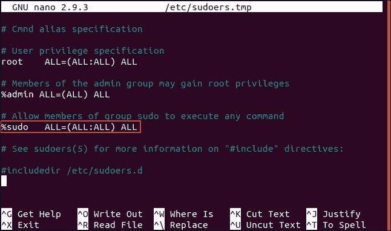

# 如何在 Ubuntu 中将用户添加到 Sudoers 文件中

> 原文：<https://medium.com/analytics-vidhya/how-to-add-users-to-sudoers-file-in-ubuntu-e89c24b7369d?source=collection_archive---------0----------------------->


> UDO 是一个命令行程序，允许受信任的用户以 root 或其他用户的身份执行命令。

**sudo** 允许您以不同用户的身份运行 Unix 命令。使用 **/etc/sudoers** 文件来确认您可以使用哪些特权，该命令有效地提升了您的访问权限，从而允许您运行命令和访问文件，否则您将无法使用。

## sudo 命令如何工作

**sudoers 文件**是一个文本**文件**，位于“/etc/ **sudoers** ”它控制 sudo 如何在你的机器上工作。您可能熟悉 **sudo 的**主要角色，将您当前帐户的权限提升为 root，即所有基于 Unix 的系统上的超级用户。

真实有效的用户 id (uid)和组 id (gid)被设置为与 **/etc/sudoers** 文件中指定的目标用户相匹配(更改该文件最安全的方法是使用 [**visudo 命令**](https://www.unixtutorial.org/commands/visudo) —查看 [visudo 教程](https://www.unixtutorial.org/2007/12/visudo-tutorial/))。使用 **sudo** 的方法非常简单:运行这个命令，并指定一个希望以不同用户的权限运行的命令行。在运行请求的命令之前，会要求您通过提供用户密码来确认您的身份。

**sudoers 文件**位于/etc/ **sudoers** 中。并且不应该直接编辑，需要使用 visudo 命令。

## 维苏多

现在主要使用 VISUDO 文件在 sudoers 文件中添加用户。

[**visudo**](https://www.unixtutorial.org/commands/visudo) 是一个安全更新 **/etc/sudoers** 文件的工具，在大多数 Linux 系统中都有(比如 [Ubuntu](http://www.ubuntu.com/) )。这是允许普通用户以超级用户权限运行命令所需的文件——使用 [**sudo 命令**](https://www.unixtutorial.org/commands/sudo/) 。

以下是 Ubuntu 手册页对此的描述，我认为这是一个很好的总结:

> ***visudo*** *以安全的方式编辑 sudoers 文件，类似于 vipw。* ***visudo*** *锁定 sudoers 文件以防多个同时编辑，提供基本的健全性检查，并检查解析错误。如果当前正在编辑 sudoers 文件，您将会收到一条消息，提示您稍后再试。*

**注意**:由于 **/etc/sudoers** 文件的敏感内容，您只能以 root 身份运行 [visudo](https://www.unixtutorial.org/commands/visudo) 。

# 使用 visudo 编辑/etc/sudoers

这是 [**visudo** 命令](https://www.unixtutorial.org/commands/visudo)的默认行为:只需不带任何参数运行它，它将在 vi 编辑器中打开/etc/sudoers 文件的内容，允许您编辑它，然后应用更改。

我强调应用更改的原因是因为 **vi** 会话将不会编辑实际的/etc/sudoers 文件，而是由 [**visudo**](https://www.unixtutorial.org/commands/visudo) 创建的临时副本。在您做出更改并退出 **vi** 之后， **visudo** 将在替换实际的/etc/sudoers 文件之前对该文件进行语法检查。

提示:如果您使用的是不同的文本编辑器，您可以通过在 shell 中设置 editor 变量来轻松覆盖它， [**visudo**](https://www.unixtutorial.org/commands/visudo) 足够智能，可以尊重它并使用指定的编辑器。

# 使用 visudo 检查/etc/sudoers 语法

有时你不想使用这个命令更新文件，但是想验证 **/etc/sudoers** 的语法是否正确。这时， [**visudo**](https://www.unixtutorial.org/commands/visudo) 的-c 选项出现了:

```
root@ubuntu:~$ visudo -c
/etc/sudoers file parsed OK
```

我们将使用 visudo 文件向该文件添加用户。

**visudo** 是 Unix/Linux 中用于安全更新/etc/sudoers 文件的特殊工具，由 [sudo 命令](https://www.unixtutorial.org/commands/sudo/)使用，用于提供和管理特权访问。

为了安全地更新/etc/sudoers 文件，可以在大多数 Linux 系统中找到(例如 [Ubuntu](http://www.ubuntu.com/) )。

由于 **/etc/sudoers** 文件定义了特权访问的规则(有时是无密码的)，所以您只能以 root 身份运行 visudo。

```
root@ubuntu:~$ **/usr/sbin/visudo**
visudo: /etc/sudoers: Permission denied
```

# visudo 命令如何工作

您不需要指定任何命令行选项。只需成为 root 用户并运行命令。您将看到默认的文本编辑器窗口，其中包含/etc/sudoers 文件。

只需运行以下命令:

```
root@ubuntu:~$ **/usr/sbin/visudo**
```

运行上面的命令后，你会得到下面的文件，在这里只添加用户。

您可以看到“用户权限规范”，唯一的超级用户被添加到超级用户行，您可以添加许多与超级用户相同的用户。

比如:

```
root   ALL=(ALL:ALL) ALL
farzana ALL=(ALL:ALL) ALL
```



在 visudo 文件“ctlr+x”中添加用户并输入“y”后，它将保存 visudo 文件。现在你可以用 Sudo 了。比如装库，更新等。

如果你仔细检查截图，你会注意到第一个重要原因 [visudo 命令](https://www.unixtutorial.org/commands/visudo/)如此有用:**它不直接编辑/etc/sudoers 文件**。相反，它会创建一个名为/etc/sudoers.tmp 的副本，并允许您编辑它。这意味着如果你的编辑会话发生了一些事情(服务器崩溃、断电、与远程服务器的连接中断)，你的服务器处于随机安全状态 **/etc/sudoers** 是没有风险的。

完成编辑后，visudo 将对生成的 **/etc/sudoers.tmp** 文件执行一系列检查，然后将其更改应用到 **/etc/sudoers** 文件中。如果发现问题，您会在保存文件并退出文本编辑器后收到相关消息:

```
root@ubuntu:~$ **visudo**
>>> /etc/sudoers: syntax error near line 11 <<<
What now?
```

只需按回车键即可看到选项:

```
Options are:
(e)dit sudoers file again
e(x)it without saving changes to sudoers file
(Q)uit and save changes to sudoers file (DANGER!)What now?
```

最有可能的是，你想按 e 键继续编辑文件。但是如果你找不到问题所在(很可能是在你之前有人破坏了 **/etc/sudoers** ，因为——你猜对了——他们手动编辑文件而不是使用**visudo**)——如果是这样的话，你可以按 **x** 退出并进一步调查 **/etc/sudoers** 文件。

# 结论:

在 Ubuntu 中向用户授予 sudo 访问权限是一项简单的任务，你所要做的就是将用户添加到“visudo”文件中。

# 参考资料:

[](https://www.unixtutorial.org/sudo-tutorial) [## sudo 教程

### sudo 允许您以不同用户的身份运行 Unix 命令。使用/etc/sudoers 文件来确认什么是特权…

www.unixtutorial.org](https://www.unixtutorial.org/sudo-tutorial) [](https://www.unixtutorial.org/commands/visudo) [## 维苏多

### visudo 是 Unix/Linux 中的一个特殊工具，用于安全地更新/etc/sudoers 文件，sudo 命令使用它来…

www.unixtutorial.org](https://www.unixtutorial.org/commands/visudo) [](https://linuxize.com/post/how-to-add-user-to-sudoers-in-ubuntu/) [## 如何在 Ubuntu 中添加用户到 Sudoers

### sudo 是一个命令行程序，允许受信任的用户以 root 或其他用户身份执行命令。我们将向您展示…

linuxize.com](https://linuxize.com/post/how-to-add-user-to-sudoers-in-ubuntu/) 

希望这篇文章对你有帮助。请在下面留下评论/建议！