# 如何通过 Google Trends 分析不同国家赌博门户用户的偏好？

> 原文：<https://medium.com/analytics-vidhya/how-to-analyse-the-preferences-of-gambling-portals-users-from-different-countries-by-google-trends-6c60c9342cac?source=collection_archive---------13----------------------->

W *hy Google Trends 被选为分析工具？
问题是:今天相关的是什么，明天还会相关吗？一周后？一个月后还是半年后？*

免费的谷歌趋势服务是一个很好的工具来回答你的问题。这是一个相当简单和方便的工具，可以找出一个主题的流行程度和当前趋势，并对季节性进行初步分析。此外，您还可以查看查询的地理分布或主题的一般兴趣。

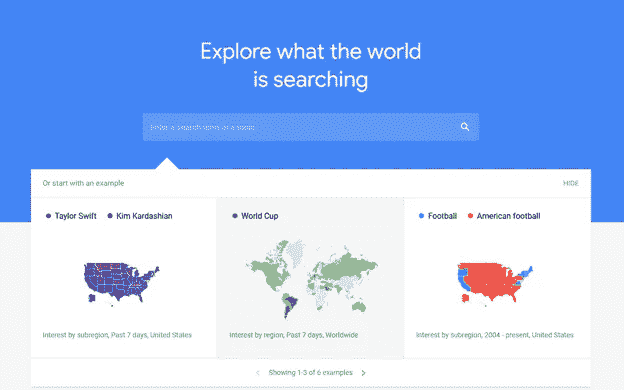

现在人们对什么感兴趣？

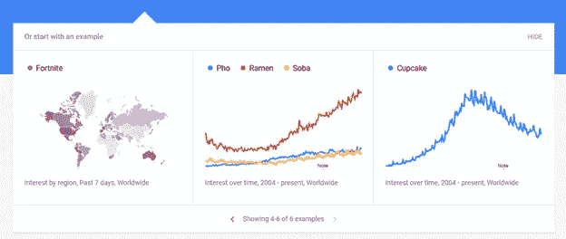

节日纸杯蛋糕越来越受欢迎了！不奇怪！

只需几秒钟，您就可以看到过去一小时最受欢迎的查询和新闻。

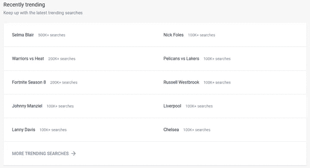

秒发现百万人感兴趣的是什么？轻松点。

值得注意的是细节层次在球上。您可以跟踪需求在任何时间段内的变化。

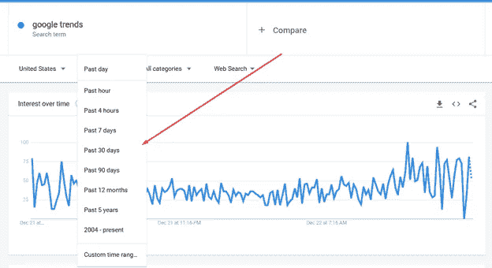

您可以跟踪某一组产品在一天、工作日不同时间的季节性波动，并根据用户/潜在客户对该主题的兴趣程度，为他们提供更有针对性和必要的广告。

*所以，要点说明完毕，让我们深入细节。*

# 基于共同因素的赌博主题需求估计:全球量、搜索量、关键字难度

为了更完整地分析赌博话题，我还对 Ahrefs 进行了描述性统计。为了不写出长达数公里的文本，选择了“在线赌场”作为聚合查询。

分析采用自上而下的方法进行。首先我想说的是搜索查询量。

德国爱网上赌场！如你所见，这些不仅仅是我的话！

你应该了解几个关键方面，比如这是一年中的平均数量。一个完美的例子是“圣诞礼物”查询。

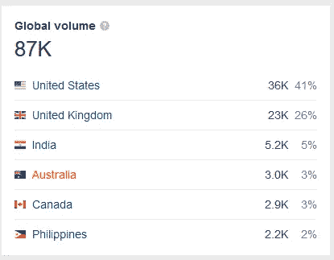

美国显然是对圣诞节感兴趣的领导者！

平均交易量相当大，但是，如果您查看相对需求在一年中的变化，您会看到下图:

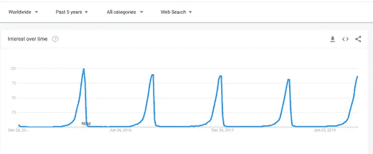

寻找礼物的高峰出现在假期前一周，一年中的其余时间是绝对的平静期。是的，这个例子相当笨拙，但是它清楚地表明了理解目标查询的季节性是多么重要。你可以在没有趋势的情况下做出明确的结论。

考虑到我的目标*“网上赌场”*查询，仅仅通过图表分析，不再有关于季节性存在或不存在的明确结论。为了做到这一点，让我们使用特定的测试来确定时间序列的季节性和趋势。

对于快速和定性的分析，您可以使用 R: library (tseries)和 library(forecast)的基本包。这里给那些因为某些原因而步调不一致的人一点帮助。

**R** 是一种用于统计数据处理和图形的编程语言，也是 GNU 项目内的免费开源计算环境。这种语言在分析师中非常流行。R 和附加包通过 CRAN(综合 R 存档网络—缩写)分发。目前，世界上有 60 多种克兰镜可供使用。头端(http://cran.r-project.org/)位于维也纳(奥地利)。由于有了广泛的社区，各种由人们编写并为人们服务的库定期出现，在网上有完整的文档和大量的例子。

tseries 和 forecast 库是最简单的，适用于时间序列的主要描述性统计。

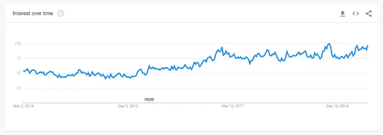

目标“网上赌场”查询

用各种标准测试平均趋势的结果如下表所示。

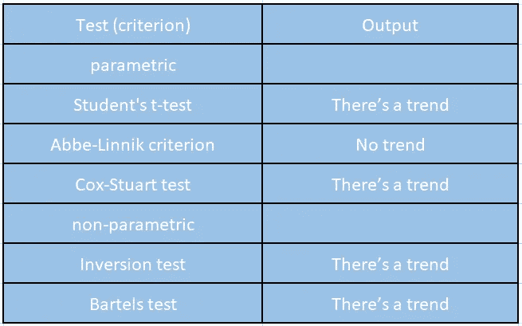

这个表格清楚地显示了什么可以被认为是趋势，什么不能

使用 ***【高峰和低谷】*** 标准测试季节性，结果是不存在。

因此， ***让我们总结一下***——*如果你在赌博小众，那么你应该提升，优化，只是一年四季保持忙碌，跳过节假日，周末和假期。在没有季节性的情况下——始终稳定地工作。*对比一下，例如，是“圣诞礼物”查询，可以得出你做搜索优化只有一个月和半年。

此外，搜索量率指的是人们在搜索框中键入的查询数量，而不是对该主题感兴趣的人数。如果你，我的读者，和我在一个小时内输入“网上赌场”查询，那么我们将会产生一个人工量。*千万不要只相信这个因素。*

像点击数这样的比率对于某些主题来说被高估了。这里有一个为什么的例子。一个搜索查询隐含着一个答案，所以谷歌解决了这个问题，找到它点击链接，给你一个答案。*因此，很好，可能会有大量的印象，高搜索量，但用户不需要访问您的网站。*

在赌博利基，这些谷歌搜索技巧是相当罕见的，但仍然有可能发生错误。要了解你的网站推广如何为一个特定的搜索查询消耗时间、精力、金钱，你可以看看关键词难度: *61 —网上赌场，34 —圣诞礼物。*

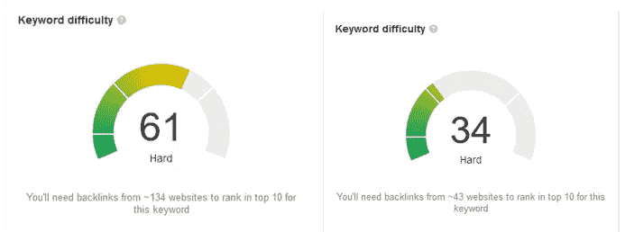

# 查询修改的时间分析

首先要说的是，我将在这里篡改原始的“网上赌场”查询。也就是说，当你在年初对你的项目产生兴趣时，我想强调这些情况。你有一个错误的信心，认为你的业务已经走上坡路，但二月即将到来，你最好保持在同一水平，或者在最坏的情况下回滚。

这种情况是由于用户的逻辑操作而发生的。让我们分析以下查询池:在线赌场 2015，在线赌场 2016，在线赌场 2017，在线赌场 2018，在线赌场 2019。

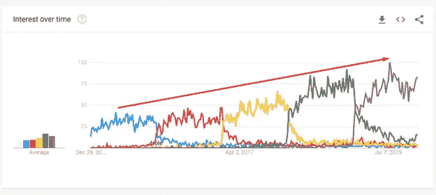

查询“网上赌场”的份额逐年增长

你可以看到查询的份额逐年增长。但是我想提醒您注意以下问题——查询周期重叠，从而造成了需求增加的假象。

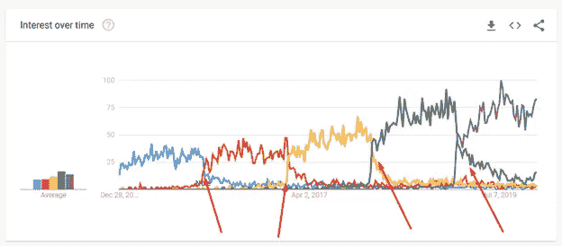

查询期重叠=需求增加的假象

# “在线赌场”查询的地理分析

一个同样重要的因素是查询分布的地理位置。在“网上赌场”查询的情况下，您可以看到以下地理位置。

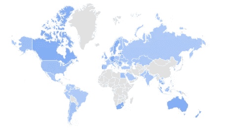

过去五年中排名前三的地区是圣赫勒拿岛——100 分，马耳他——86 分，葡萄牙——59 分，其次是新西兰(31 分)

考虑到去年的统计数据，轮换可以忽略不计。这与在城市环境中探索该查询的情况不同。

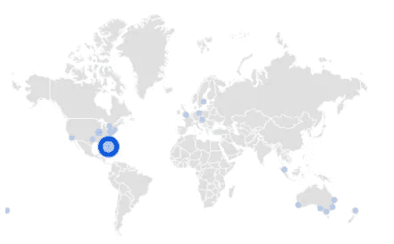

过去 5 年对“在线赌场”的需求

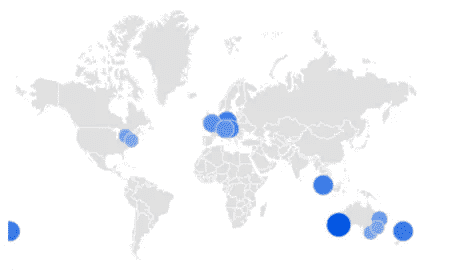

去年对“在线赌场”的需求

第一张图显示了过去 5 年的需求，第二张图显示了去年的需求。如你所见，多样化是最大的。在过去 5 年中，平均而言，玩得最多的城市是好莱坞——100，然后是彭布罗克派恩斯——21，迈阿密、圣路易斯和利斯堡只有 5 分，在其他城市中份额绝对微不足道。过去一年，统计数据有趣多了。

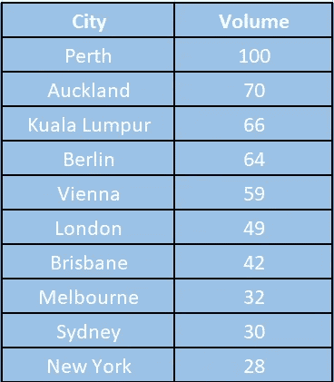

因此，处理赌博利基你应该注意的项目优化的地区。许多门户网站都是这样做的，例如，多区域*casi now*项目。**我为什么举这个例子？**所进行的分析显示了该项目在各个地区的个性化程度。
接下来，我想提供一个地区和关键因素之间匹配的汇总表，在我看来，这些因素决定了人们对赌博话题的高度兴趣。

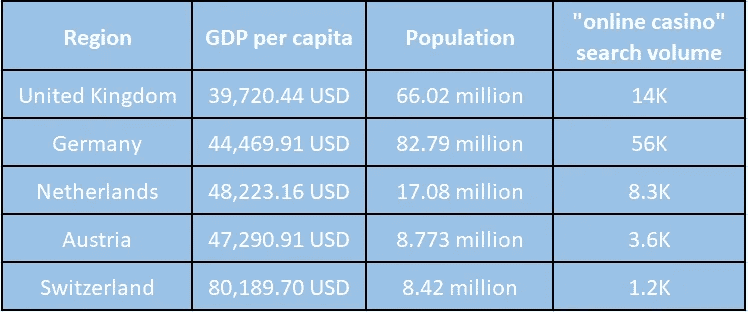

所研究的地区都有自己的赌博特征。特别是，关于网上赌场的法律方面有所不同，例如，在英国([https://casino-now.co.uk](https://casino-now.co.uk))和瑞士([https://swiss-casino-now.com/](https://swiss-casino-now.com/))。每个地区的用户偏好也非常多样化。因此，*casi now*不仅致力于品牌发展，还依赖于市场分析，聚集大量数据，创建用户偏好卡，并将其与在线赌场的法律和质量方面相结合。结果，为每个区域选择了唯一的最佳匹配。审查和忽视的网上赌场收集和汇总每个地区单独。德国是[https://onlinecasino-now.de/](https://onlinecasino-now.de/)，荷兰是[https://online casino-now . nl](https://onlinecasino-now.nl)，奥地利是 [https://casino-now.at](https://casino-now.at) ，加拿大是[https://casino-now-canada.com/](https://casino-now-canada.com/)

上面的数据明显存在一些不合逻辑的扭曲。例如，考虑到奥地利和瑞士，搜索量似乎是不合理的。人均 GDP 水平两倍，人口几乎相等，搜索流量却少了 3 倍。我们发现了一个差异——让我们回到**谷歌。**

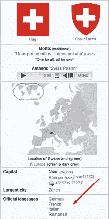

在许多国家，人们同时说多种语言。创建任何项目时都必须考虑这一点

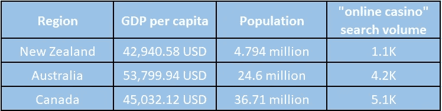

然而，并不是所有的潜在市场都适合赌博。在一些国家，如澳大利亚，尽管有需求，促进网上赌场是非法的。因此，负责任地选择一个地区是很重要的，不仅仅是根据需求，还要考虑合法性。

**您可以评估该地区赌博的潜在承诺，重点关注平均生活水平。**为了方便，我使用下面的汇总表[https://www.prosperity.com/rankings?pinned=&过滤器](https://www.prosperity.com/rankings?pinned=&filter=)

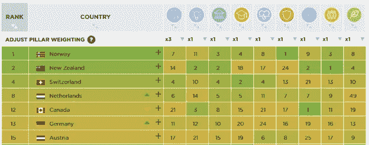

让我们假设在人们的生活水平和他们对赌博的兴趣之间有关联。在不久的将来，你会在后续文章中找到更详细的地区分析。

欢迎来到赌场现在官方代表的博客。感谢你的时间，我希望你喜欢！期待您的反馈和意见！

PS 一些有用的链接:

1.[https://trends.google.com/trends/?geo=US](https://trends.google.com/trends/?geo=US)

2.https://ahrefs.com/v3-keywords-explorer

3.【https://en.wikipedia.org/wiki/Time_series 

4.[https://en.wikipedia.org/wiki/Seasonality](https://en.wikipedia.org/wiki/Seasonality)

5.[http://r-statistics.co/Time-Series-Analysis-With-R.html](http://r-statistics.co/Time-Series-Analysis-With-R.html)

6.[https://www.prosperity.com/rankings?pinned=&滤镜](https://www.prosperity.com/rankings?pinned=&filter) =

PPS:谢谢你的时间！随意分享！:)

