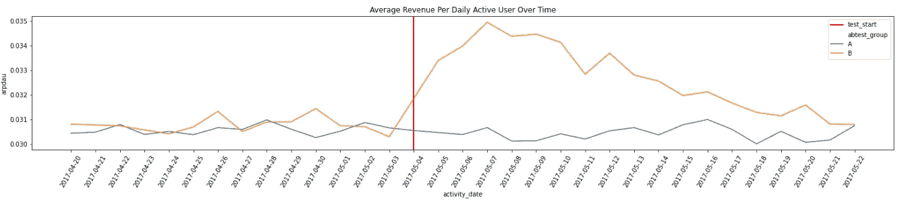

# 如何分析 A/B 测试结果？

> 原文：<https://medium.com/analytics-vidhya/how-to-analyze-a-b-test-results-b93c9eafbc61?source=collection_archive---------0----------------------->

来自 https://www.vippng.com/maxp/hxxximo/的 A/B 测试图

在这篇文章中，我将带你分析一个由手机游戏开发者进行的假设 A/B 测试。

## **游戏概述**

*   这个游戏叫做数学智力游戏。像其他谜题一样，玩家需要击败关卡才能进步。
*   这款游戏可以免费玩，这意味着玩家可以免费下载和玩游戏，但也可以选择购买关卡提示。

## **实验描述**

*   在游戏上运行了一个实验(A/B 测试),提供两种不同的游戏体验，我们称之为 A 和 B，A 组是对照组，体验保持不变，B 组是实验组，体验新的体验。
*   我们将分配过程设置为在各组中随机分配玩家:80%分配给 A 组(控制组)，20%分配给 B 组(测试组)。
*   实验从*2017–05–04*进行到*2017–05–22。*

## **实验假设**

*   假设是游戏的新变化将改善用户体验，使数学益智游戏成为更好的游戏。

# 数据

我们有两张桌子

1.  工作分配表:

2.活动表

# 分析

导流的单位是一个 player_id。我们假设每个 player_id 都是独立的。我们假设α=0.05(显著性水平)。

## 1.选择分析指标

我们使用两种类型的度量:不变度量和评估度量。

*   不变指标用于“健全性检查”，以确信测试的有效性，因为通过确保这些指标在对照组和实验组之间不会发生剧烈变化，这些指标不会因实验而受到影响。
*   评估指标是在与我们旨在实现的业务目标相关的预期变更中使用的指标。

## 2.确保 A/B 测试运行正常

这看起来类似于 80–20 分割的原始设计。确保玩家分布的差异不显著，是随机的，甚至像我们预期的那样。我们可以用下面的方式对这种转移建模:
我们期望控制组中的玩家数量大约是玩家总数的 20%。

从上面的图表中我们可以看到，大多数球员在第一个分配日被分配，然后剩余的球员在每个分配日被补充。但是根据上面的图表，玩家分布遵循 80-20 分成 A 组和 B 组。这与我们的实验设计一致，从而结束了我们的健全性检查

## 3.对评估指标的影响

对于每个评估指标，测量两组值之间的差异。然后，我们计算该差异的置信区间，并检验该置信区间是否具有统计显著性。

**3.1 转换**

转化率告诉我们玩家转化为付费会员的比率。我们看它的置信区间比较和累积转化率。当心一些运动员在他们的分配日期之前已经转变。

从以上统计我们可以看出，控制组和实验组的进入者数量分别约为 80%和 20%。B 组整体转化率略好于 A 组(3%相对增幅)。为了检查这种增加是否具有统计学意义，我们将计算两组转换率差异的置信区间，并检验该置信区间是否具有统计学意义。

我们可以作出零假设:A 和 b 之间的转化率没有差异。我们使用的检验统计量是两组转化率之间的差异。将进行 ztest 来计算 p 值。让我们检查一下统计显著性。

*假设:*

*   *H0:对照组和试验组转化率无差异*
*   *H1:治疗组的转换率与对照组不同*

我们 0.05 的显著性水平。基于上述 p 值检验，我们不能拒绝零假设。基于差异的置信区间，我们再次观察到两者之间的转换率没有显著差异

**3.2 保持力**

> p 值为 0.20587705835186143
> 因订婚实验引起的变化为-0.02 %
> 差异的置信区间:[-0.0006000000000001，0.0002 ]
> 如果 CI 不包括 0，则变化具有统计学意义。

**3.3 啮合**

玩家的参与对于决定游戏用户体验的改善非常重要。我们将参与度计算为每位玩家的平均游戏回合数

每个玩家每天的游戏结束数的分布有一个长尾巴的右偏态分布。然而，我们可以使用 z 检验，因为我们将比较两组中每个玩家每天游戏结束的平均值，并且因为样本足够大，通过中心极限定理，我们可以假设平均值的正态分布。

我们可以看到，在实验于 2017 年 5 月 4 日开始后，B 组自实验开始以来每个玩家的平均游戏回合数一直在下降，而对照组则保持稳定，这表明治疗降低了参与度。

## 3.4 每日活跃用户平均收入(ARPDAU)

玩家每日活跃用户的平均收入是决定游戏商业成功的重要指标。我们将参与度计算为每位玩家的平均购买量

该分布具有带长尾的右偏态分布，其中大多数人的平均购买量为 0，这表明很少一部分人产生了相对较大的影响。

我们最初看到治疗组每日活跃用户的平均收入有所增加，但随着时间的推移，这种情况似乎正在消失。为了理解可能发生的情况，我们可以试着理解不同的使用者对治疗的反应。

# 4.不同类型的球员对治疗的反应不同吗？

新奇效应是 AB 测试中常见的问题。最常见的检查新奇效果的方法是通过划分新老玩家。当开始日期和安装日期相同时，新玩家被定义。

# 5 建议和结论

数学智力题游戏的 AB 测试按照设计规范成功运行。

从我们对指标的分析中，我们可以得出以下结论:

*   治疗没有显示出任何统计学上显著的转化率变化。
*   治疗没有显示出任何统计学上显著的保留变化。
*   这种治疗会减少每个玩家的平均游戏回合数，从而对参与度产生负面影响。
*   这种治疗增加了每日活跃用户的平均收入，但这似乎是由于一种新奇的效果，事实上随着时间的推移而消退。新玩家和老玩家对治疗的参与度都比较低。同时，老玩家比新玩家更有可能在治疗中花钱。

由于参与度的下降，并且由于每日活跃用户平均收入的增加是由新奇效应引起的，并且最终在处理下没有观察到转化的显著变化，我们可以得出结论，我们不应该实施该处理，因为根据指标，该处理对用户体验有负面影响。

引入的治疗最有可能:

*   关卡难度的增加，由于玩家可以玩的回合数减少，从而降低了参与度。旧的付费玩家最终购买提示，因为结合了新颖性和难度的增加。

在这次 AB 测试中，我们观察到了一个有趣的现象，老玩家由于引入了新功能而最终花费更多。我们可以从这一观察中推断，通过定期发布不会对参与度产生负面影响的新体验，我们可以增加游戏收入。

代码请访问我的 github 页面链接

 [## shabeelkandi/AB_Test_analysis

### AB 测试分析。在 GitHub 上创建一个帐户，为 shabeelkandi/AB_Test_analysis 开发做贡献。

github.com](https://github.com/shabeelkandi/AB_Test_analysis)