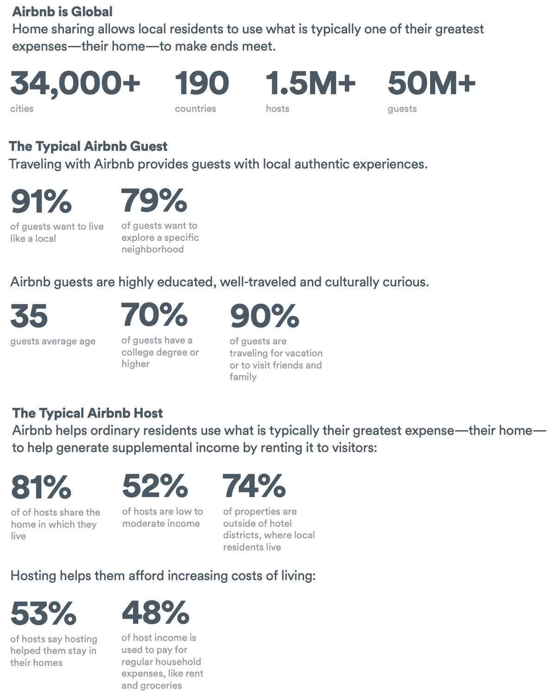
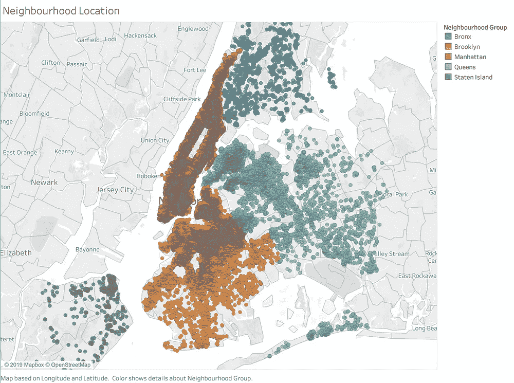
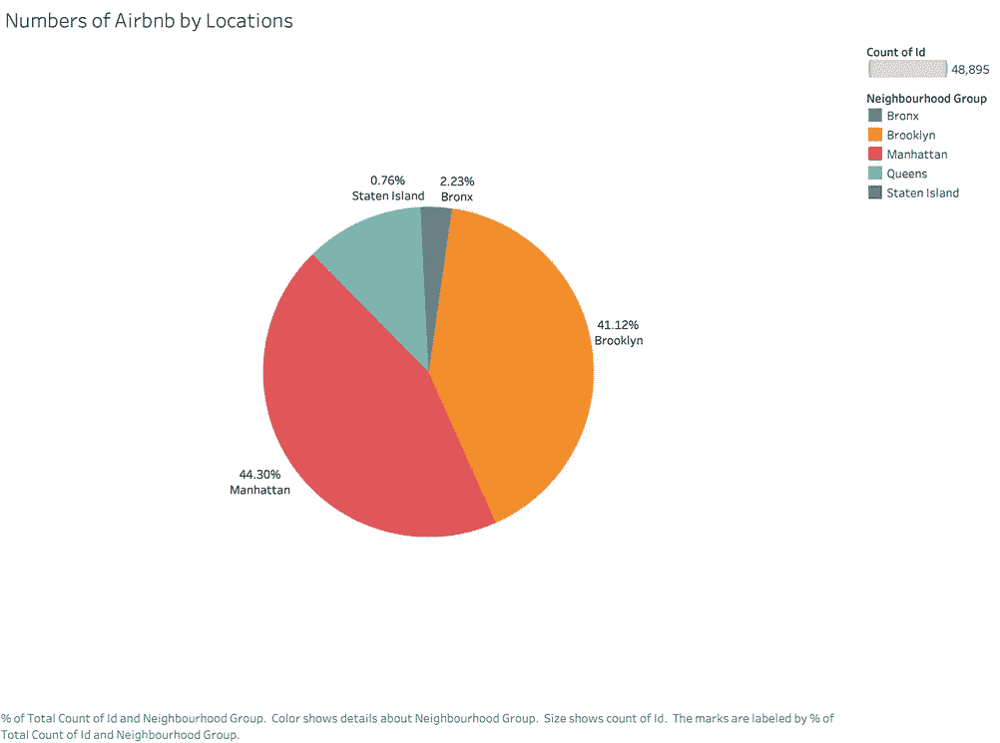
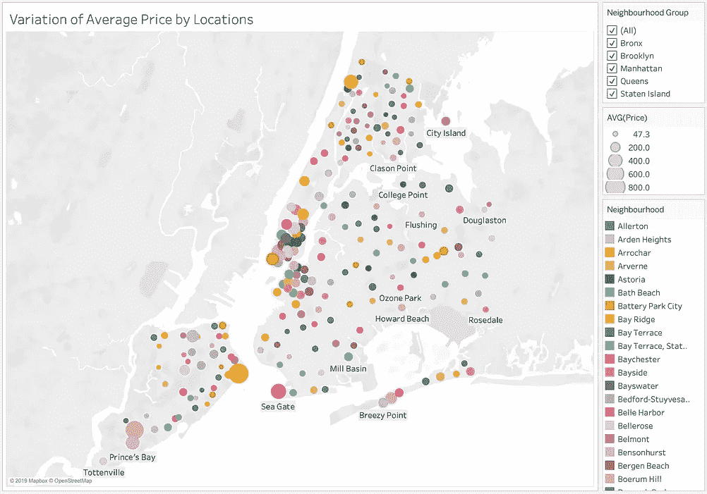
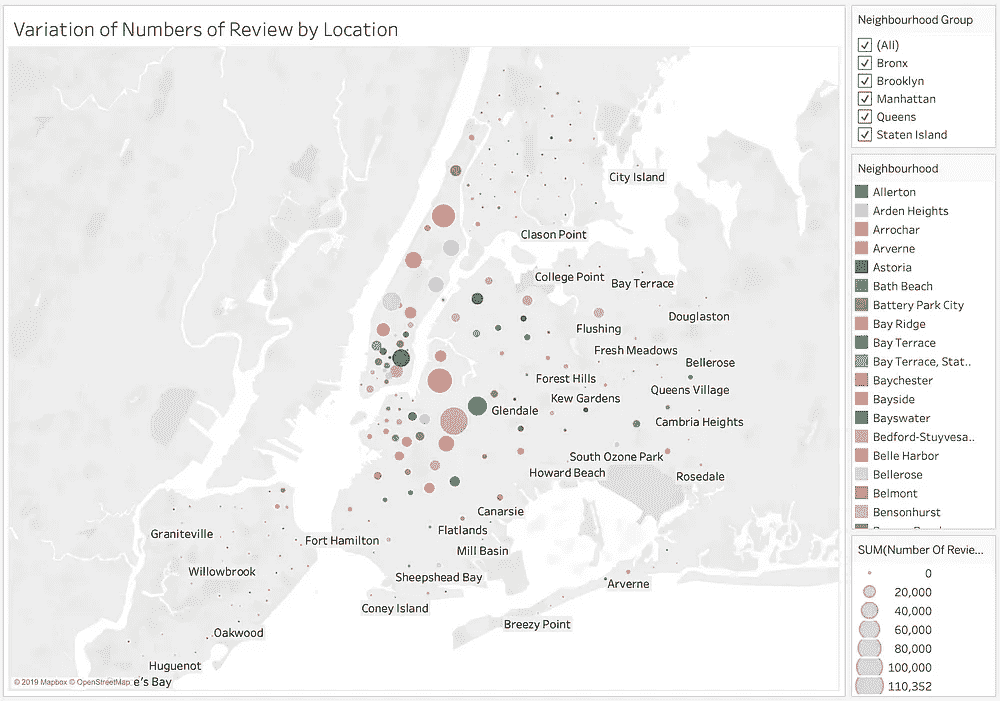
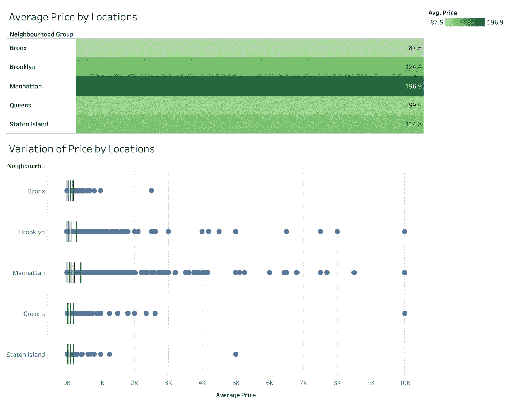
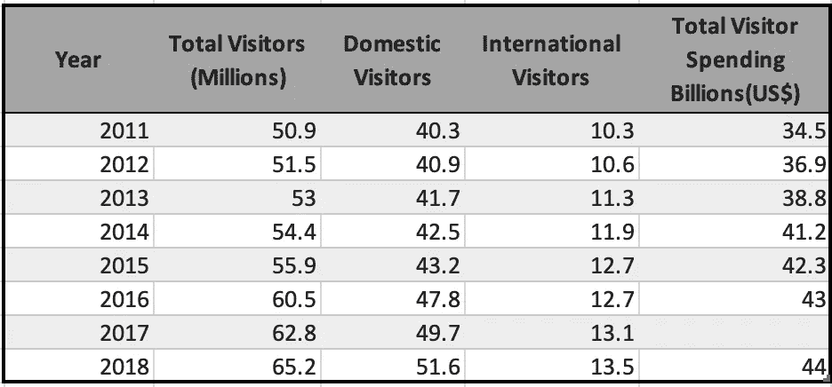
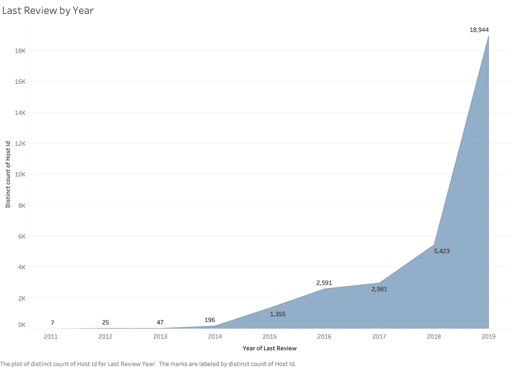
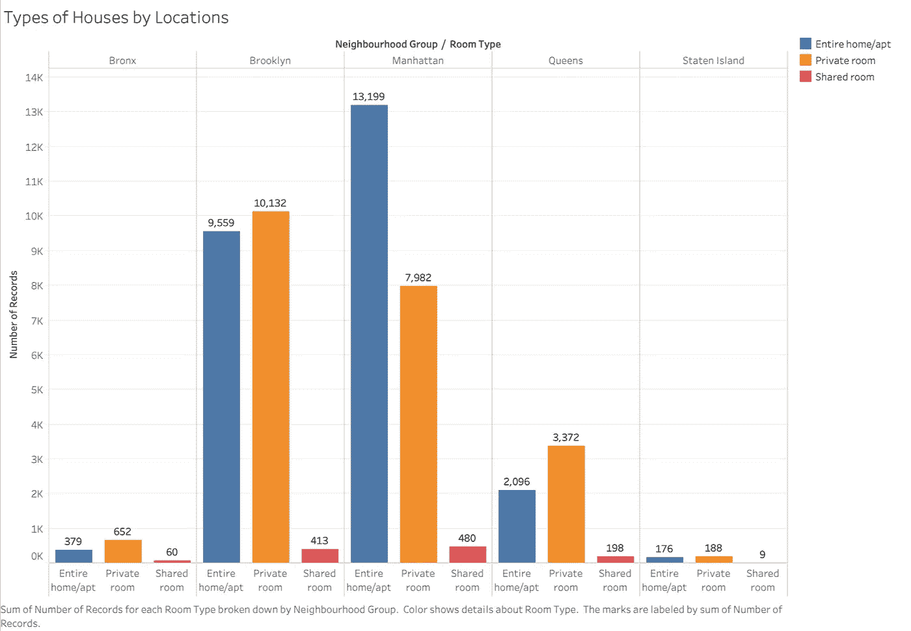
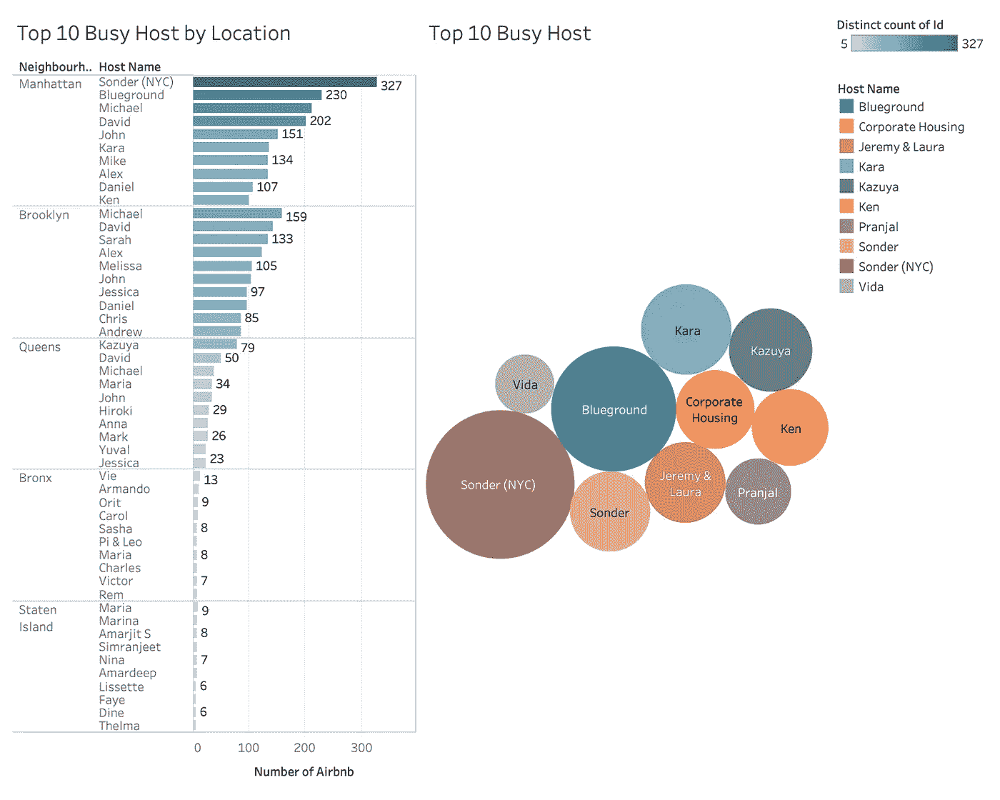

# 如何用正确的方法分析 Airbnb 的性能数据

> 原文：<https://medium.com/analytics-vidhya/how-to-analyze-airbnb-performance-data-in-the-right-way-b83f3dad1458?source=collection_archive---------0----------------------->

## 使用 Tableau 数据分析了解 Airbnb 性能


# 项目的目标

*   根据位置了解 Airbnb 的受欢迎程度
*   根据价格(哪个区域最贵)、评论(哪个区域最好)和房间类型分析位置差异的原因
*   了解主机的繁忙情况
*   预测未来 2020 年 Airbnb 在纽约市的表现

# Airbnb 简介

Airbnb 成立于 2008 年 8 月，总部位于加利福尼亚州旧金山，是一个值得信赖的社区市场，人们可以在线或通过手机或平板电脑列出、发现和预订世界各地的独特住宿。无论是备用卧室、公寓、别墅还是私人岛屿，Airbnb 都能让旅行者在 190 个国家的 34，000 多个城市获得更加多样化和真实的体验。



Airbnb 社区简介

# 数据描述

数据集包括三个主表:

*   关于主机、Airbnb 房屋和价格的详细列表数据。分析中使用的属性是`id`(列表 ID)、`name`(列表名称)、`host_id`(主机 ID)、`host_name`(主机名称)、`room_type`(列表空间类型)和`price`(以美元为单位的价格)。
*   `reviews`——嘉宾给出的详细点评。关键属性包括`number_of_reviews`(评论数)`last_review`(最新评论数)`reviews_per_month`(每月评论数)。
*   `location` -提供纽约市 Airbnb 位置的详细信息。四个属性，包括`neighbourhood_group`(主区域)`neighbourhood`(区域)`longitude`和`latitude`。

# Airbnb 在纽约的受欢迎程度

根据邻里位置，图表显示 44.3%的 Airbnb 房屋位于曼哈顿，41.12%的 Airbnb 房屋位于布鲁克林。几乎 90%的 Airbnb 房屋都位于最著名的城市热点附近，如时代广场、帝国大厦、华尔街、中央公园和 DUMBO，并且往往交通便利(地铁站)。



纽约市不同地点的 Airbnb 数量

# 位置！价格、评论和房间类型的变化

Airbnb 用户根据位置、价格、清洁度、居住体验和一系列其他参数对他们的住宿进行评级。在这里，我用这些数据得到了平均价格变化和不同地区评论数量的图表。这真的很有趣，因为平均价格和评论数量并没有很大的正相关性。高消费的社区往往不会有更多的评论，因为旅行者会选择住在更便宜的 Airbnb，并乘坐交通工具前往著名的城市热点。

## 哪个地区贵，哪个地区最好？



显示不同地点平均价格变化的地图|显示不同地点评论数量变化的地图

> 哪个地区贵？

根据显示平均价格随位置变化的地图，平均价格与位置基本一致。显而易见的是，高评级的位置也往往是昂贵的，这是因为在供应不变的情况下，需求越高，价格越高。此外，由于需求旺盛，曼哈顿的平均房价最高，为 196.9 美元。然后，有趣的是观察到高平均价格区域与运输相对应。布鲁克林和斯塔滕岛也是如此。



> 哪个地区最好？

根据显示不同位置的评论数量变化的地图，曼哈顿获得最高的评论数量，因为它靠近最著名的城市热点(时代广场、帝国大厦、华尔街和中央公园)，并且具有更方便的交通。在布鲁克林，靠近高地公园的地方评论最多。靠近曼哈顿的布鲁克林区往往有更高的位置评级。

按年份查看最近一次评论，结果显示每年的评论数量一直在不断增加，因为总访客数从 2011 年(5090 万)增加到 2018 年(6520 万)。此外，更多的用户希望根据他们的体验写下评论，这样他们就可以给潜在用户一个选择最佳居住地的机会。因此，纽约市已经成为最著名的旅游城市之一！



2011 年至 2018 年总访客人数



按年份排列的上次审查

## 纽约市不同类型的房间

现在让我们探索一下纽约市的房间类型。下图显示了不同地区(布朗克斯、布鲁克林、曼哈顿、皇后区和斯塔滕岛)的客房类型分布情况。

根据图表，它显示布鲁克林和曼哈顿提供了最多的房子和房间，代表了那里的高需求。还有，因为房价高，Airbnb 中的纽约市给用户更多的包间选择，以减轻生活负担。



按位置划分的房间类型

# 主人的忙碌

根据上面的图表。让我们探索一下纽约的主人有多忙。根据纽约市不同位置的 Airbnb 数量、不同位置的平均价格变化以及不同位置的评论数量变化的不同图表，我们了解到布鲁克林和曼哈顿提供了最多的房屋和房间。因此，我们可以想象前 10 个繁忙主机来自布鲁克林和曼哈顿地区。



按位置列出的 10 大繁忙主机

# 未来 2020 年 Airbnb 在纽约市的表现

2020 年，我认为纽约市的 Airbnb 肯定会增加。我们来看看需求和定价之间的关系。

如前所述，我从 2011 年到 2018 年的总访客数和最后一年的回顾来实现 2020 年对 Airbnb 租赁的需求。此外，我假设评论的数量对应于 Airbnb 租赁的需求，即 60%的客人应该根据他们的体验来评论他们的住宿。对于 2011 年至 2018 年的总游客数量，我们可以知道，总游客数量从 2011 年(5090 万)增加到 2018 年(6520 万)。此外，按年份显示的上次审查图表显示，每年的审查数量一直在不断增加。所以来的游客越多，对房源的需求就越高，对 Airbnb 的价格也就越高。

综上所述，Airbnb 在纽约市有了明显的增长。上述分析表明，Airbnb 在纽约市仍有强大的市场。

# 关于我

非常感谢您阅读我的文章！大家好，我是雪莉，目前在亚利桑那州立大学攻读商业分析硕士学位。特别感谢我的队友 Divya，Raghu 和 Andrew 的贡献。如果您有任何问题，请随时联系我！

```
Email me at ***kchen122@asu.edu***and feel free to connect me on [**LinkedIn**](https://www.linkedin.com/in/kuanyinchen-shirley/)!
```