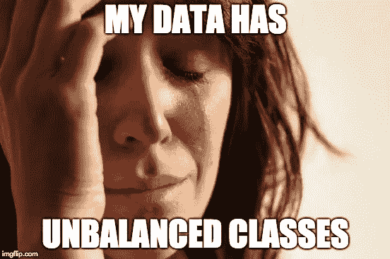

# 如何用不到 20 行代码处理不平衡的图像数据集

> 原文：<https://medium.com/analytics-vidhya/how-to-apply-data-augmentation-to-deal-with-unbalanced-datasets-in-20-lines-of-code-ada8521320c9?source=collection_archive---------0----------------------->

## imagedata generator+randomversampling

据我们所知，在大多数情况下，深度学习需要一个很大的数据集来学习一个特定的问题。然而，收集如此大量的数据可能既困难又昂贵，尤其是对于现实世界的问题。为了处理这个问题，我们可以应用一个众所周知的技术，叫做**数据** …