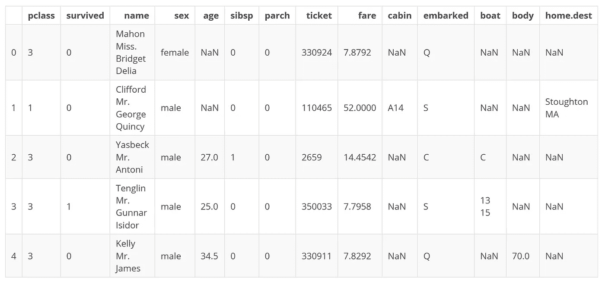

# 如何将管线中的预处理步骤仅应用于特定特征

> 原文：<https://medium.com/analytics-vidhya/how-to-apply-preprocessing-steps-in-a-pipeline-only-to-specific-features-4e91fe45dfb8?source=collection_archive---------4----------------------->


图片由 Pixabay 的 Michael Gaida 提供

情况:您有一个标准化和自动化预处理的管道。您的数据集包含至少两种不同数据类型的特征，需要不同的预处理步骤。例如，分类特征可能需要转换为虚拟变量，但连续特征可能需要标准化。从 0.20 版本开始，sci-kit learn 已经为您提供了相关内容！函数 [ColumnTransformer](https://scikit-learn.org/stable/modules/generated/sklearn.compose.ColumnTransformer.html) 允许您创建特定于列的管道步骤！在这篇文章中，我将向您展示如何使用这个函数，并谈一谈使用管道进行预处理的好处。我们开始吧！

首先，加载必要的库:

```
import pandas as pd
from sklearn.compose import ColumnTransformer
from sklearn.impute import SimpleImputer
from sklearn.linear_model import LogisticRegression
from sklearn.metrics import classification_report
from sklearn.model_selection import GridSearchCV, RepeatedStratifiedKFold
from sklearn.pipeline import Pipeline
from sklearn.preprocessing import OneHotEncoder, StandardScaler
```

我们将使用泰坦尼克号的数据集。

```
titanic = pd.read_csv('./titanic.csv')

titanic.head()
```



# 使用管道进行预处理的优势

我们希望根据现有数据预测是否有乘客幸存。在我们训练我们的模型之前，必须做一些预处理。为什么要在我们的机器学习管道中包含预处理？事先做好一切，比如说熊猫，不是更容易吗？

首先，它很方便，并且使预处理步骤及其顺序显式、透明和可复制。但是还有三个更实质性的原因:

1)它允许在超参数调优中包括预处理步骤(我将在另一篇文章中回到这个问题)。

2)它使您避免了使用任何测试数据进行模型训练或模型决策(例如，分类器参数)的错误，也称为*数据泄漏*。例如，当您使用缩放器或输入缺失值时，这个陷阱就潜伏着。避免这种情况对于获得有效的模型性能估计是至关重要的。管道中声明的预处理步骤保证只基于训练数据(或交叉验证中的训练折叠)来执行。

3)它保证您的数据总是以相同的方式进行预处理。这很重要，例如，如果分类特征在测试集中有一个不在训练集中出现的类别。我举个例子:假设你的训练数据包含一个特征`review_status`，这个特征表示一个交易是否已经被审核过。它可能包含以下两个类别:

```
review_status = ['not reviewed', 'reviewed']
```

但是，在您的测试数据中，还有一个类别`'externally reviewed'`，它没有出现在训练集中。现在如果你使用`pandas.get_dummies()`，你会遇到两个问题:

1)如果通过观察获得新的数据，使用`pandas.get_dummies()`根本没有意义。

2)与训练集相比，您最终在测试集中多了一个特征/列。但是您的模型是在训练集上训练的，不知道此列。反之亦然，如果类别在测试集中缺失，那么您的模型就需要多一个特性。`OneHotEncoder()`作为所有流水线步骤，首先在训练集上调用`.fit()`方法，然后调用`.transform()`方法，但在测试集上只调用`.transform()`。因此，这些类别仅来自训练集中的唯一类别！您可以通过设置`handle_unknown`参数明确声明如果遇到未知类别会发生什么:`handle_unknown = 'error'`在遇到未知类别时抛出一个错误，而`handle_unknown = 'ignore'`使转换器忽略该类别。因此，一旦适合，`OneHotEncoder()`每次应用于新数据时都会产生相同的输出。这对于我们的模型来说很容易消化。

# 创建列转换器

好了，现在让我们创建一个预处理管道。我们希望为分类特征创建虚拟变量，并对连续特征进行标准化。出于这个目的，我们把所有东西都放在一个`ColumnTransformer`里。我们从分类开始:首先，我们需要命名这个步骤:`'onehot'`。然后我们需要指定变压器，这里是`OneHotEncoder()`。最后，我们需要指出哪些列应该被转换，这里通过给出列名`['pclass', 'sex', 'embarked']`来完成，但是其他形式(例如，索引)也可以。

```
('onehot', OneHotEncoder(), ['pclass', 'sex', 'embarked'])
```

`StandardScaler()`也是如此。由于我们的特征中有一些缺失值，我们也可以实现一个估算器。幸运是，sci-kit learn 为我们提供了一个简单的估算工具。最后，我们需要告诉`ColumnTransformer`在`remainder`中没有被选择进行转换的特征发生了什么。你可以选择把它们留在`remainder = 'passthrough'`中，像我一样，把它们丢弃在`remainder = 'drop'`中，或者把它们交给另一个评估者。这里是完成的`ColumnTransformer`:

```
preprocessor = ColumnTransformer(
    [
        ('imputer', SimpleImputer(strategy = 'constant', 
          fill_value = 'missing'), ['pclass', 'sex', 'embarked']),
        ('onehot', OneHotEncoder(), ['pclass', 'sex', 'embarked']),
        ('imputer', SimpleImputer(strategy = 'median'), 
          ['age', 'sibsp', 'parch', 'fare']),
        ('scaler', StandardScaler(), ['age', 'sibsp', 'parch',
          'fare'])
    ],
    remainder = 'drop'
)
```

这段代码看起来有点难看。我更喜欢将这些行分成两个子转换器，一个用于分类特征，一个用于数字特征。

```
# transformer for categorical features
categorical_features = ['pclass', 'sex', 'embarked']
categorical_transformer = Pipeline(
    [
        ('imputer_cat', SimpleImputer(strategy = 'constant',
          fill_value = 'missing')),
        ('onehot', OneHotEncoder(handle_unknown = 'ignore'))
    ]
)
```

现在，数字特征的步骤是:

```
# transformer for numerical features
numeric_features = ['age', 'sibsp', 'parch', 'fare']
numeric_transformer = Pipeline(
    [
        ('imputer_num', SimpleImputer(strategy = 'median')),
        ('scaler', StandardScaler())
    ]
)
```

我们再次将它们组合在一个`ColumnTransformer`中。

```
preprocessor = ColumnTransformer(
    [
        ('categoricals', categorical_transformer, 
          categorical_features),
        ('numericals', numeric_transformer, numeric_features)
    ],
    remainder = 'drop'
)
```

接下来，我们创建机器学习管道，并作为一个步骤包括列转换器。可能会缩短代码，但我发现这种表达方式更清晰。

```
pipeline = Pipeline(
    [
        ('preprocessing', preprocessor),
        ('clf', LogisticRegression())
    ]
)
```

现在我们已经设置了所有的预处理步骤，我们可以继续进行超参数调整和模型性能评估。我在这里将候选参数作为字典传递。因为我们稍后将为`GridSearchCV()`提供一个管道，所以我们需要指出一个参数属于哪个步骤。在我们的管道步骤`('clf', LogisticRegression())`中添加“clf__”就可以实现这个目的。

```
params = {
    'clf__solver': ['liblinear'],
    'clf__penalty': ['l1', 'l2'],
    'clf__C': [0.01, 0.1, 1, 10, 100],
    'clf__random_state': [42]
}
```

我们仍然需要定义一个交叉验证策略。我选`RepeatedStratifiedKFold()`和 *k* =5。这意味着分层的 5 重交叉验证重复两次，在两次重复之间对观察结果进行洗牌。

```
rskf = RepeatedStratifiedKFold(n_splits = 5, n_repeats = 2, random_state = 42)
```

接下来，我们通过填写上面的步骤并选择一个评分标准来创建`GridSearchCV()`对象:

```
cv = GridSearchCV(
  pipeline, 
  params, 
  cv = rskf, 
  scoring = ['f1', 'accuracy'], 
  refit = 'f1', 
  n_jobs = -1
  )
```

将数据分为要素(X)和目标(y):

```
X = titanic.drop('survived', axis = 1)
y = titanic.survived
```

最后，执行和评估！

```
cv.fit(X, y)print(f'Best F1-score: {cv.best_score_:.3f}\n')
print(f'Best parameter set: {cv.best_params_}\n')
print(f'Scores: {classification_report(y, cv.predict(X))}')
```

让我们来看看结果:

```
Best F1-score: 0.712

Best parameter set: {'clf__C': 10, 'clf__penalty': 'l1', 'clf__random_state': 42, 'clf__solver': 'liblinear'}

Scores:               precision    recall  f1-score   support

           0       0.82      0.85      0.83       809
           1       0.74      0.69      0.72       500

    accuracy                           0.79      1309
   macro avg       0.78      0.77      0.77      1309
weighted avg       0.79      0.79      0.79      1309
```

我们的最佳结果，F1 值为 0.712，是在正则化强度的倒数( *C* )为 10 和 L1 罚的情况下实现的。

在下面的一个文件中找到完整的代码。编码快乐！

这篇文章也发表在我的博客[这里](https://moritzkoerber.github.io/python/tutorial/2019/10/11/blogpost/)。