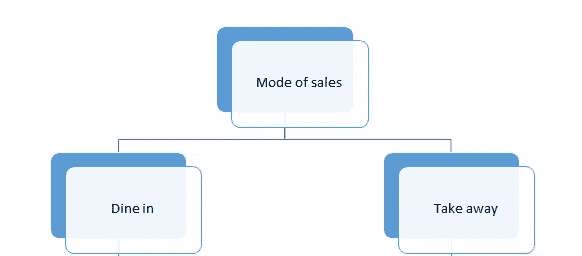
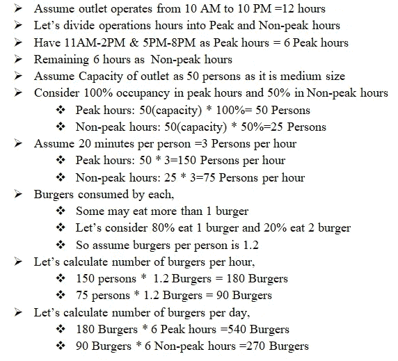
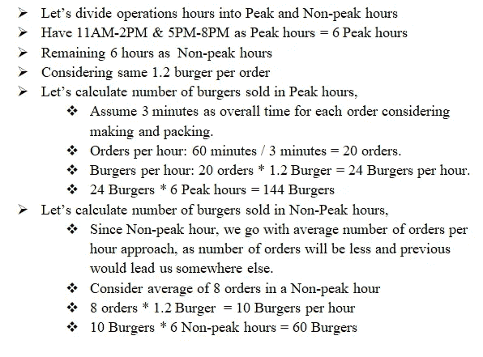

# 如何接近猜测值

> 原文：<https://medium.com/analytics-vidhya/how-to-approach-guesstimates-961835d93b9d?source=collection_archive---------0----------------------->

照片由 [Aaron Burden](https://unsplash.com/@aaronburden?utm_source=medium&utm_medium=referral) 在 [Unsplash](https://unsplash.com?utm_source=medium&utm_medium=referral)

让我们来谈谈已经成为商业和分析面试不可或缺的一部分的东西。猜测只不过是玩弄假设，没有什么相关的事实。

当我开始准备分析面试时，我听说了猜测。最初，选择一种方法或得到一个解决方案并不容易。最后，我在网上寻找简单的方法和解决方案，我发现很少有方法可以解决猜测。对于像我这样喜欢通过观察和理解来学习的人来说，这给了我很大的帮助。通过进一步的练习，解决猜测就像解决基本的数学问题一样简单。

要记住的一件重要的事情是，猜测从来没有一个确定的正确答案，这完全取决于决定最终答案(数量)的方法和逻辑思维。

扑朔迷离！！！让我们举一些简单的例子来理解。

**问题:钦奈的麦当劳一天能卖出多少个汉堡？**

在开始观察问题之前，需要记住几个步骤来解决猜测；

1.  **方法:**有很多方法(简单数学方法、人均方法、供给&需求方法)可以用于每一个猜测，但是要理解问题的要求，选择简单易懂的方法。
2.  要记住的数字:要记住的数字有人口、GDP、性别比例、家庭平均规模、土地面积、人口增长率以及更多的比例分布。
3.  **数学数字丰富:**知道百万、千万、十亿、万亿中零的个数。始终保持您的值简单并四舍五入为偶数，以便于计算。

现在，观察给定的问题是解决猜测的第一步。永远不要觉得问题的数据有限或不足以解决。如果面试官允许，尽可能多地问清楚问题，否则做出假设。

在本例中，我们必须重新构建几个参数，才能清楚地了解需要什么，因此让我们做一些假设。

是否也考虑在店内销售或外卖？-假设两者都有。

是周末还是工作日？-假设工作日

插座的尺寸？-假设中等

钦奈的位置(郊区、IT 中心、城市住宅区)？-假设它是集线器

附近有类似的汉堡巨头(赛百味、汉堡侠、汉堡王)？-假设是的

有报价吗？在这个经销店还是附近的其他经销店？-假设是(类似提议)

在这里，我们对这个问题有了清楚的认识。让我重新框定一下:考虑到报价和附近的汉堡巨头，在工作日的 IT 中心钦奈，一家中型麦当劳分店卖出了多少汉堡，包括堂食和外卖？

我们从解决这个猜测开始，

销售方式

**用餐:**假设和求解方法:

算下来高峰时段 540 个汉堡，非高峰时段 270 个汉堡。因此，在餐厅用餐卖出的汉堡总数为:540+270= 710 个汉堡。

**带走:**假设和解决方法:

算下来高峰时段 144 个汉堡，非高峰时段 60 个汉堡。因此，外卖卖的汉堡总数:144+60= 204 个汉堡。

最后，卖出的汉堡总数:710+204=每天 914 个汉堡。达到这个正确的最终数量并不是最重要的。最重要的是，我们实现这一最终数量的方法。

让我们在接下来的文章中用不同的问题来讨论不同的方法。

喜欢这个猜测指南吗？还能更好吗？有你想解决的猜测问题吗？请在评论中告诉我！

联系我链接在:[https://www . LinkedIn . com/in/Krishna-Raj-parthasarathy-3a 0798111/](https://www.linkedin.com/in/krishna-raj-parthasarathy-3a0798111/)

电子邮件:raj191996@gmail.com

很高兴收到你的来信…