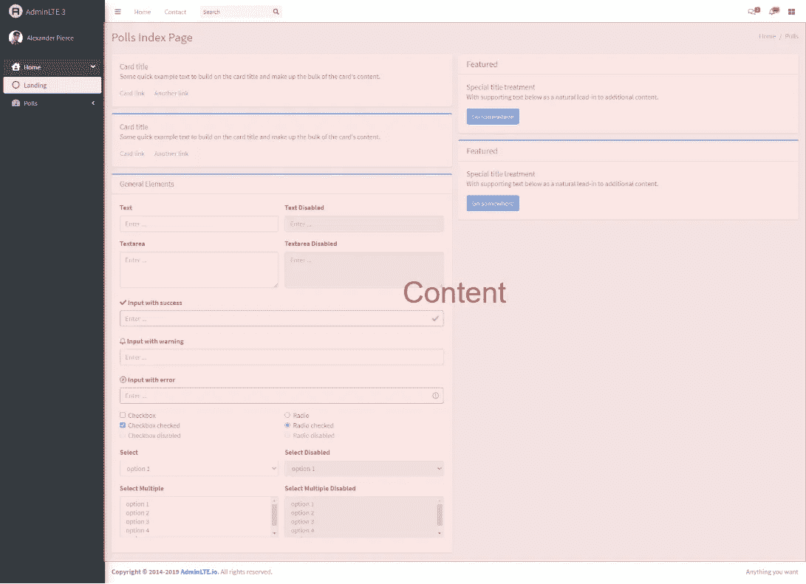
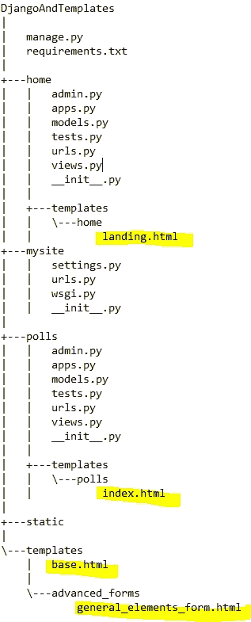

# 如何构建 Django 模板

> 原文：<https://medium.com/analytics-vidhya/how-to-architect-django-templates-4e780f440f6a?source=collection_archive---------10----------------------->

# 摘要

在本文中，我将介绍我在 Django 应用程序开发中设计 Django 模板的方法。目标是让 Django 应用程序的 UI 部分组织得更好，避免冗余编码。Django 在模板引擎中提供了各种机制来帮助我们实现这个目标。在本教程中，我将通过使用 Django 内置的模板标签 **block** 、 **extends** 和 **include** 来尽可能地让模板易于维护。

# 依赖关系:

1.Python 3.6

2.姜戈 2.2

3.AdminLTE 3.0.5(你可以查看我之前关于这个主题库的教程[这里](https://www.linkedin.com/pulse/how-use-adminlte-django-yiqing-lan/)。)

# 预览:模板的不良架构

我已经上传了一个项目[在这里](https://github.com/slow999/DjangoAndBadTemplatesDesign)来说明模板有多乱。我们将从那里开始。我们来看看这两个页面，[http://127 . 0 . 0 . 1:8000/home/](http://127.0.0.1:8000/home/)和[http://127 . 0 . 0 . 1:8000/polls/](http://127.0.0.1:8000/polls/)。他们各自的 html 模板分别位于 home/templates/home/landing . html 和 polls/templates/polls/index . html，简单来说，我就把他们叫做**landing.html**和**index.html**。每个模板都重复侧边栏菜单、css 和 javascript 库。最重要的是，在“通用元素”框中有一个巨大的表单，其中的内容是相同的。随着应用程序和网址的增长，这种情况已经失控。

# 我的方法

下面是我避免 Django UI 的“意大利面条代码”的方法。

## 第 1/4 步:base.html

将模板分解成多个部分，我们知道除了菜单和内容，其他的都是可重复的。我们将制作一个基础模板来保存这些公共部分。



在项目文件夹中创建一个文件夹**模板**。在它内部，创造出一个**base.html**。把所有普通的棋子都放进去。你可以复制并粘贴下面的代码，这些代码是由**landing.html**和**index.html**共享的。

请注意，块 **content_wrapper** 用于呈现每个页面的自定义内容。

# 步骤 2/4:删除多余的公共代码

由于我们在上一步中创建了一个**base.html**，所以不再需要保留**landing.html**和**home.html**中的公共代码。我们应该有如下结果。

# 第 3/4 步:继承 base.html

为了使用**base.html**作为每个页面的基础模板，我们需要通过在模板的开头使用将**base.html**声明为“父”模板。除此之外，不要忘记**内容 _ 包装器**块。将整个内容包装到该块中。我们应该得到如下结果。

在**landing.html**:

```


  <div class="content-wrapper">
    . . .
  </div>

```

在**index.html**:

```


  <div class="content-wrapper">
    . . .
  </div>

```

# 第 4/4 步:干燥普通的小块

您可能会注意到，两个模板中存在相同的巨型表单。几乎一半的代码是它。因为这个表单在两个模板中被重用，所以让我们把它放在一个任何模板都可以包含它的地方。

在**模板**文件夹中创建文件夹 **advanced_forms** 。在 **advanced_forms** 文件夹中，创建一个**general _ elements _ form . html**，如下图所示。

删除**landing.html**和**index.html**中多余的表格代码。使用{ % include ' advanced _ forms/general _ elements _ form . html“% }”包含表单。随着它的建立，这里是最终的结果。

现在，让我们重新启动项目。屏幕上没有变化。但是在后台，项目变得更容易维护。努力是值得的。

这是我们完成增强后的文件模式快照。我用黄色突出显示了模板。



我已经在这里上传了最终项目。[https://github.com/slow999/DjangoAndTemplates](https://github.com/slow999/DjangoAndTemplates)。

我在这个教程里用的乱七八糟的项目就上传到这里。[https://github.com/slow999/DjangoAndBadTemplatesDesign](https://github.com/slow999/DjangoAndBadTemplatesDesign)。

我还做了一个视频。看看这里。

# 结论

模板是 web 应用的核心部分之一。不要重复自己(干)。我已经参与并领导了大量的项目，我相信这个原则适用于前端和后端开发，这样我们就可以开发出可扩展的应用程序。希望这篇教程能回答你的问题，帮助你的项目成长。敬请关注。