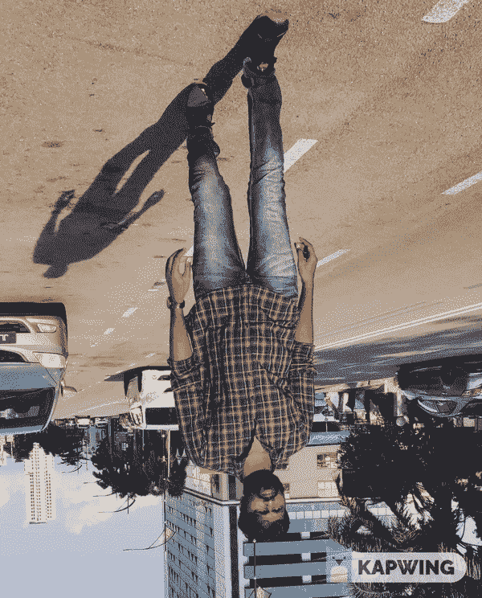
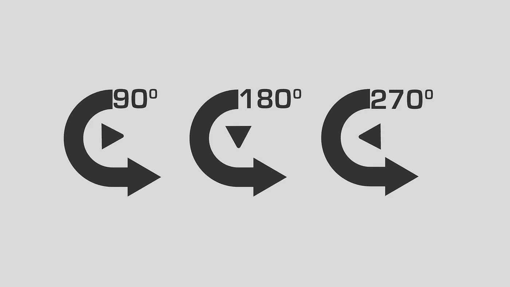
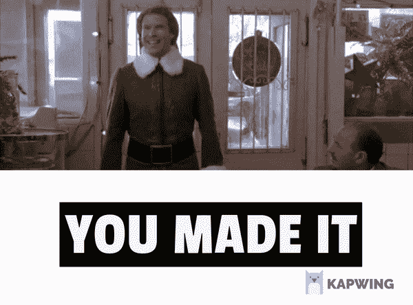

# 如何使用深度学习自动旋转图像！！！

> 原文：<https://medium.com/analytics-vidhya/how-to-auto-rotate-the-image-using-deep-learning-c34b2e0e157d?source=collection_archive---------4----------------------->

## 使用计算机视觉自动旋转图像以获得人类照片的正确角度的 5 个简单步骤



演示

上图显示了输入(左)和输出(右)。让我们看看如何在不手动旋转的情况下自动旋转图像。这些天来，计算机视觉已经在全世界范围内发展了这么多。我刚刚使用计算机视觉玩并实现了一个自动旋转图像的小技术。

**自动旋转图像的步骤:**

1.  读取输入图像。
2.  用 Caffe 模型检测人脸。
3.  如果没有检测到面部，则旋转图像。
4.  再次检测旋转图像的脸。
5.  将图像旋转三个角度，直到检测到人脸。

在实现这项技术之前，我们将看看需要什么样的依赖库和模型。

1.  **OpenCV**
2.  **Numpy**
3.  **Caffe 模型(深度学习)**

***第一步:-*** 导入以上所有需要的库。

```
import cv2
import numpy as np
```

***第二步:-*** 下载 [Caffe 模型和文件以及 prototxt 文件](https://github.com/balavenkatesh3322/Face_Recognition/tree/master/model)。让我们看看为什么我们需要这两个文件，这是什么。

**什么是 Caffe 模型文件？**

Caffe 是由 Berkeley Vision and Learning Center(BVLC)开发的深度学习框架。它是用 C++写的，有 Python 和 Matlab 绑定。在用我们的数据集训练模型之后，我们将在一个带有扩展名的文件中获得训练过的**模型**。

**什么是 deploy.prototxt 文件？**

**prototxt** 是一个文本**文件**，它保存了关于神经网络结构的信息:神经网络中的层列表。每层的参数，如名称、类型、输入尺寸和输出尺寸。各层之间的联系。那个 prototxt 文件只是用来部署模型，不能用来训练模型。

***第三步:***——这是使用 OpenCV 读取图像文件的主要方法。然后将图像传入 detect_face 方法(*步骤 4* )它会给出真(检测到)或假(未检测到)。如果它返回假，那么图像不是正确的角度，因此我们需要按照下面的角度逐步旋转图像的角度。

**旋转角度- > 90 - > 180 - > 270**



旋转角度

```
def main(): 
 frame = cv2.imread(‘6.jpg’)
 original_status = detect_face(frame)
 (h, w) = frame.shape[:2]
 # calculate the center of the image
 center = (w / 2, h / 2)
 scale = 1.0
 angle_90 = 90
 angle_180 = 180
 angle_270 = 270
 if original_status is None:
 status_90 = rotate_image(frame,center,scale,angle_90)
   if status_90 is None:
    status_180 = rotate_image(frame,center,scale,angle_180)
      if status_180 is None:
         status_270 = rotate_image(frame,center,scale, angle_270)
```

***第四步:-*** 下面是使用 Caffe 模型检测人脸的 detect_face 方法。我们可以使用 OpenCV [dnn 模块](https://docs.opencv.org/master/d2/d58/tutorial_table_of_content_dnn.html)使用 **readNetFromCaffe** 方法读取 Caffe 模型。然后将我们的图像转换成斑点，通过基于输出权重的神经网络，它将返回概率值。我使用 0.7 作为最小精度值。如果该值大于该值，我们可以检测人脸图像。Caffe 模型是由直角人脸图像训练的，因此它将只检测人脸图像是否是正确的角度。

```
def detect_face(frame):net = cv2.dnn.readNetFromCaffe(‘deploy.prototxt’,        ‘res10_300x300_ssd_iter_140000.caffemodel’)

    (h, w) = frame.shape[:2]blob = cv2.dnn.blobFromImage(cv2.resize(frame,(300,300)), 1.0,   (300,300), (104.0,177.0,123.0))net.setInput(blob)faces = net.forward()for i in range(0, faces.shape[2]):
     confidence = faces[0,0,i,2]

    if confidence < 0.7:
      continuebox = faces[0,0,i,3:7] * np.array([w,h,w,h])
  (startX, startY, endX, endY) = box.astype(‘int’)text = “face “ + “{:.2f}%”.format(confidence * 100)cv2.imwrite(‘test.jpg’,frame)
    return True
```

***第五步:-*** 让我们看看如何使用 OpenCV 旋转图像。

```
def rotate_image(frame,center,scale,angle):
 (h, w) = frame.shape[:2]
 M = cv2.getRotationMatrix2D(center, angle, scale)
 frame = cv2.warpAffine(frame, M, (h, w))
 return detect_face(frame)
```

# 结论

就是这样。你成功了！！最后，你可以看到正确的角度图像。



> 祝大家学习愉快！！如果您需要任何帮助或协助，请通过 [LinkedIn](https://www.linkedin.com/in/bala-venkatesh-67964247/) 和 [Twitter](https://twitter.com/balavenkatesh22) 与我联系。