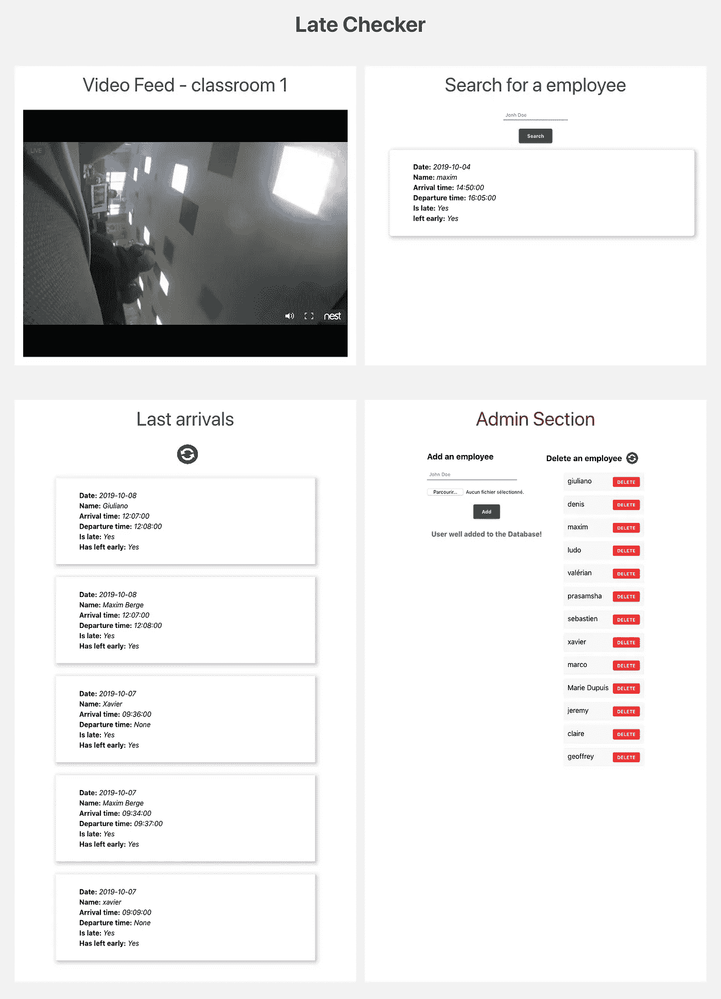
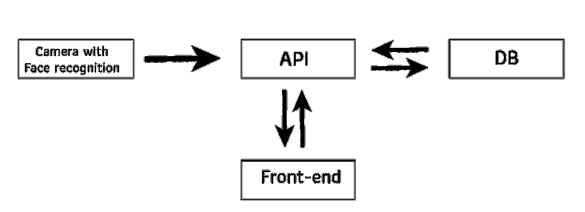

# 如何用人脸识别、Python 和 React 实现考勤自动化

> 原文：<https://medium.com/analytics-vidhya/how-to-automate-attendance-record-with-face-recognition-python-and-react-8d61c303784?source=collection_archive---------1----------------------->

## 点名是一件相当枯燥的工作。让我们看看如何利用 python 中的人工智能和 React 中的漂亮用户界面来实现自动化。

# 我们想要什么？

检查雇员是否准时或早退系统。但是也要查一下那些人的到达和离开时间。

我们还希望能够**添加**或**删除**一名员工。

# 怎么做？

我们可以在门前放置一个摄像头，它将**识别员工**和**并保存他们**到达**和**离开**的**时间**。**

有了这些数据，我们做一些简单的条件来确定他们是**迟到**还是**早退**。我们把这些信息保存在一个在线的 T21 数据库里，以便在任何地方都可以查阅。

# 用户将如何使用这些数据？

一个简单的网络界面。我们只想添加和删除一个雇员，并检查我们拥有的关于他的所有数据。

*截图:*

界面示例

# 用哪些技术？

Python、ReactJs 和 Flask

为了创建**前端**，我们使用 [**反应**](https://github.com/facebook/react) ，这对于实时处理信息是完美的。

对于**后端**，我们使用 [**Python Flask**](https://github.com/pallets/flask) 创建一个 API，可以接收请求和数据，然后发回并应答。例如，API 将接收一个名字，请求数据库获取关于这个人的所有数据，然后发送回这些数据。

对于**数据库**，我们使用[**PostgreSQL**](https://www.postgresql.org/)**，但是任何数据库引擎都可以完成这项工作。**

**对于**人脸识别**，我们使用了一个名为“[**face _ recognition**](https://github.com/ageitgey/face_recognition)”的 python 库。**

# **它将如何工作？**

## **让我们描述一下我们的 web 应用程序的数据处理流程。**

**一旦摄像头检测到人脸，它将检查**此人是否在系统**中，如果是，它将检索此人的**日期**、此人的**姓名**以及检测到此人的**时间**。如果这是该员工今天第一次被检测，将分配一个到达时间，一旦确定了该时间，当天的每个后续检测将更新他的离开时间。**

## **让我们详细说明数据将如何传输。**

**第一个脚本将从摄像机获取视频，检测人，获取检测时间，并将这些信息发送到我们的 API。然后，API 将向 DB 询问该雇员今天是否已经被看到，以确定它看到该人的时间是到达时间还是离开时间。然后，它将检查员工是否处于准时状态，并将所有这些数据发送回数据库。**

**用户将能够从前端询问有关雇员的数据，添加或删除一个。**

**前端将信息发送到 API，API 将查询数据库，接收信息并将其发送回前端。**

****

**项目的 UML。**

# **让我们深入研究代码！**

**很好。现在我们知道了我们想要什么，以及它将如何被构造，是时候编码了！**

**本节将分为 3 个部分。**

1.  ****面部识别。****
2.  ****API****
3.  ****前端****

## **1.面部识别**

**如上所述，对于面部识别，我们将使用 python[**face _ recognition**](https://github.com/ageitgey/face_recognition)库。让我们快速看一下它是如何工作的。**

**我们**给出一个用户的图片**来记录他的*【面部身份】*。
第一个模特会挖掘出**是否是人脸**和**确定其在照片上的位置**。
第二个模型将**计算面部参数**。*(两眼之间的距离，下巴的形状……)*
我们**通过**将这些所谓的“编码”数据链接到一个名称**来保存**，这样就可以将它们**与未来的图片**进行比较。**

**然后我们给**一张新的无名照片**和**相同的过程**将被重复，除了这一次，一个**第三模型将会比较脸部**和那些它已经知道的**的参数。****

***更多信息请参考* [*官方文档*](https://github.com/ageitgey/face_recognition) *。***

***代码:***

***添加带有图片的单个用户:***

**添加两名员工**

**如果我们想添加更多的用户，我们必须对每个用户重复这些步骤。**

**为了让*保持干燥，让我们通过创建一个文件夹来存储我们员工的肖像照片，从而使“添加面孔”过程自动化。***

***现在，它将自动**对文件夹中的所有照片**进行编码，方法是**将它们**链接到**文件** **名称**。***

***自动化流程***

***我们走吧！我们所有的员工现在都被编码了，我们可以认出他们。***

****对比图片:****

***将一幅画与另一幅相比较***

****末尾的值为“* ***姓名*** *”将为“***或有* ***姓名的员工*** *匹配*****

****很好，我们知道如何**比较两张图片**。但是我们想把它应用到一个**视频源，**对吗？****

****所以让我们**将它应用到视频馈送的每一帧**，然后如果有匹配，**将数据**发送到 **API** *(我们将稍后制作)*！****

****我们的 API 将收到一个完整的 json，其中包含所有需要的数据****

****我们现在有一个脚本，它将**识别出**谁在摄像机前面**，然后**将它发送给 API** 。******

## ****2.API****

****如上所述，对于 API，我们使用 [**烧瓶**](https://github.com/pallets/flask) 。这里的目的是从我们的人脸识别模型接收数据，并在需要时将其重新分配到前台。而且有可能添加一个新的雇员与他的名字和照片，并能够删除一些只有恢复他的名字。****

*****代码:*****

## ****让我们**创建应用程序**:****

****从 [app.py](https://github.com/GraphtyLove/Face-recognition-project/blob/master/API/app.py) 导入****

## ****创建一条 [**路线**](https://hackersandslackers.com/the-art-of-building-flask-routes/) ，该路线将**从我们的**人脸识别**模型接收数据**:****

*****注意:这段代码应该是******创建 app 段*** *和* ***运行服务器段*** *。*******

****从 [app.py](https://github.com/GraphtyLove/Face-recognition-project/blob/master/API/app.py) 接收 _ 数据路径****

## ****创建一个路由，从数据库中获取一个雇员的数据，并以他的名字命名****

****我们**从**前端**的 **GET 请求**中接收**一个字符串形式的名称，对数据库进行**查询，**将我们从**获得的数据**作为 json** 返回。******

**从 [app.py](https://github.com/GraphtyLove/Face-recognition-project/blob/master/API/app.py) 获取 _ 员工路线**

## **创建一条路线，获取摄像头检测到的最后 5 名员工的数据**

**我们从**前端**收到一个 **GET 请求**，**查询 DB** 以获取 **5 最后一个条目**，**将答案**作为 json 发送回前端**。****

**从 [app.py](https://github.com/GraphtyLove/Face-recognition-project/blob/master/API/app.py) 获取 _5_last_entires 路线**

## **创建将在系统中添加员工的路线**

**我们从**前端**接收到一个带有**图片**和**名称**的**获取请求**，我们将**添加到用户的文件夹**中，并且**向前端发回一个成功消息**。**

**从 [app.py](https://github.com/GraphtyLove/Face-recognition-project/blob/master/API/app.py) 添加 _ 员工路线**

## **创建一个路由，它将获得系统中所有雇员的姓名列表**

**我们从**前端**接收到一个 **GET 请求**，在用户文件夹中**走**得到所有员工的**姓名，然后**将这个列表**作为 **json** 返回给**前端**。****

**从 [app.py](https://github.com/GraphtyLove/Face-recognition-project/blob/master/API/app.py) 获取 _employee_list 路线**

## **创建一个将删除带有其姓名的用户的路由**

**我们从**前端**收到一个 **GET 请求**，用**用户名**作为字符串**删除**它。然后 **API 访问用户文件夹**并且**删除**带有**对应名称**的**图片**。**

**从 [app.py](https://github.com/GraphtyLove/Face-recognition-project/blob/master/API/app.py) 中删除 _ 员工路线**

**开始了。我们有一个全功能的人脸识别脚本和一个 API，踢一些屁股！现在让我们建立一个好的用户界面。**

## **3.前端**

**对于前端，我将每个面板分成一个组件。我们不会详细讨论每个组件，我们只是解释如何以 json 的形式发送请求和接收回答。我们让你创造性地使用数据。如果你想要一个例子，[**这里有一个项目**](https://github.com/GraphtyLove/Face-recognition-project) 的 github 的链接。**

***请求获取员工数据:***

**[SearchBar.jsx](https://github.com/GraphtyLove/Face-recognition-project/blob/master/FRONT/late-checker/src/Components/SearchBar/SearchBar.jsx) 组件**

***请求获取最后到达的 5 个部门:***

**[LastArrivalList.jsx](https://github.com/GraphtyLove/Face-recognition-project/blob/master/FRONT/late-checker/src/Components/LastArrivalList/LastArrivalList.jsx) 组件**

***请求添加员工:***

**[AddEmployeeForm.jsx](https://github.com/GraphtyLove/Face-recognition-project/blob/master/FRONT/late-checker/src/Components/AdminBlock/AddEmployeeForm.jsx) 组件**

***请求获取员工名单并删除他们:***

**[employeetodeletelist . jsx](https://github.com/GraphtyLove/Face-recognition-project/blob/master/FRONT/late-checker/src/Components/AdminBlock/EmployeeToDeleteList.jsx)组件**

**现在你可以把相机放在门前，安静地喝你的咖啡了！**

# **项目的 GitHub**

**[*这里可以找到回购。*](https://github.com/GraphtyLove/Face-recognition-project)**

# **制定项目的团队:**

*   **[伯奇格言](https://www.linkedin.com/in/maxim-berge-94b486179/)**
*   **[奥利维拉·朱利亚诺](https://www.linkedin.com/in/giuliano-oliveri-b83b93183/)**
*   **龙沃·泽维尔**

**我希望我说清楚了。**

**如果你对它有**任何问题**或**建议**，请不要犹豫，在评论中提出，或者你可以 [*在 LinkedIn 上直接联系我！*](https://www.linkedin.com/in/maxim-berge-94b486179/)**