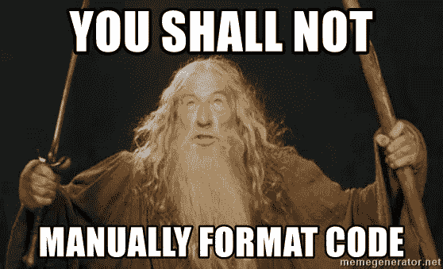

# 如何自动化 Python 代码格式化

> 原文：<https://medium.com/analytics-vidhya/how-to-automate-python-code-formatting-2509440491db?source=collection_archive---------12----------------------->



你好，你好，我的工程师同事们！

我想讨论一下 Python 协议。

首先，我们将讨论一些格式概念和为什么我们应该遵循 Python 协议的原因。然后我将向您展示三个工具，您可以使用它们来自动化整个过程！我们将介绍布莱克、YAPF 和伊索特图书馆。听起来不错吧？让我们开始吧…

如果你是一个听觉学习者，我在这里制作了一个关于这个讨论的基础和自动化工具的视频:[https://youtu.be/q2d5vrw1Lss](https://youtu.be/q2d5vrw1Lss)

# 什么是最佳实践？

仅仅是遵循 PEP 8 风格指南吗？

PEP 8 是代码约定，是一个随着 Python 的变化而发展的活文档(参见 https://www.python.org/dev/peps/pep-0008/)。

或者是遵循 Python 的禅，这是一套用 Python 编码的原则(参见 https://www.python.org/dev/peps/pep-0020/[)。](https://www.python.org/dev/peps/pep-0020/)

这些增强方案都没有涵盖所有内容，但是从设计上来说，它们非常灵活。

# 你应该对此固执己见吗？

在用 Python 编码时，应该允许你有任何个人偏好吗？只要代码按预期运行，并且有测试覆盖，是否存在正确或错误的编码方式？你认为代码的效率比可读性更重要吗？

在 Python 成为遗产之前，有很多问题可以讨论。

我和我的团队讨论了我们编码的方式，以及在我们的代码库中出现的一些不一致。我们每个人都提出了我们喜欢看到的代码格式。

我们都同意的一件事是一致性。从函数和类到我们编写测试的方式。只要我们意见一致，我们就可以开始关注更重要的事情。

# Python 协议的优点

*   *代码评审:*当你评审代码时，你不希望你的注意力被吸引到风格注释上，而不是集中在正在创建的特性和测试的覆盖范围上。
*   一致性:在代码库之间保持一致的风格会让你的代码更具可读性。我们人类的直觉是寻找模式。因此，一致的代码库将允许开发人员(尤其是代码库新手)更快地掌握代码的精髓。
*   *关注:*一旦你有了合适的协议，它最终会变成你的第二天性。然后，您可以开始关注真正的问题和您正在创建的功能。
*   *美观:*一致的代码库好看！

# 我们该怎么办？

作为基础，我们使用 PEP8 和 PEP 20，如果你是林挺，无论如何你都需要符合 PEP 8。

规则是不断变化的，这就是编码的方式。但是我们已经制定了一些基本规则来遵守:

*   模块文档字符串包含模块的详细描述，并在需要的地方有示例用例。
*   导入遵循 PEP 8，首先是标准模块，其次是第三方，然后是应用级模块。
*   来自单个依赖项的多个导入被括在括号中，并在末尾添加一个逗号。逗号是这样的，GitHub 会将任何新添加的内容识别为单行更改，而不是删除和替换。
*   全局变量全部大写，变量描述它们包含的数据，所有变量也是如此。
*   模块的单个异常与代码存储在同一个文件中。然而，如果有几个，我们为异常创建一个新文件并导入它们(以避免混乱)。
*   函数名应该尽可能具有描述性。
*   我们目前使用 Python 3.7，所以对于我们的函数，我们使用变量和预期返回的类型提示。
*   具有多个变量的复杂函数可能需要一个 docstring。
*   具有异常处理的函数必须记录异常，并有一个处理的 docstring 解释。
*   字典应该在每一行都有一个键和值，并以逗号结尾。
*   对于列表创建，我们试图保持 Pythonic 式的(即列表理解)，但是如果它不适合一行，那么我们使用循环。
*   对于日志记录，我们使用 f 字符串(它看起来更好一点)。

下面是用代码编写的上述规则的示例:

```
*"""
Module docstring describing what the module does
"""*import logging
import os
import sysimport pandas as pdfrom file_to_be_imported import descriptive_function_1
from files_to_be_imported import (
 descriptive_function_2,
 descriptive_function_3,
 descriptive_function_4,
)GLOBAL_VARIABLE = "global variable" class SomeException(Exception):
 *"""this is an exception and needs a docstring"""* pass def single_variable(var: str):
 descriptive_function_1(var) def multiple_variables(
 descriptive_var_1: str,
 descriptive_var_2: int,
 descriptive_var_3: bool,
):
 try:
 descriptive_function_2(descriptive_var_1)
 descriptive_function_3(descriptive_var_2)
 descriptive_function_4(descriptive_var_3)
 except SomeException:
 logging.exception("Some Exception occurred") descriptive_dict_example = {
 "key1": "value1",
 "key2": "value2",
 } descriptive_list_example = [x for x in range(0, 10)] logging.info(f"{descriptive_dict_example} and {descriptive_list_example}")
```

# 演示时间

# 自动格式化！

作为软件工程师，一旦我们解决了一个重复出现的问题，我们就应该自动化它。我发现了两个可能对您有用的库:

***黑色:***

这是一个简单易用的模块，它的配置非常少。他们喜欢说“我们固执己见，所以你不必如此”

[https://black.readthedocs.io/en/stable/](https://black.readthedocs.io/en/stable/)

他们有一个在线格式化工具，你可以用它来查看黑色格式化的结果。为了和 Pipenv 一起使用，我们必须使用 pip 来安装它，由于某种原因，Pipenv 没有直接选择这个库。如果有人能告诉我为什么，我很想知道:

```
pipenv run pip install black
```

下面我创建了一个文件，我想格式化:

```
import os, sysfrom file_to_be_imported import descriptive_function_1class SomeException(Exception):def single_variable(var: str):def multiple_variables(descriptive_var_1: str,descriptive_list_example = [
import logging import pandas as pd 
from files_to_be_imported import descriptive_function_2, descriptive_function_3, descriptive_function_4 GLOBAL_VARIABLE = "global variable" 
 """this is an exception and needs a docstring"""
 pass 
 descriptive_function_1(var) 
 descriptive_var_2: int,
 descriptive_var_3: bool,
):
 x for x in range(0, 10)
 ] 
 """
 This is a more complex function so this
 Params are not needed if they are descriptive enough unless they are dataframes. Dataframes should be described.
 SomeException: The cases for Exceptions should always be described
 """
 try:
 descriptive_function_2(descriptive_var_1,)
 descriptive_function_3(descriptive_var_2)
 descriptive_function_4(descriptive_var_3)
 except SomeException:
 logging.exception("Some Exception occurred") descriptive_dict_example = {"key1": "value1","key2": "value2",} logging.info(f"{descriptive_dict_example} and {descriptive_list_example}")
```

(眼尖的也会注意到文件末尾没有换行符)

然后运行黑色:

```
pipenv run black <path to file>
```

所以在我们的例子中:

```
pipenv run black file_to_be_formatted.py
```

结果如下:

```
file_to_be_formatted.pyimport os, sys
import loggingimport pandas as pdfrom file_to_be_imported import descriptive_function_1
from files_to_be_imported import (
 descriptive_function_2,
 descriptive_function_3,
 descriptive_function_4,
) GLOBAL_VARIABLE = "global variable" class SomeException(Exception):
 *"""this is an exception and needs a docstring"""*pass def single_variable(var: str):
 descriptive_function_1(var) def multiple_variables(
 descriptive_var_1: str, descriptive_var_2: int, descriptive_var_3: bool,
):
 try:
 descriptive_function_2(descriptive_var_1,)
 descriptive_function_3(descriptive_var_2)
 descriptive_function_4(descriptive_var_3)
 except SomeException:
 logging.exception("Some Exception occurred") descriptive_dict_example = {
 "key1": "value1",
 "key2": "value2",
 } descriptive_list_example = [x for x in range(0, 10)] logging.info(f"{descriptive_dict_example} and {descriptive_list_example}")
```

这里需要注意几点:

*   它还没有完全覆盖 PEP8 进口标准。尽管它用括号括起了多个导入。
*   它在我们的单行 docstring 之后添加了一个新行。
*   它在一行中列出了函数的所有变量。
*   字典键值在单独的行上。
*   列表理解也在一行上。

总的来说，它做得相当不错，如果你真的不想在格式化上固执己见，也许这就是你要的格式化程序。

***YAPF*** :

诞生于谷歌深处的 YAPF 是一个高度可配置的格式化程序。它使用称为旋钮的东西(如果你是英国人，这听起来很滑稽)来配置 Python 格式:

它们被设置在一个名为`.style.yapf`的文件中，见下文:

```
[style]
based_on_style = pep8
dedent_closing_brackets = true
each_dict_entry_on_separate_line = true
```

需要设置`based_on_style`:有`pep8`、`google`、`facebook`和`yapf`。然后，您可以添加旋钮来配置您想要的格式样式。您也可以单独使用`based_on_style`。在上面的例子中，我将括号设置为 dedent，并将每个字典条目放在单独的一行上。

然后，您可以使用以下命令运行 yapf:

```
pipenv install -d yapf pipenv run yapf -i file_to_be_formatted.py
```

使用前面的文件，我们最终得到的结果是:

```
import os, sys
import loggingimport pandas as pdfrom file_to_be_imported import descriptive_function_1
from files_to_be_imported import descriptive_function_2, descriptive_function_3, descriptive_function_4GLOBAL_VARIABLE = "global variable" class SomeException(Exception):
 *"""this is an exception and needs a docstring"""* pass def single_variable(var: str):
 descriptive_function_1(var) def multiple_variables(
 descriptive_var_1: str,
 descriptive_var_2: int,
 descriptive_var_3: bool,
):
 try:
 descriptive_function_2(descriptive_var_1, )
 descriptive_function_3(descriptive_var_2)
 descriptive_function_4(descriptive_var_3)
 except SomeException:
 logging.exception("Some Exception occurred") descriptive_dict_example = {
 "key1": "value1",
 "key2": "value2",
 } descriptive_list_example = [x for x in range(0, 10)] logging.info(f"{descriptive_dict_example} and {descriptive_list_example}")
```

请注意，YAPF 和黑色一样，不包括进口商品。但是我们设法去掉了函数上的括号。字典键值都在单独的行上。总的来说，它在总体风格上坚持了 PEP8。

如果您还想控制导入，那么您需要将前面两个格式化程序中的一个与 iSort 结合起来:

要安装和使用 iSort:

```
pipenv install -d isort
pipenv run isort file_to_be_formatted.py
```

这将对您的导入和括号以及多个导入语句进行排序。

```
"""file_formatted_with_isort.py"""
import logging
import os
import sysimport pandas as pdfrom file_to_be_imported import descriptive_function_1
from files_to_be_imported import (descriptive_function_2,
 descriptive_function_3,
 descriptive_function_4)
```

然后，要将它与 YAPF 结合起来，您需要在多导入行的末尾添加一个逗号。

```
"""file_formatted_with_isort.py"""
import logging
import os
import sysimport pandas as pdfrom file_to_be_imported import descriptive_function_1
from files_to_be_imported import (descriptive_function_2,
 descriptive_function_3,
 descriptive_function_4,)
```

使用 iSort 和 YAPF 的最终结果是:

```
"""file_formatted_with_isort_and_yapf.py"""import logging
import os
import sysimport pandas as pdfrom file_to_be_imported import descriptive_function_1
from files_to_be_imported import (
 descriptive_function_2,
 descriptive_function_3,
 descriptive_function_4,
)GLOBAL_VARIABLE = "global variable" class SomeException(Exception):
 *"""this is an exception and needs a docstring"""* pass def single_variable(var: str):
 descriptive_function_1(var) def multiple_variables(
 descriptive_var_1: str,
 descriptive_var_2: int,
 descriptive_var_3: bool,
):
 try:
 descriptive_function_2(descriptive_var_1, )
 descriptive_function_3(descriptive_var_2)
 descriptive_function_4(descriptive_var_3)
 except SomeException:
 logging.exception("Some Exception occurred") descriptive_dict_example = {
 "key1": "value1",
 "key2": "value2",
 } descriptive_list_example = [x for x in range(0, 10)] logging.info(f"{descriptive_dict_example} and {descriptive_list_example}")
```

你可以看到进口现在是 PEP8 标准。我们还对多重导入语句加了括号并做了说明！太棒了。

我希望这能让你对如何使用这些工具有一点了解。我真的相信 Python 协议应该被标准化，这样作为开发者我们可以专注于重要的事情。

我将编写一个 shell 脚本来自动化整个过程，我会在后续的博客中发布。

如果你有任何问题，请随意提问，我会在下一个问题上和你联系。