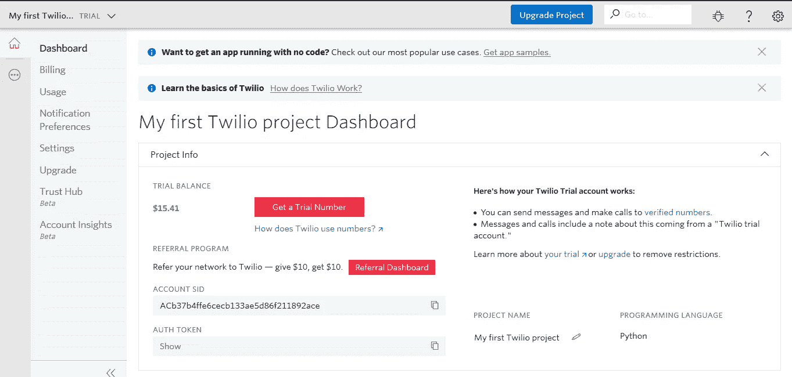
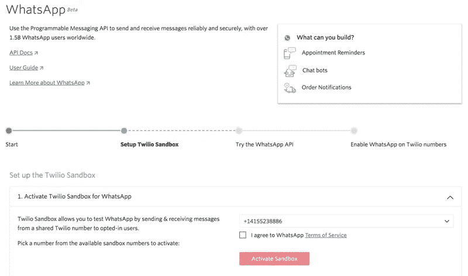

# 如何在电脑上以编程方式自动发送 WhatsApp 信息

> 原文：<https://medium.com/analytics-vidhya/how-to-automate-whatsapp-messages-programmatically-from-your-computer-a042d0f4269f?source=collection_archive---------0----------------------->


我是一个组织的 WhatsApp 平台的管理员。管理员们做的最重要的事情是祝每个人生日快乐。我们不应该错过它。它包括保留一本书(字面上)关于组织的每个成员，这样我们就不会错过他们的生日。我想到了建立一个应用程序，可以做到这一点，只需照顾簿记，也有一个报警系统，将告知当天谁是监礼人。现在，我发现我们也可以通过程序从应用程序发送消息。本质上，我们可以用代码做所有的事情。

## 介绍

我们将使用 Twilio 和编程语言 Python 来发送消息。真的是安装它，它有一个免费层。它被蓝围裙，Zendesk，美国红十字会，CipherHealth 等使用。Twilio 也有其他编程语言的绑定，请查看[快速入门](https://www.twilio.com/docs/quickstart)页面。

## 装置

首先，您应该安装 python，因为我们将使用 python。如果你没有安装 python，我建议你去 python.org[下载 python 3 的最新更新。](https://www.python.org/downloads/)

接下来，我们必须安装 Twilio。在您的终端中，执行以下操作:

```
pip install twilio
```

如果你没有一个 IDE，基本上是一个好的文本编辑器，可以帮助你有效地开发应用程序，我推荐使用 [vs code](https://code.visualstudio.com/download) 。

这些是我们现在唯一要安装的东西。

# 创建项目文件夹和文件

在你的电脑上为这个项目创建一个文件夹，命名为 *birthday_messages_app* 。在其中创建一个文件名 *main.py，*我们将编写我们的应用程序的代码。

# 我们的程序

1.  我们需要一个数据库来存储一些员工的数据。
2.  我们将查询该数据库，以查看谁的出生月份和生日与今天的日期和月份相匹配。
3.  然后我们会给那个人发一条 WhatsApp 信息，表达我们对他的感激之情。

## 步骤 1:建立数据库

我们的应用程序将使用的数据库是一个单文件数据库。但是，我们将使用 SQLite，它具有单个文件数据库的所有优点，没有任何缺点，而不是使用文件作为数据库，这有很多不好的副作用。SQLite 是 python 自带的，所以你不需要安装任何东西。

要使用 SQLite，我们必须在 python 中导入 sqlite3 模块。打开 *birthday_messages_app* 文件夹中的 main.py 文件，编写以下内容。

```
import sqlite3conn = sqlite3.connect("company_data.db")
cursor = conn.cursor()conn.close()
```

在上面的代码中，我们导入了 sqlite3 模块，然后连接到一个名为 company_data.db 的文件数据库，如果这个文件不存在，它将由 sqlite3 创建，如果它也存在，它将不会被覆盖。所以本质上它连接到一个叫做 company_data 的数据库。

一个公司的数据可能包括很多东西；其中有我们想要的:员工数据。那可能会存储在一个名为*雇员 _ 数据*的表中。公司将存储的员工数据包括:名、姓、电话号码、出生日期、地址等。我们只会对名字、电话号码和出生日期感兴趣。我们将只从数据库中读取数据。因为我们在模仿数据，所以我们应该创建那个表，并放入一些员工数据，以便能够构建我们的应用程序。

让我们编写函数将数据输入到数据库中。将此添加到 *main.py*

```
def employee_data(): sql = "CREATE TABLE employees_data (first_name, dob, phone)"
    cursor.execute(sql) sql = "INSERT INTO employees_data VALUES (?, ?, ?)"
    data = [('John', '10/30/1990', '+1234567890'),
            ('Tim', '10/29/1992', '+1234567890'),
            ('Van', '10/29/2001', '+1234567890'),
            ] cursor.executemany(sql, data)
    conn.commit()
```

上面的代码创建了一个名为 employees_data 的表，其中包含 first_name、birth date(DOB)和 phone 三列，然后添加三行包含这些数据的雇员。 ***出于实验原因，请将电话号码替换为您目前在 whatsapp* *上使用的电话号码。***

> **注意，在“出生日期”一栏中，日期的安排应该是为了让我们的系统试验起来更有趣。因此，请为其中两个使用当天，然后为另一个使用第二天。因此，如果应用程序永远运行，我们今天会收到两条消息，明天会收到另一条。**

但是首先我们必须运行函数，因为代码在函数内部。将这一行添加到 main.py 的底部以运行该函数

```
employee_data()
```

所以现在在 *main.py* 中我们应该有:

```
import sqlite3conn = sqlite3.connect("company_data.db")
cursor = conn.cursor() def employee_data(): sql = "CREATE TABLE employees_data (first_name, dob, phone)"
    cursor.execute(sql) sql = "INSERT INTO employees_data VALUES (?, ?, ?)"
    data = [('John', '10/30/1990', '+1234567890'),
            ('Tim', '10/29/1992', '+1234567890'),
            ('Van', '10/29/2001', '+1234567890'),
            ] cursor.executemany(sql, data)
    conn.commit() employee_data()conn.close()
```

打开你的终端，输入

```
cd birthday_messages_app
```

这将把你的 shell 导航到*生日消息应用*文件夹。

接下来，通过输入以下代码运行 *main.py* 文件。这就是我们将如何运行我们的 main.py。

```
python main.py
```

*如果上面的代码运行没有错误，您将拥有一个名为 company_data 的数据库和一个名为 employees_data 的表，表中有 3 名雇员的名字、出生日期和电话号码*

接下来，我们开始创建应用程序。

## 步骤 2:查询数据库

是时候查询数据库知道是谁的生日了。

让我们创建一个函数来做这件事。在上面的 employee_data 函数中，我们不必创建函数，因为我们将静态数据放入数据库中。函数 employee_data 现在没有用了，但是我们必须创建一个函数来查询数据库，因为我们将使用 python 中的返回值。

在您的 *main.py* 文件**中删除**现在已经过时的行:

```
employee_data()
```

但是，保留 employee_data 函数以供参考

我们将与时间打交道，所以**将下面几行添加到文件顶部的导入语句中:**

```
...
from time import gmtime, strftime
...
```

将 *check_birthdays* 函数添加到文件底部:

```
...def check_birthdays():
    birthday_people = [] sql = "SELECT first_name, dob, phone from employees_data"
    cursor.execute(sql)
    birth_list = cursor.fetchall() day, month = strftime('%d %m', gmtime()).split(' ') for name, date_set, phone in birth_list:
        dates = date_set.split('/')
        if dates[0] == month and dates[1] == day:
            birthday_people.append((name, phone))

    return set(birthday_people)
```

在上面的代码中，我们检查了 employees_data 数据库表中那些出生月份和生日与我们当前的日期和月份相匹配的人。

当你把它添加到你的 *main.py* 文件中时，你应该得到如下所示的东西:

```
from time import gmtime, strftime
import sqlite3conn = sqlite3.connect("company_data.db")
cursor = conn.cursor() def employee_data(): sql = "CREATE TABLE employees_data (first_name, dob, phone)"
    cursor.execute(sql) sql = "INSERT INTO employees_data VALUES (?, ?, ?)"
    data = [('John', '10/30/1990', '+1234567890'),
            ('Tim', '10/29/1992', '+1234567890'),
            ('Van', '10/29/2001', '+1234567890'),
            ] cursor.executemany(sql, data)
    conn.commit()def check_birthdays():
    birthday_people = [] sql = "SELECT first_name, dob, phone from employees_data"
    cursor.execute(sql)
    birth_list = cursor.fetchall() day, month = strftime('%d %m', gmtime()).split(' ') for name, date_set, phone in birth_list:
        dates = date_set.split('/')
        if dates[0] == month and dates[1] == day:
            birthday_people.append((name, phone))

    return set(birthday_people) conn.close()
```

您可以试验一下 *check_birthdays* 函数返回的内容。但是我们在运行应用程序时不会这样运行，所以我们还没有调用它。

接下来，我们需要一个函数，从 check_birthdays 函数中获取生日的人，然后使用另一个函数向每个人发送消息。我更喜欢调用 main 函数，因为它将是主调用者。不要生气，你可以叫它任何你想叫的名字。

所以在你的 main.py **文件的底部添加**main 函数:

```
def main():
    birthday_people = check_birthdays()
    send_messages(birthday_people) 
```

从上面的代码中可以看出，我们必须创建一个名为 *send_messages* 的函数，并使用它将我们的消息发送给那些人。

*send_messages* 函数将向这些个人发送消息。

要发送这些消息，我们必须使用 Twilio，记住我们安装了它，但要发送 WhatsApp 消息，我们需要注册 Twilio。我不相信有其他方法可以做到这一点，例如直接使用 WhatsApp API，唯一的出路是使用 Twilio，所以让我们注册 Twilio 免费试用，本质上是有限制的 Twilio forever。

## 第三步:注册

我们可以使用一个免费的 Twilio 号码，并用它请求 WhatsApp 注册，但这可能需要几天时间。所以让我们使用沙盒版本，它本质上给了我们一个可以使用的 WhatsApp 商业帐户，但你必须重新打开，因为它每 24 小时关闭一次。别烦我，我们开始吧。

报名参加 twilio

前往 [Twilio](https://www.twilio.com/try-twilio) 注册 Twilio，应该很简单，当你完成后，你应该被重定向或者前往[https://www.twilio.com/console](https://www.twilio.com/console)。

您应该会看到类似这样的内容:



你将需要**账号 SID** 和**认证令牌**。您将通过点击显示按钮显示您的**认证令牌**。复制两张或让窗户开着。

下一步，你应该有一个安装了 Whatsapp 的设备。

前往[https://www.twilio.com/console/sms/whatsapp/sandbox/](https://www.twilio.com/console/sms/whatsapp/sandbox/)，在那里你会找到我们将要使用的沙盒。通过选择一个要使用的数字来激活沙盒。您必须向该号码发送加入{keyword}消息才能激活。



现在，让我们搜索一个图像，我们可以使用它作为发送此人的媒体。使用这张我从网上借来的图片在[这里](https://karaspartyideas.com/wp-content/uploads/2019/04/Chic-Pastel-Dino-Party-via-Karas-Party-Ideas-KarasPartyIdeas.com_.png)。

现在，让我们回到我们的应用程序。

## 第四步:发送信息

在我们的 *main.py* 进口 twilio

```
...
import sqlite3from twilio.rest import Client...
```

然后创建 send_messages 函数。您需要从 Twilio 控制台分别用您的**帐户 SID** 和**验证令牌**替换*帐户 _sid* 和*验证令牌*。

如果您不喜欢提供的*生日 _ 封面*图片，请随意使用互联网上的另一张图片。

```
...
def send_messages(people): account_sid = 'AXXXXXXXXXXXXXXXXXXXXXXXXXX'
    auth_token = "XXXXXXXXXXXXXXXXXXXXXXXXXXXXX"
    client = Client(account_sid, auth_token) birthday_cover = "https://karaspartyideas.com/wp-content/uploads/2019/04/Chic-Pastel-Dino-Party-via-Karas-Party-Ideas-KarasPartyIdeas.com_.png" for name, phone in people: msg = f"Happy birthday {name}."
        msg += " We at good Company celebrate you!" message = client.messages.create(
            media_url=[birthday_cover],
            from_="whatsapp:+14155238886",
            body=msg,
            to=f"whatsapp:{phone}"
        ) return True
```

在上面的代码中，我们设置变量来保存我们的**帐户 SID** 和**身份验证令牌**，请更改 *XXX* 来反映您的值，我们将需要它来成功调用 Twilio 的 SMS API。

接下来，我们通过传入上述两个值来创建客户机对象的实例。接下来是我们将作为信息媒体的生日封面。

接下来，我们循环遍历*人*，这样我们就可以向多个生日庆祝者发送消息，如果他们是多个的话。

接下来，我们创建一个 *msg* 变量来保存一条定制的消息，该消息包含两行人名，以符合 PEP8。

接下来，我们最终使用 *client.messages.create* 从 *twilio.rest* 模块调用 API。我们在***【media _ URL】******from _******body******to***变量中传递。

*   ***media_url*** :是包含我们选择的封面图片的列表
*   ***from_*** :是沙盒中提供的数字。也可以是你的[免费 Twilio 号](https://www.twilio.com/docs/whatsapp/tutorial/connect-number-business-profile)，格式应该是“whatsapp:+012345678911”
*   ***正文*** :是消息的正文
*   ***到*** :是你加入沙盒的 whatsapp 号。应该是“whatsapp:+012345678911”的格式

接下来我们在函数上返回*真值*就这样。

现在将这一行添加到 main.py 文件的底部，以运行 main 函数

```
main()
```

所以现在的 *main.py* 文件应该是这样的，XXX 被替换了:

```
from time import gmtime, strftime
import sqlite3from twilio.rest import Client conn = sqlite3.connect("company_data.db")
cursor = conn.cursor() def employee_data(): sql = "CREATE TABLE employees_data (first_name, dob, phone)"
    cursor.execute(sql) sql = "INSERT INTO employees_data VALUES (?, ?, ?)"
    data = [('John', '10/30/1990', '+1234567890'),
            ('Tim', '10/29/1992', '+1234567890'),
            ('Van', '10/29/2001', '+1234567890'),
            ] cursor.executemany(sql, data)
    conn.commit()def check_birthdays():
    birthday_people = [] sql = "SELECT first_name, dob, phone from employees_data"
    cursor.execute(sql)
    birth_list = cursor.fetchall() day, month = strftime('%d %m', gmtime()).split(' ') for name, date_set, phone in birth_list:
        dates = date_set.split('/')
        if dates[0] == month and dates[1] == day:
            birthday_people.append((name, phone))

    return set(birthday_people)def send_messages(people): account_sid = 'AXXXXXXXXXXXXXXXXXXXXXXXXXX'
    auth_token = "XXXXXXXXXXXXXXXXXXXXXXXXXXXXX"
    client = Client(account_sid, auth_token) birthday_cover = "https://karaspartyideas.com/wp-content/uploads/2019/04/Chic-Pastel-Dino-Party-via-Karas-Party-Ideas-KarasPartyIdeas.com_.png" for name, phone in people: msg = f"Happy birthday {name}."
        msg += " We at good Company celebrate you!" message = client.messages.create(
            media_url=[birthday_cover],
            from_="whatsapp:+14155238886",
            body=msg,
            to=f"whatsapp:{phone}"
        ) return True def main():
    birthday_people = check_birthdays()
    send_messages(birthday_people) main()conn.close()
```

现在打开终端并运行 main.py 文件。您应该可以上网发送此邮件。在您的终端中输入以下内容

```
python main.py
```

万岁！！！你应该会在你的 Whatsapp 上收到一条非常漂亮的媒体消息。类似于这样的东西:


**万岁！！！**

## 你可以在这里结束教程，或者你可以选择成为一名忍者。

## 奖励:时间循环系统

从我们当前的 *main.py* 文件中，我们可以只运行 main 函数来检查生日并向他们发送消息，但我更喜欢我们有一个时间检查系统，这样我们只运行这个应用程序一次，但它每天都向当天的生日庆祝者发送消息，而无需我们再次调用它。

因为我们将使用时间模块中的睡眠功能，所以将您的时间导入语句更新为:

```
from time import gmtime, strftime, sleep
```

让我们把我们的主函数改写成这样:

```
def main():
    while True:
        if not_wished_today():
            birthday_people = check_birthdays()
            if send_messages(birthday_people):
                update_last_wished() else:
            sleep(3600)
```

上面的代码使用了一个永远运行的 while 循环。然后，它会检查我们今天是否希望人们睡眠 3600 秒(1 小时)，并再次检查，以便我们不会错过午夜的钟声。如果我们没有许愿，我们会检查庆祝者并发送消息，在我们发送完消息后，我们会更新上次许愿的日期。

我们将需要一个数据存储来存储我们最后一次希望人们。让我们为此创建一个数据库表。

在 *main.py* 文件中创建一个函数*生日 _ 系统*

```
def birthday_sys():
    sql = "CREATE TABLE birthday_sys (last_wished)"
    cursor.execute(sql) sql = "INSERT INTO birthday_sys VALUES ('0 0')"
    cursor.execute(sql)
    conn.commit()
```

上面的代码在运行时将创建一个包含一列 last_wished 的表 birthday_sys。它还插入一个字符串“0 0”来表示没有日期和月份。

从 main.py 的底部删除对 main 函数的调用，并添加以下内容:

```
birthday_sys()
```

所以现在在你的 main.py 中，你应该有这样的东西

```
from time import gmtime, strftime, sleep
import sqlite3from twilio.rest import Clientconn = sqlite3.connect("company_data.db")
cursor = conn.cursor() def employee_data(): sql = "CREATE TABLE employees_data (first_name, dob, phone)"
    cursor.execute(sql) sql = "INSERT INTO employees_data VALUES (?, ?, ?)"
    data = [('John', '10/30/1990', '+1234567890'),
            ('Tim', '10/29/1992', '+1234567890'),
            ('Van', '10/29/2001', '+1234567890'),
            ] cursor.executemany(sql, data)
    conn.commit() def check_birthdays():
    birthday_people = [] sql = "SELECT first_name, dob, phone from employees_data"
    cursor.execute(sql)
    birth_list = cursor.fetchall() day, month = strftime('%d %m', gmtime()).split(' ') for name, date_set, phone in birth_list:
        dates = date_set.split('/')
        if dates[0] == month and dates[1] == day:
            birthday_people.append((name, phone))

    return set(birthday_people)def send_messages(people): account_sid = 'AXXXXXXXXXXXXXXXXXXXXXXXXXX'
    auth_token = "XXXXXXXXXXXXXXXXXXXXXXXXXXXXX"
    client = Client(account_sid, auth_token) birthday_cover = "https://karaspartyideas.com/wp-content/uploads/2019/04/Chic-Pastel-Dino-Party-via-Karas-Party-Ideas-KarasPartyIdeas.com_.png" for name, phone in people: msg = f"Happy birthday {name}."
        msg += " We at good Company celebrate you!" message = client.messages.create(
            media_url=[birthday_cover],
            from_="whatsapp:+14155238886",
            body=msg,
            to=f"whatsapp:{phone}"
        ) return True def birthday_sys():
    sql = "CREATE TABLE birthday_sys (last_wished)"
    cursor.execute(sql) sql = "INSERT INTO birthday_sys VALUES ('0 0')"
    cursor.execute(sql)
    conn.commit()def main():
    while True:
        if not_wished_today():
            birthday_people = check_birthdays()
            if send_messages(birthday_people):
                update_last_wished() else:
            sleep(3600) birthday_sys()conn.close()
```

从 python 运行应用程序，这应该会得到*生日系统*表。

现在让我们编写 *not_wished_today* 函数

```
def not_wished_today():
    sql = "SELECT * FROM birthday_sys"
    cursor.execute(sql) last_wished = cursor.fetchone()[0]
    curr_time = strftime('%d %m', gmtime()) if last_wished != curr_time:
        return True
    else:
        return False
```

*上面的代码从 birthday_sys 表中获取最后一个愿望，并用我们的当前日期进行验证，看看日期是否相同。如果他们不是，那么那天我们没有祝福任何人。*

最后，我们还要编写 *update_last_wished* 函数

```
def update_last_wished():
    curr_time = strftime('%d %m', gmtime())
    sql = f"UPDATE birthday_sys SET last_wished='{curr_time}'"
    cursor.execute(sql)
    conn.commit()
```

*上面的代码将更新 last _ wished 列来保存当前的日期和月份*

现在一切都完成了。**在 main.py 中添加**主函数调用

```
main()
```

因此，main.py 文件最终应该是这样的，其中的 **XXX** 值发生了变化:

```
from time import gmtime, strftime, sleep
import sqlite3from twilio.rest import Clientconn = sqlite3.connect("company_data.db")
cursor = conn.cursor() def employee_data():
    sql = "CREATE TABLE employees_data (first_name, dob, phone)"
    cursor.execute(sql)
    sql = "INSERT INTO employees_data VALUES (?, ?, ?)"
    data = [('John', '10/30/1990', '+1234567890'),
            ('Tim', '10/29/1992', '+1234567890'),
            ('Van', '10/29/2001', '+1234567890'),
            ]
    cursor.executemany(sql, data)
    conn.commit() def check_birthdays():
    birthday_people = []
    sql = "SELECT first_name, dob, phone from employees_data"
    cursor.execute(sql)
    birth_list = cursor.fetchall()
    day, month = strftime('%d %m', gmtime()).split(' ')
    for name, date_set, phone in birth_list:
        dates = date_set.split('/')
        if dates[0] == month and dates[1] == day:
            birthday_people.append((name, phone)) return set(birthday_people) def send_messages(people):
    account_sid = 'AXXXXXXXXXXXXXXXXXXXXXXXXXX'
    auth_token = "XXXXXXXXXXXXXXXXXXXXXXXXXXXXX"
    client = Client(account_sid, auth_token)
    birthday_cover = "https://karaspartyideas.com/wp-content/uploads/2019/04/Chic-Pastel-Dino-Party-via-Karas-Party-Ideas-KarasPartyIdeas.com_.png"
    for name, phone in people:
        msg = f"Happy birthday {name}."
        msg += " We at good Company celebrate you!" message = client.messages.create(
            media_url=[birthday_cover],
            from_="whatsapp:+14155238886",
            body=msg,
            to=f"whatsapp:{phone}"
        )
    return True def birthday_sys():
    sql = "CREATE TABLE birthday_sys (last_wished)"
    cursor.execute(sql)
    sql = "INSERT INTO birthday_sys VALUES ('0 0')"
    cursor.execute(sql)
    conn.commit() def not_wished_today():
    sql = "SELECT * FROM birthday_sys"
    cursor.execute(sql)
    last_wished = cursor.fetchone()[0]
    curr_time = strftime('%d %m', gmtime())
    if last_wished != curr_time:
        return True
    else:
        return False def update_last_wished():
    curr_time = strftime('%d %m', gmtime())
    sql = f"UPDATE birthday_sys SET last_wished='{curr_time}'"
    cursor.execute(sql)
    conn.commit()def main():
    while True:
        if not_wished_today():
            birthday_people = check_birthdays()
            if send_messages(birthday_people):
                update_last_wished()
        else:
            sleep(3600)main()
conn.close()
```

请为此，我建议你打开一个单独的终端。导航到*生日消息应用*文件夹

```
cd birthday_messages_app
```

然后运行 main.py

```
python main.py
```

你应该首先看到一条消息，如果你让终端一直打开到第二天午夜 12 点，你应该会收到另一条消息(根据你的数据库)，只有到那时你才应该关闭终端，对吗？:)