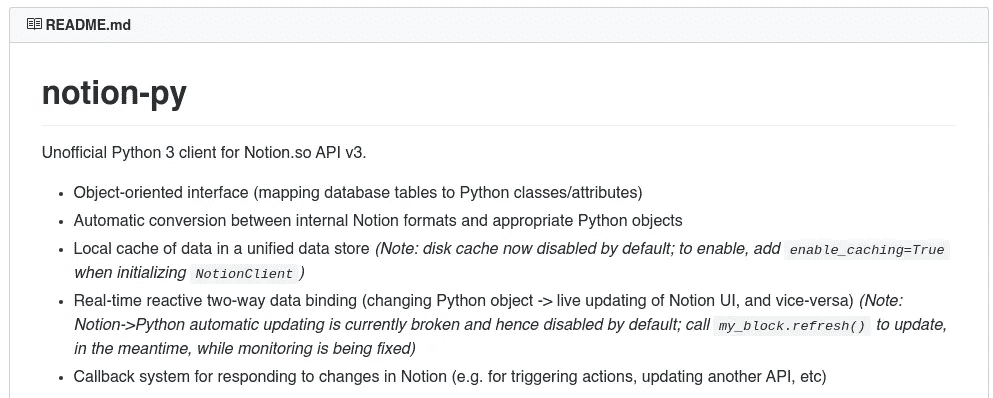

# 如何为公关活动自动创建媒体列表

> 原文：<https://medium.com/analytics-vidhya/how-to-automatically-create-a-list-of-media-for-pr-campaign-941af7baac89?source=collection_archive---------29----------------------->

如果你不知道你的目标听觉阅读的是哪种媒体，该怎么办？

你想在法国开展公关活动，但你住在美国。你不知道背景，也不知道你的目标受众在法国实际阅读了什么。

这篇文章将帮助你解决这个问题。

法国媒体的一个小图表

# 介绍

几个月前，当我因为我的[创业](http://reface.tech)而开始与媒体沟通时，我面临着同样的问题。这就是为什么我需要一份高科技媒体的清单。

**我想要一个包含这些列的表格:**

1.  媒体名称
2.  链接到网站
3.  它的优先级(或“适合我的目的”)
4.  Alexa 率，因为我应该知道这个网站是否受欢迎

这种表格的一个例子

以防你不知道:Alexa(我指的是 https://www.alexa.com/siteinfo 的)是亚马逊的网站分析工具。

我发现 Alexa 有一个名为“相似网站”的特殊标签，它为你提供了 5 个与你请求的网站重叠的网站的信息。

**所以我的计划是:**

1.  插入我在 Alexa 分析工具中发现的所有网站
2.  从 Alexa 获得所有类似的网站。
3.  过滤它们(如果一个网站不符合我的要求，就阻止它)
4.  在 Alexa 分析工具中插入所有过滤的网站
5.  (再一次迭代)

我开始用手做，但是不真实。

**一些问题:**

1.  很难记住你是否已经浏览过这个网站。所以你需要在某个地方存储信息，这需要时间。

2.您还应该存储有关“被阻止”网站的信息。

3.您的浏览器中有太多标签。你的电脑开始运行缓慢，这很烦人。任务开始需要更多的时间来解决。

**结论:**这个过程耗费大量时间。但是可以自动化！

# 伙计们，该做快速数学了

媒体之间的连接可以由图来表示，其中顶点是媒体。如果两个媒体(即顶点)是连接的(即它们之间存在边)，那么在 Alexa 中可以说它们是相似的。

**举个例子:**

在法国，有这样一种媒体叫做《巴黎人》。事实上，这是一个日常新闻，但这并不重要。

Alexa 为我们提供了类似的网站:

1.  [linternaute.fr](https://www.alexa.com/siteinfo/linternaute.fr)
2.  [larousse.fr](http://larousse.fr)

4.  [cnrtl.fr](https://www.alexa.com/siteinfo/cnrtl.fr)
5.  [lefigaro.fr](https://www.alexa.com/siteinfo/lefigaro.fr)

《巴黎人报》与其他媒体的关系图

我们还应该知道，这些媒体中的每一个都会给我们带来大约 5 种其他的联系。此外，该网站可以连接到我们已经在图表中看到的一些网站。

例如，现在让我们获取关于 [lemonde.fr](http://lemonde.fr) 的信息。

**哪些站点是相对于它的？**

1.  [leparisien.fr](https://www.alexa.com/siteinfo/leparisien.fr)
2.  [lefigaro.fr](https://www.alexa.com/siteinfo/lefigaro.fr)
3.  [linternaute.fr](https://www.alexa.com/siteinfo/linternaute.fr)
4.  [francetvinfo.fr](https://www.alexa.com/siteinfo/francetvinfo.fr)
5.  [法国西部](https://www.alexa.com/siteinfo/ouest-france.fr)

正如我们所见， [linternaute.fr](https://www.alexa.com/siteinfo/linternaute.fr) 、 [lefigaro.fr](https://www.alexa.com/siteinfo/lefigaro.fr) 和 [leparisien.fr](https://www.alexa.com/siteinfo/leparisien.fr) 已经出现在我们的图表中。但是最后两个资源不在那里。

让我们重新画一下我们的插图:

但是如果 [lemonde.fr](http://lemonde.fr) 不符合我们的要求呢？

我们应该把它排除在我们的图表之外。因此，它将排除类似的网站，因为我们现在不能去那里。但这并不是说这些资源将被完全排除，因为在未来(当我们更深入时)可能会存在与某些资源的相似性，并且它们之间的边界将被画出。

# 自动化计划

今天我们将在 Python 上写作。但是我们应该写什么呢？

1.  一个模块，与 Alexa 互动，并获得有关类似网站和 Alexa 率的信息。
2.  一个模块，处理新的网址，保存更改，如果你已经查看了资源或阻止它。它实际上触发了 Alexa 交互模块来扫描新的资源。
3.  在某处添加获得的数据的模块。我将把它添加到概念中，因为我非常喜欢它，但是你可以自己制作一个(例如，用于在 CSV 中存储数据)。

现在让我们了解一下我们应该在这里使用的仪器。

## Alexa 交互模块

我的第一个想法是使用`requests`库获取页面内容。但是，对我们来说不幸的是，Alexa 网站不发送所有需要的 HTML 代码信息。加载到浏览器后，它开始发出请求以接收数据。为了得到它，你必须以某种方式“坐下来等待”,直到它将加载所有内容。

出于我们的目的，我们将使用名为`Google Chome driver`的东西。

可以在这里下载:[https://chromedriver.chromium.org/downloads](https://chromedriver.chromium.org/downloads)

实际上，它允许我们通过 Python 与真正的浏览器进行交流，打开新的站点，发出请求，获取站点代码等等。

对于与 Chrome 驱动程序的通信，我们使用`selenium`。这是一个用于浏览器自动化的库。我们使用`beautifulsoup`解析 HTML，因为它实际上是一个众所周知的 it 工具。

## Url 交互模块

显然，我们有三个 URL 数组:

1.  要查看的新 URL
2.  已查看的 URL
3.  禁止的 URL

我们需要将它们保存到我们的文件系统，并在启动时加载，以便能够关闭脚本并进入睡眠状态，而不用担心我们会丢失所有的进度。

## 概念交互模块

正如你可能知道的，概念没有一个公共 API。但是有人逆转了它，并用 Python 实现了一个完全有效的实现:

它位于这里:[https://github.com/jamalex/notion-py](https://github.com/jamalex/notion-py)

现在，我们准备实施一切。

# 编写代码

正如我们已经说过的，让我们写一些代码。

首先，我们有一些常数:

1.  概念的象征，因为我们想与它互动
2.  Chrome 驱动程序的路径
3.  Alexa 网址(即[alexa.com/siteinfo](http://alexa.com/siteinfo))
4.  链接到概念表，每个对应一个国家。在我们的例子中，我们列出了一个法国媒体的列表，但是你可能也想要一个英国时尚媒体的列表。

所以我们的`constants.py`文件看起来如下:

**好问题是:**

> 我们如何得到这个概念令牌？

**答案:**

*   转到[inconce . so](http://notion.so)
*   按 Ctrl + Shift + J
*   转到应用程序-> cookie
*   将 token_v2 字段复制到那里

**我们的文件结构如下:**

## 书写 Chrome 交互器

**这里发生了什么:**

1.  我们要求`selenium`打开我们的`final_url`。它是[alexa.com/siteinfo/](http://alexa.com/siteinfo/)+网址。
2.  我们等待 3 秒钟，直到所有东西都装载完毕。
3.  我们从浏览器获取 HTML 并开始解析它。
4.  如果我们在浏览器中打开站点的代码，我们会看到 Alexa rate 属于类别`big`和`data`，所以我们用适当的选择器来获取它。
5.  然后，我们删除所有格式，并将其重新解析为整数。
6.  然后我们得到“相似的网站”。实际上，它们属于`truncations`类，我们用适当的选择器得到它
7.  我们将所需的信息添加到概念中。正如你所看到的，我们在开始时已经初始化了概念。
8.  我们返回`truncations`。如你所知，Chrome interactor 是从 URL interactor 调用的。所以我们把它退回去

## 写作观念互动者

**这里发生了什么:**

1.  我们初始化 URL 处理程序和一个与概念通信的东西。我们还加载已经添加到概念中的 URL，因为我们不想第二次添加它。我们得到一个表格内容。
2.  当调用`add_row`时，我们检查 URL 是否不在概念中。如果没有，那么我们在那里添加它。
3.  如果它已被添加到概念，那么我们更新其 Alexa 率

## 正在编写 URL 交互器

伙计们，这是故事中最复杂的部分。所以我会分部分给你代码。

在这里，我们初始化代表`banned_urls`(我们不会查看的)、`viewed_urls`(我们已经查看过的)和`new_urls`(现在正在工作)的数组。我们还初始化了 Chrome 处理程序。

现在让我们检查 URL 是否被禁止、查看，它是否是新的，我们是否可以打开它:

关于`is_found`的注意:我们不能只检查 URL 是否在数组中，因为在数组中可能有，例如，[https://leparisien.fr/high-tech,](https://leparisien.fr,)并且我们从截断中得到 [leparisien.fr](http://leparisien.fr) 。

现在让我们实现功能，禁止，查看，添加到新的等等。

**注意**:在`add`中，我们的脚本询问我们是否应该写一个新的 URL。如果答案是否定的，那么它将禁止它。

现在，让我们编写将数据加载并保存到文件中的函数。

在`load`中，我们检查是否已经创建了一个文件。如果没有，那么我们用`save_empty`创建它。在`save`中，我们将数组转储为 JSON 数组。

现在让我们编写处理截断和启动 Chrome interactor 的函数。

## 写入主文件

现在是最容易的部分。

我们要求用户插入一种语言(即一个国家)。然后所有的交互器被初始化，过程开始。

今天到此为止。谢谢你读这篇文章，我很高兴能帮到别人我的想法:——)

# 资源

## 您可以在 GitHub 上找到这篇文章的所有代码:

[https://github.com/mixeden/MediaCrawler](https://github.com/mixeden/MediaCrawler)

## 以下是项目中使用的库的链接:

Chrome 驱动:【https://chromedriver.chromium.org/downloads
美汤:[https://pypi.org/project/beautifulsoup4/](https://pypi.org/project/beautifulsoup4/)
意念-py:[https://github.com/jamalex/notion-py](https://github.com/jamalex/notion-py)
硒:[https://www.selenium.dev/](https://www.selenium.dev/)