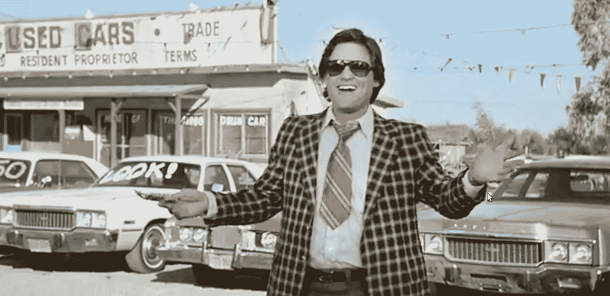
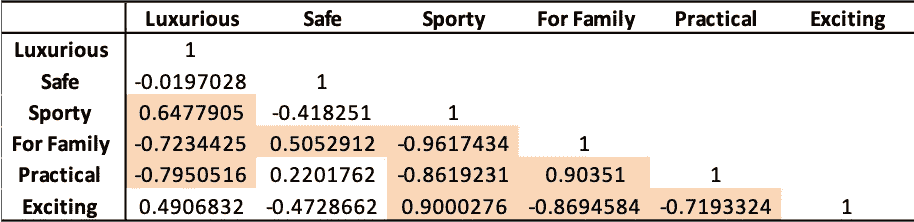
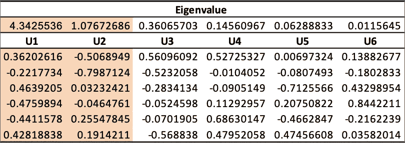
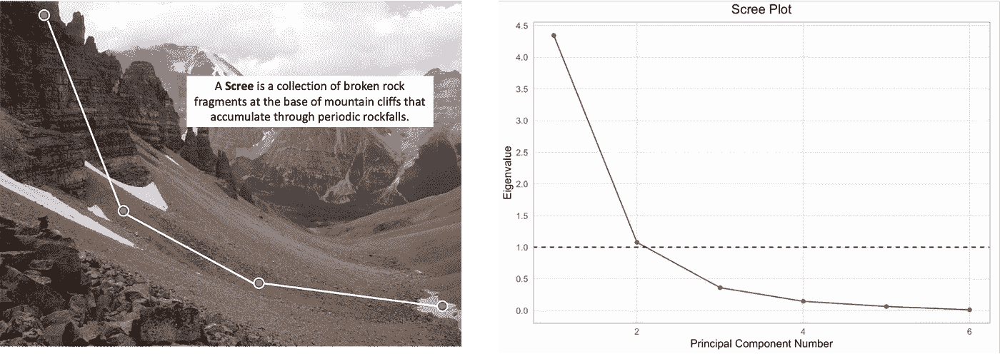
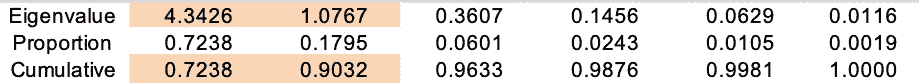
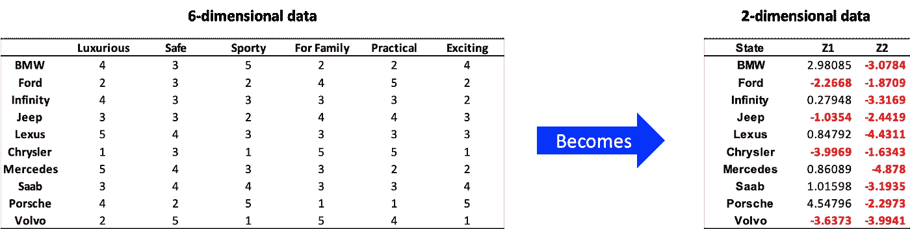
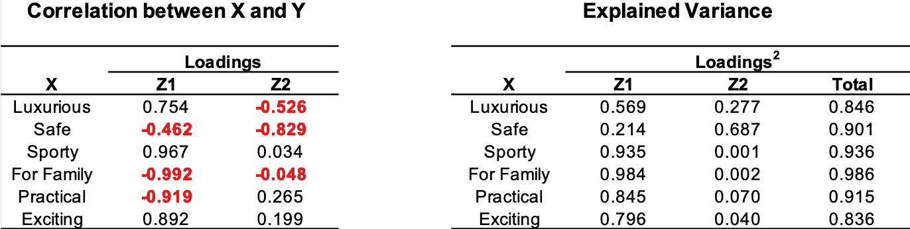
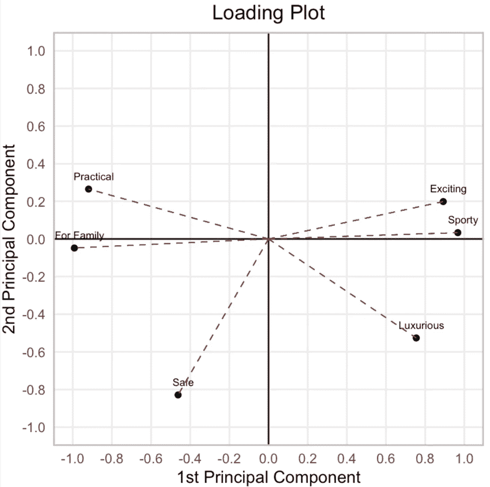
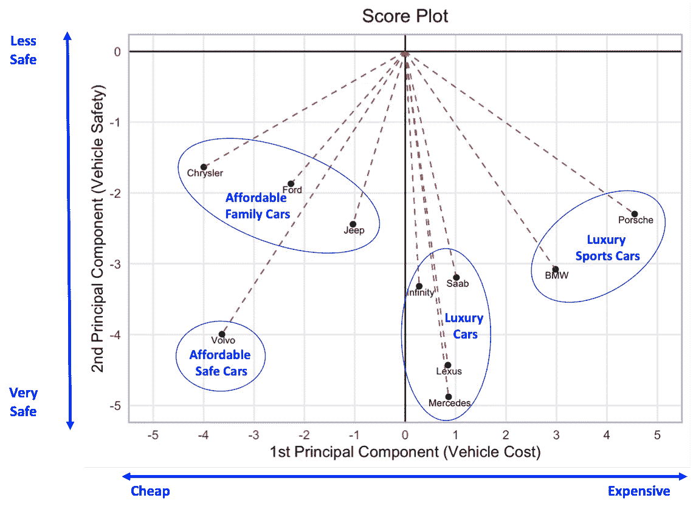

# 如何成为一名更好的二手车销售员

> 原文：<https://medium.com/analytics-vidhya/how-to-be-a-better-used-car-salesman-8dfc4c494581?source=collection_archive---------22----------------------->

## 数据分析

## 主成分分析的一个应用实例

在下面的文章中，我用一个出售二手车的假想例子来描述主成分分析(PCA)是如何工作的。一个完整的、可复制的 R 脚本也可以在 github 上找到。

想象一下，你是一名二手车销售员，在一家经销商处工作，该经销商提供多家制造商的汽车。您的代理商有大量选项可供选择，但每个客户都将寻找符合其品味、个性和预算的特定产品。你的生活依赖于帮助客户找到“正确的”汽车，但了解每辆汽车的具体特点是一个很大的问题。另一方面，对你来说，理解区分一个汽车品牌和另一个品牌的主要因素也许是合理的。

幸运的是，前台的 Bob 给了您一份电子表格，其中包含制造商在 6 个类别中的表现评级(注意:本例中使用的所有数据都是虚构的)。这看起来像是有用的数据，但是有些类别非常模糊，而且根据对它们的解释，似乎是多余的。例如,“适合家庭”评级的真正含义是什么？父母可能会认为“安全”是家用车的一个重要特征。其他预算紧张的家庭可能会认为低成本，“实用”的购买对家庭友好；或者，客户可能只是在寻找一辆有很多座位的宽敞汽车，比如小型货车，并将安全性和实用性视为完全不同的类别。

不同制造商的名义汽车评级

幸运的是，**相关性分析**提供了一种探索不同评级之间关系的手段。例如，下面的相关性矩阵显示“适合家庭”类别中的汽车评级与安全性(0.505)和实用性(0.903)评级有很强的正相关性。相比之下，“适合家庭”的评分与豪华(-0.723)、运动(-0.961)和刺激(-0.869)的评分有很强的负相关性。总的来说，相关矩阵揭示了我们正在处理高度相关的多元数据。

相关矩阵。突出显示的单元格用大于 0.5 的值标注相关系数。

这就是 PCA 派上用场的地方。PCA 提供了一种在不相关分量中重新表达高度相关的多元数据的方法，这些不相关分量捕获在较大数据集中表示的独立信息片段。

主成分(PCs)计算为多元数据的线性组合。我们通过执行相关矩阵的**特征分析**来确定线性组合的权重以及使用多少分量。根据一般经验，我们应该只使用特征值大于 1 的 PC。在下面的特征矩阵中，两个特征值大于 1。因此，我们将只使用列`U1`和`U2`中的特征向量来计算 PCs。

相关矩阵的特征值和向量。突出显示的单元格包含特征值大于 1 的特征向量。

确定保留多少个 PC 的另一个技术是检查特征值的 **scree plot** 。scree 图是一个线形图，在 y 轴上显示特征值，在 x 轴上显示 PC 数。碎石图被称为“碎石”图，因为它们看起来像碎石。

特征值的 Scree 图

通常，我们保留的 PC 数量应该比 scree 图的“弯头”少一个。或许，更恰当的说法是，“找到悬崖的底部，留住掉在悬崖表面的电脑”。不管我们想使用哪种类比，特征值的 scree 图表明我们应该保留 2 个 PC，因为“肘”或“悬崖底部”似乎位于第 3 个 PC。

我们也可以采用更精确的方法来分析特征矩阵。特征矩阵描述了 PCs 中捕获了多少信息。在这个例子中，下表表明前两个 PC 描述了原始 6 维数据的约 90.3%的变化，剩余的变化可归因于测量误差。

由主成分(PCs)解释的累积方差

接下来，我们通过将 6 维数据转换为 2 维数据来降低数据的维度。降维产生一个 PCs 矩阵( **Z** )，通过将原始数据( **X** )乘以特征向量矩阵( **U** )来计算。

从好的方面来看，转换后的变量现在相互不相关，约占总方差的 90.3%——(4.3526+1.076)/6 = 0.903。从负面来看，我们的旧变量标签不再有用，我们必须确定如何解释新变量。

从 6 维数据到 2 维数据的降维

为了确定 PCs 的新含义，检查 PCs 和原始变量之间的关系通常是有帮助的。**主成分载荷**指 PCs 和原始变量之间的相关性。我们通过将每个特征向量 *uᵢ* 乘以标量 *√λᵢ* (即第 I 个 PC 的标准偏差)来获得载荷(FF)。对负载矩阵求平方使我们能够确定每个 PC 捕获的原始数据的差异量。

根据荷载值表和两个 PC 荷载值图，第一个 PC 似乎是一个分类变量，它反映了车辆成本。安全、家庭、实用的车通常很便宜，出现在装载地块的左侧；然而，令人兴奋的、豪华的、运动型的汽车通常价格昂贵，出现在右侧。

第二个 PC 的解释在加载矩阵或图中不清楚。然而，解释差异表显示，第二台 PC 获得了安全评级 68.7%的差异，豪华评级 27.7%的差异，而在其余评级类别中几乎没有任何差异。因此，第二个 PC 似乎主要与安全相关，如果我们考虑安全与其他类别的关系，这是有道理的。令人兴奋的跑车不会像有很多安全功能(如四轮驱动)的车那样安全。同样，实际上，家用汽车会不太安全，因为额外的安全功能需要花钱。

基于我们的主成分分析，我们认为汽车选择可以归结为两个主要考虑因素，而不是六个:1)汽车的价格是多少？2)它有多安全？为了探索这一理论，我们可以检查 10 家制造商的 PC 值的**得分图**。

得分图似乎证实了我们关于如何解读 PCs 的直觉。奢侈品牌聚集在地块右侧；平价品牌集中在左边。沃尔沃远离其他可负担的安全选项是有意义的，因为沃尔沃的品牌身份是基于其安全的持久声誉。同样，雷克萨斯和奔驰在豪华车中往往有较高的安全评级。

既然我们已经充分讨论了 PCA 是如何工作的，让我们讨论一下为什么我们的 PCA 结果是有用的。PCA 使得向客户解释汽车选项的差异变得更加简单。例如，你应该问的第一个问题是:

**“您今天有兴趣看看豪华车吗？或者说，你今天的目标价格区间是多少？”**

如果客户说他们预算紧张，你可能应该先向他们展示沃尔沃、吉普、福特或克莱斯勒，或者你可以提到你的代理商提供的一年零年利率销售活动，看看他们是否想看看 Infinity 或 Saab。如果他们穿着西装，戴着劳力士，看起来很有钱，也许你应该先问:

“你是在寻找有趣刺激的东西，还是在恶劣天气下也能应付自如的东西？”

如果客户说他们想要一辆车来给人留下深刻印象，你可能应该先向他们展示一辆宝马或保时捷。当你拜访汽车经销商时，销售人员会问这类问题。当推销员形容一辆车是“运动型的”、“令人兴奋的”或“豪华的”时，言外之意是你会为它付更多的钱。PCA 看透了语义，识别出区分汽车选项的首要因素——你愿意花多少钱？