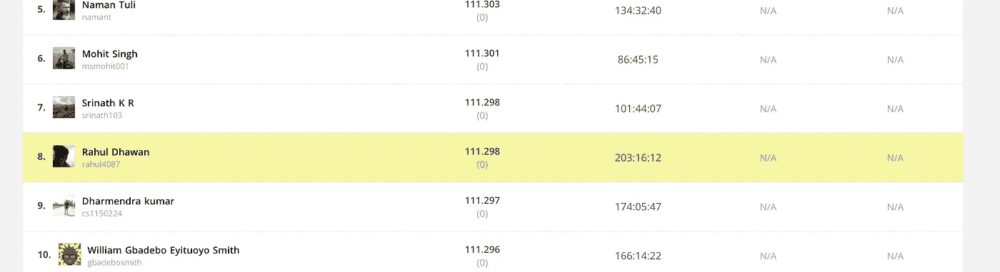

# 如何在机器学习/数据科学竞赛中成为英雄

> 原文：<https://medium.com/analytics-vidhya/how-to-be-a-hero-in-machine-learning-data-science-competitions-4ad28c440b42?source=collection_archive---------31----------------------->

目前，为了掌握机器学习模型，人们必须参加各种平台上出现的竞争。那么一个刚接触大联盟的人是如何从**零**变成**英雄**的呢？指南在这篇文章里。

这个想法并不太难。只需要耐心和一些努力。我举一个刚刚进入前 10 名的比赛的例子。所以竞争一般会给你一些隐藏特征的问题，因为他们希望你**探索数据**并得出解释目标值的特征。通过探索，我想说几件事:

1.  看数据。获得数据的意义。
2.  找出所有特征与目标值的相关性。
3.  尝试由现有功能组成的新功能。

探索也需要一些数据的清理。因为一般情况下，主机会将噪声添加到数据中，这样我们就很难获得良好的准确性。我说的清洁是指

1.  用 NaN 值交易。
2.  从训练中找出并移除异常值。

最重要的步骤之一是选择**功能用于训练**。为了选择特征，人们应该知道相关性以及如何产生非常有影响力的新特征。这些特征可以是一些特征的平均值、通过添加一些特征而得到的结果等。人们可以从很多方面来看待这个问题。

然后，最后但并非最不重要的部分是选择模型。选择模型并不意味着只是选择某个模型并训练它。但是最重要的部分是用一些好的参数值来训练模型。因为我看到在参数上的一点小调整会让你达到很高的精度。

对于初学者:
1-开始学习数学和统计学的概念。
2-学习 R 或 Python 的数据科学编程工具。
3-学习机器学习算法(第一部分)

下面是上一个列表的资源:
来自 Udacity 的描述性统计:[https://www . uda city . com/course/Intro-to-Descriptive-Statistics-ud 827](https://www.udacity.com/course/intro-to-descriptive-statistics--ud827)
一本好的统计学书籍(可选):【http://onlinestatbook.com/2/index.html】
来自 EDx 的概率课程介绍:[https://www . EDx . org/course/Introduction-Probability-science-mitx-6-041 x-2](https://www.edx.org/course/introduction-probability-science-mitx-6-041x-2)
概率书介绍:[https://www.stat.berkeley.edu/~aldous/134/grinstead.pdf](https://www.stat.berkeley.edu/~aldous/134/grinstead.pdf)

对于专业人士:
1-学习深度学习的概念，建立至少一个项目。
2-学习数据可视化

# 推荐资源

*   文档！熊猫和 [Scikit-Learn](http://scikit-learn.org/stable/documentation.html) 都有大量的文档和许多有趣的讨论。
*   想了解更多关于 Kaggle 成功故事的信息，我推荐 [Kaggle 博客](http://blog.kaggle.com/)，在那里他们经常采访竞赛获胜者，询问他们的方法和途径。
*   对于数据帧的详细概要，我推荐查看[熊猫-概要](https://github.com/mouradmourafiq/pandas-summary)和[熊猫-概要](https://github.com/pandas-profiling/pandas-profiling)。
*   为了更好地解释更高级的随机森林用法，我推荐[对随机森林的直观解释](https://towardsdatascience.com/intuitive-interpretation-of-random-forest-2238687cae45)。
*   所有相关的 Reddit:[r/machine learning](https://www.reddit.com/r/MachineLearning/)， [r/learnmachinelearning](https://www.reddit.com/r/learnmachinelearning/) ， [r/datascience](https://www.reddit.com/r/datascience/) 。

下面是我遵循这些步骤后所取得的结果。

希望这些程序能帮到你。如果这对你有所帮助，让我鼓掌。