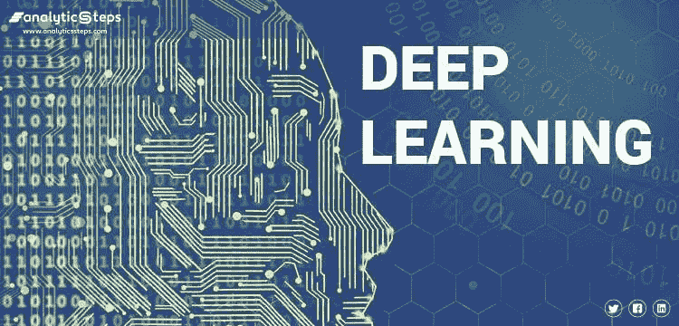

# 如何从零开始成为一名优秀的数据科学家

> 原文：<https://medium.com/analytics-vidhya/how-to-become-a-excellent-data-scientist-from-scratch-4f8e9ef718a4?source=collection_archive---------25----------------------->

在这篇文章中，我将讲述从**白手起家**成为一名优秀的**数据科学家**的完整过程，所以让我们开始吧

你首先要学的是**python****数据科学的基础编程语言**你也可以选择 **R** 。

python 和 R

完成 python 后，学习 python 的各种库，如 **Numpy** 、 **pandas、**、 **seaborn** 、 **Matplotlib。**

然后开始学习**机器学习** **算法**，并以这样一种方式学习，你可以深入了解背后的**数学**，因为在面试中他们会简单地问**机器学习算法背后的**数学**。**

机器学习算法

不要先学习每一个**数学**然后再学习 **ml 算法**它对你没有帮助总是使用**逆向工程**去或选择任何 **ml 算法**然后深入其中并在 **ml 算法**的帮助下学习**数学**，这将真正对你有帮助，因为你在实现的帮助下学习数学或 **Algo** 。

数学

然后学习**统计学**，了解如何在**中使用 ml 算法。**

统计数字

完成这些步骤后，遵循**数据科学**生命周期，在现实世界中**数据科学项目**是如何工作的:

1.**数据采集** 2。**数据清洗**
3。**数据预处理**
4。**探索性数据分析**
5。**特色工程**
6。**特征选择**7
。**模型建筑**
8。**车型部署**

这些是**数据科学项目**生命周期的步骤 u 可以使用这个生命周期来构建任何复杂的**数据科学项目**。

在了解了**生命周期**之后，如果你完成了**机器学习算法，那么就来学习部分学习**深度学习**技术。**

深度学习

然后根据你对哪个领域感兴趣的选择去学 **NLP** 或者**计算机视觉**。

开始建立一些基于学习的**小项目**假设你学习**机器学习算法**比建立一些与**机器学习**相关的**小项目**这将帮助你对学习有更强的把握。

然后在构建一些**小项目**之后，是时候构建**端到端项目**了。
构建端到端项目所需的知识。

* *学习 **python web 框架**工作**烧瓶。** * *学点**基础前端。**
**基本**部署技术**在各种平台上，如 **AWS、AZURE、HEROUKU、GCP。**
* *然后尝试**在这个平台上部署**你的**模型**

现在你对数据科学项目如何运作有了一个概念

1.  现在你学会了基本的**可视化**或**仪表板工具**如 **Tableau、**power bi 基于你的选择，这将帮助你以**仪表板的形式可视化你的数据或许多其他数据。**
2.  参加一些**游戏**比赛**来磨练你的技能。**
3.  学习任何数据库，比如 SQL 或 NOSQL，这是你的选择。
4.  然后带着充分的准备去应聘**数据科学岗位**。

希望这篇小文章对你有帮助。祝你好运！