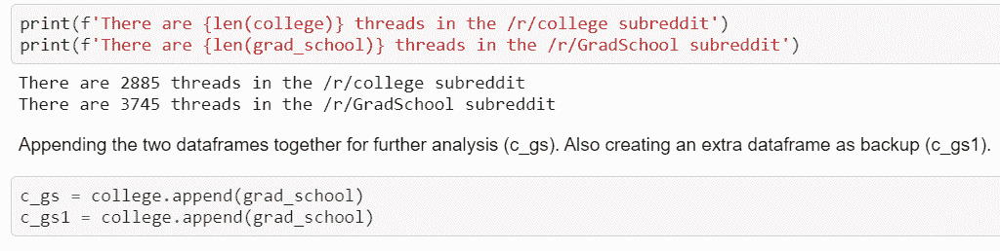
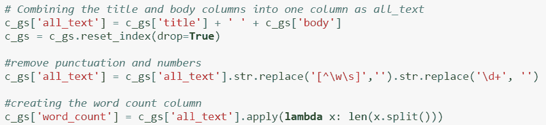
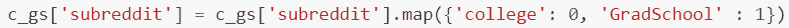
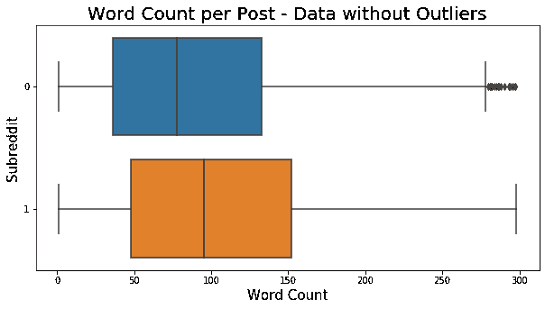
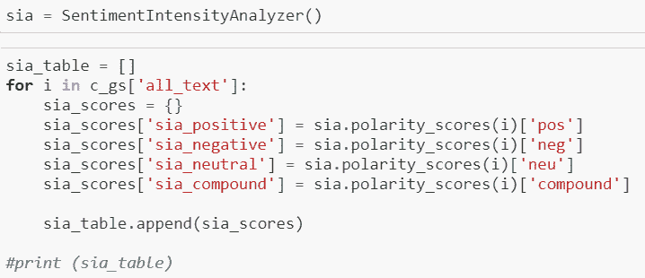
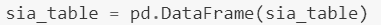
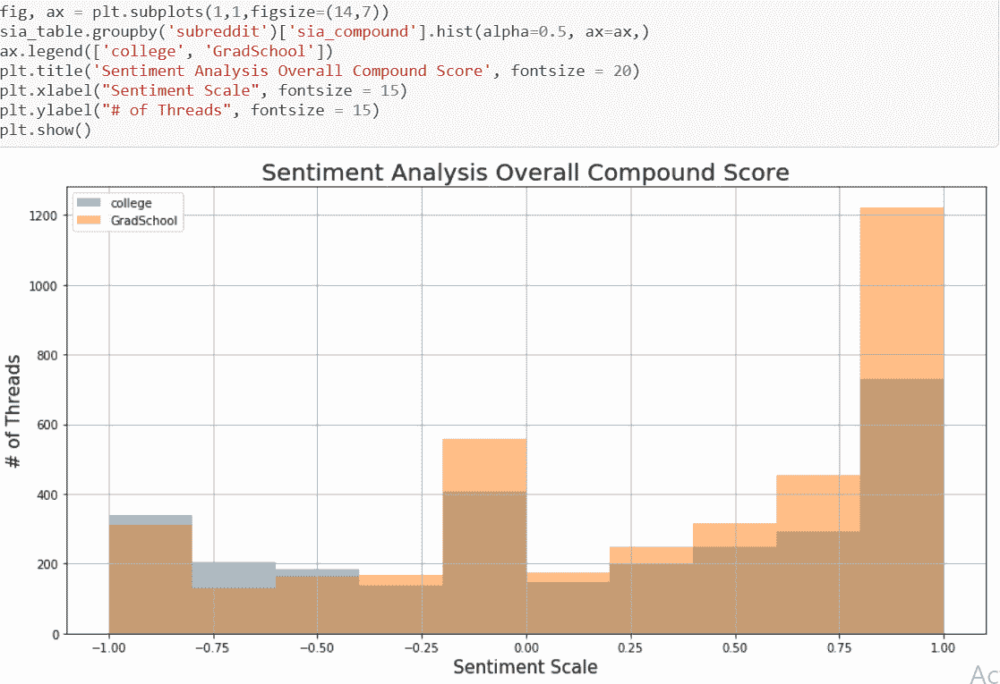
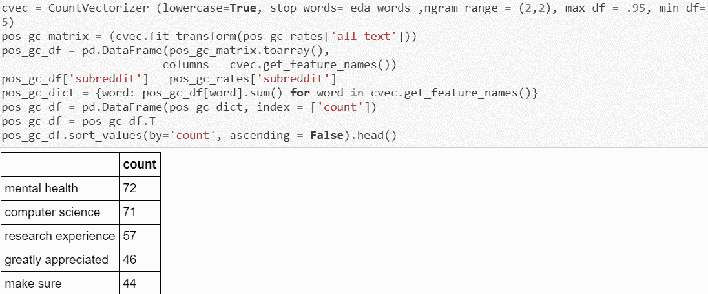
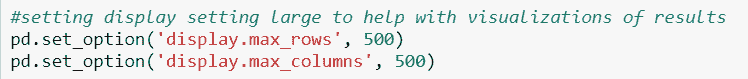

# 如何开始在 NLP 上执行 EDA

> 原文：<https://medium.com/analytics-vidhya/how-to-begin-performing-eda-on-nlp-ffdef92bedf6?source=collection_archive---------8----------------------->

我越来越喜欢 NLP 调查了。自然语言处理汇集了我对定量和定性分析的热爱。

在这个项目中，我的目标是创建一个能够识别哪个线程来自哪个子线程的模型。我选择的两个子编辑是**/r/学院**和**/r/研究生院**子编辑。这两个子主题在主题上非常接近，有相似的语言用法。使用 EDA 进行调查将对我如何构建模型起到关键作用。本文将解释一个简单的 EDA 过程，它可以用于任何处理 NLP 的 python 项目。

# **确定你的目标班级**

在搜集/收集了你所有的数据之后。导入 csv 并检查数据框的形状非常重要。你想要了解你正在分类的主题的比例。在这种情况下，我的实验对象大约是 43/57 的比例。在比较这两个类的可视化效果时，记住这一点很重要。

执行 EDA 时，我会制作一个额外的数据帧作为备份。我曾经想参考回一个干净的文本数据帧，不包含任何特征工程的副本将是可用的。我在 EDA 过程中采取的每一步都会添加到 c_gs 数据帧中。这样我就不会忘记我创建的任何额外的调查。这在我开始建模阶段时也很有帮助，因为我将有更多的功能可以使用。

# **特色工程**

对于子编辑，有时标题列中只有文本，而正文列中没有。最好将该线程的所有文本合并到一个列中，以便我可以最好地执行 EDA。

接下来，我编写了一行简单的代码，它将删除 c_gs[all_text]列中包含的所有点和数字。为了制作字数统计列，我对 all_text 列应用了一个 lambda 函数，该列在每个空格处拆分。

为了参考即将出现的图表，我将 subreddit 线程中的主题更改为二进制值。

根据你的文本数据，从可视化你的文本数据中尽可能多的重要数字开始。下面是去除了我的数据中的异常值后的字数图表。

可以使用文本数据可视化的其他类型的要素有

*   字符计数
*   字符或单词在每个主题中出现的次数
*   对于 Twitter 数据:一条推文中的转发量、收藏量和提及量
*   对于 Reddit 数据:每个线程的投票数
*   情感分析

# **情绪分析。**

nltk 库有一个情感库。这个*可以从 nltk . petition . Vader 导入 SentimentIntensityAnalyzer。*导入后，一定要实例化库。

在我的 Reddit 项目中，我使用了一个函数来抓取我的 all_text 列，并评估正面、负面、中性和复合得分。这个函数将这个分数放在一个列表中，我将这个列表转换成一个数据帧。

我用情感分数做了一个单独的表格。这是出于教育目的的个人偏好。在我创建了我的情感分数数据框架之后，我用一个重叠的直方图可视化了两个子记录的复合分数。*注意:* *虽然我为情感分数做了一个额外的数据框架，但我仍然采取额外的步骤将这些情感分数添加到主 c_gs 数据框架中。*

在这个直方图中，重要的是要记住我有不均匀的目标类。这就是为什么 r/grad school 占据了图形的大部分。然而，/r/GradSchool 线程的传播在复合传播的正端比负端占据更多的传播。尽管只占数据的 43 %,/ r/College threads 情绪得分在情绪得分图的负侧占据了稍多的量。

基于这个 nltk 库，这个图表向我展示了大多数/r/Gradschool 的帖子大多是正面的。让我们进一步研究这些积极和消极的线索。

# **识别文本数据中的常用术语**

在面向自然语言处理的 EDA 中，最重要的一步是识别数据集中的常用术语。在这种情况下，当调查我的数据集中使用的常用术语时，我合并了情感得分。

下一段将解释我是如何使用复合情感分数来调查常用词的。如果这不适用于你，跳到下一段。使用情感分数。对于这个例子，我创建了一个名为 pos_gs_rates 的额外数据帧，它包含复合情绪得分/r/gradschord sub Reddit 大于 0.6 的线程。对于复合情绪得分低于-0.6 的线程也是如此。

在研究这些术语时，实例化一个你希望的文本转换器。我使用了 sklearn.feature_extraction 库中的 CountVectorizer。另一个流行的转换器是 TfidfVectorizer。在用您喜欢的参数实例化您的矢量器之后。您可以采取以下步骤来获取常见的二元模型。要更改要搜索的术语的长度，请编辑 ngram_range 参数。

像“非常感谢”和“确保”这样的术语表明，在/r/GradSchool 子编辑中的用户很可能在他们的帖子中表达他们自己，并且很可能从其他用户那里寻求输入和建议。我们可以推断，当谈到研究生院时，“心理健康”并不总是以最积极的方式使用。然而，这些积极测量的帖子可能是用户为他们的心理健康寻求积极的建议。

要了解更多关于我对这两个子主题的研究，请查看我的 github 项目:[https://github.com/briannalytle/reddit_nlp.git](https://github.com/briannalytle/reddit_nlp.git)

# **其他备注:**

*   如果我想深入研究 NLP。我必须选择在 text 列上执行所有这些操作，而不仅仅是在 all_text 列上。
*   标记化、词汇化和波特词干化是对文本数据进行研究的一些方法。
*   潜在狄利克雷分配(LDA)是 sklearn.decomposition 库中的另一个库，它有助于识别文本数据中的常见主题。阅读这篇文章，了解关于[LDA 如何在这里工作的介绍](/@lettier/how-does-lda-work-ill-explain-using-emoji-108abf40fa7d)。
*   在 seaborn 库中，catplots 对于可视化不同类上两个测量值的相关性非常有用。
*   如果您想显示最大行数，请使用以下代码。我在 NLP 中使用它，因为它有助于在数据帧中可视化结果。

