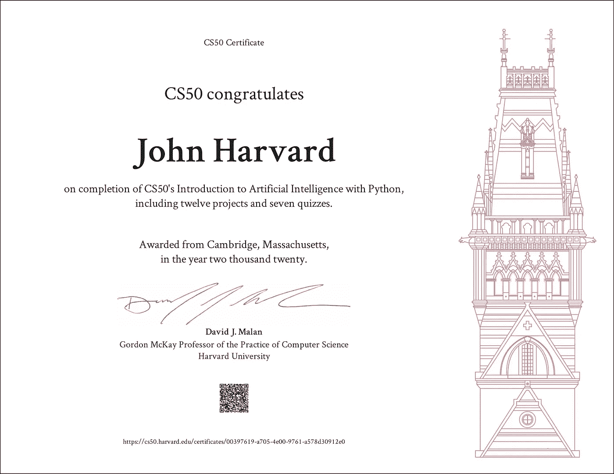
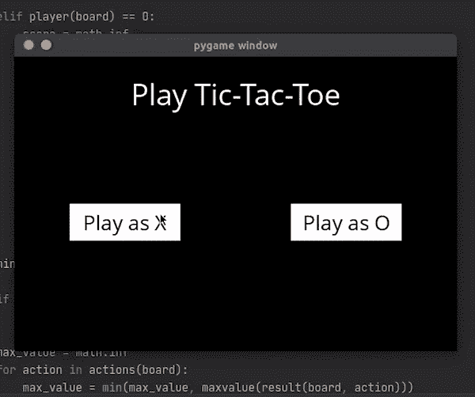
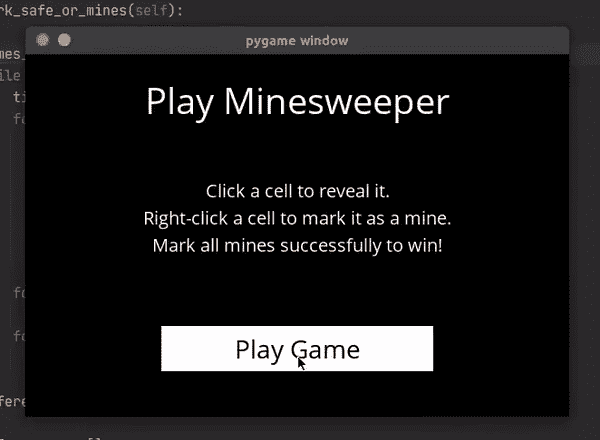

# 如何闯入 AI？哈佛 CS50AI:人工智能导论课程回顾

> 原文：<https://medium.com/analytics-vidhya/how-to-break-into-ai-harvard-cs50ai-introduction-to-artificial-intelligence-course-review-fe14b78e6575?source=collection_archive---------1----------------------->

由大卫·特拉维斯在 [Unsplash](https://unsplash.com/photos/5bYxXawHOQg) 上发表

如果你正在阅读这篇文章，你可能正在寻找进入人工智能领域的大门。我很高兴地告诉你，你已经找到了。CS50AI 是 [edX](https://www.edx.org/professional-certificate/harvardx-computer-science-for-artifical-intelligence) 上与 CS50 配对的专业证书项目的一部分，它是一个很好的资源，带你了解可用的 AI 主题。

我向任何想尝试这个领域的人推荐这门课程，看看你是否会喜欢。该课程从基本算法开始，如广度优先搜索，并以机器学习和深度学习等综合概念结束。

[CS50AI](https://cs50.harvard.edu/ai/2020/certificate/) 证书

开始之前，我们先回答一些基本问题。

**多久？7 周(每周一次讲座)**

**多少努力？每周 10-30 小时(30 小时更合适)**

**多少钱？200 美元购买一个经过验证的 edX 证书(阅读到最后，了解如何获得免费证书的提示)**

我在一周前完成了这个项目，但我是在 9 月初开始的(这意味着我作为一名全职学生和兼职员工花了 15 周的时间来完成)。请做好相应的计划，因为 CS50AI 不是有简单测验的常规课程。它非常面向项目。它期望你多走一步。

尽管这门课程与 CS50:计算机科学导论有关，但在开始之前，你肯定需要更好地掌握 Python 和数据结构&算法。了解 Python 中的各种数据结构至关重要。课程从来不会教你使用 Python 字典、集合等。这门课的 Python 先决条件非常真实。

> CS50AI 只能由完成 [CS50x](https://cs50.harvard.edu/x/2020) 或同等作业的人员完成；它确实假设了一些背景。学生们也可能从一些额外的 Python 经验中受益，无论是从 [CS50W](https://cs50.harvard.edu/web/2020) 还是其他类似的经验中。— [CS50AI](https://cs50.harvard.edu/ai/2020/faqs/)

作为初学者，为什么这门课程对你的职业生涯有用？因为它是从人工智能的基础开始的。你不能在走之前跑，这就是为什么 CS50AI 的第 0 周致力于基础算法，如广度优先搜索，贪婪最佳优先搜索和极大极小搜索。

你大概想直接跳到**机器学习**，在[第 4 周](https://cs50.harvard.edu/ai/2020/weeks/4/)，但是在那之前还有一些必要的基础题目，比如**命题逻辑**(第 1 周)**概率**(第 2 周)**优化**(第 3 周)。你放心，在做机器学习之前先学那些题目，你的旅程会更顺利。

现在，我们来谈谈利弊。

# CS50AI 很全面

正如我已经提到的，CS50AI 从必要的基本主题开始，这将使你成为一个更精通人工智能的人。在**四**周的时间里，在介绍机器学习和深度学习的概念之前，[余腾渤](https://brianyu.me/)教授了基本的算法和概念，作为后面讲座的基础。通过一开始就把事情说清楚，这门课程为你的未来打下了坚实的基础。

在这四周内，你将完成以下项目:

1.  在 IMDb 数据库**上应用广度优先搜索算法来寻找两个演员之间的最短连接**。
2.  使用极大极小决策规则**来构建一个在井字游戏中永不失败的人工智能**。

来自我的 [GitHub](https://github.com/dtemir/harvard-CS50AI) 回购的演示 Gif

3.用命题逻辑表示知识**构建一个最优玩扫雷的 AI**。

来自我的 GitHub 回购的演示 Gif

4.模拟谷歌搜索算法、 [PageRank](https://en.wikipedia.org/wiki/PageRank) 的**基础版。**

5.和许多其他项目。

# CS50AI 具有挑战性

在课程的最后三周，Brian 将向您介绍主导该领域的尖端技术。这些是:

1.  **机器学习，**有监督学习、无监督学习、强化学习的概念。你将实际上建立一个基于 **Q-learning** 的**强化学习模型**，它将训练 AI 玩 [**Nim**](https://en.wikipedia.org/wiki/Nim) 的游戏。这是一个勇敢的步骤，包括一个关于强化学习的作业，因为它对初学者不友好，但相信我，这将是你第一次可能会想，“人工智能还活着吗？”
2.  **深度学习**，有神经网络、计算机视觉、卷积神经网络的概念。CS50AI 将为您介绍圣杯， **TensorFlow** 。在第 5 周的[结束时，您将使用提供的数据集、 **TensorFlow** 和 **Open-CV** 构建一个路标识别项目。您将获得这些令人敬畏的框架的实践经验，这是一种享受。](https://cs50.harvard.edu/ai/2020/weeks/5/)
3.  **自然语言处理**，使用上下文无关语法、马尔可夫模型和朴素贝叶斯的概念。有没有想过亚马逊 Alexa 如何理解你的命令，如何回应你的问题，比如“伯尼·桑德斯多大了？”你会学到的。第六周的项目之一是建立一个系统，使用一个流行的库，NLTK 来回答你的问题。

# CS50AI 无处不在

就像它的哥哥 CS50 一样，该课程在各地都有社区。Discord，Quora，Twitter，脸书，应有尽有。如果你遇到困难，这些社区中的任何一个都会帮你。如果您在安装 Python 库、理解赋值或调试时遇到问题，总有人可以询问。

这导致了选修这门课的弊端。

# **CS50AI 长**

你可能会有一个自然的问题，如果有这么多具有挑战性的项目，他们如何检查我的工作？不幸的是，由于事情的复杂性，项目都是**人工评估**。一旦你完成了你的项目，你必须记录它的功能，上传到 YouTube，填写另一个谷歌表格，然后等待。需要多长时间才能获得成绩？

> …我们有你的表格，会在三周内评分。— [CS50AI](https://cs50.harvard.edu/ai/2020/faqs/)

是的，另一个人必须检查你的代码，看看它是否正常运行，这对于 MOOC 来说很不寻常。好的一面是，如果你的提交没有通过，检查你的工作的人会提供一些有用的反馈。

等待三周分数的到来并不是一件容易的事情。尤其是如果你在学习完本周的分数后才能开始下一周的学习，但是等待是值得的。

# **CS50AI 没那么好玩**

如果你看过《CS50 2019》和[大卫·马兰](https://cs.harvard.edu/malan/)，你就知道它有多好玩了。看着哈佛学生参与活动会让你觉得你是教室的一部分。

CS50AI 就不是这样了。在他们录制视频的时候，疫情可能已经开始了，所以只有布莱恩你会看到整个系列。他不开玩笑(尽管看起来还是很有趣)。

# 动手吧！

既然提到了课程的好与坏，我只能说:“开始上吧。”我想我从来没有见过一门课程会带你跨越人工智能的所有主题，并让你在每一个方面都获得实践经验。CS50AI 将带您了解 trending **Python** 领域内的**机器学习、深度学习、自然语言处理**的基础知识，以及像 **TensorFlow** 、 **Open-CV** 、 **scikit-learn** 和 **NLTK** 这样的库。

 [## CS50 用 Python 介绍人工智能

### 人工智能正在改变我们的生活、工作和娱乐方式。通过启用自动驾驶汽车和推荐等新技术…

www.edx.org](https://www.edx.org/course/cs50s-introduction-to-artificial-intelligence-with-python) 

快速提示:你根本不需要为 edX 认证证书付费。CS50AI 将在完成所有作业后为您提供一份。他们的证书看起来就像开头的那个，你可以在 LinkedIn 上分享。

# 课程结束后做什么？

如果你对机器学习感兴趣，可以参加吴恩达在 Coursera 上的机器学习课程。

 [## 机器学习

### 机器学习是让计算机在没有明确编程的情况下行动的科学。在过去的十年里…

www.coursera.org](https://www.coursera.org/learn/machine-learning) 

否则，如果你对更面向商业的数据使用感兴趣，可以上 IBM 在 Coursera 上的数据科学课程。

 [## IBM 数据科学

### 由 IBM 提供。数据科学是十年来最热门的职业之一，对数据科学家的需求…

www.coursera.org](https://www.coursera.org/professional-certificates/ibm-data-science)