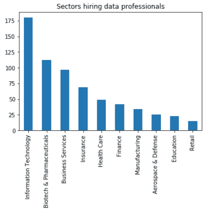
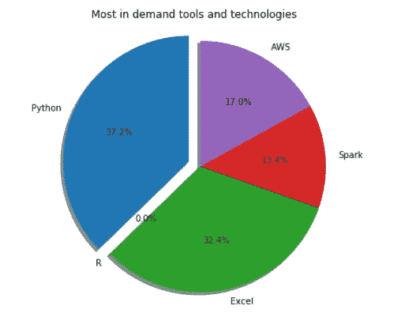
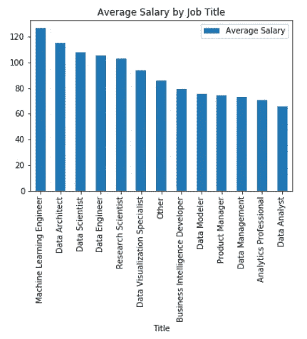

# 如何打入数据科学领域

> 原文：<https://medium.com/analytics-vidhya/how-to-break-into-the-field-of-data-science-80eb8d8bd45e?source=collection_archive---------34----------------------->

米利安·耶西耶在 [Unsplash](https://unsplash.com?utm_source=medium&utm_medium=referral) 上拍摄的照片

**简介**

作为近年来最令人兴奋的领域之一，许多人都在寻找进入数据科学和机器学习的正确途径。使用数据驱动的方法，我决定更深入地挖掘，找出最常见问题的答案。我分析了从 Glassdoor 获得的数据，以回答以下 3 个问题:

1.  **雇佣数据专业人员的顶级行业有哪些**

为了回答我的问题，我将数据按部门进行了分组，并可视化了为数据专业人员发布职位的前 10 个部门。

结果与我的预期相符，信息技术领域是最需要数据专业人员的领域。

**2。学习什么工具最重要**

另一个有很多争论的问题是，你应该学习哪些工具来获得数据工作。许多人正在学习数十种新工具和技术，以跟上该领域的快速发展。

我决定通过添加一个新功能来对高级职位的招聘信息进行分类。后来，我制作了一个饼状图，看看哪种技术只对高级职位最有需求。

上面的图表向我们展示了 Python 编程语言知识是高级职位最需要的技能。第二个顶级技能是 Excel，现在许多人低估了它作为分析数据的强大工具。

**3。哪个数据角色工资最高**

最后，我想知道数据科学领域的哪个职位工资最高。为了更深入地了解这一点，我将招聘信息按照统一的职称命名惯例进行了分类，并将我的发现用条形图表示出来。

在这里，我们可以看到机器学习工程师、数据架构师和数据科学家是市场上薪酬最高的数据专业人士。

**结论**

在本文中，我们仔细查看了 Glassdoor 招聘数据科学专业人员的招聘信息。

1.  我们了解到，信息技术、生物技术和制药以及商业服务是招聘最多的行业。
2.  我们研究了在这个领域找到工作最需要的不同工具和技术。这表明 Python 是最需要的语言，我们还了解到，即使最近出现了所有新工具，Excel 仍然是相关的。
3.  最后，我们研究了收入最高的职位。我们发现机器学习工程师是薪酬最高的专业人士。而数据架构师和数据科学家紧随其后。

要查看更多关于这个分析的内容，可以点击这里的链接。