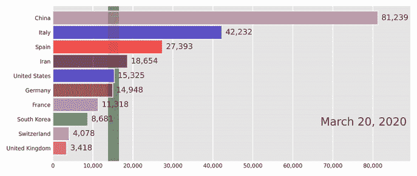
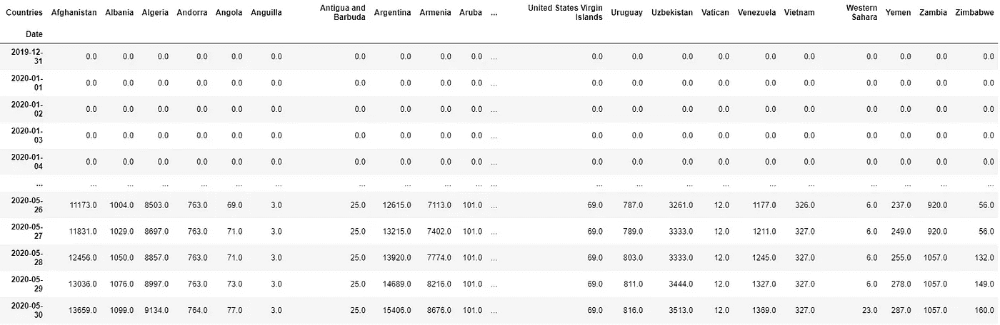
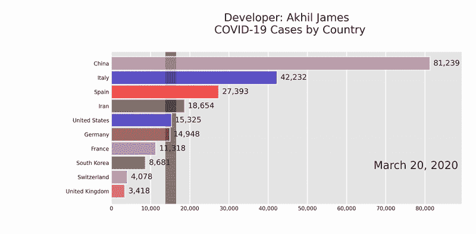

# 如何在 5 分钟内建立条形图比赛！

> 原文：<https://medium.com/analytics-vidhya/how-to-build-a-bar-chart-race-in-under-5-minutes-e4a00e0e01d6?source=collection_archive---------30----------------------->

条形图比赛是一种视觉盛宴。不仅仅是视觉效果让它被广泛接受，还有他们与观众交流的效果。我们大多数人都在循环中看过我们最喜欢的条形图比赛(我的例子是 python 如何在编程语言图表中飞速上升)，并想知道如何构建它们来为我们未来的项目提供视觉吸引力。

最近，我遇到了一个很棒的 python 包，名为“[条形图竞赛](https://github.com/dexplo/bar_chart_race/)，它使用 pandas 数据框在几分钟内构建可视化效果。关于如何安装和使用这个软件包的说明可以在软件包的 [GitHub](https://github.com/dexplo/bar_chart_race/) 页面找到。您在上面看到的新冠肺炎案例的可视化是使用条形图 race 和从 ourworldindata.org[获取的数据生成的。](https://ourworldindata.org/coronavirus-data)

## 熊猫数据帧格式

条形图竞赛要求熊猫数据框采用特定的格式。下面显示了一个图示，其中行代表日期，列代表迄今为止报告新冠肺炎病例总数的国家。

熊猫数据框所需的格式

条形图 race 期望 pandas 数据框中的行描述单个时间段，每列代表一个特定类别并保存其值。关于数据帧格式要求的更多细节可以在[dexplo.org/bar_chart_race](https://www.dexplo.org/bar_chart_race/)中找到。在生成条形图竞赛之前，请确保您的数据框是干净的，没有空值，并且每一行和每一列都是预期的数据类型。

## 生成条形图竞赛

一旦有了所需格式的数据框，只需将它传递给带有所需参数的 bar_chart_race 函数。可用参数列表及其详细信息可在 [api 参考](https://www.dexplo.org/bar_chart_race/api/)中找到。你可以自由地保存不同格式的输出文件，如 mp4，gif，html，mpeg，mov 等。在[示例](https://www.dexplo.org/bar_chart_race/)下列出了一些可视化及其代码。

按国家分列的新冠肺炎病例

上面显示的用于创建新冠肺炎条形图比赛的数据集和 jupyter 笔记本可以在下面列出的 GitHub 存储库中找到。部分代码是从[条形图比赛](https://github.com/dexplo/bar_chart_race/)的 GitHub 页面复制过来的。

 [## aj7 amigo/条形图-Race - COVID19

### 为报告的 COVID19 病例总数创建条形图竞赛。-aj7 amigo/条形图-Race - COVID19

github.com](https://github.com/aj7amigo/Bar-Chart-Race---COVID19) 

感谢您抽出时间阅读这篇文章。非常欢迎您的反馈。

**谢谢**