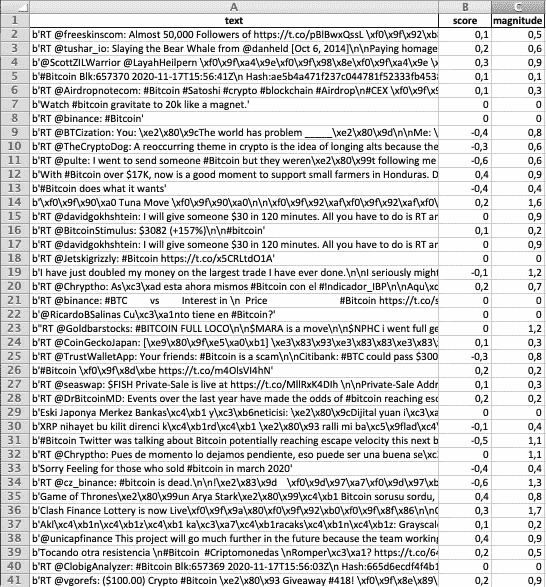

# 如何使用 Python 和 Twitter 构建比特币情绪分析

> 原文：<https://medium.com/analytics-vidhya/how-to-build-a-bitcoin-sentiment-analysis-using-python-and-twitter-beb89e6ce0c8?source=collection_archive---------3----------------------->

情绪分析现在是一种趋势，事实上，已经有几个产品在分析一个或多个社交媒体，以获得对某项金融资产的情绪。这些模型有些是有效的，有些则不那么有效。


## 为什么要创建自己的情感分析？

关键是，在其他人制作的通用模型中，我们通常找不到我们需要的细节，而且它们也没有足够的可塑性来满足我们的需求。

由于创建一个情绪分析所需的资源是完全免费的，所以我想到了创建一个简短的 DIY 指南，让每个人都可以选择如何实现自己的分析，并从中汲取灵感。

## 先决条件

为了让 Python 脚本正确运行，您需要订阅一些资源并安装一些库。此外，我下面要列出的资源已经安装在装有 Python 3.9 的 mac 上，所以如果您使用不同的机器或环境，结果可能需要稍加调整。在任何情况下，对于任何障碍，总有“神圣之水”来帮助我们。

*   Python 3 安装了以下库:
*   Tweepy ( `pip install tweepy`
*   谷歌 Clound 语言(`pip install — upgrade google-cloud-language`)
*   熊猫(`pip install pandas openpyxl`)
*   Twitter 开发订阅和相关 Oauth 凭证
*   NLP 库的 Google Cloud 订阅和相关 Oauth 凭据

一旦安装了这些库，您就可以在代码的第一部分导入它们:

```
import tweepy
import os
from google.cloud import language_v1
import pandas as pd
```

## 从 Twitter 抓取

Twitter 有一个公共 API，可以基于 JSON 格式的搜索返回 tweets。我们感兴趣的是关于比特币的信息，所以我们将按照下面的代码对**#比特币**进行搜索。在任何情况下，简单地通过添加另一枚硬币或其他相关标签(例如 **#BTC** )来修改这个脚本将允许您扩展或改进搜索。

更改访问令牌后(`insert-your-twitter-access-token-here`

您可以修改搜索参数，以确定每次搜索检索多少条推文以及最大推文数量(分别为`tweetsPerQry`和`maxTweets`)。我强烈建议做一些测试查询来检查结果，看看推文是否相关。

可以对代码进行的其他更改旨在优化推文，例如通过消除转发。看看 Tweepy API，了解可用的选项。

从这里，我只提取推文的文本，并把它们放在一个列表中(`listposts`)，然后由 Google NLP 进行实际分析。

```
consumer_key = 'insert-your-twitter-access-token-here'
consumer_secret = 'insert-your-twitter-access-token-here'
access_token = 'insert-your-twitter-access-token-here'
access_token_secret = 'insert-your-twitter-access-token-here'

tweetsPerQry = 100
maxTweets = 100
hashtag = "#Bitcoin"

authentication = tweepy.OAuthHandler(consumer_key, consumer_secret)
authentication.set_access_token(access_token, access_token_secret)
api = tweepy.API(authentication, wait_on_rate_limit=True, wait_on_rate_limit_notify=True)
maxId = -1
tweetCount = 0
listposts = []
while tweetCount < maxTweets:
	if(maxId <= 0):
		newTweets = api.search(q=hashtag, count=tweetsPerQry, result_type="recent", tweet_mode="extended")
	else:
		newTweets = api.search(q=hashtag, count=tweetsPerQry, max_id=str(maxId - 1), result_type="recent", tweet_mode="extended")

if not newTweets:
		print("Tweet Habis")
		break

	for tweet in newTweets:
		d={}
		d["text"] = tweet.full_text.encode('utf-8')
		print (d["text"])
		listposts.append(d)

	tweetCount += len(newTweets)	
	maxId = newTweets[-1].id
print (listposts)
```

这里可以找到我用的 Twitter 抓取脚本:[**https://gist . github . com/DeaVenditama/40 ed 30 CB 4 BC 793 ab 1764 fc 3105258 D8 a**](https://gist.github.com/DeaVenditama/40ed30cb4bc793ab1764fc3105258d8a)

## 把推文交给谷歌自然语言处理

Google NLP 是我们将用来对从 Twitter 中提取的文本进行自然语言处理的库。我选择尝试这一个，因为我在过去已经尝试过其他的不太能说服我。鉴于很难用几句话来理解情绪，我发现这个谷歌图书馆非常详细，因为它提供了两个衡量标准:**得分**和**量级**。

特别地，**分数**对应于文本的总体情感倾向，其可以是积极的、消极的或中性的，并且具有可以从-1 到 1 变化的值(-1 表示消极，0 表示中性，1 表示积极)。
的**量级**反而表示得分的强弱。换句话说，情绪的强度。趋向于 0 的值表示低强度，而趋向于 2 的值表示高情感强度。

在启动脚本之前，您需要有一个 Google Cloud 帐户，并按照这个 URL([https://Cloud . Google . com/natural-language/docs/reference/libraries # Cloud-console](https://cloud.google.com/natural-language/docs/reference/libraries#cloud-console))上的步骤安装必要的库，并下载包含身份验证凭据的 JSON 文件。一旦你把文件下载到你的机器上，你必须输入文件的完整路径来代替(`insert-the-path-to-your-json-key-here`)

在这部分代码中，我们什么也不做，只是滚动之前获得的 tweet 列表，并调用分析情绪的 Google NLP 函数，为每个 tweet 返回一对值( **score** ， **magnitude** )。

```
os.environ['GOOGLE_APPLICATION_CREDENTIALS'] = "insert-the-path-to-your-json-key-here"
client = language_v1.LanguageServiceClient()

for x in range (len(listposts)):

    try:

        document = language_v1.Document(content=listposts[x]["text"], type_=language_v1.Document.Type.PLAIN_TEXT)
        sentiment = client.analyze_sentiment(document=document).document_sentiment
        sscore = round(sentiment.score,4)
        smag = round(sentiment.magnitude,4)

        listposts[x]["score"] = sscore
        listposts[x]["magnitude"] = smag

    except Exception as e:
        print(e)
        listposts[x]["score"] = 0
        listposts[x]["magnitude"] = 0
```

谷歌 NLP 脚本是丹尼尔·赫里迪亚提供给我的。在这个页面上，你还可以找到一个从脸书帖子开始的一般分析例子。

[](https://www.danielherediamejias.com/facebook-scraping-and-sentiment-analysis-with-python/) [## 用 Python - Daniel Heredia 实现脸书抓取和情感分析

### 在今天的帖子中，我将向你展示如何非常容易地删除发表在公共网站上的帖子…

www.danielherediamejias.com](https://www.danielherediamejias.com/facebook-scraping-and-sentiment-analysis-with-python/) 

## Excel 文件的结果分析

在最后两行中，tweets 列表及其分数和大小通过 Pandas 库进行处理，并写入您选择的 excel 文件(`insert-you-file-excel-path-here`)

```
df = pd.DataFrame(listposts)df.to_excel('insert-you-file-excel-path-here', header=True, index=False)
```

脚本运行完毕后，您将得到一个类似于下图的 excel 文件:



结果表明，对提取的推文进行后续提炼是必要的，因为很容易遇到不太相关的推文，甚至更糟糕的是，促销推文。我相信这种分析的最终价值与预先完成的细化工作一样准确。

在我的情况下，100 条推文中的平均分数是-0.025，震级为 0.0517。

## 接下来的发展

除了推文细化之外，还有许多措施可以增加这种分析的价值，例如:

*   提取比特币的价值(大多数交易所都有免费的 API)，并将其与分数相关联。
*   通过尝试不同的标签来使用不同的搜索
*   使用较小的加密货币，Twitter 上的标签较少，以了解结果是否更准确，因为它的垃圾邮件较少
*   了解哪些时间框架是正确的。在我们的例子中，我们采用了最近的推文。但从理论上讲，情绪在短期内相关性很强，而在长期内相关性较弱，或者相反。
*   从推文中添加不同的指标:转发次数、点赞等，这些都有助于推文的加权或过滤。