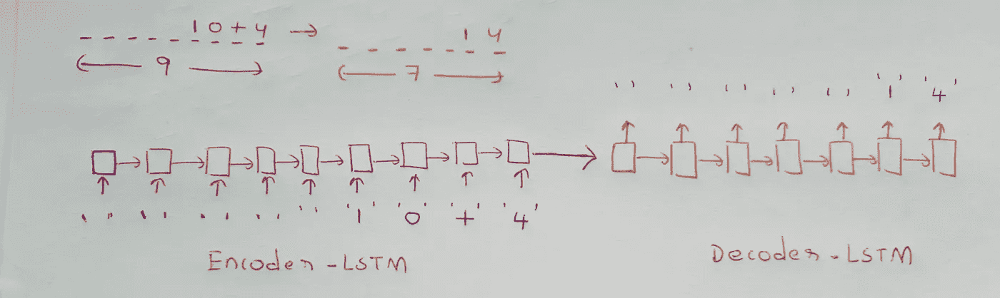

# 如何使用简单的序列到序列模型构建计算器？

> 原文：<https://medium.com/analytics-vidhya/how-to-build-a-calculator-using-simple-sequence-to-sequence-model-8e2e7c409dd3?source=collection_archive---------14----------------------->

简单的编码器-解码器模型

在这篇文章中，我们将学习对模型进行排序的基础知识，并构建一个简单的计算器应用程序。

序列到序列模型广泛用于机器翻译、图像字幕。在我们的计算器序列对序列模型中，给定一个输入序列(“10+21”)，我们将尝试预测一个输出序列(“31”)。我们将限制我们的…