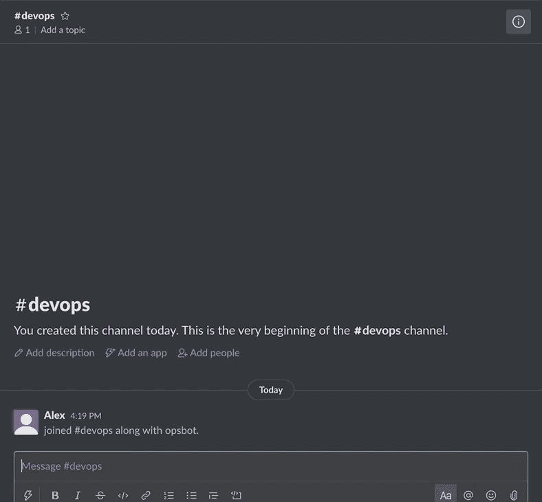
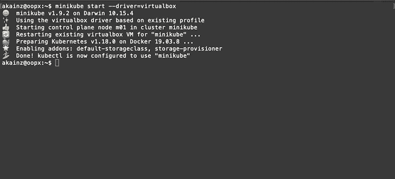
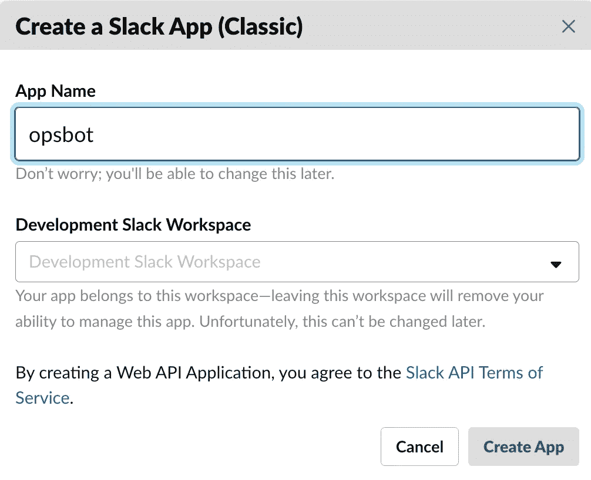
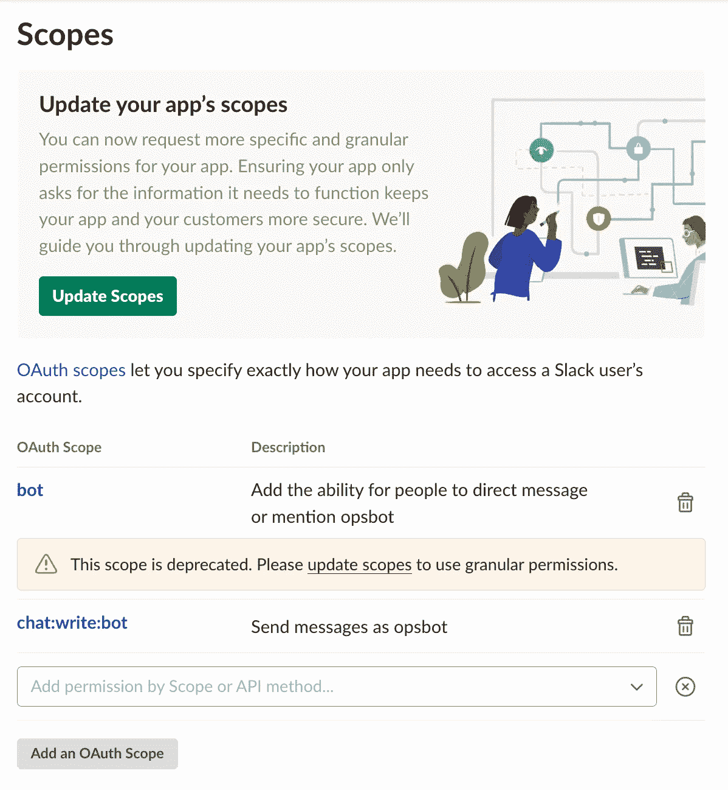
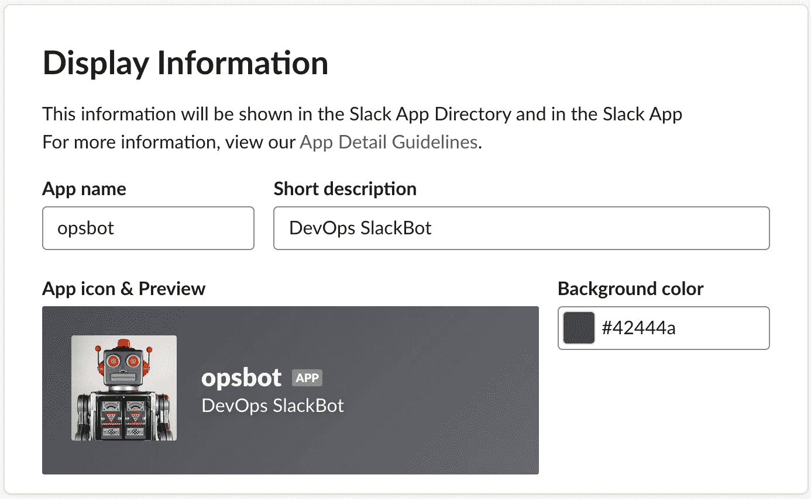
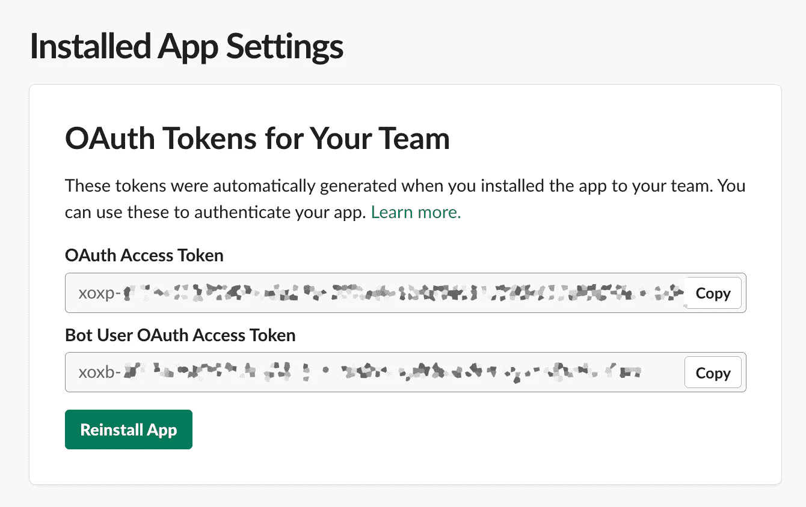
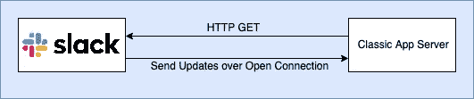
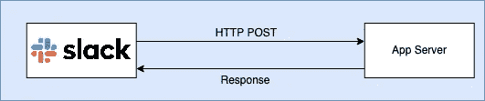

# 如何使用 Slack 和 Kubernetes 在 Python 中构建 ChatOps-Bot

> 原文：<https://medium.com/analytics-vidhya/how-to-build-a-chatops-bot-with-slack-and-kubernetes-6f25b9c20a8?source=collection_archive---------10----------------------->


由[安迪·凯利](https://unsplash.com/@askkell?utm_source=medium&utm_medium=referral)在 [Unsplash](https://unsplash.com?utm_source=medium&utm_medium=referral) 上拍摄

ChatOps 允许您使用基于聊天的界面管理您的 DevOps 任务。了解如何使用 Slack 构建一个简单的 bot 来控制 Kubernetes 集群。

最后，您可以使用 Slack 聊天消息查看 Kubernetes 日志和信息。

没有 Kubernetes 或 Slack API 的先验知识是必要的。

因此，让我们通过探索什么是 ChatOps 来开始构建。



与完成的聊天机器人互动

# 什么是 ChatOps

ChatOps 是执行 DevOps 任务的一种方式，例如使用聊天消息进行部署、监控和系统管理。例如，向聊天机器人发送日志消息可以检索最新的日志消息。或者可以从聊天消息中触发部署。

这提供了一些重要的优势:

*   一种非常人性化的管理基础设施的方式，通过与机器人聊天。`*@chatbot logs*`比`*kubectl logs hello-minikube-64b64df8c9-fkb6w -ndefault*`更容易理解
*   它可以是共享聊天的一部分，以便人们可以协作和共享信息。这也提供了执行命令和动作的记录。
*   它可以帮助安全地克服网络和防火墙的限制，使在家或外出工作成为可能
*   DevOps 工具上的统一界面，使用同一界面管理 Kubernetes 和 OpenShift
*   它可以简化和保护基础设施任务，因此它们可以由开发人员自己来完成。

# 设置

本文描述了使用以下工具构建一个最小的聊天机器人:

*   Minikube 作为一个 Kubernetes 环境。 [Kubernetes](https://kubernetes.io/) 被贴上“生产级容器编排”的标签。Kubernetes 允许我们部署、管理和扩展 docker 映像。Minikube 是一个在开发机器上运行 Kubernetes 的交钥匙解决方案。
*   作为聊天服务器的 Slack
*   Python 来实现聊天机器人。

# 迷你库贝

为了在开发机器上快速运行 Kubernetes， [Minikube](https://kubernetes.io/docs/setup/learning-environment/minikube/) 在单个虚拟机映像中实现了一个 Kubernetes 集群。详细的安装说明可以在[这里](https://kubernetes.io/docs/setup/learning-environment/minikube/#installation)找到。

为了在我的 macOs 系统上安装它，我使用 VirtualBox 作为虚拟化驱动程序。VirtualBox 可以在[这里](https://www.virtualbox.org/wiki/Downloads)找到。

安装 VirtualBox 后，可以使用下面的命令在 macOs 上安装 Minikube。它还将部署一个示例应用程序。这假设你已经安装了[自制软件](https://brew.sh/)。

```
*$ brew install minikube # install via Homebrew**§ minikube start — driver=virtualbox # start and use Virtualbox**$ kubectl create deployment hello-minikube-image=k8s.gcr.io/echoserver:1.10 # install sample app*
```

使用`kubectl get all`来验证安装，结果应该显示示例 pod，类似于`pod/hello-minikube-64b64df8c9-fkb6w`。



执行 kubectl 的结果得到所有

# 对 Kubernetes 的(难以置信的)简短介绍

Kubernetes 是一款允许管理集群中 docker 映像的软件。这包括部署、扩展、管理和监控。基本部署单元是一个吊舱。窗格可以包含多个 docker 图像或容器。我们将在本文中开发的聊天机器人只支持具有单一图像的窗格。Kubernetes 可以通过`kubectl`命令和其他方式控制。

我们的服务器将使用以下 Kubernetes 命令

`kubectl get pods --selector=app={app} --namespace={namespace}`:检索名称空间中应用程序的窗格。

`kubectl logs {pod} --namespace={namespace}`:获取 pod 中容器的日志(如果容器中只有一个图像)

`kubectl describe pod {pod} --namespace={namespace}`:描述 pod 的详细信息。

# 松弛的

如果您没有 Slack 账户，您可以在[https://slack.com 获得自己的工作空间。](https://slack.com)

在本文中，我们将创建一个所谓的经典应用程序，因此我们能够使用[实时消息(RTM)](https://api.slack.com/rtm) API。

这里可以创建一个经典的 app[。](https://api.slack.com/apps?new_classic_app=1)确保不要只是创建一个新的 Slack 应用程序，因为它不支持实时消息。



该应用程序将需要以下范围，机器人和聊天:写:机器人。如果你没有找到这些范围，你可能在最后一步创建了一个非经典的应用程序。



我们将为应用程序添加描述和图标。对于我的机器人，我使用了来自维基媒体的图片。



最后一步是将应用程序安装到工作区，记下 bot 令牌，单击“将应用程序安装到您的团队”。我们将允许应用程序访问我们的工作区，并记下“Bot 用户 OAuth 访问令牌”。



# ChatOps 服务器

该服务器的代码可以在 https://gitlab.com/alexk/chatops-kubernetes[找到。它需要 python 3，例如可以在 macOs 上安装`*brew install python3*`。](https://gitlab.com/alexk/chatops-kubernetes)

然后下载并安装需求

```
*git clone git@gitlab.com:alexk/chatops-kubernetes.git**cd chatops-kubernetes/**pip3 install -r requirements.txt*
```

之后，设置要与一起使用的松弛令牌

```
*export SLACK_API_TOKEN=<Your Slack token starts with xoxb-…>*
```

并启动聊天机器人服务器

```
*python3 chatbot.py*
```

# ChatOps 服务器

正如在设置部分所讨论的，我们将利用 Slack 中的实时消息传递功能。要使用这一功能，我们必须创建一个经典应用程序。



使用 WebSockets 的经典 Slack 应用实时消息模型

在当前的 Slack 应用模型中，Slack 为每个聊天消息或命令向 chatbot 服务器发送 HTTP Post 消息。



使用 HTTP POSTS 的现代 Slack 应用程序模型

然而，在 ChatOps 的背景下，经典应用程序允许我们使用 WebSockets 连接到 Slack。我们的 chatbot 服务器将对 Slack 端点使用 HTTP GET 调用。Slack 服务器将保持连接开放，并向我们的聊天机器人传输更新。

这意味着我们不需要在 DevOps 基础架构上打开一个传入端点。相反，我们将使用传出连接。

由于 ChatOps 服务器通常以提升的权限运行，因此很难向外界开放端口。通过使用经典应用程序和 websockets 连接，我们关闭了网络犯罪分子的另一个攻击角度。

服务器将支持 4 个命令

`set-app` 为用户设置应用程序。因此，我们不需要在每次使用另一个命令时都提供应用程序名称。保护访问安全的一个简单方法是只允许 admin 用户执行这个命令。

`get-app` 为用户获取应用程序

`logs`和`describe`检索 pod 上所选应用程序的日志和信息。

为了存储选定的应用程序，我们将在 db.py 模块中使用一个嵌入式 [sqllite3](https://www.sqlite.org/index.html) 数据库。

主事件循环如下所示:

```
@RTMClient.run_on(event="message")  # subscribe to 'message' events
def process_command(**payload):
    data = payload['data']
    web_client = payload['web_client']
    print(payload)
    # ignore service messages, like joining a channel
    is_service = 'subtype' in data and data['subtype'] is not None

    if not is_service and 'text' in data:
        channel_id = data['channel']
        thread_ts = data['ts']
        user = data['user']
        text = data['text']  # get data from the event
        tokens = text.split()  # split it up by space characters
        me = tokens[0]  # user id of the cht bot
        # object to track the conversation state
        conv = Conversation(web_client, channel_id, user)
        if len(tokens) > 1:
            print(tokens)
            # first token is my userid, second will be the command e.g. logs
            command = tokens[1]
            print('received command ' + command)
            if command in commands:
                # get the actual command executor
                command_func = commands[command]
                try:
                    args = tokens[slice(2, len(tokens))]
                    # execute the command
                    result = command_func(conv, args)
                    if result is not None:
                        # and return the value from the 
                        # command back to the user
                        conv.msg(result)
                except Exception as e:
                    conv.msg(str(e))

            else:
                # show welcome message
                web_client.chat_postMessage(
                    conv.msg(welcome.format(user=user, me=me))
                )
        else:
            # show welcome message
            conv.msg(welcome.format(user=user, me=me))
```

它被注释为`@RTMClient.run_on(event=”message”)`，每次在当前聊天中发送消息时，Python Slack 客户端都会调用这个消息。

为了确保我们没有收到我们自己的消息和服务消息(“…已经加入对话”)，我们使用这行代码`is_service = ‘subtype’ in data and data[‘subtype’] is not None`

获得消息后，我们将它转换成令牌，并获得每个命令的实际处理程序，然后单个命令将解析传入的参数。例如，set-app 命令将为用户将应用程序存储在 db 中。为了实现这一点，我们使用了`os.popen(cmd)`

```
def logs(pod, namespace):
    cmd = f'kubectl logs  {pod} --namespace={namespace}'
    print(f'Executing {cmd}')
    stream = os.popen(cmd)
    return stream.read()
```

# 结论

使用 Slack 客户端支持的实时消息 API，我们能够构建一个简单的聊天机器人来执行 kubernetes 命令。聊天机器人也可以使用 Slack 中的现代 POST 事件来构建。如果您对那个 API 感兴趣，请告诉我，我会添加一篇后续文章。

下一步是通过建立一个授权模型来提高安全性，以使它能够像 ChatOps bot 一样工作。当编排多个 DevOps 工具时，实现一个 DevOps API 可能是有意义的，它处理实际的编排并提供一个公共接口。该接口可用于构建多通道 DevOps 工具集，例如仪表板和 ChatOps。