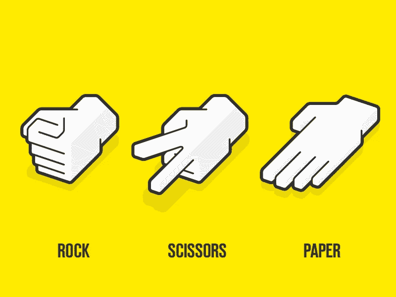
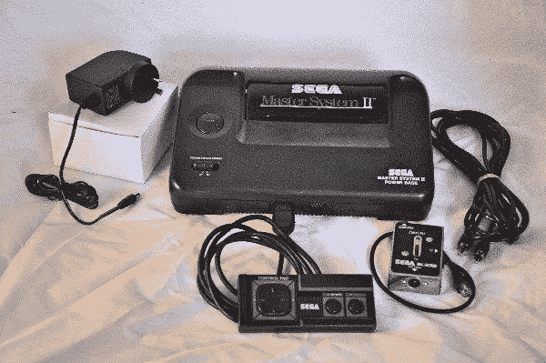
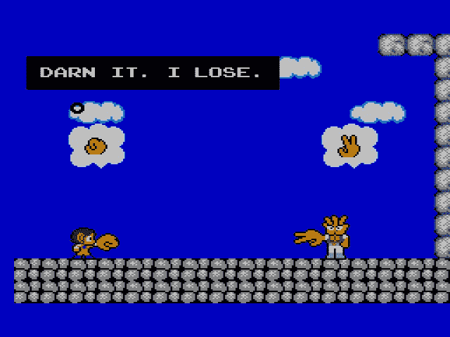
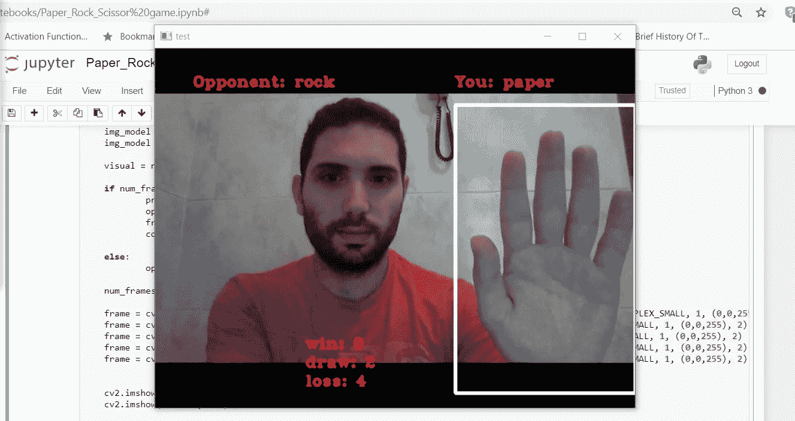

# 如何用 Python 构建一个计算机视觉游戏？

> 原文：<https://medium.com/analytics-vidhya/how-to-build-a-computer-vision-game-in-python-a6b064ce72be?source=collection_archive---------4----------------------->

我成长在 90 年代，那时还没有互联网、智能手机和下一代游戏机。在增强现实和虚拟现实出现之前。我知道，我老了…至少我经历了物质世界。啪！(没有，我们也没有 Snapchat)。我们只是交流一个大概的位置，重返大气层的时间，然后我们就准备起飞了。

那很有趣。但你知道还有什么更有趣吗？主系统 2。

**游戏机简史**

很久很久以前，游戏机是这样的:

游戏是你必须插入控制台的盒式磁带。嗯…不全是。一款游戏是预装的(感谢 G.od 他们没有对[滥用主导地位](https://www.ft.com/content/56ae8282-89d7-11e8-b18d-0181731a0340)展开调查)。一个捕捉了我生命中几个小时的游戏。

**奇迹世界里的亚历克斯·基德**

这场比赛是一个杰作。的确是一个真正的奇迹世界。你扮演一个小角色，亚历克斯，在一次任务中击败一个非法的暴君([剧情](https://en.wikipedia.org/wiki/Alex_Kidd_in_Miracle_World))。没有弹劾，只是不同层次的吨。

这款游戏最令人惊叹的是游戏的多样性。你跳来跳去打碎砖块，收集钱，在水下游泳试图避开鱼和章鱼的触角。为什么不坐船呢？你可以买一个。或者一架直升机，一辆摩托车，一个飞行斗篷…insta gram inst ragram 之前的生活！

**让我们玩石头剪刀布……**

亚历克斯·基德无所畏惧。除了石头、剪刀和布…

几乎在每一关结束时，你都要玩石头剪子布的游戏。我从来没有玩过比亚历克斯·基德更激烈的 RPS 游戏。但那是以前。

**…在直播视频上…**

科技很神奇。当我回忆起在可能比我还重的电视上玩了几个小时的游戏时，“现在的孩子们”正在虚拟世界里玩，没有电缆。让我们在中间见面。

我创建的程序使用计算机视觉和深度学习在直播视频流(在这种情况下来自网络摄像头)上玩石头剪刀布游戏。听起来令人印象深刻…其实不然。其实真的很简单！

**…使用 OpenCV 和 Python**

OpenCV 是一个非常完整的计算机视觉库，可以让你做任何你需要的事情。网上有大量的教程可以帮助你入门(如果需要的话，我可以推荐一些——请在评论中联系我)。这是我用来捕捉和处理图像的。深度学习部分我用了 Tensorflow 和 Keras。

**工作流程**

玩这个游戏需要什么？一只手仅此而已。该程序只需识别手的手势，与对手进行比较，并输出结果(赢、输、平)。

**1 —识别手**

你可以想出一个手部跟踪算法，但我喜欢简单。因此，我创建了一个感兴趣的区域，用户必须将手放在这里并做手势。它不太灵活，也不“白痴证明”，但是它有简化代码的优点。

我们已经缩小了行动地点的范围。但是我们仍然需要“捕捉动作”(意思是识别手)。为此，有几种不同的方法。我尝试的第一个方法是使用梯度方向直方图。如果你不知道那是什么，不要担心，这不是我最后采用的方法。我只是想吹嘘一下。

我用了一个简单的“背景减法”。如果你减去图像的背景，就只剩下前景了。这就是我们在这里想要的:手(应该是)在感兴趣的区域中唯一运动的东西。

**2 —识别手势**

一旦我们隔离了手，我们就可以开始思考识别它正在做什么手势的策略。我决定用深度学习，因为用深度学习做任何事任何事都很酷。

这也非常简单。跟我一起数:我记录了数百张每个手势的图像(20 秒)，扩充了数据集(20 秒)，训练了模型(5 分钟)。6 分钟以内深度学习！

注意:数据扩充包括随机修改我创建的图像来创建新的图像，有一点点不同(旋转一些角度，放大或缩小一些百分比等)。).你可以在训练模型时直接这样做，但我喜欢分开做，这样 1/我可以看到我生成的修改，2/跟踪图片(用于复制), 3/这里内存空间不是问题。

**3 —输出结果**

一旦程序识别出这个人在做什么手势，你只需要执行规则(布战胜石头，石头战胜剪刀，剪刀战胜布)。我硬编码了逻辑，因为它更简单。

因为没人愿意和我玩，所以我模拟了一个对手。最后，这就是你得到的。

看我玩得多开心！！

它是如何工作的？

让我们来分解一下:

1-程序获取来自流的第一个图像，并将其视为背景(我们假设只有手会在感兴趣的区域中移动)；

2 —然后取每一帧并减去背景(这种方法也适用于不同的肤色)；

3-采用 2/的结果，并将其馈送到深度学习模型，以便识别手势；

4 —根据规则将手势与对手的手势进行比较；

5 —输出图像和结果信息(赢、平、输)。

**如何改进？**

如果这个游戏不能让我在暴雪找到一份开发者的工作，我不知道还有什么可以！但是如果我想花更多的时间并真正提高它，我会:

1-使用手跟踪系统来消除对感兴趣的预设区域的需要；

2 —改进深度学习模型(设计，还有训练数据—包括额外的手势)；

3 —改善对手(要么通过创建强化学习代理，要么通过创建更多的逻辑，如“如果玩家连续玩两个 X，就玩 Y”——最佳策略是随机玩，但更令人兴奋的是建立一个看似具有你试图猜测的策略的对手)；

4-改进游戏屏幕的图形和效果(为每一个新游戏倒计时，获胜时的庆祝纸屑等。);

5 —你的其他想法！

**玩得开心！**

如果你成功了，恭喜你，你打败了所有的老板(Boredominus，NotFuninator 和 ObviousItIs)。作为奖励，你可以在[我的 github](https://github.com/Enoooooormous/rock_paper_scissors) 上找到代码。如果您有任何问题，请随时联系我们，但代码非常简单，所以我相信您会没事的！

好了，这是你真正的奖励:[免费在 PC 上玩《奇迹世界》中的亚历克斯·基德](https://www.retrogames.cz/play_170-SegaMS.php?language=EN)。

另一边见！