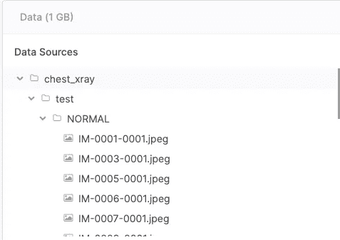
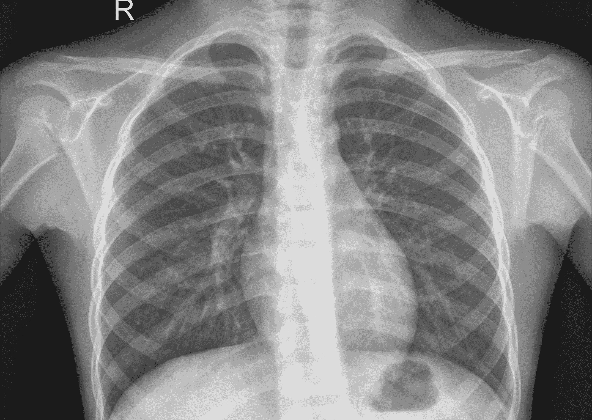
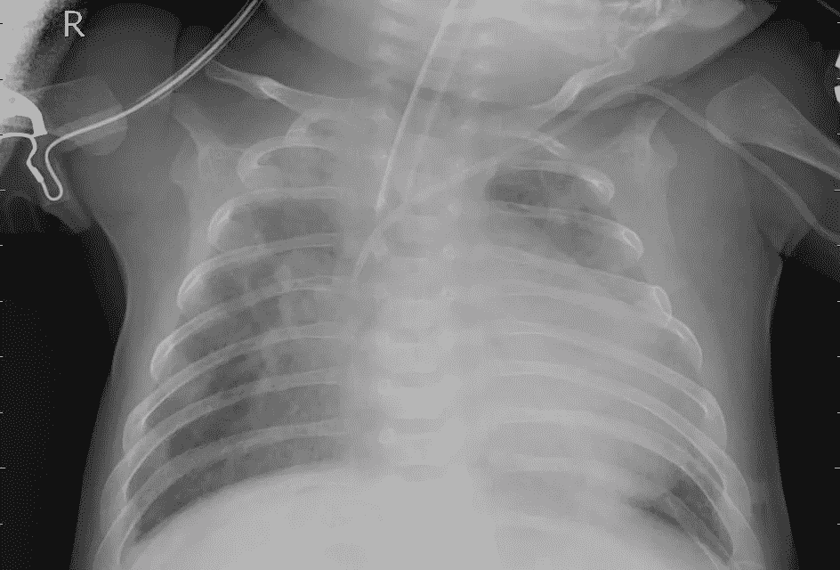
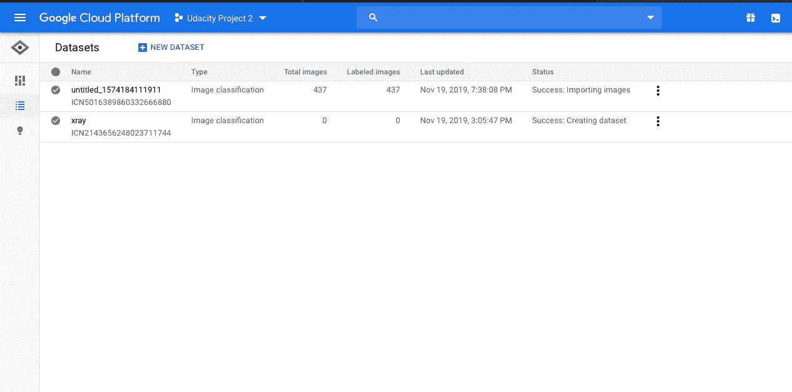
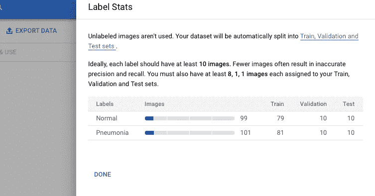
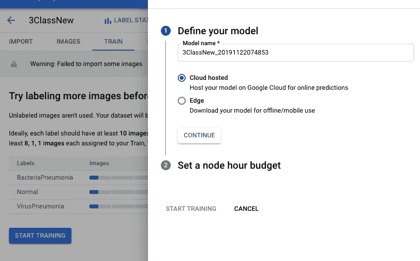
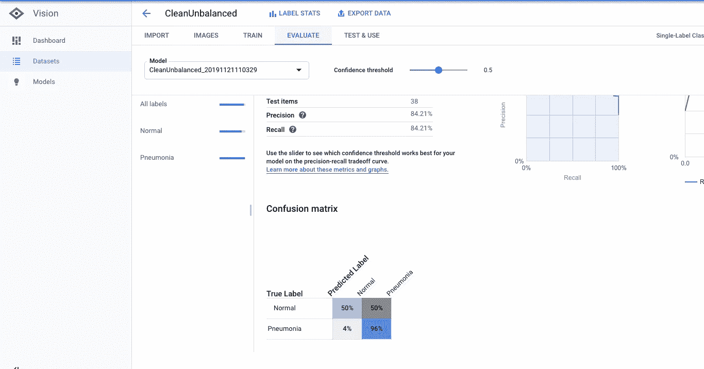

# 没有编码知识如何建立机器学习模型

> 原文：<https://medium.com/analytics-vidhya/how-to-build-a-machine-learning-model-without-coding-knowledge-da21acc660bd?source=collection_archive---------20----------------------->

人工智能除雾管理指南—第 2 部分

小安东和他的父母在意大利度暑假。每次他想买冰淇淋时，他都不得不向他的父母求助，因为他不会说意大利语。安东决定学习意大利语。第二年，当他再次在意大利度假时，他能够自己买冰淇淋了，只要他想。由于他的语言能力，安东是自由的。学习让你自由……*(故事来自布里吉特·拉贝的儿童哲学丛书“Les goters Philo”)。)*

由[莎伦·麦卡琴](https://unsplash.com/@sharonmccutcheon?utm_source=medium&utm_medium=referral)在 [Unsplash](https://unsplash.com?utm_source=medium&utm_medium=referral) 上拍摄的照片

这正是我在构建我的第一个机器学习(ML)模型时的感受。由于我新学到的技能，我“自由”了，能够比以前更容易、更快、更深入地理解和评估人工智能商业案例。

构建一个 ML 模型也是这篇博客的主题。这是“人工智能除雾经理指南”系列的第 2 部分。

该系列由 3 部分组成:

1.  [了解开发人工智能模型的步骤(第一部分)](/analytics-vidhya/managers-guide-to-demistify-a-i-part-1-a80f3c44883e)
2.  **使用 Google AutoML 构建你自己的人工智能原型(第二部分)**
3.  构建正确的人工智能模型，避免偏见(第 3 部分)

**使用 Google AutoML 建立你自己的人工智能原型**

为了开始构建您的 ML 模型，您需要准备:

1.  正确标记的数据集—在本例中，我们将使用公开可用的数据集
2.  向 AutoML 平台注册—在本例中，我们将使用 Google AutoML

*请注意:由于 Google AutoML 仍处于测试版，您可以免费获得 300 美元信用，这是一个尝试该平台的绝佳机会。只是要小心，因为信用点数会很快用完——尽管除非您明确升级您的帐户，否则不会向您收费。*

我们将关注的**业务案例**如下:

> 有不同病人的胸部 x 光照片。这些图像显示了患者的肺部，部分健康(正常)，部分显示了肺炎(肺部的一种疾病)的症状。我们希望机器能够预测某张 x 光照片是否显示出肺炎症状。

以下是需要遵循的步骤:

1.  训练模型
2.  评价
3.  预测或“测试和使用”

1.  **训练模型**

**数据集的准备，数据标注**

训练 ML 模型是教导模型不同图像显示什么的过程，以便它可以做出必要的预测。为了训练您的 ML 模型，您需要在平台中上传源数据集。

Kaggle 胸部 x 光数据集，分类为“正常”和“肺炎”。

这些数据集一旦上传，就被用来教导机器与普通 x 光片相比，什么是肺炎 x 光片。作为数据集，在本例中，我们将使用在 [Kaggle](https://www.kaggle.com/paultimothymooney/chest-xray-pneumonia#IM-0001-0001.jpeg) 可用的图像。( [Kaggle](https://www.kaggle.com/) 是一个数据科学家和机器学习者的在线社区，在这里你可以找到你的 ML 试验的数据集)。

在机器学习中，带标签(或带注释)的数据意味着你的数据能够教会模型它需要学习什么。作为这种学习的结果，你的机器学习模型可以预测你的问题的答案——例如，“这张 x 光片显示出肺炎的症状了吗？”。在本例中，标记数据是分类为“正常”或“肺炎”的数据。创建该数据集的过程被称为“数据注释”或“数据标记”。如上所述，在一个带标签的数据集中，并不是每张图像都需要标上“肺炎”或“正常”的名称。如果图像被相应地分类——放在各自的文件夹中，这就足够了。

下面是包含在源数据集中用于训练 ML 模型的示例图像。这是一张“正常”的胸部 x 光照片。正如你所见，它是清晰的，没有混浊或不透明的地方。

“正常”患者的胸部 x 光片，包含在“正常”文件夹中

另一方面，肺炎患者的胸部 x 光显示不清楚、不透明和混浊的区域。这是源数据集“肺炎”的示例图像。

“肺炎”文件夹中的肺炎患者的胸部 x 光照片

通过检查这些数据集，该模型正在学习普通胸部 x 光片与肺炎胸部 x 光片的外观。模型提供的图像越多，它就能更好地学习。

我们在 Google AutoML 平台上传了两个带有正确标签的文件夹(正常/肺炎)。不同的文件夹需要立即压缩和上传。

这是数据上传后的样子

**关于数据集准备的提示:**

上传数据集时，重要的是:

*   数据平衡:数据应包括相同数量的正常肺和肺炎肺的 x 光片(不同类别)。不平衡的数据集可能导致 ML 模型的不正确预测。
*   数据被正确标记:只有健康肺在健康文件夹中，只有肺炎肺在肺炎文件夹中。混淆这些可能导致 ML 模型的不正确预测。

*请注意:一个干净、平衡的数据集，即使不是一个大数据集，也会导致更精确的预测，并且比一个更大、不干净/不平衡的数据集花费更少。*

对于您的特定用例，可能并不总能找到足够的已标记数据。在这种情况下，您可以寻找一家能够支持您完成这项任务的数据注释公司。尽管这类工作被众包给了印度或菲律宾等成本较低的国家，但仍然是机器学习中成本最高的项目之一。我将在另一篇博客中讨论数据注释的细节。现在，让我们假设您已经准备好要上传的数据。

*请注意:做必要的检查以确保最大似然算法没有偏差是至关重要的。这将确保客观和精确的预测。我们将在下一篇博文中详细探讨这个话题。*

**上传标签数据**

当您上传数据时，platform 将使用部分数据进行验证和测试，而大部分数据用于培训。验证和测试数据将有助于您在评估阶段评估模型的健壮性(我们稍后将回到这一点)。

上传数据后，按“开始训练”。你现在可以高枕无忧了。模型的训练需要几个小时。此过程完成后，您将收到邮件通知。

*请注意:您的型号名称应该以字母开头。如果它以一个数字开始，那么“开始训练”按钮会像上面一样被禁用，这是由于 beta 平台中的一个 bug。*

**2。评估**

评估是您了解模型在部署后做出正确预测的可能性有多大的部分。你可以在准确率和召回率上看到这一点。

**精度**显示准确度，即实际正确的正面预测比例。这意味着，如果模型预测 10 幅图像为肺炎，其中 8 幅实际上是肺炎，那么准确率是 0.8 或 80%(8/10)。虽然 precision 衡量预测的准确性，但它不能提供完整的情况，即实际肺炎数据中有多少是正确预测的。

**回忆**通过将预测的相关性添加到完整的实际数据集中来完善精确度的描述。回忆试图回答问题“有多少比例的实际阳性预测是正确的？”这意味着，如果模型对肺炎做出了 8 个正确的预测，但实际上有 12 张肺炎 x 光片，那么召回率将是 0，67 或 67% (8/12)。

*请注意:精确度和召回率越接近 1，ML 模型的预测正确的概率就越高。*

如果您对训练模型的精度和召回率不满意(例如<90%), then you should go back and retrain the model with a revised dataset.

In order to increase your precision and recall rates, some example questions you can ask are:

*   Is the data for the different labels balanced?
*   Is the data correctly labelled?
*   Is the amount of data provided for training sufficient?

You should repeat this process until you have an acceptable precision and recall rate. The acceptance level of the precision and recall rates for your model will depend very much on your use case: impact of the decision, the level of autonomy the model has, whether the results will be screened by a human before implementation, the complexity of the dataset and the difficulty of the predictions, etc.

Once you are satisfied with the evaluation results of your model, you can move further on to prediction or “Test & Use”.

**3。预测或“测试&使用**

现在您已经训练了您的模型，是时候让模型为您工作了。但在此之前，您可以通过上传已知标签的数据集进行最终测试，让 ML 模型进行预测并检查预测的准确性。

*注意:您在此阶段上传的数据集应该与之前上传的训练数据不同。*

如果你对预测的正确性感到满意，那么你可以上传需要分类的数据并得到结果。

**何时使用 AutoML**

AutoML 在这样的情况下工作，其中数据被清楚地标记(正常/肺炎)。这种机器学习的方法被称为“监督学习”。

在监督学习中，您通过显示不同标签的许多示例来训练不同类别的模型。该模型没有提供不同数据集的具体描述以供学习。它只是通过识别给定类别中的图像模式来学习。

在胸部 x 射线的例子中，我们使用计算机视觉(CV)处理图像，但 AutoML 也可以应用于自然语言处理(NLP)，处理文本。

**结论**

在这篇博文中，我试图帮助你获得一项新技能，即使用 AutoML 构建你自己的 ML 模型。如果你计划使用监督学习和一个常见的用例，它可能也是适合你的模型。

在 X 射线的情况下，AutoML 模型工作得相当好。在每个标签 100 个图像的小数据集之后，我能够获得 90%以上的精确度和召回率。[根据谷歌](https://cloud.google.com/vision/automl/docs/beginners-guide)的说法，这是最低限度，建议数量为每个标签 1000 个以上。

除了谷歌，还有其他 AutoML 提供商，如微软 Azure Automated ML 或亚马逊 SageMaker Autopilot。

这篇博客是“人工智能除雾经理指南”系列的第二部分。第 1 部分可以在这里找到[。第三部分，人工智能安全入门，你可以在这里阅读](/analytics-vidhya/managers-guide-to-demistify-a-i-part-1-a80f3c44883e)。