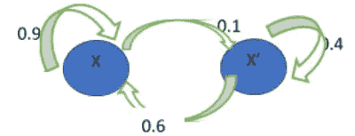

# 如何使用马尔可夫链和 Python 构建市场模拟器

> 原文：<https://medium.com/analytics-vidhya/how-to-build-a-market-simulator-using-markov-chains-and-python-b925a106b1c4?source=collection_archive---------6----------------------->

# 什么是马尔可夫链

马尔可夫链是一种数学系统，其中根据概率规则从一种状态转移到另一种状态。按照马尔可夫系统，从一个状态到下一个状态的转换只取决于当前状态，而不是先前状态，状态是离散的，可以用矩阵形式表示。

这里有一个例子

假设有一个品牌 X 卖 dosas。有更多的品牌销售 dosas，这些都是 X 的竞争对手。根据目前的市场分析，X 拥有大约 20%的市场份额，因此 80%的市场被其他品牌占领。现在，X 想通过广告和活动来扩大业务。比方说，活动结束后

*   90%已经使用 X 的人仍然使用 X
*   60%不消费 X 的人会转而消费 X

两个品牌 X 和假设 X '(不是 X)代表两种状态


让我们用转换图来展示上述结论



该图表示某物停留在同一状态或移动到另一状态的概率。让我们用概率矩阵来表示，P–


其中 XX = 0.9 代表留在 X 的人，XX' (0.1)代表用 X '的人，X'X (0.6)代表转用 X 的人，X'X' (0.4)代表吃其他品牌 dosas 的人。以上称为转移概率矩阵，显示了从当前状态到下一个状态的转移。

这些状态是 dosa 商店广告/活动的结果。起步状态怎么样？

让我们把初始状态表示为 Si。

如果你还记得，dosa 的份额最初是 x 品牌的 20%。


这叫做初始状态分布矩阵。基于这些信息，我们可以预测人们在接下来的一周内消费品牌 X 的概率。假设 Si 是本周的州。所以，下周这个州就是 S1 了。为了找到这个，我们必须用概率矩阵乘以初始状态

S1 = [0.2 0.8] 0.9 0.1 0.6 0.4

= [0.2*0.9 + 0.8*0.6 0.2*0.1 + 0.8*0.4]

= [0.66 0.34]

这意味着，一周后，市场份额有望上升至 66%。我们可以把这个公式概括为:

S1 = Si*P

S2 = S1*P —用于预测初始状态 2 周后的状态

**Sn = S(n-1)*P**

通过使用相同的概率矩阵来尝试这些值，并查看这些值如何逐周变化。

在上面的例子中，我们有两个状态。随着状态数量的增加，矩阵的大小也会增加。

# 如何用 Python 实现马尔可夫链

Python 有很多库可以帮助你创建马尔可夫链。因为我们的文章是关于使用马尔可夫链建立一个市场模拟器，我们将牢记我们的市场模拟器来探索我们的代码。

我们已经了解了什么是马尔可夫链，知道它是一个可以应用到各种现实场景中，根据当前状态预测未来结果的概念。数据可以是任何范围的—一周、一个月、一个季度、一年—这取决于您对结果所需的精确度。

你可以从任何地方获得数据集，比如雅虎财经，甚至是提供免费金融和经济数据集的 Quandl，只要使用 Python 的 quandl [包。这种做法一直持续到 2018 年，但我们仍然可以将这些数据用于学习目的。下面是如何提取它——](http://www.techgeekbuzz.com/python-package/)


我们使用了微软公司的数据。你可以选择 facebook、亚马逊或其他任何网站。

正如我们所看到的，数据中有开盘价、最高价、最低价、调整后的收盘价和其他值。然而，对于预测，我们可能不一定对精确的值感兴趣。我们需要知道的只是“转变”——例如，如果未来 3 天的值是 25.50、28.00、29.00，那么第 4 天的值是多少？会涨还是会跌？

但是在将我们的数据分为高或低之前，我们需要知道收盘、高、低和成交量值的百分比变化。

为了使用百分比变化函数和许多其他数据操作函数，我们需要导入 pandas 包。

```
import pandas as pd# Get the closing gapClose_Gap = dataset[‘Close’].pct_change()# The high percent change from the immediate previous rowHigh_Gap = dataset[‘High’].pct_change()Low_Gap = dataset[‘Low’].pct_change()Volume_Gap = dataset[‘Volume’].pct_change()Daily_Change = (dataset[‘Close’] — dataset[‘Open’]) / dataset[‘Open’]Outcome_Next_Day_Direction = (dataset[‘Volume’].shift(-1) — dataset[‘Volume’])
```

让我们创建一个空的新数据集，并用上面的数据和一些其他有用的细节填充它——

```
new_dataset = []new_dataset.append(pd.DataFrame({‘Close_Gap’:Close_Gap,‘High_Gap’:High_Gap,‘Low_Gap’:Low_Gap,‘Volume_Gap’:Volume_Gap,‘Daily_Change’:Daily_Change,‘Outcome_Next_Day_Direction’:Outcome_Next_Day_Direction}))
```

现在让我们把新的数据集打印成-

`print(new_dataset)`


为了更清楚起见，让我们使用 head()方法只获取几个值。但是我们必须首先将列表转换成 DataFrame 对象。

```
new_dataset_df = pd.concat(new_dataset)print(new_dataset_df.head())
```


我们不需要确切的数值。为了让我们的转移矩阵和概率起作用，我们需要的只是稳定状态。根据高低形态，我们可以预测未来的市场状况。

这意味着我们可以简单地将这些值分成三类——低、中、高——或者简而言之——L、M、h。这就是所谓的宁滨数据。

幸运的是，Python 的 pandas 包提供了一个函数 qcut，可以将数据分成大小相等的块。

```
# Close_Gapnew_dataset_df[‘Close_Gap_LMH’] = pd.qcut(new_dataset_df[‘Close_Gap’], 3, labels=[“L”, “M”, “H”])# High_Gapnew_dataset_df[‘High_Gap_LMH’] = pd.qcut(new_dataset_df[‘High_Gap’], 3, labels=[“L”, “M”, “H”])# Low_Gapnew_dataset_df[‘Low_Gap_LMH’] = pd.qcut(new_dataset_df[‘Low_Gap’], 3, labels=[“L”, “M”, “H”])# Volume_Gapnew_dataset_df[‘Volume_Gap_LMH’] = pd.qcut(new_dataset_df[‘Volume_Gap’], 3, labels=[“L”, “M”, “H”])# Daily_Changenew_dataset_df[‘Daily_Change_LMH’] = pd.qcut(new_dataset_df[‘Daily_Change’], 3, labels=[“L”, “M”, “H”])With this information of L, M, H, we can find the event pattern which we get by concatenating the H L M values of close gap, volume gap and daily change –new_dataset_df[‘Event_Pattern’] = new_dataset_df[‘Close_Gap_LMH’].astype(str) + new_dataset_df[‘Volume_Gap_LMH’].astype(str) + new_dataset_df[‘Daily_Change_LMH’].astype(str)print(new_dataset_df.tail(20)
```


现在，我们看到了很多导致这种模式的变化——LML，嗯，MHH，MLH 等等。让我们压缩这些数据，得到一系列事件的字符串。


减少数据集，压缩它，只得到最有趣和最突出的变化，去掉弱的变化。


一旦我们得到了这些，我们必须将我们的数据分成训练集和测试集。大多数数据必须进入训练集，以尽可能准确地训练模型。

这可以通过使用 sklearn 包中的 train_test_split 来完成。假设我们给出大约 80%的数据用于训练，那么只有 0.2%或 20%的数据用于测试。

我们可以根据 outcome_next_day_direction(积极或消极)拆分数据。

```
compressed_set_pos = compressed_set[compressed_set[‘Outcome_Next_Day_Direction’]==1][‘Event_Pattern’]print(compressed_set_pos.shape)compressed_set_neg = compressed_set[compressed_set[‘Outcome_Next_Day_Direction’]==0][‘Event_Pattern’]print(compressed_set_neg.shape)
```

得到结果方向后，现在让我们构建马尔可夫网格。

*   从压缩集中找出唯一的事件模式。例如，LHM、MLH 等
*   用 from_event(如 LMH)和 to_event(如 MLM)组成一个模式
*   如果找到匹配，连接模式值
*   创建“至/自”栅格和枢轴
*   用零填充 NaN 值
*   用正负压缩集构建转换网格


基于这个矩阵，预测结果是简单的。我们必须找出概率，并用实际值和预测值创建一个混淆矩阵。

要获得构建矩阵网格和预测结果的代码，请访问代码链接 [viralml](https://www.youtube.com/watch?v=sdp49vTanSk&t=584s) 。该视频基于一篇博客，详细描述了[马尔可夫链如何用于股票市场预测。](https://pkghosh.wordpress.com/2015/07/06/customer-conversion-prediction-with-markov-chain-classifier/)

# 结论

预测股票市场价值是马尔可夫原理最常见的实时应用之一。在本文中，我们试图涵盖基础知识，并继续解释如何建立一个模拟器。您可以尝试使用任何数据集在您的机器上运行代码，并检查结果的准确性。使用马尔可夫链的主要繁琐部分是清理和缩减数据集，以找到和分割数据集。接下来的部分——就是了。