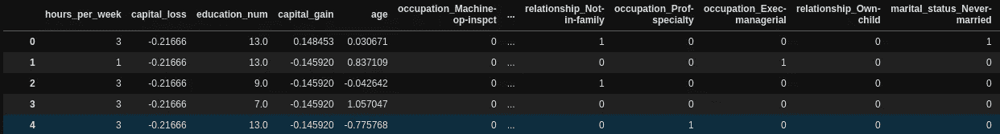
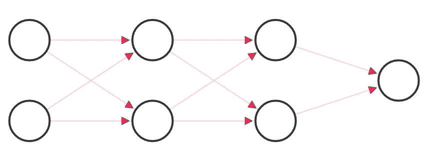
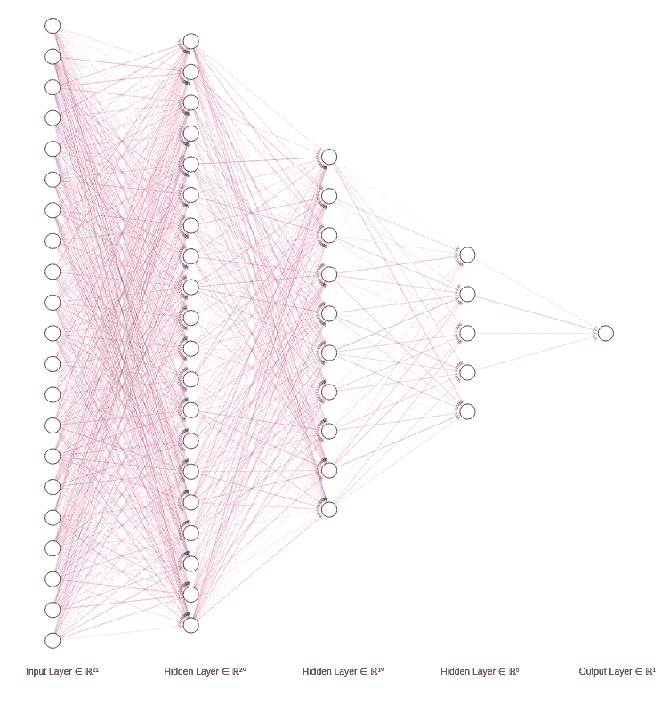

# 如何用 Tensorflow 构建香草神经网络？

> 原文：<https://medium.com/analytics-vidhya/how-to-build-a-neural-network-classifier-with-tensorflow-54e10dd87433?source=collection_archive---------8----------------------->

## 万物张量流


艾莉娜·格鲁布尼亚克在 [Unsplash](https://unsplash.com?utm_source=medium&utm_medium=referral) 上的照片

在我的[上一篇文章](/analytics-vidhya/linear-regression-with-tensorflow-161f35a6ef3f)中，我谈到了占位符，变量，用 TensorFlow 定义回归的损失函数。在本文中，我将向您介绍我设计一个香草神经网络来构建分类模型的尝试。
本项目使用的数据可以在[这里](http://www.kaggle.com/dataset/67721cc8414c5b9a7c7d70f1e6af93ef67e715fe9e0bcba130ec0f2766ca7fc9)找到。我们将试图预测一些美国人的年收入是否会超过 50000 美元。更不用说，这是一个二元分类问题。

我将不讨论数据清理和预处理部分，因为这不在本文的范围之内。你可以在这个 [GitHub 链接](https://github.com/Pranab1011/tensorflow_for_everything/tree/main/Neural%20network%20classifier)中找到它们。

在预处理、特征工程和特征选择之后，数据看起来像这样



训练集包含大约 32000 个样本和 21 个预测变量。这些变量大多是二元特征。接下来，我们将设计一个接受这些特征的神经网络来给出我们的二进制输出

## 解读普通神经网络

简单而模糊地说，香草神经网络只是一堆连接在一起的逻辑回归。网络中的每个神经元接收来自前一层的输出，将它们馈送给自己的“逻辑回归”，并生成自己的输出，该输出再次被馈送给下一层。这种相互关联的逻辑回归允许模型学习传统模型无法学习的更深层次的特征。

为了建立这样一个网络，我们需要做的就是定义层数和每层中的神经元数量，并用一个数学关系将它们连接起来。对于反向传播，我们还需要定义一个损失函数来优化模型。

## 编写一个简单的前馈神经网络

首先，让我们从一个非常简单的网络开始:

*   两个输入特征
*   两个隐藏层，每个都有两个神经元
*   Sigmoin 激活函数



在[http://alexlenail.me/NN-SVG/index.html](http://alexlenail.me/NN-SVG/index.html)设计的图形

在 Tensorflow 中，我们需要在建立任何关系之前声明占位符和变量。**占位符**是 tensorflow 声明输入和输出特性的方式。在我们的例子中，X 和 Y 是占位符。在每个向前和向后传播步骤中，占位符值都被提供给网络。tensorflow 中的
**变量**是经过训练的变量。在这种情况下，变量是权重和偏差。

我们首先声明如下占位符:

```
n_features = 2
n_dense_neurons_1 = 2x = tf.placeholder(float, (None, n_features))
y = tf.placeholder(dtype=float)
```

接下来，我们声明第一个隐藏层的权重和偏差，并将它们插入到 sigmoid 激活中

```
W1 = tf.Variable(tf.random_normal([n_features, n_dense_neurons_1]))
b1 = tf.Variable(tf.zeros(n_dense_neurons_1))z1 = tf.add(tf.matmul(x, W1), b1)
a1 = tf.sigmoid(z1)
```

然后，我们设置第二个隐藏层

```
n_dense_neurons_2 = 2W2 = tf.Variable(tf.random_normal([n_dense_neurons_1, n_dense_neurons_2]))
b2 = tf.Variable(tf.zeros(n_dense_neurons_2))z2 = tf.add(tf.matmul(a1, W2), b2)
a2 = tf.sigmoid(z2)
```

和输出层

```
n_dense_neurons_3 = 1W3 = tf.Variable(tf.random_normal([n_dense_neurons_2, n_dense_neurons_3]))
b3 = tf.Variable(tf.zeros(n_dense_neurons_3))z3 = tf.add(tf.matmul(a2, W3), b3)
a3 = tf.sigmoid(z3)
```

输出激活 a3 给我们一个介于 0 和 1 之间的值。我们可以选择一个阈值概率来得到最终的二元预测

## **一个稍微复杂的正则化网络**

在我的项目中，我开发了一个更深层次的神经网络

*   21 个特征，
*   2 个隐藏层，分别包含 20 个和 10 个神经元
*   辍学正规化，以打击过度拟合



在[http://alexlenail.me/NN-SVG/index.html](http://alexlenail.me/NN-SVG/index.html)设计的图形

```
n_features = 21
n_dense_neurons_1 = 20

x = tf.placeholder(float, (**None**, n_features))
y = tf.placeholder(dtype=float)

W1 = tf.Variable(tf.random_normal([n_features, n_dense_neurons_1]))
b1 = tf.Variable(tf.zeros(n_dense_neurons_1))

z1 = tf.add(tf.matmul(x, W1), b1)
a1 = tf.sigmoid(z1)

drop_out_1 = tf.nn.dropout(a1, 0.5)n_dense_neurons_2 = 10

W2 = tf.Variable(tf.random_normal([n_dense_neurons_1, n_dense_neurons_2]))
b2 = tf.Variable(tf.zeros(n_dense_neurons_2))

z2 = tf.add(tf.matmul(drop_out_1, W2), b2)
a2 = tf.sigmoid(z2)

drop_out_2 = tf.nn.dropout(a2, 0.5)n_dense_neurons_3 = 5

W3 = tf.Variable(tf.random_normal([n_dense_neurons_2, n_dense_neurons_3]))
b3 = tf.Variable(tf.zeros(n_dense_neurons_3))

z3 = tf.add(tf.matmul(drop_out_2, W3), b3)
a3 = tf.sigmoid(z3)n_dense_neurons_4 = 1

W4 = tf.Variable(tf.random_normal([n_dense_neurons_3, n_dense_neurons_4]))
b4 = tf.Variable(tf.zeros(n_dense_neurons_4))

z4 = tf.add(tf.matmul(a3, W4), b4)
a4 = tf.sigmoid(z4)
```

这里的大部分代码保持不变，除了在每个隐藏层激活后，我们使用 tensorflow 的 nn.dropout()方法放置一个 **dropout 层**，将分数传递给要保留的输入，作为第二个参数。

## 反向传播

为了建立反向传播，我们首先需要定义损失函数。对于这个项目，我使用了二元交叉熵损失函数

```
loss = tf.reduce_sum(-(y*tf.math.log(a4) + (1-y)*tf.math.log(1-a4)))
```

和 Adams optimizer 来优化损耗

```
optimizer = tf.train.AdamOptimizer(learning_rate=0.0001, beta1=0.9, beta2=0.999, epsilon=1e-08, use_locking=**False**,
    name='Adam')
train = optimizer.minimize(loss)
```

## 培养

为了在 tensorflow 中训练我们的模型，我们首先需要使用

```
sess = tf.Session()
init = tf.global_variables_initializer()  
sess.run(init)
```

为了对任何给定的示例进行训练，我们需要将它提供给 *train* 实例

```
sess.run(train, feed_dict = {x:x_example, y:y_example})
```

我们分批喂我们的训练样本。我们遍历每个时期，遍历每个唯一的批次，并将其提供给上面声明的 *train* 实例。

为了预测，我们将测试数据传递给最后一个激活函数。在这种情况下，整个列车组通过。

```
training_epochs = 200
batch_size = 16
train_size = x_data.shape[0]

**for** epoch **in** tqdm(range(training_epochs)):
    X = x_data.copy()
    Y = y_data.copy()
    **for** batch **in** range(int(train_size/batch_size)+1):

        **if** X.shape[0] > batch_size:
            random_index = random.sample(list(range(X.shape[0])), batch_size)

            x_sample = np.array(X.loc[random_index, :])
            y_sample = np.array(Y.loc[random_index])

            X = X[~X.index.isin(random_index)].reset_index(drop=**True**)
            Y = Y[~Y.index.isin(random_index)].reset_index(drop=**True**)
        **else**:
            x_sample = np.array(X)
            y_sample = np.array(Y)

        sess.run(train, feed_dict = {x:x_sample, y:y_sample})

    **if** (epoch+1)%10 == 0:
        c_train = sess.run(loss, feed_dict = {x:np.array(x_data), y:np.array(y_data)})
        training_pred = sess.run(a4, feed_dict = {x:np.array(x_data), y:np.array(y_data)})
        training_threshold = np.median(training_pred)
        training_pred = [1 **if** i>training_threshold **else** 0 **for** i **in** training_pred]
        training_accuracy = accuracy_score(y_data, training_pred)
        training_f1 = f1_score(y_data, training_pred)

        print("Epoch", (epoch + 1), ": Train loss =", c_train/x_data.shape[0], "Training accuracy =", training_accuracy, 'f1_score:', training_f1)
```

这总结了我在建立二元分类的神经网络模型方面的尝试。对于大多数实际情况，我们不使用神经网络进行简单的二元分类，因为它需要大量的处理能力和时间。然而，这给了我们一个更好的想法，比如说，面部情感分类器的基础是什么。

我希望你喜欢这篇文章。接下来是 RNN 和 LSTM 的 Tensorflow

在那之前，谢谢你，注意安全。

> 再多的钱也买不到一秒钟的时间— *托尼·斯塔克，MCU*