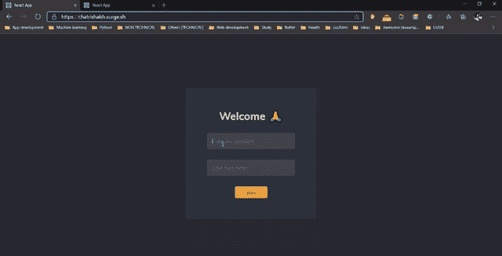
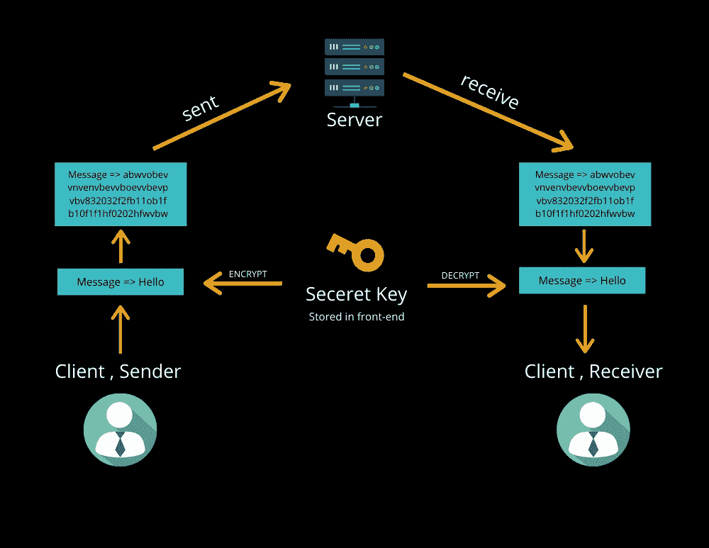
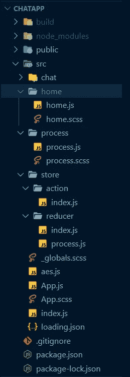

# 如何使用具有 E2E 加密的 Node + Reactjs + Socket.io 构建一个实时聊天 web 应用程序

> 原文：<https://medium.com/analytics-vidhya/how-to-build-a-real-time-chat-web-app-using-node-reactjs-socket-io-having-e2e-encryption-18fbbde8a190?source=collection_archive---------3----------------------->



**链接链接** : [这是我们要打造的聊天应用✌](https://bit.ly/30sqUpJ) 的例子。

**Github 链接**:后端— [链接，](https://github.com/RishabhVerma098/chatappBackend)前端 [—链接](https://github.com/RishabhVerma098/chatapp)。

所以你可能想知道 WhatsApp，telegram 类型的应用程序是如何说他们的用户数据在整个网络上被“加密”的。

这意味着存储在他们数据库中的所有信息都是加密的，所以即使一些“第三方”试图在他们到达目的地的途中“窃听”信息，被截获的信息也将是加密的形式。

> 在本文中，我将向您展示如何构建一个简单的 E2E(它不会像 Whatsapp 使用的那样安全，但总比什么都没有好)。
> 
> 我们将使用一个单独的密钥来加密和解密我们的消息，从而拥有对称的加密架构。
> 
> **注意**，Whatsapp 使用 *Diffie-Helman* 技术来实现非对称加密，这是可以用来制作最安全聊天应用的技术之一，如果你想了解更多，请参考这个[链接](https://youtu.be/JnZQMUL8GcQ)。

# **工作**



如上图所示，我们将创建一个存储在前端的密钥(*)现在，我把它存储在前端文件中，但是为了生产，你必须把它保存在。部署了前端的服务器的 ENV 变量*。

每当用户发送信息，我们必须使用 [aes256](https://www.npmjs.com/package/aes256) npm 包用你的密钥加密。在收到加密的消息后，我们将重复这个过程，但这一次将使用相同的密钥解密。

# 密码

## 后端(Node、Express、Socket.io)

*文件夹结构*

```
Backend
 |- dummyuser.js
 |- server.js
 |- package.json
```

*依赖安装*

```
npm i socket.io express dotenv cors colorsnpm i nodemon -d
```

**转到 dummyuser.js**

*   这里我们创建了三个函数来照顾用户。 **userjoin()** **函数**将**添加**一个用户到空数组 users 中。
*   用户对象由 3 个键组成——id、用户名和房间名，房间名基本上就像一个“WhatsApp 组”,它会告诉用户属于这个特定的房间。
*   **getcurrentuser()** ，将获取特定用户的 id 并返回其用户对象。
*   每当用户离开聊天( ***断开*** )时，我们将调用 **userLeave()** ，它接受一个用户 id，并将**从用户数组中删除**该用户对象

## 转到 server.js

*导入包和初始设置*

这里我们只是从 **dummyuser.js 导入模块、函数、**监听端口 **8000** 和**初始化套接字**。

在初始化 socket 之后，与 sockets 相关的所有东西都会进入 io.on(connection，()= >“所有东西都会到这里”)这个回调。

这里我们有两个函数，socket . on("***join room***")，socket.on("chat ")。 ***加入房间*** 功能只会在新用户加入房间时运行。这里，我们将**向他/她发送**欢迎消息，**向所有用户(除了他/她)广播**消息(*用户已经加入*)。

socket.on(" *chat* ")会处理来回消息发送部分。

此外，每当用户*断开连接时，我们将向房间中的所有人发送“*用户已离开聊天*”消息。*

## *前端(React、Redux、Socket.io-client、aes256)*

**文件夹结构**

**

**要安装的依赖项**

```
*npm i node-sass react-lottie react-redux react-router-dom redux*
```

## *初始设置*

***index.js***

*这里我们添加 redux 并从*导入减速器。/存储/减速器/索引**

***/商店/行动/索引. js***

***/store/reduce/index . js***

***/store/reduce/process . js***

*在上面的文件中，我们将 redux 添加到 React 应用程序中，并创建一个名为**'*' process****'*的操作，该操作将负责向' ***aes.js*** '(负责加密和解密)发送消息(包括传入和传出消息)，并从' ***aes.js*** '获取数据，然后返回到我们的组件。*

# ***转到 App.js***

*这里我们添加了路线和导入组件，*

**Routes* ，on-base URL 我们正在渲染负责获取用户名和房间名的 home 组件。在路径"*/chat/room name/username*"上，我们正在呈现一个组件 AppMain，它返回两个 div，一个是 chatbox，另一个告诉我们加密的传入消息和解密的消息的显示过程。*

****为 App.js 和 globals.scss*** 添加所需的样式*

****app . scss****

****_globals.scss****

# *转到/home/home.js*

*这里，我们从用户(用户和房间名称)获取输入，并调用 socket.emit(" *joinRoom* ")，传递用户名和房间名称，这将在我们的后端激活" *joinRoom* "，这将把用户添加到房间，并发出/广播消息，如上文在我们的后端部分所讨论的。*

****给 home.js 添加样式，****

***home . scss***

***转到/chat/chat.js***

*这里，我们从用户处获取输入，并将数据传递给 process action，该 action 将数据传递给 ***aes*** 函数进行加密，然后将其发送给 socket . on(“chat”)，每当接收到消息时，我们都会将其再次传递给 ***aes*** 函数，但这次是用于解密。*

****为聊天应用样式****

## *聊天. scss*

# *转到 aes.js*

*这里我们导入了 **aes256** 并编写了一个函数，在这个函数中我们解密传入的消息(除了欢迎消息)并加密传出的消息。*

# *转到 process.js(可选组件)*

*这只是一个组件(右栏),我们在其中显示传入的加密内容*

*消息并使用我们的密钥解密它。*

****添加样式到 process.js****

*基本上，process.js 负责显示传入的加密和解密消息。*

*就是这样！，我们终于做了一个实时聊天的 E2E app。现在，只需在终端中写入 npm start 来启动 react 应用程序，然后转到 localhost:3000，写入用户名和房间名，同时打开另一个选项卡，然后转到 locah host:3000，写入您的姓名和您之前在第一个选项卡中写入的相同房间名。*