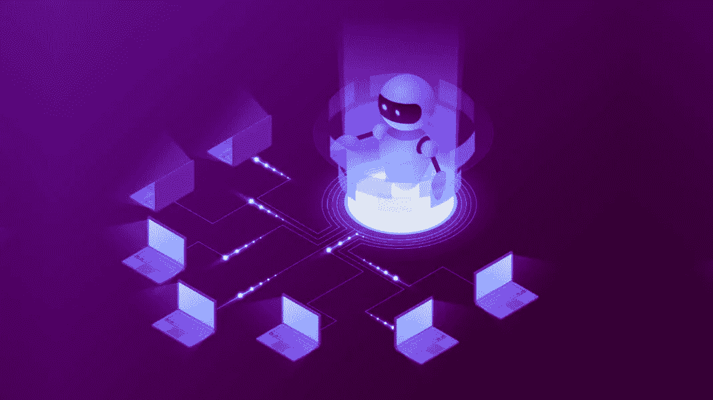

# 如何使用 python 构建一个简单的机器人

> 原文：<https://medium.com/analytics-vidhya/how-to-build-a-simple-bot-using-python-133e813eed70?source=collection_archive---------13----------------------->



现在有一些小的机器人(简单的软件)正在运行，它们会通过处理响应并发回响应来完成一个动作(例如 Slack Bot，Messenger Bot)。为了构建这种简单的机器人，我创建了一个名为 [iaBot 的框架。](https://pypi.org/project/iaBot/)

iaBot 是一个 Python 库，用于创建简单的机器人，并为其提供不同的可用服务器。

## 系统需求

使用 python3.7+的系统是创建一个 bot 并满足请求的最低要求。

## 如何创建一个机器人？

使用 python 包管理器 pip 并在您的系统上安装 iaBot 包。

```
pip install iaBot
```

这个框架设计有两个主要的东西来驱动机器人。一个是处理者，一个是动作。处理程序是一组操作。您可以创建任意多的处理程序，并向机器人注册。若要创建自定义处理程序，请确保您继承了 BaseHandler。

```
from iabot.handlers import BaseHandlerclass DoorHandler(BaseHandler):
    handle = 'door'

    def open(self, *args, **kwargs):
      """
      You will write code to open your door by connecting
      with the hardware
      """
      return {"status": "OK"}
```

门把手内部的打开功能称为动作。在一个处理程序中可以有多个动作，比如关闭、锁定、解锁等。现在我们需要将这个处理程序注册到一个机器人。

机器人知道在处理程序中调用哪个动作来处理请求。它根据通过请求发送的消息选择处理程序和动作。bot 只能理解 request_data 中的句柄、动作、数据。

```
{
 "handle": "door",
 "action": "open",
 "data": {}
}
```

要创建一个机器人，

```
from iabot import CreateBothandlers_register = [
 DoorHandler
]bot = CreateBot(handlers=handlers_register)
```

到目前为止，您已经成功创建了一个机器人。bot 应该连接到一个介质来接收请求，并在处理请求后发回响应。这里这些媒介被称为服务器。服务器可以是 HTTPServer、WebSocket 或 RPCServer。在当前版本(0.0.4)中，iaBot 只支持 HTTPServer。要创建 HTTPServer，

```
from iabot.servers import HTTPServerserver = HTTPServer(bot=bot)
server.run()
```

请记住，您需要在初始化 HTTP 服务器时传递您的 bot。一旦你做了 server.run()你的 bot 将开始监听端口 8080。您可以使用任何可用工具中的 post 方法将消息发送到您的 bot。您还可以更改服务器监听的端口，

```
server = HTTPServer(bot=bot, port=<any_port>)
```

目前，我们只有 HTTPServer。该版本的未来版本中将会添加更多的服务器。

最后，您的代码看起来像这样，

```
from iabot import CreateBot
from iabot.handlers import BaseHandler
from iabot.servers import HTTPServer class DoorHandler(BaseHandler):
    handle = 'door'

    def open(self, *args, **kwargs):
      """
      You will write code to open your door by connecting
      with the hardware
      """
      return {"status": "OK"}handlers_register = [
    DoorHandler
]bot = CreateBot(handlers=handlers_register)
server = HTTPServer(bot=bot)
server.run()
```

享受添加更多的处理程序到你的机器人。您也可以在 [Github](https://github.com/satheesh1997/iaBot) 上给我们投稿。

尝试这个例子来更好地理解，

```
from iabot import CreateBot
from iabot.handlers import SystemInformationHandler
from iabot.servers import HttpServer

handlers = [
   SystemInformationHandler
]
bot = CreateBot(
   handlers=handlers
)
bot_server = HttpServer(bot)
bot_server.run()
```

完成后，HTTP 服务器将监听 localhost:8000，使用 postman 或 alternate 发送一个包含以下数据的 HTTP post 请求。

```
{
  "handler": "system",
  "action": "time"
}
```

希望您在响应中获得了系统时间。快乐编码:)