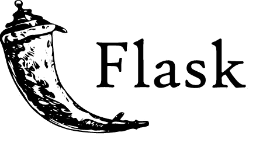
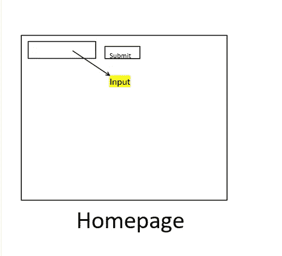
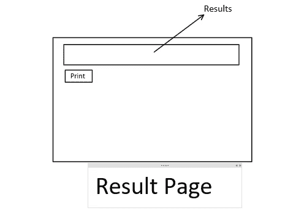
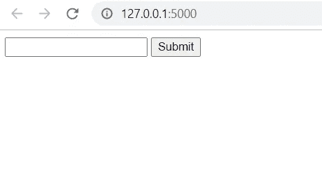

# 如何使用 Flask 构建一个简单的搜索引擎

> 原文：<https://medium.com/analytics-vidhya/how-to-build-a-simple-search-engine-using-flask-4f3c01fe80fa?source=collection_archive---------4----------------------->

大家好。这是我第一次在媒体上写作。我在这里要做的是，我将写一系列文章来讨论如何建立一个基于电子表格的搜索引擎，该引擎接受用户输入，并使用 Flask 和其他库返回 csv、xlxs 文件格式的结果。在这篇文章中，我们将讨论如何起草大图片，以及如何编码我们的主页。



# 搜索引擎使用了以下软件包:

*   烧瓶(用于构建搜索引擎的核心)
*   熊猫(熊猫非常适合处理电子表格)
*   Gspread(用于从 google sheet 中检索电子表格)

# 特种宽银幕电影

第一步是最重要的一步，我们必须知道我们要做什么，以减少重复的步骤。所以在每个项目的开始，我总是先画一个大图，然后决定如何完成这个项目。

# 搜索引擎需要什么？



搜索引擎需要知道用户在搜索什么，所以我们给主页一个输入框，在用户输入查询后，我们必须有一种方法让用户将查询发送回服务器。让我们添加一个提交按钮。”问题已解决

# 如何显示结果？



电子表格只是一个存储信息的表格，但数据形式不同，所以我想把它当作 html 中的表格(使用标签显示结果)。对于一些用户来说，他们希望为某些特定的目的打印出结果，作为程序员，我们的工作不仅仅是创造东西，还必须满足客户的需求。

## 这就是我们项目的总体情况，让我们看看我们需要什么

*   供用户键入查询的主页
*   显示结果的结果页面

> *在起草了前端的样子之后，我们接着决定后端如何操作。*

# 搜索引擎是做什么的？

*   接受用户输入
*   返回结果
*   打印

1.  第一个过程是在主页上完成的，所以我们让主路径(“/”)为我们完成这项工作
2.  第二个过程是页面在接收到用户输入后返回结果，所以只需让 route("/search ")来处理这个搜索过程。
3.  最后一个过程是打印结果，我们添加了一个处理这个任务的路径("/print ")。我稍后会解释为什么我们需要这条路线。

毕竟，我们为我们的项目得到了以下文件结构

```
SearchEngine
|__ templates
|_____ index.html
|_____ search.html
|_____ print.html
|_main.py
```

# 让我们开始吧

# index.html

它有 2 个元素输入字段和提交按钮的要求，我们将写出如下 index.html


```
<!DOCTYPE html>
<head>
    <title>Simple Search Engine</title>
</head>
<body>
    <form action="/search" method="POST">
        {{form.csrf_token}}
        {{form.ids}}
        {{form.submit}}
    </form>
</body>
```

{{form.csrf_token}}

{{form.ids}}

{{form.submit}}

> *这些是来自 WTForm 的元素，因为我们使用 WTForm 作为我们的主表单库。*

# 基本形式

继续我们的表单，正如我之前所说的，我将使用 WTForm 来呈现这些表单。根据 WTForm 文档，WTForms 是一个用于 Python web 开发的灵活的表单验证和呈现库。它可以与您选择的任何 web 框架和模板引擎一起工作。”

```
class BasicForm(FlaskForm):
    ids = StringField("ID",validators=[DataRequired()])
    submit = SubmitField("Submit")
```

ids 和 submit 是我们的字段名称，它将以格式{"ids "、" values "、" submit "、" Submit"}从浏览器发回。记下这一点很重要，因为稍后我们将使用这种方式从用户那里获得价值。

# 主路径@app.route("/")

```
@app.route("/",methods =['POST','GET'])
def main():
    form = BasicForm()
    return render_template("index.html",form = form)
```

decorator route 告诉我们什么样的 URL 应该触发我们的函数(在上面的情况中触发 main()函数)。main 函数初始化 BasicForm 的实例，并将其作为变量传递给 render_template。我们计划将“index.html”作为我们的主页，因此 render_template 必须包含“index.html”。

这就是我们需要的主页添加以下代码，并从命令运行。

```
if __name__ == "__main__":
    app.run(debug=True)
```

从命令运行

```
python main.py
```



主页

这就是我们的主页。我会让这篇文章作为我们系列的第一部分结束，因为仍然有很多事情要谈，如果我只是写下所有的东西，然后在一篇文章中发布，读者很容易感到无聊。在接下来的几天里，我会尽我所能完成我们的系列，并与你们分享。第二部分将在 3 天后发布。如果我的文章有任何让你们厌烦的错误，请留下评论让我知道。感谢阅读